# L4- Consensus in Bitcoin

## Imagine - Bitcoin with a Central Authority (CA)

If we would have designed a digital currency with a central authority, what would it look like ?

    - CA signs and creates every new block and publiushes it to the network
    - Other nodes validate the content and append the new block to their own copy of the chain

What are the disadvantages of this approach ?  What could the CA do ? 

- The CA has to be nominated or somehow defined
- The CA could unilaterally ignore or delay transactions of certain parties or with certain properties
- The CA could render the network unavailable by being overloaded or intentionally shut down. 

> Bitcoins aims to democratize the financial world, however, this approach would lead to a "dictatorship"

## Random Dictatorship 

How do we do that ?  

- Looking at social choice theory, we could establish an agreed-upon world state by fairly randomizing a dictator, creating a "random dictatorship"

### Problem 

Now, we are facing the problem of fairly choosing a random participant as the central authority. Additionally, we must ensure that no one is getting chosen more often by creating multiple identities (i.e Sybil Attack). Remember, blockchain identities are (usually) free and easy to create. 

> Note that ; The consensus mechanism is often used to refer to the mining puzzles, however, mining is not a part of the consensus mechanism. 

## Sybil Control Mechnanism

### Sybil Attack

    - Sybil attack is a type of attack where a user creates and controls multiple identities for a malicious purpose. 
    - In our case, the attacker can create an arbitrary number of nodes to increase his chance to be selected as the central authority. 

- Bitcoin adopts Proof-of-Work(PoW) as its Sybil control mechanism for validating the expenditure of the computational work
- To avoid sybil attacks, we need to bind the probability of getting selected to a **scarce resource.** In PoW, that resource is proportional to your computational power. Thus, creating new identities would not give you an advantage regarding to how often your are chosen. 

| 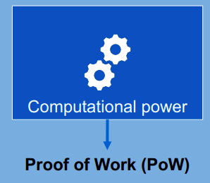 | 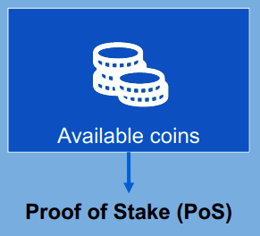 |
|---------------------------|---------------------------|
|   Facilitates search puzzle | Coins are deposited to propose new block |
| Requires large amount of tries | Requires large amount of stake |
| High energy costs   | Low energy costs   |
| Leads to arms race  | "Rich people getting richer" | 
| High attack costs | Low attack costs (discouraged by penalties)
| Fully anonymous mining | | 
| High investment costs | |

---
**BITCOIN USES POW**

---

### Difficulties with Reaching a common world state

- We now have solved thhe problem of defining who is allowed to create new blocks (i.e central authority)
- However, we still have to ensure that a common world state (i.e consensus) is reached. THis can be difficult process as some of the chosen central authorities may not stick to the protocol. 
- In game theory, this problem is known as the **Byzantine Generals Problem**

## Byzantine Fault Tolerance 

THe Byzantine army wants to invade an enemy city. However, it is separated into multiple divisions. They want to attack at the same time, therefore they have to communicate in between the divisions to find a common time to attack. 

A general is responsible for one division. These generals communicate by messenger. Some of the generatls may be traitors, sending wrong messages to other generals. **The goal is for all local generals to derive the same plan without the traitors being able to convince other generals of the wrong plan** 

> This property is called the "Byzantine Fault Tolerance (BFT)"

It can be shown that if more or equa to one third of the generals are malicious, it is impossible for the honest nodes to derive a common plan. 

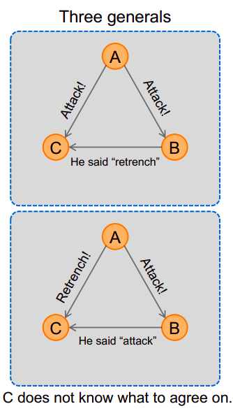

## Distributed Consensus 

- Thanks to cryptography, especially digital signatures, message authenticity is guaranteed. Thus, the only problem left to overcome is agreeing upon a chain to represent the current world state. 

> Definition Distributed Consensus
  A network consists of N nodes. Each node has an input value that they proporse to other nodes. Some of the nodes are fauly (not responding) or malicious, trying to propose a wrong input. 
  Two properties must hold: 
    - The process has to terminate with all **honest nodes** in agreement on **the same input value**
    - The value must have been generated by an **honest node**

- We want the network to agree on the information the world state contains:
    - which of the proposed **transactions are valid ?**
    - In which **order** do the **transactions** appear in the ledger ?

- Bitcoin agrees on the **longest chain of blocks** as the world state. 

## Bitcoin invented a new approach

- Bitcoin's approach to decentralized consensus was completely new and very different from older approaches that resembled traditional voting and scaled very poorly to more than a handful of nodes. 

|  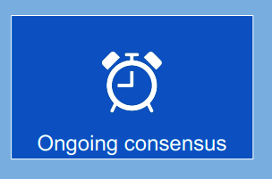 | 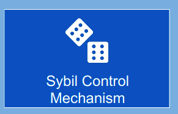  | 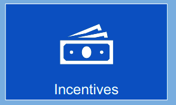
|------------------------------------------|------------------------------------------------|------------------------------|
| Probabilistic consensus: The consensus mechanism is an ongoing process in Bitcoin. Therefore, the order of blocks or transactions is never 100% final. | Proof of Work: The network selects a random node to process a new block using Proof-Of-Work. As we will see later, this ensures that probabilistic consensus can be reached asssuming over 50% are honest | Incentivized nodes: The network incentivizes nodes to participate in the consensus algorithm. They receive Bitcoins for created blocks which are included in the longest chain.|

## Simplified consensus of Bitcoin 

1. **Transaction Broadcast**: Every node who receives transactions or create them, broadcasts  them to the network, making everyone aware of new transactions. 

2. **Block Building** : Every node collects the valid transactions, orders them and creates a new blcok containing the transactions. 

3. **Random  Node Selection**: A node is randomly chosen out of the network. It is able to propose its block to the network. 

4. **Block Validation**: Other nodes receive the block from the randomly chosen node and validate whether it is correct. A correct block only contains valid transactions. 

5. **Block Acceptance** Other nodes show their acceptance for this block if the nodes build new blocks on top of the recently proposed block. 

## Block Propagation

1. Only **valid** blocks are included in the blockchain

2. **The longest** chain (with the highest block) wins

3. **A node builds on the first** block it hears of. 

(refer to slides for visualization)

## Transactions in Orphan Blocks

- An **orphan block** is a block that has been proposed in the network but has not been included in the longest chain.

What happens to transactions which are included in the orphan block(s)?

- Unconfirmed transactions are stored in the mempool before they get added to block 
- As unconfirmed transactions get "gossiped" in the network, every node will know of all transactions. 
- As a new block is proposed, all nodes update their mempool and remove the transactions which were included. 
- As a consequence, the transactions in an orphan block are simply considered as unconfirmed, waiting to be included in a later block. 

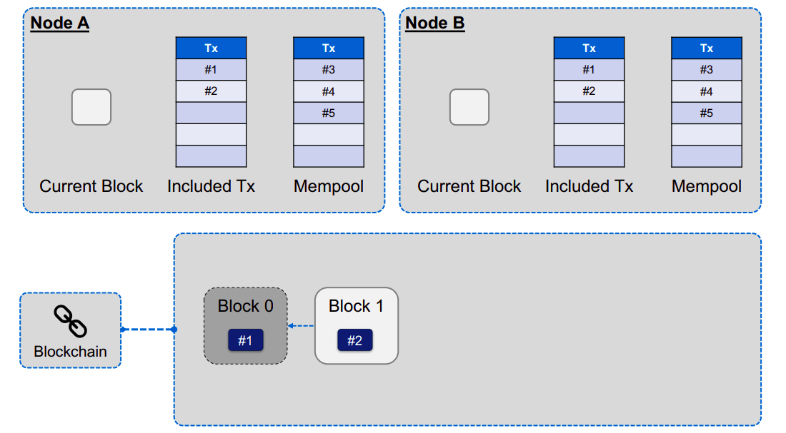

----- 
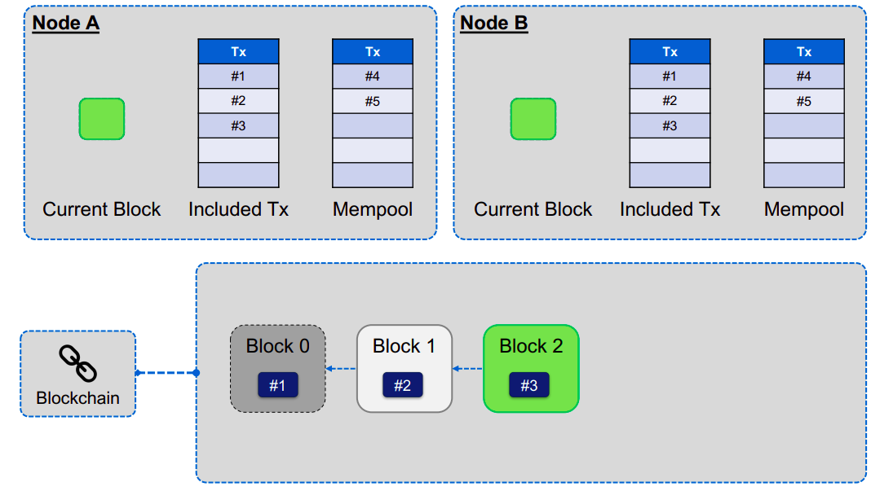

-----
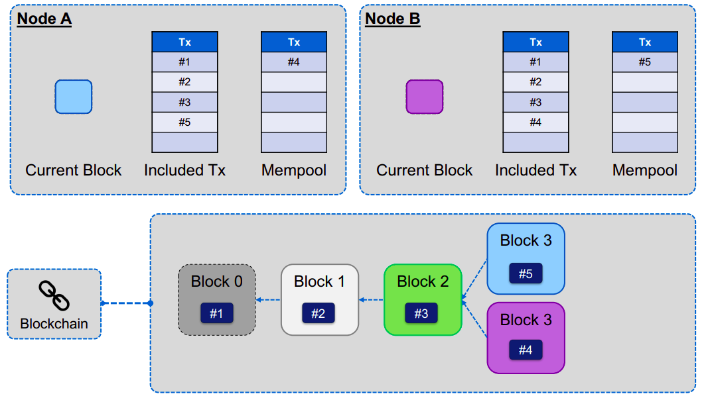

---- 

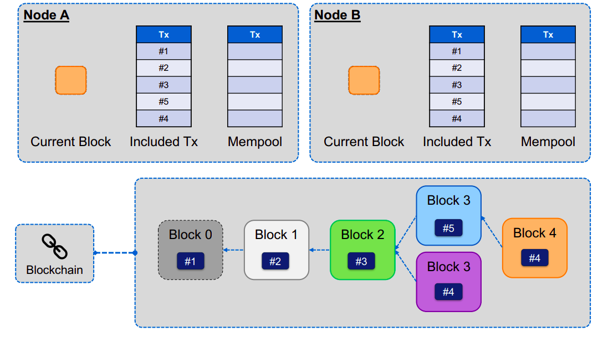

----

## The Mining Puzzle - Proof of Work (PoW)

Idea: We use the search puzzle introduced in the chapter about crytographic  foundations. The header of the has has to be included in Y. Bitcoin uses double SHA-256. (sha256(sha256(block)))

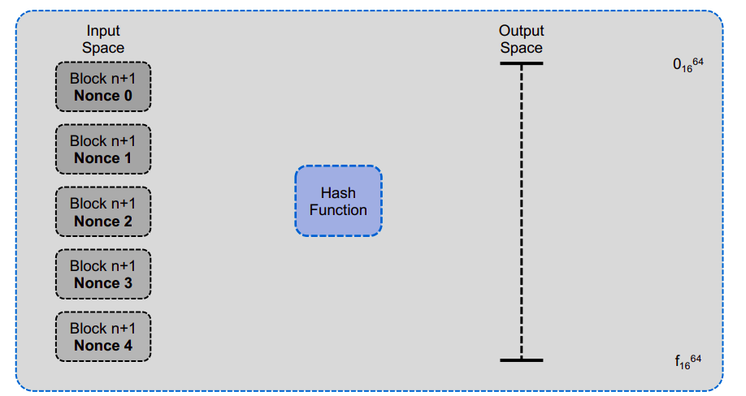

------
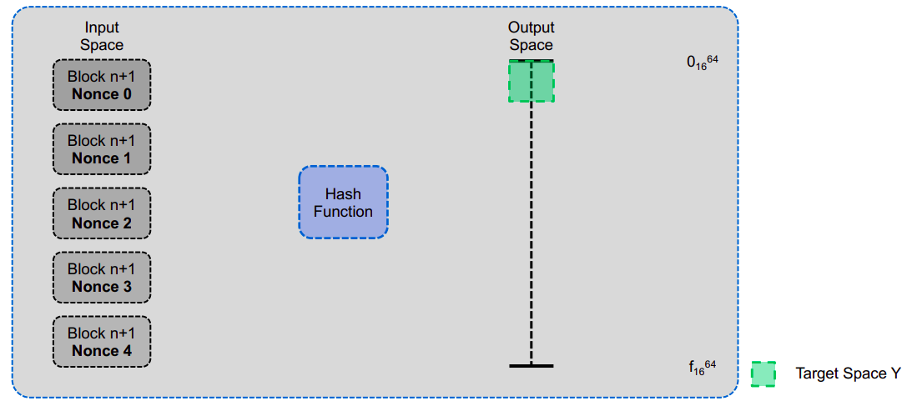

------
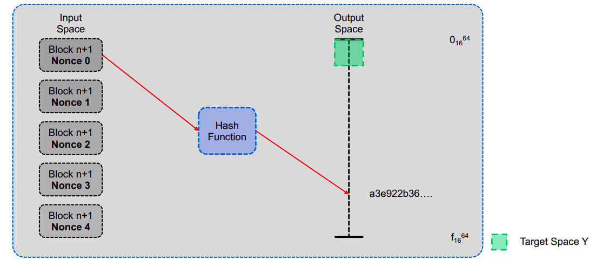

------
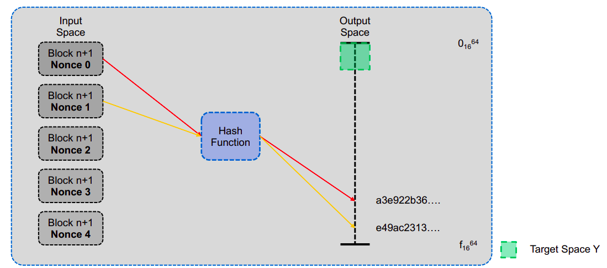

------

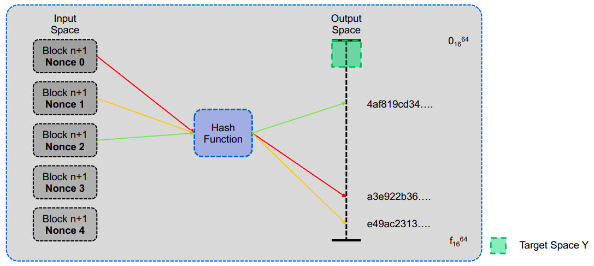

------

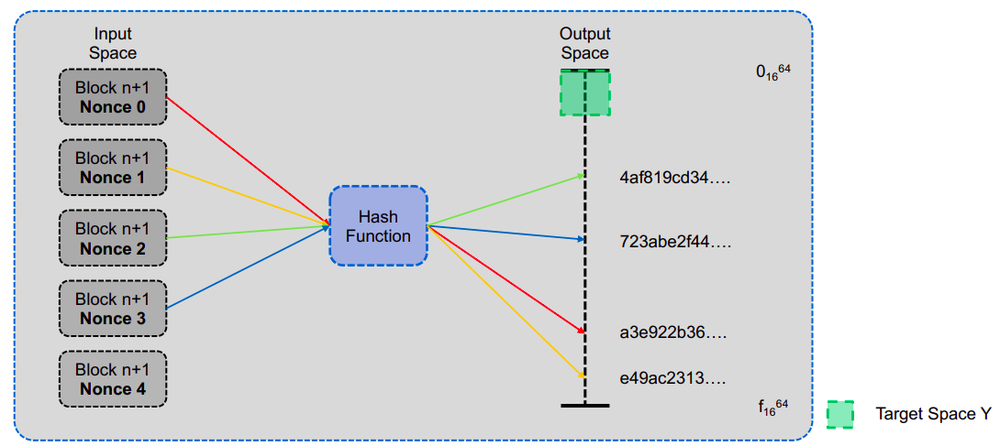

------

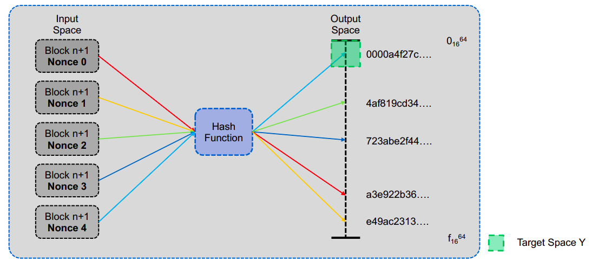

------

## Does Everyone Have the Same Search Puzzle ?

**Recap**

- The block's hash used for chaining is calculated from the version until the nonce field. 

- Assume:
    - There are only 10 Tx in the memory pool. Every node includeds all of them in the new block.
    - Every node uses the same time and version

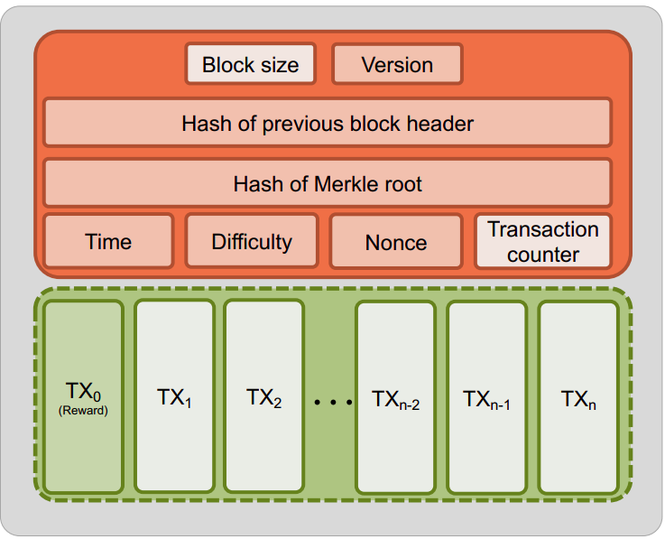

- Does everyone have the same search puzzle ?  If not, why not ? 

- No, every node has a diffirent puzzle, as the TX_0 (the reward-address) is different from node to node. 

## Difficulty calculation & Block Time

- The block time defines the average time between the creation of two blocks (in Bitcoing, block time = 10 minutes)

- Why has the block time to be constant ?  
    - Too slow:
        - Transactions take longer to be included
        - Network capacity decreases 
    - Too fast: 
        - Higher possibility of chain forking, leading to multiple "realibities"
        - Network has to keep track of these forks even if many will be orphaned 
        - Empty blocks

- How do we design the search puzzle in such way that it keeps a constant block time ? 
    - Every 2016 blocks, the difficulty of the puzzle is adapted to the current network speed. 

- The longest chain is considered as the chain with the accumulated highest difficulty

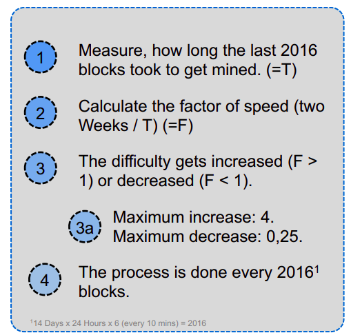

## The Bitcoin Currency

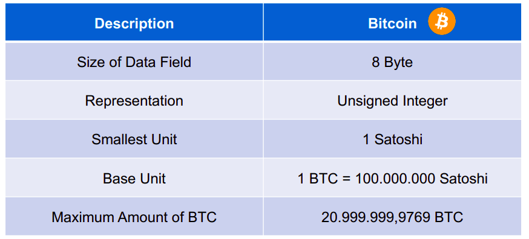

## Mining Puzzle

> Miners incentives 

|  |  |
|-------------|-----------|
| For a newly created block, the miner is allowed to issue new Bitcoins to his wallet. | Every transaction includes a transaction fee. |
| The mining reward was 6.25 bitcoins as November 2021. This incentive, which was originally 50 Bitcoins, is cut in half roughly every four years or after each set of 210.000 blocks are mined. This is known as **halving** and it limits the total global supply of Bitcoin, so prices could rise if demand remains strong. | It is the difference between all inputs and outputs. |

## Upper Bound of Bitcoins

- Bitcoins block reward started at 50 BTC and halved every 210.000 blocks
- This would theoretically result in a maximum amount of Bitcoins of around 21,000,000

- The maximum number of Bitcoins is actually 20,999,999,9769, due to constraint in the current data structure of the blockchain

- When block 6,929,999 has been modified, the maximum will be attained. 

## Transaction Fee

- Every transaction includes a transaction fee. It is difference between all inputs and outputs. 

- The miner of the block obtains the transaction fees in addition to the block reward. 

- The network can only process between 3 and 6 transactions per second, therefore  some transactions have to wait longer. 

- The higher the transaction fee, the faster the transaction gets included in the Blockchain. 

- The miners are incentivized to mine the high-fee transactions first. 

- The fee is calculated in Satoshi/byte

- 1 Satoshi equals 10^-8 Bitcoin. Smallest value in Bitcoin network. 