# Internet Wide Measurements

→   Why do we measure the network?

*   Distributed multi-domain network

*   → information only partially available

*   Moving target

*   Requirements change
*   Growth, usage, structure changes

*   Highly interactive system
*   Heterogeneity in all directions
*   The total is more than the sum of its pieces
*   Built, driven and used by humans

*   Errors misconfigurations, flaws, failures, misuse

Network provider view

*   Manage traffic

*   Model reality
*   Predict future
*   Plan network
*   Avoid bottlenecks in advance

*   Reduce cost • Accounting

Service provider view

*   Get information about clients
*   Adjust service to demands
*   Reduce load on servers
*   Accounting

Client view

*   Get the best possible service
*   Do I get what I paid for?

Security view         • Detect malicious traffic  
        • Detect malicious hosts  
        • Detect malicious networks

Researcher view

*   Understand the Internet better
*   Could our new routing algorithm handle all this real-  
    world traffic?
*   ...

→ ETHICAL CONSIDERATIONS

Active Internet-wide measurements effect the network, users and providers!

Problems:

*   Creates additional traffic
*   Creates load on routers and hosts
*   Might uncover personal information
*   Might be intrusive

Considerations:

*   Scan with a moderate rate
*   Distribute the load as good as possible
*   Do not publish data without anonymization or limited access
*   Inform about the scanning behavior and react to complaints

→ NMAP

Open-source network mapping tool

*   https://nmap.org/
*   First version in 1997 Modes of operation:

*   Host discovery
*   Service detection
*   OS detection
*   Execution of custom scripts

*   TCP RAW socket scans with certain flags

*   SYN: Find open ports
*   NULL/FIN/Xmas:

*   According to RFC 793 all packets without SYN, ACK, RST result in RST if port is closed, and no response if port is open
*   NULL: No bit set
*   FIN: Only FIN set
*   Xmas: FIN+PUSH+URG

*   ACK: Determine filtered/unfiltered ports in a firewall
*   Window: Same as ACK, lists responses with Window > 0 in RST as open (implementation on certain firewalls)
*   Maimon: Send FIN+ACK, according to RFC 793 all hosts should respond with RST, no matter if port is open or closed

*   TCP connect scans
*   ICMP ping scan
*   UDP payload scan

→ NMAP-PERFORMANCE

Internet-wide scans using Nmap:

→ Stateful scanning approach

*   Nmap keeps state for every packet in transit
*   Catch timeouts and send retry packets

→ Performance

*   Full scan from one system takes 10 days (4k IP addr/sec) \[1\]
*   25 Amazon EC2 instances → 25 hours (1.6k IP addr/sec) \[2\]
*   Typically 1 packet sent and 1 packet received per IP addr

→ ZMAP

Adaptation of Nmap for Internet-wide scans

*   https://zmap.io/
*   Developed at the University of Michigan \[3\]
*   First port-scanner to saturate 1 Gbit/s link: 1.4 Mpps
*   Scan entire Internet in 45 minutes
*   Later tweaked to saturate 10 Gbit/s link \[4\]: 14 Mpps

Internet-wide scans

*   Use TCP SYN or UDP payload scan to find open ports
*   Input randomization

*   Pseudo-random number generator
*   Based on multiplicative group of integers modulo p (2 32 \+ 15)
*   Map 32-bit integer to IPv4 address

*   Possible to use multiple worker nodes (shards) on different machines

• IP will only be scanned once in complete scan

→ ZMAP-Approach

Stateless scanning

*   No state for sent packets kept
*   Timeout detection not possible
*   How to identify responses belonging to scan?

*   Use IP ID = 54321
*   Generate validation based on packet input (e.g. destination IP) using AES
*   Store validation in packet which will be sent (e.g. in sequence number)
*   Validate validation (e.g. sequence number – 1) in received packet

Separate send and receive threads using RAW sockets

*   Use RAW socket to directly send and receive packets without kernel TCP stack
*   No locking needed
*   ZMap send and receive behavior:

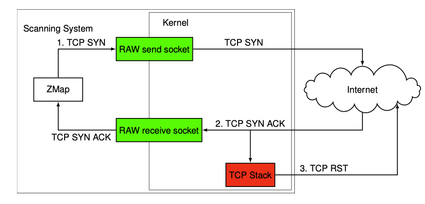

Separate probe and output modules

*   Probe modules

*   Implement scanning technique
*   E.g. TCP SYN, TCP SYN-ACK, UDP payload

*   Output modules

*   Implement processing and output of received responses
*   E.g. IP address only, CSV, database

ZMap is the basis of a large set of additional tools 2 :

→ ZGrab

*   Stateful application-layer scanner
*   e.g. for HTTPS, SSH, BACNET

→  ZDNS

*   utility for fast DNS lookups

→  ZCrypto

*   TLS and X.509 library
*   Certificate parsing and TLS handshake transcription

Original ZMap implementation supports only IPv4

→ Extension of ZMap with IPv6 capabilities → ZMapv6 •

*   https://github.com/tumi8/zmap
*   Adaptation of scanning core to send and receive IPv6 packets
*   Port probe modules for IPv6 scanning: ICMPv6, TCP over IPv6, UDP over IPv6

→ HITLISTS

→ A list of targets, most likely responsive, of feasible size.

*   Responsive :

*   Responsive to at least one protocol (e.g ICMP, HTTP,...)
*   Different between addresses
*   Changes over time

*   Feasible size:  

*   Scan duration
*   Bandwidth limitations

→ TOP LISTS

*   A Top List is a list of domains ranked by their popularity

*   Ranked list of domains
*   Popularity calculated by different measures
*   Normally one million entries
*   Most popular top lists:

*   Alexa Top list
*   Majestic million
*   Umbrella

Alexa Top List

Provided by Amazon

*   Based on HTTP requests

*   Collected with a browser toolbar
*   Depends on volunteers to install the toolbar
*   Captures statistics about visited web pages

→ Strong focus towards web pages

The Majestic Million

*   Independent organization
*   Based on link metrics

*   Combination of outgoing and incoming links
*   Collected by a web crawler
*   Data updated several times a day

→ Focus towards web pages

Umbrella

*   Provided by Cisco
*   Based on DNS requests  to the Umbrella global Network (formerly OpenDNS)
*   Algorithm based on unique client IPs visiting a domain
*   Calculates Internet popularity independent of the port

→ No focus towards web traffic

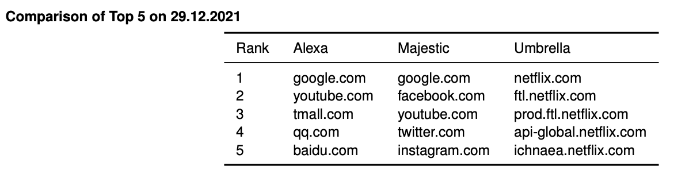

Treat Top Lists carefully:

*   Frequent changes over time \[5\]
*   Weekend effect \[5\], \[6\]

*   Different user behavior changes lists on the weekend
*   Focus towards entertainment and streaming on the weekend

*   Clustering Effect \[6\]

*   Large clusters with same rank
*   Ordered alphabetically

*   Size is not always 1 million

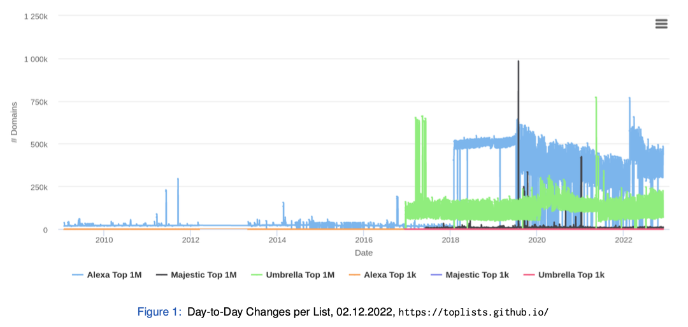

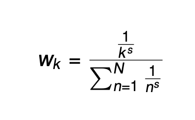

Can we rank prefixes not domains?

→ How can we classify the importance of a prefix?

→ Zipfs law

• Internet traffic is assumed to follow Zipfs law

*   A few sites consist of millions of pages, but millions of sites only contain a handful of pages.
*   Millions of users flock to a few select sites, giving little attention to millions of others.
*   k = rank of object
*   s = slope of distribution
*   s is set to 1 based on related work \[8\]

→ Prefix Top Lists \[9\]

*   Aggregate top lists over a week \[5\]
*   Collect A and AAAA records for domain based top lists
*   Assign Zipf weight of domain to IP addresses
*   Aggregate on prefixes and ASes
*   Useful for:

*   Prefix prioritization
*   Security impact assessment

*   prefixtoplists.net.in.tum.de

→ IPV4 - LISTS

State of the art:

*   Full "0/0" scans
*   Feasible with Nmap/ZMap
*   Protocol-specific scanners for stateful protocols
*   Continuous scans to observe changes in the network and deployment

Exemplary scans at our chair:

*   Scan rate: 20k IP addr/s
*   Scan duration: 37h
*   TLS scan

*   TCP Syn scan to port 443
*   48 Mio responding hosts

*   SMB scan

*   TCP Syn scan to port 445
*   3.8 Mio responding hosts

→ IPv6 - Lists

Challenges

*    Vast address space → “0/0” scan not possible

*    Scan rate 20k IP addr/s → 5.4 × 10 26 years

*   Multitude of possible IPv6 hitlist sources
*   Lack of understanding of IPv6 hitlist source

Solutions

*   Different approaches to create hitlists might suit different use cases
*   Evaluate biases of hitlist sources and aliased prefixes \[10\]
*   Combine hitlists to a tailored IPv6 hitlist \[11\]

→ IPv6 Sources

Possible sources for an IPv6 hitlist

*   List of addresses

*   List of domains

*   Unranked
*   Ranked

*   Active scans
*   Machine learning

A list of known addresses from passive sources.

Possible sources:

*   Raw packet traces

*    Extract IPv6 addresses from live traffic

*   Flow data (NetFlow, IPFIX)

*   Export flow data from routers and collect at measurement point

*   Extract IPv6 addresses from flow data

*    Traceroutes

*   Often used for the analysis of network paths and structure
*   Reveals addresses of hops on the path
*   e.g. with Scamper

A list of existing domains can be resolved into used addresses.

*   Unranked lists
*   Extracted from other datasets
*   Side products of other scans

→ Targets highly depend on the source

Possible sources of unranked lists:

*   DNS zone files

*   Content of complete top-level domain name zone
*   .com, .net, .org, . . . are available via contract with Verisign or paid services (e.g. premiumdrops.com)
*   New gTLDs are available via ICANN’s Centralized Zone Data Service (CZDS)

*   Certificate Transparency (CT)

• Extract domains from Common Name , Subject Alternative Name entries of logged certificates

Possible sources (continued):

*   Rapid7 IPv4 rDNS

*   Complete reverse DNS resolution of IPv4 addresses
*   Published weekly on scans.io

*   Rapid7 DNS ANY

*   Use domains gathered from other scans for DNS ANY scans
*   Published weekly on scans.io

*   CAIDA IPv6 router DNS names

*   rDNS resolution of IPv6 addresses obtained from traceroute measurements on the Ark measurement infrastructure
*   Request access on caida.org

IPv6 - rDNS Walking

rDNS Walking is an example of an active Scan resulting in a hitlist.

DNS:

*    Resolve human readable domains into addresses

*    Domain —-A/AAAA→ Address

Reverse DNS:

*   Address  —PTR→ Domain
*   Addresses represented as subdomains of ip6.arpa.  
    • 1080::8:800:200c:417a  
    • a.7.1.4.c.0.0.2.0.0.8.0.8.0.0.0.0.0.0.0.0.0.0.0.0.0.0.0.0.8.0.1.ip6.arpa.

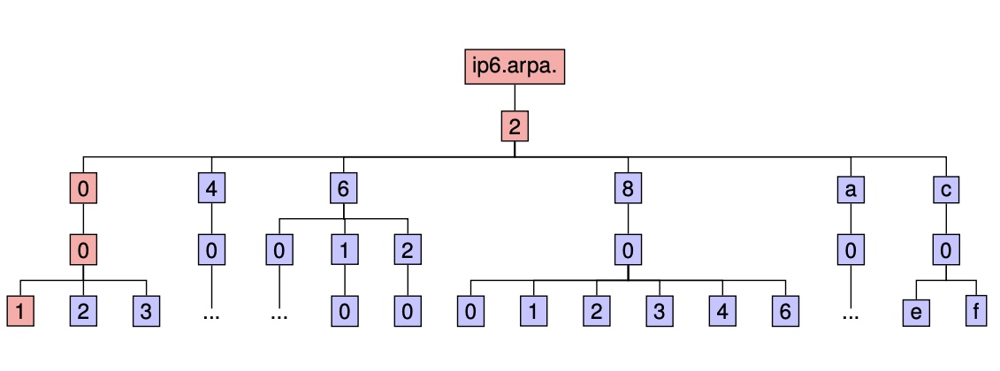

Idea

*   Mentioned by Peter van Dijk in a blog post6 in 2012
*   Added to RFC7707 \[12\]
*   Implemented as Internet-wide Scan by Fiebig et al. \[13\] in 2017  
    

Requirement - NXDomain

*   DNS response code
*   Neither the domain, nor any subdomain exists \[14\]

*   Start at root ip6.arpa.
*   Query first nibble value
*   Prune whole subtree in case of NXDomain
*   Query next nibble value
*   Descend into subtree
*   Descend until full address is reached

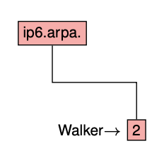

 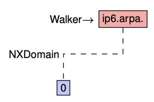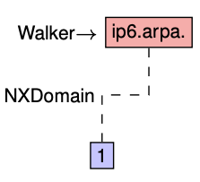 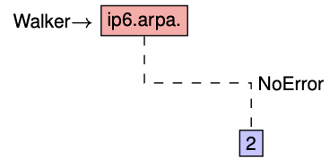 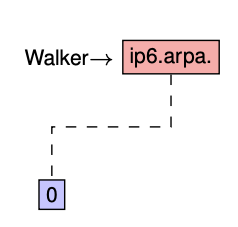

Full IPv6 scan:

*   Query rate: 200 queries per name server
*   Scan duration: 7 to 10 days
*   Large query overhead

*   All 16 permutations of each nibble are queried
*   Majority replies are NXDomain

Results :

*   1.2 Mio /64 prefixes
*   9 Mio addresses
*   Addresses cover > 5k autonomous systems
*   Most popular ASes

*   KPN

*   Yandex

*    Yahoo

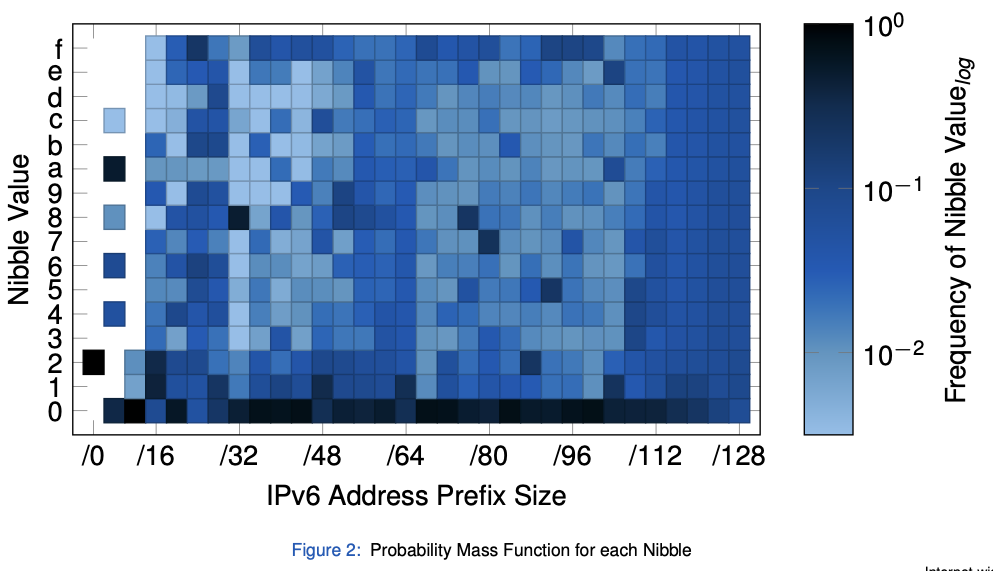

Result distribution:

*   Shows frequency of nibble values
*   The first nibble is always 2
*   Patterns can be seen, e.g. ff:fe

→ IPV6- MACHINE LEARNING

Learn addresses from schemes in existing datasets

*   Relies on responsive addresses as seed list
*   Addresses are often assigned with a specific pattern

*   e.g. MAC-based IIDs with ff:fe
*   Servers with a fixed schema

*   These patterns can be used to learn new addresses
*   Entropy/IP \[15\]

*   Calculate entropy of addresses
*   Transform to a Bayesian network model
*   Walk the model to generate addresses

*   6Gen \[16\]

*   Cluster addresses

→ Good approach to extend existing hitlists with comparable responsiveness

→ TARGET BIAS

Evaluate Interface ID (IID) portion of IPv6 addresses to determine device type

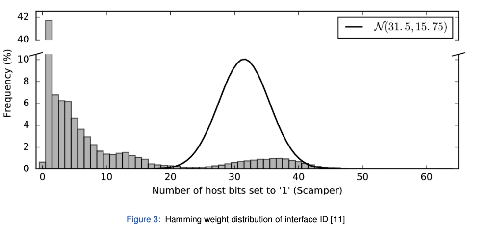

*   Traceroute source (scamper) contains routers
*   Router IP addresses are assigned mostly manually
*   Most commonly only one bit of IID set to ‘1’ → e.g. ::1 for default gateway

Evaluate Interface ID (IID) portion of IPv6 addresses to determine device type

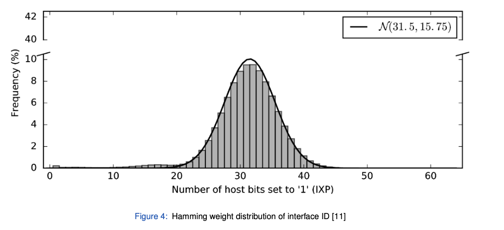

*   IXP source contains many client devices
*   Clients make extensive use of IPv6 Privacy Extensions
*   Central limit theorem → sum of single-bit distributions approximates normal distribution

→ AS Bias

Hitlists can have a bias not only towards device types but also autonomous systems.

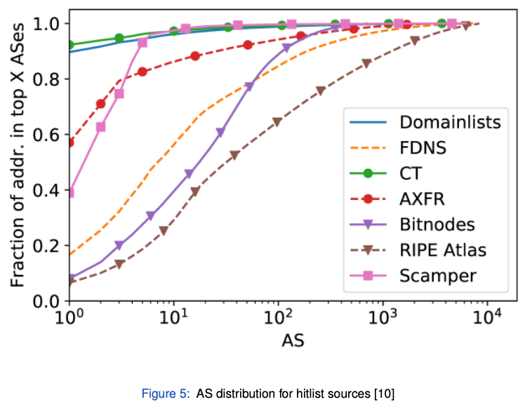

→ Aliased Prefixes

Problem:

*   Alias: another address of the same host
*   Aliased prefix: whole prefix bound to the same host
*   Bias: some hosts over-represented due to aliased prefixes 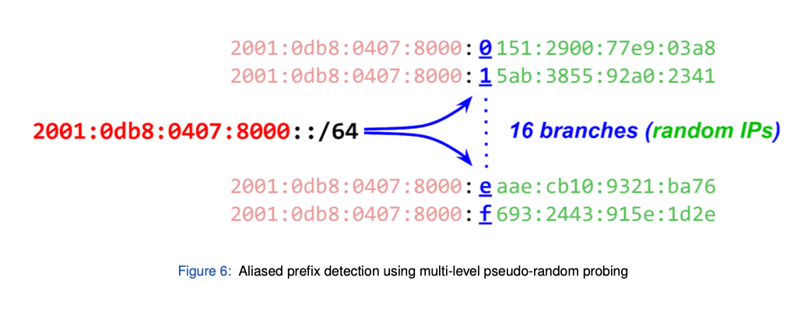

Results:

*   Only small number of prefixes are aliased
*   But nearly half of the addresses are in aliased prefixes
*   Validated using fingerprinting (initial TTL, TCP options, timestamps)
*   Aliased prefix detection is crucial to reduce bias

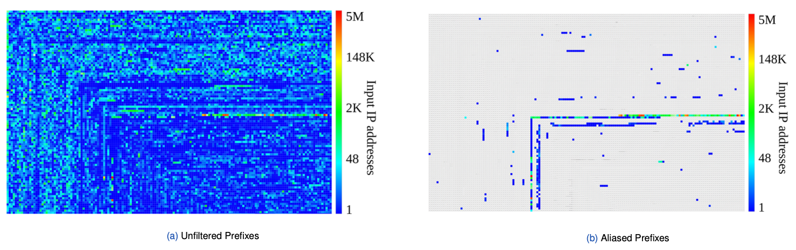

→ HITLISTS BIASES

However, many of these are not necessarily aliased but fully responsive \[17\]:

• Aliased prefixes are often announced by CDNs.

*   For Fastly, more than 98 % of announced IPv6 addresses are aliased.

• Many domains resolve to IPv6 addresses in aliased prefixes.

*    For Cloudflare, aliased prefixes host more than 10 M domains.

•  Fingerprinting reveals different behavior between hosts within the same aliased prefix . We tested the responsiveness to other protocols for one address out of 60 k aliased prefix:

*   32.3 k are responsive to TCP/443
*   28.8 k are responsive to UDP/443
*   172 are responsive to UDP/53

→ Including addresses from fully responsive prefixes should be considered in research relying on IPv6 hitlists.

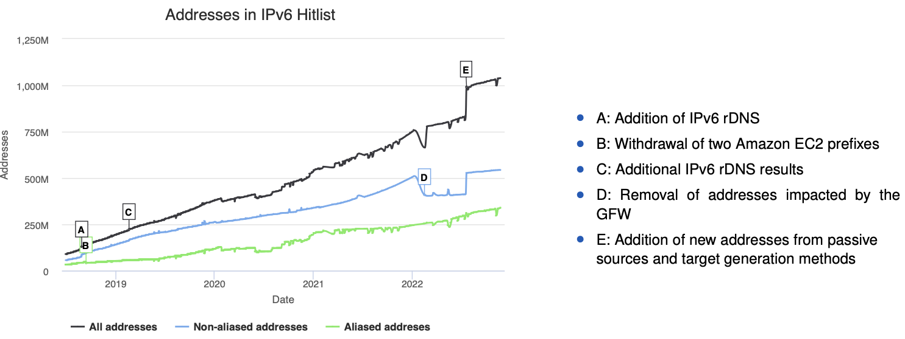

→ FILTER

The input has to be filtered by several steps before the responsiveness can be tested.

Not globally routed

*   Datasets might contain addresses that are not routed
*   Infrastructure changes might change the reachability of addresses

Blocklisted

• Aggregated list of blocklisting requests from all scans at our chair

Aliased prefixes

Not responsive for 30 consecutive days

Hitlists:

*   Lots of possible sources
*   Knowledge about sources is important
*   Number of IP addresses is not only metric → evaluate reachability and stability
*   Optimal sources depend on type of measurement (end-user devices, servers, routers,. . . )
*   Be aware of biases in your hitlist (address distribution, prefix/AS distribution, aliased prefixes)

QUIC Measurements

As a new fundamental network protocol with widespread early adoption, QUIC requires early analysis and researchers tools to analyze QUIC deployments.

→ We provided an Internet-wide measurement study shortly before the final RFC release \[19\]

Research Questions:

1.  How can we detect QUIC deployments?

*   →  IPv4 + IPv6 ZMap modules
*   →  HTTPS DNS RR
*   →  HTTP ALT-SVC header

2.  Who deploys QUIC?
3.  Which QUIC versions are deployed?
4.  Can we successfully connect to QUIC servers and analyze deployments?

→ We developed and published the QScanner, a highly parallelized stateful QUIC scanner

How can we detect QUIC deployments?

ZMap module:

*   QUIC relies on UDP

→ ZMap needs to send valid QUIC packets

*   Relies on the QUIC version negotiation

*   Server responses should contain all supported versions
*   No state is created at the server
*   No computational expensive cryptography is necessary

*   Requires no input (at least for IPv4)
*   ZMap reports most addresses supporting the QUIC version negotiation

*    Domains can be mapped to only 10 % of addresses

HTTPS DNS Resource Records

*   Based on a new IETF draft \[20\]
*   Specifies DNS resource records to provide service information

*   Can include ALPN values indicating QUIC support
*    simple.example 7200 IN HTTPS 1 . alpn=h3

*   Requires domains to resolve

→ HTTPS DNS RRs results in the fewest amount of deployments

HTTP ALTSVC Headers

*   HTTP header containing alternative service information

*    Can include ALPN values indicating QUIC support
*    alt-svc: h3=":443"; ma=86400, h3-29=":443"; ma=86400, h3-28=":443"; ma=86400, h3-27=":443"; ma=86400

*   Requires HTTP(s) capable targets and scans
*   ALT-SVC reveals the most domains with QUIC support

→   WHO DEPLOYS QUIC ?

To analyze who is involved in the deployment of QUIC, we analyzed originating ASes:

*   Deployments are dominated by large providers
*   ZMap results in addresses located in more than 4.7 k ASes
*   HTTPS DNS Resource Records are strongly biased towards Cloudflare 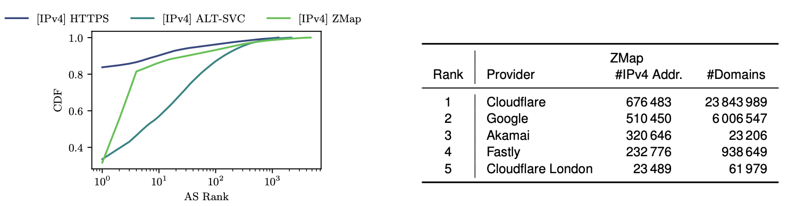

Which QUIC versions are deployed? 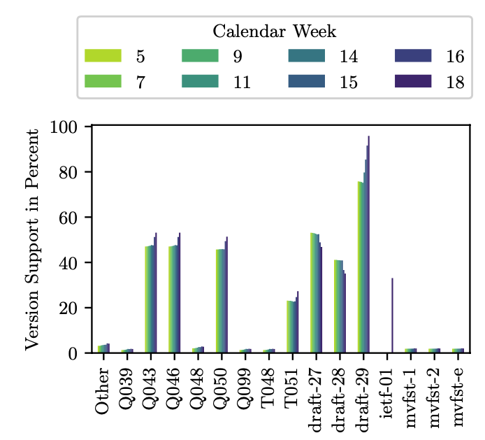

We regularly scanned with ZMap between February and May 2021:

*   50 % of found targets still supported Google QUIC versions
*   More than 90% supported the latest draft that should be de- ployed (Draft-29)
*   First deployments announced Version 1 even before the final RFC release

Can we successfully connect to QUIC servers?

QScanner (https://github.com/tumi8/QScanner)

*   Stateful scanner based on quic-go that conducts full handshakes
*   Supports the latest drafts and Version 1
*   Allows HTTP requests after successful handshakes
*   Extracts widespread information:

*   connection information
*   TLS properties
*   X.509 certificates
*   HTTP headers

→ We are able to successfully complete handshakes with more than 26 M targets

• Low success rate without a server name identifier

• Version mismatches were mainly due to an iterative roll-out of IETF QUIC at Google

*   They do not occur in current scans

• Including the server name identifier drastically increases the success rate

*   Addresses from ZMap without domains have to be treated carefully

Can we identify different QUIC deployments based on configurations?

Servers share a set of QUIC Transport Parameters during the handshake:

*   17 different parameters exist, e.g.,

*   initial size of the flow control window
*   the maximum number of allowed streams

*   A new TLS extension was defined to send transport parameters (see RFC9001

         →   The QScanner extracts server values

         →  Can we identify different QUIC deployments based on configurations? 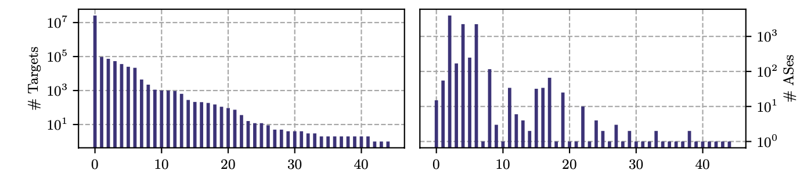

Transport parameters differ within order of magnitudes

*   We find 45 different parameter sets
*   The most common set is used by Cloudflare and 15 additional ASes
*   Three parameter sets are seen in more than 1000 ASes
*   Two out of these are seen in combination with a single HTTP Server header value:  
    • proxygen-bolt

→ These targets are edge PoPs from Facebook and not set up by individuals

→ QUIC MEASUREMENT CONCLUSION

*    Different means to detect QUIC deployments exist, each offering unique targets
*   Widespread deployment of QUIC can be found

*   more than 2M addresses in 4700 ASes

*    The overall state was solid and ready for the RFC release

*   26 M targets result in successful handshakes
*   More than 90 % of targets support the latest draft or version 1

*     Mainly driven by large providers

• We identified deployments in many ASes as edge PoPs of large providers