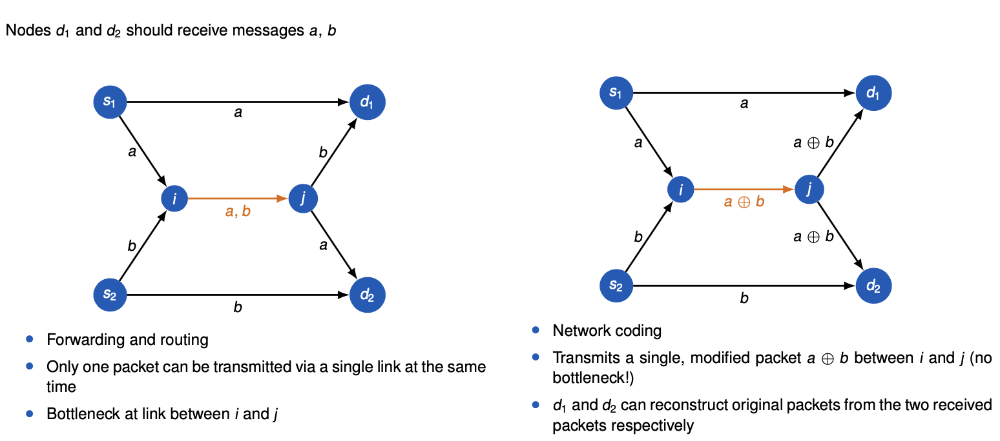
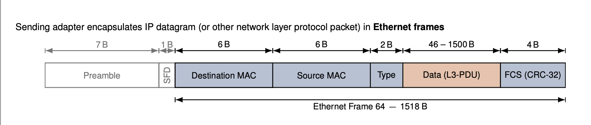
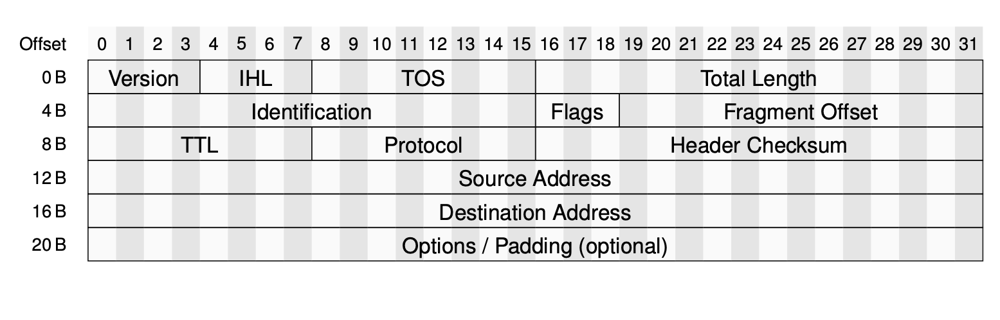
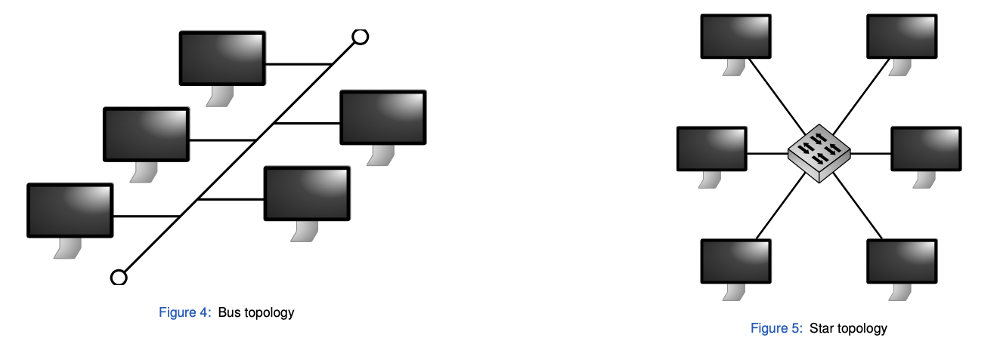
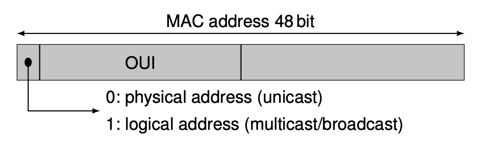
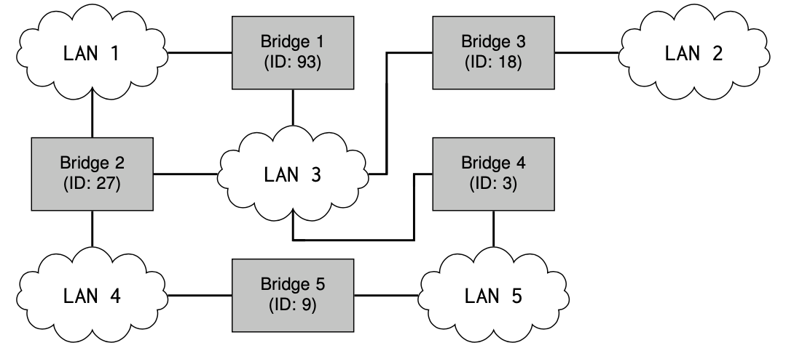
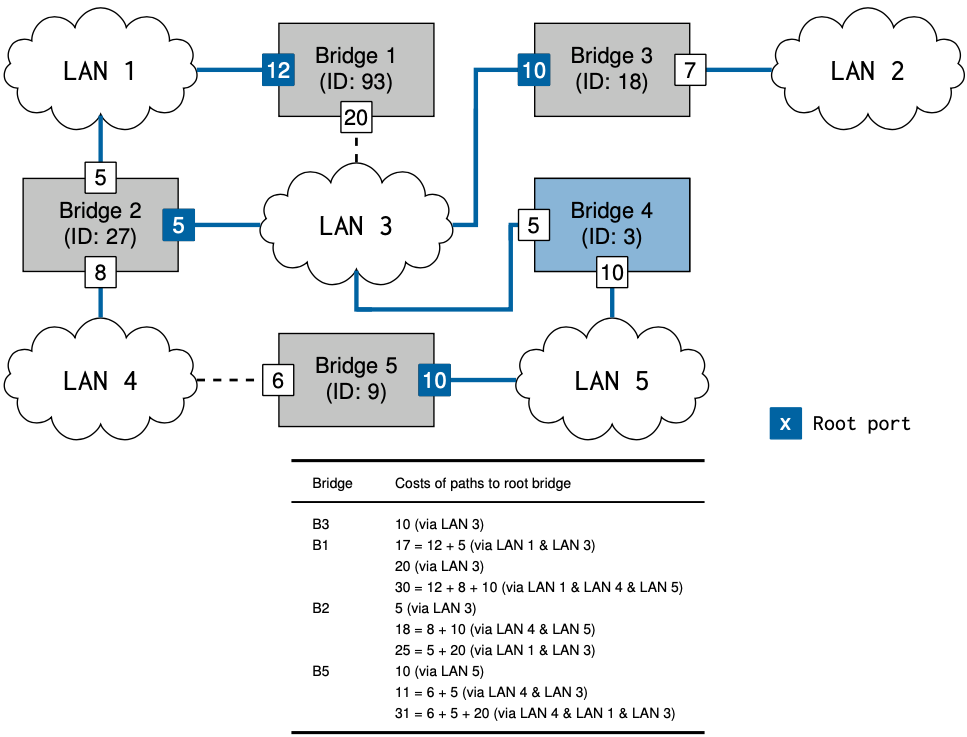
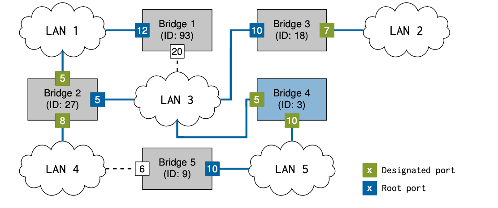
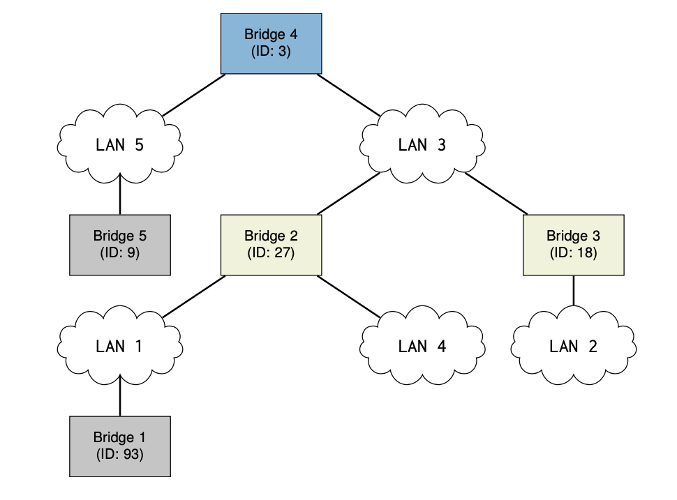

Protocol Mechanisms
===================

→ Forwarding/routing vs. network coding

→ Network coding

*   A different type of routing
*   Nodes in a network combine packets possibly from different sources and generate groups of encoded packets
*   Outgoing packets are arbitrary combinations of previously received packets

→ Traditional routing and forwarding

*   Routing determines best paths from source to destination
*   Packets are forwarded by switches and routers along one of these paths
*   Packet payloads remain unaltered

→ Benefits of layering

*   Need layers to manage complexity

*   don't want to reinvent Ethernet-specific protocol for each application

*   Common functionality

*   "Ideal" network

→ Link layer

*   Hosts and routers are nodes
*   Layer-2 packet is called frame
*   Layer-3 packet often called packet, sometimes also datagram

→ The data link layer has the responsibility of transferring a datagram from one node to an adjacent node over a link.

→ Link Layer # Services

*   Framing,link access

*   Encapsulate datagram into frame, adding header, trailer
*   Channel access if shared medium
*   "MAC" addresses used in frame headers to identify source and destination node

*   Different from IP address.

*   Reliable delivery between adjacent nodes

*   Rarely used on low bit-error rate links (fiber, some twisted pair)
*   Wireless links: high error rates

*   L2 retransmission scheme, e.g wireless LAN (IEEE 802.11)

*   Flow Control

*   Pacing between adjacent sending and receiving nodes

*   Error detection

*   Errors caused by signal attenuation, noise
*   Receiver detects presence of errors:

*   Signals sender for retransmission or drops of frame

*   Error correction

*   Receiver identifies and correct error(s)

*   Error correcting codes: correcting bit errors without retransmission
*   Terminology "error correction" may include retransmissions

*   Half-duplex and full-duplex

*   With half duplex, nodes at both ends of link can transmit, but not at same time.

→ Two types of "links"

*   Point-to-point

*   Point-to-point link between Ethernet Switch and host
*   PPP for dial-up access

*   Broadcast (shared wire  or medium)

*   Old-fashioned Ethernet
*   802.11 Wireless Lan

→ MAC Protocols: A Taxonomy (Three board classes)        

*   Channel Partitioning

*   Divide channel into smaller "pieces" (time slots, frequency, code)
*   Allocate piece to node for exclusive use

*   Random access

*   Channel not divided, allow collisions "recover" from collisions

*   Taking turns

*   Nodes take turns, nodes with more to send can take longer turns
*   Poling from central site, token passing
*   Bluetooth, FDDI, IBM Token Ring

→ ETHERNET FRAME

→ IPv4 Datagram

*   32 bit IPv4 address

*   Network layer address
*   Used to get datagram to destination IP subnet

*   MAC/LAN/physical/Ethernet address

*   Function: transmit frame from one interface to another physically-connected interface (same network)
*   48 bit MAC address (for most LANs)

*   Burned in network adapter ROM or configurable in software

→ Bus vs Star

→ Logical bus topology (10base5, 10base2)

*   All nodes are part of a common collision domain
*   Defect bus wire splits network in two parts

→ Star topology (newer standards)

*   Active switch in center
*   Each "spoke"  runs a (separate) Ethernet protocol, therefore a defect wire disconnects only one host

→ RJ45-Based Ethernet

*   Advantages

*   Robustness
*   Cheap, existing wiring

*   Disadvantages

*   Short cable lengths
*   High energy consumption (for 10G)

→ Limitations of L2

*   Scalability problems:

*   Flat addresses
*   No hop count (so loops may lead to disaster)
*   Missing additional protocols (such as ICMP)
*   Perhaps missing features:

*   Fragmentation
*   Error messages
*   Congestion Feedback

→ MAC addresses layout

*   Human-friendly notation for MAC addresses

*   Six groups of two hex digits, separated by "-" or "." in transmission order
*   E.g 0C-C4-11-6F-E3-98        

*   Multicast and broadcast

*   Broadcast address: FF-FF-FF-FF-FF-FF
*   Multicast address: least-significant bit of first byte has value "1"

*   Organisation Unique Identifier (OUI) : company id

*   Manufacturer purchases portion of MAC address space from IEEE Registration Authority (assuring uniqueness)
*   OUI: First 3 byte of address in transmission order
*   OUI enforced: 2nd least significant bit of first byte has value "0"
*   otherwise : locally administered MAC address

*   Locally administered MAC addresses:

*   Similar to private address blocks on layer 3
*   E.g used for VMs

*   MAC address: flat address portability (+ implication on privacy)

*   Can move LAN card from one LAN to another

*   IP address: hierarchical address NOT portable

*   Address depends on IP subnet to which node is attached.

→ Bit-reversed representation of MAC address

*   Corresponds to convention of transmitting least-significant-bit of each byte first in serial data communications (transmission of LAN addresses over the wire)
*   Also known as “canonical form”, “LSB format” or “Ethernet format“ (LSB: Least Significant Bit):

*   First bit of each byte on the wire maps to least significant (i.e., right-most) bit of each byte in memory (cf. RFC 2469)

*   Token Ring (IEEE 802.5) and FDDI (IEEE 802.6) do not use canonical form, but instead: most-significant bit first

→ MAC addressing modes

*   General address types (L2 and L3): Unicast, Multicast,Broadcast, Anycast
*   Terminology to distinguish destination MAC addresses

*   Physical addresses: identify specific MAC adapters
*   Logical addresses: identify logical group of MAC destinations

*   LAN broadcast address: FF-FF-FF-FF-FF-FF
*   Transmission of multicast frames

*   Sender transmits frame with multicast destination address

*   Reception of multicast frames

*   NICs can be configured to capture frames whose destination address is:

*   Their unicast address or
*   One of set of multicast addresses

Layer 2

→ HUB

*   Physical-layer ("dump") repeaters:

*   No frame buffering
*   No collision detection at hub: host NICs detect collisions

→ Switch

*   Link-layer devices: smarter than hubs, take active role

*   Store & Forward of Ethernet frames or cut-through switching
*   Examine incoming frame's MAC address, selectively forward frames to one or more outgoing links

*   Transparent

*   Hosts are unaware of presence of switches

*   Plug-and-play, self-learning

*   Switches do not need to be configured

→ Switches buffer packets

→ Ethernet protocol used on each incoming link, but no collisions; full duplex

*   Each link is its own collision domain

→ Switches learn which hosts can b e reached through which interfaces

*   When a frame is received, a switch "learns" location of sender: incoming LAN segment
*   Records sender/location pair in switch table
*   Expiry time: soft state mechanism

→ Switch: frame filtering/forwarding

→ SPANNING TREE PROTOCOL

*   Bridges gossip among themselves
*   Compute loop-free subset
*   Forward data on the spanning tree
*   Other links are backups

→ ALGORITHM

*   Step 1: select root bridge, i.e bridge with lowest bridge\_ID
*   Step 2: determine least cost paths to root bridge

*   Each bridge determines cost of each possible path to root
*   Each bridge picks least-cost path
*   Port connecting to that path becomes root port (RP)
*   Bridges on network segment determine bridge port with least-cost-path to root i.e designated port (DP)
*   Disable all other root paths

*   Bridge Protocol Data Units (BPDUs) are sent regularly (default: 2s) to STP  multicast address

→ Bridge Protocol Data Units (BDPUs)

*   Configuration BPDUs transmit bridge\_IDs and root path costs
*   Topology Change Notification (TCN) BPDU announce changes in network topology

→ STP switch port states

*   Blocking
*   Listening
*   Learning
*   Forwarding
*   Disabled

→ Least cost path becomes the root port.

→ RESULT

