TCP/UDP/QUIC
============

*   TCP : Transmission Control Protocol

→ Connection oriented

→ In sequence delivery of byte stream - Stream-oriented

→ Reliability properties

*   Bit error detection
*   TSDU (Transport Service Data Unit) loss detection and retransmission

→ Provides Flow Control (sender will not overwhelm receiver)

→ Provides Congestion Control (sender will not overwhelm network)

→ Used in many applications: HTTP/FTP/SSLTLS/SSH/BGP/Backups …

 → Properties:

        → Point-to-point

*   One   sender, one receiver

→ Reliable

*   Everything that was sent will be received at some point  

→ In-order

*   Sending order is receiving order

→ Stream-oriented

*   Data is one continuous stream, no message boundaries
*   Example:

*   send("Hello"); send("World");
*   recv()

                        "HelloWorld", "Hello", "Hell"

*   Not possible to have: "World", "HeWorld"

→ Connection-oriented

*   Handshakes, holding state on both sides, tear-downs
*   3-way handshake

SYN→ SYN/ACK → ACK

FIN → FIN/ACK → ACK

→ Flow controlled  

*   Sender can only send as much as the receiver can utilize

→ Congestion controlled

*   Sender throttles bandwidth to not overwhelm network

→ TCP Header

  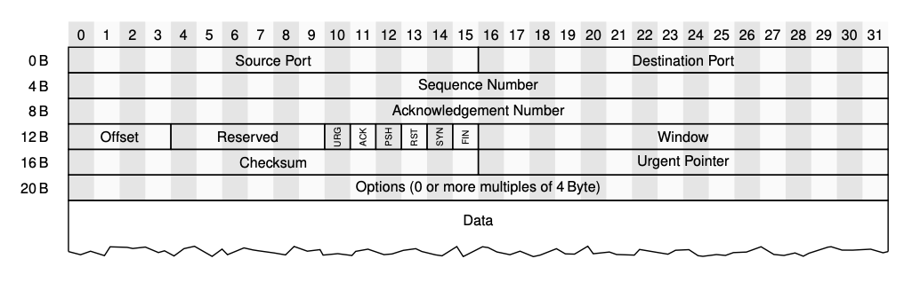

→ Basic Operation

Sender:

*   Sends segments
*   Expects acks

→ How does the sender know if a segment is lost ?

*   ACK is not received within a certain time interval

*   Timeout occurs
*   Sender retransmits segment
*   Takes at least timeout value + 1 RTT until lost segment is acknowledged

*   Multiple duplicate ACKs arrive

*   Can be caused by reordering or packet loss
*   Segments arrived out-of-order, or at least one segment was lost
*   3 duplicate ACKs => Sender performs Fast Retransmit
*   Remark: 3 duplicate ACKs != 3 lost segments
*   One or more lost segments always cause duplicate ACKs as long as there are subsequent segments

→ How to estimate RTT

*   SampleRTT: measured time from segment transmission until ACK receipt

*   Ignore retransmissions

*   SampleRTT will vary, want estimated RTT "smoother"

*   Average several recent measurements, not just current sampleRTT

*   Called: Exponential weighted moving average (EWMA)
*   Influence of past sample decreases
*   More weight on recent samples than on older samples
*   Typical value 

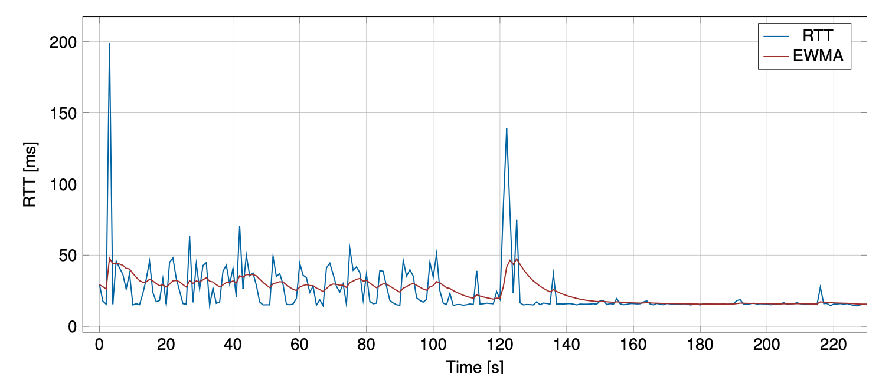

→ TCP Options

*   Maximum Segment Size Option (MSS)

*   Announce MSS during handshake: accept no segments larger than MSS
*   Can be completely independently in each direction
*   MSS counts only data octets in the segment, it does not count the TCP/IP header

*   TCP Timestamp Option

*   Prevents ambiguity of ACKs (is the ACK from the original packet or the retransmission)
*   Sender and receiver have a (virtual) "timestamp clock”
*   Append two "timestamps" to each sent TCP segment:

*   TImestamp Value (TSVal): current "timestamp" when the packet is sent
*   Timestamp Echo Reply (TSecr): lates TSVal received before sending the packet

*   On receive compute: TSecr - current timestamp

*   Selective Ack Options

*   TCP only provides feedback about the next expected segment
*   What if each second segment gets lost ? → many RTTs to retransmit everything
*   Goal: provide more information about received/missing arguments

*   TCP windows scale option

*   2B windows size field → at most about 65 kb receive buffer
*   Scale the announced window by a factor (shift the window)

→ FLOW CONTROL 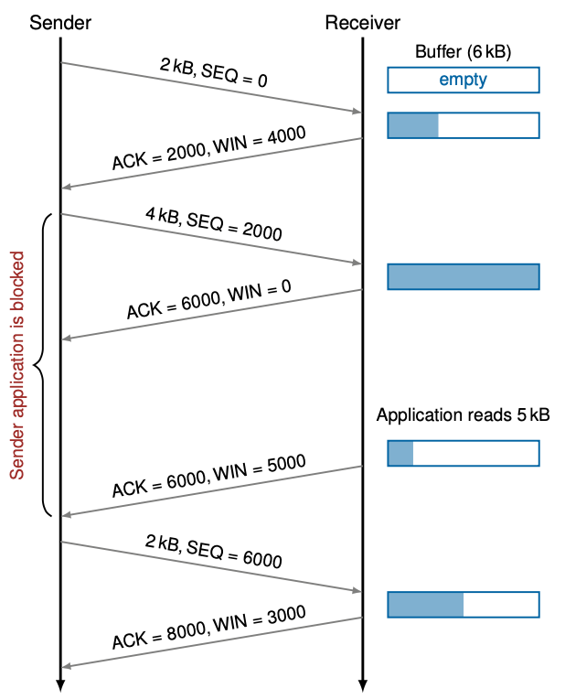

*   Receiver may be a resource limited device
*   OS kernel buffers segments for applications to process
*   Buffer is of limited (maybe small) size
*   If the buffer is full: incoming segments are dropped
*   Flow control sets a maximum of data the sender is allowed to send
*   Implemented by using the window field in the header
*   Used in order to avoid overwhelming of receiver buffer

→ CONGESTION CONTROL

*   Informally: "Too many sources sending too much data too fast for the network to handle"
*   Different from flow control (which handles overlad at the recipient)

     → Manifestations:

*   Lost packets (buffer overflow at routers)
*   Long delays (router buffer queues fill up)

What we want is ⬇️

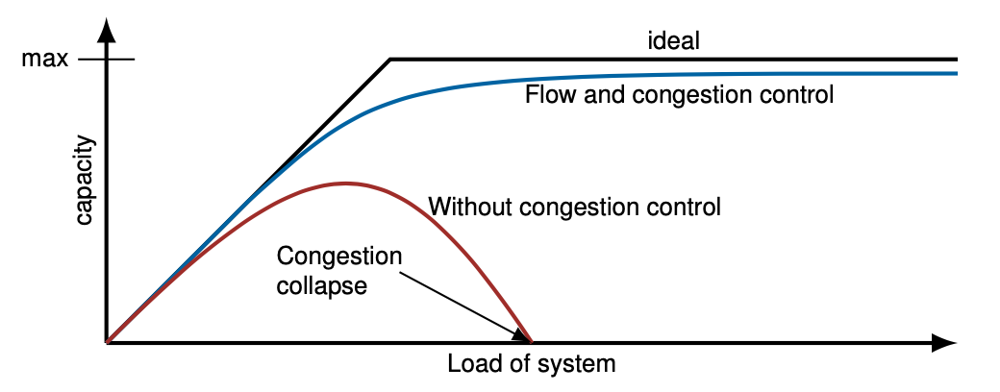

→ Without controlling amount of outgoing data, capacity may drop dramatically because of congestion collapse

→ Round Trip Propagation delay:  being the delay of link i

→ Bottleneck bandwidth:   being the bandwidth of link i

→ BtlneckBufSize: buffer size at the bottleneck link

→ Amount inflight: data which is sent but not acked.

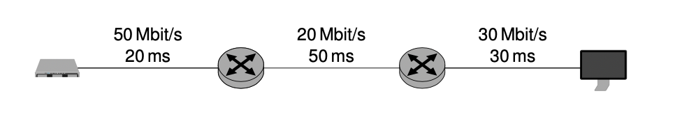

→  Congestion Control

*   Application limited if inflight < BDP

*   Link underutilization
*   Low latency

*   Bandwidth Limited if BDP < Inflight < BDP+BtlneckBufSize  

*   Full link utilization
*   Buffer starts filling

*   Buffer Limited if BDP + BtlneckBufSize < Inflight

*   packet  loss leads to lower goodput (retransmission consume bandwidth)
*   Unpredictable latency due to retransmissions

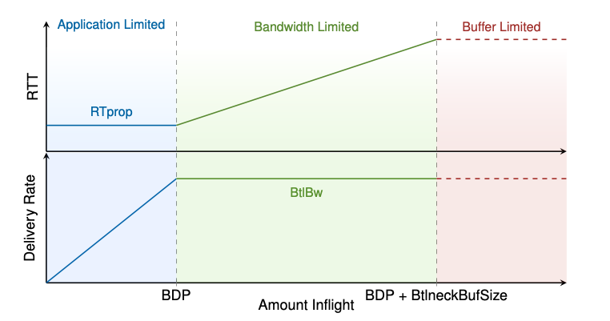

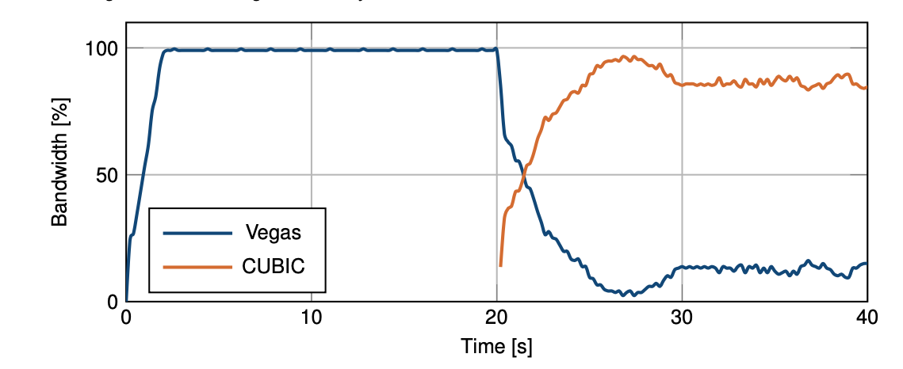

→ Is TCP fair ?

*   Multiple TCP flows use the same path
*   Do all of them get an equal share of bandwidth ?
*   Multiple different congestion control algorithms may be used !

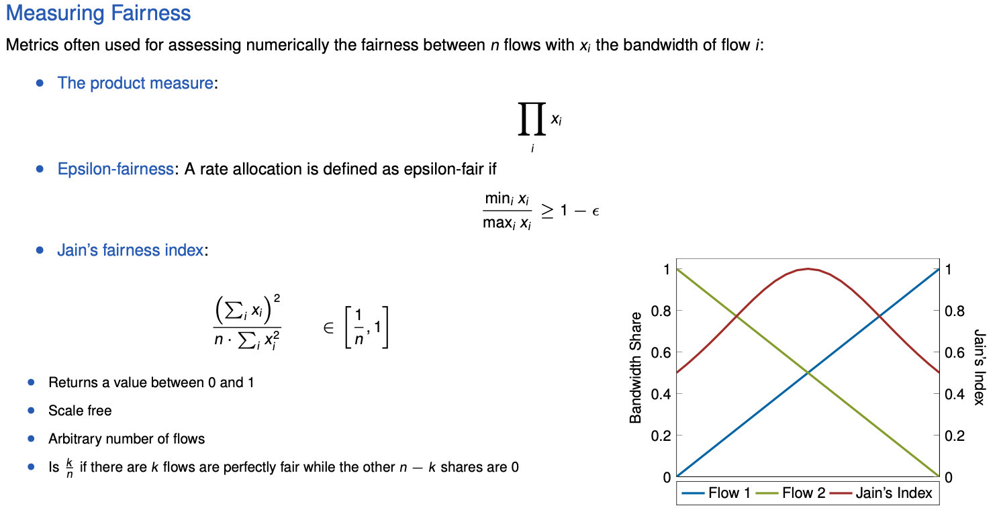

→ How does TCP regulate the sending rate ?

*   Only have a well-defined number of bytes (/segments) in the network, which have not yet been acked.

*   This number of bytes is called the  Congestion Window

 → How to process available information to modify the congestion window size ?

*   Different classes

*   Loss-based
*   Delay-based
*   Model-based
*   Hybrid-approach

*   Most popular/interesting

*   TCP Tahoe ( slow start, congestion avoidance)
*   TCP Reno (fast retransmit, fast recovery, today: TCP new reno)
*   TCP Vegas
*   TCP Cubic  (current default in the Linux kernel)
*   TCP BBR (new, proposed by Google)

→ LOSS-BASED CONGESTION CONTROL

*   Assumption: Packet loss only happens due to congestion
*   No packet loss → increase congestion window
*   Packet loss → decrease congestion window
*   Advantages: robust, reliable, efficient
*   Disadvantages: buffers kept full → high latency, performance drop on lossy links
*   Examples: Reno, BIC, CUBIC

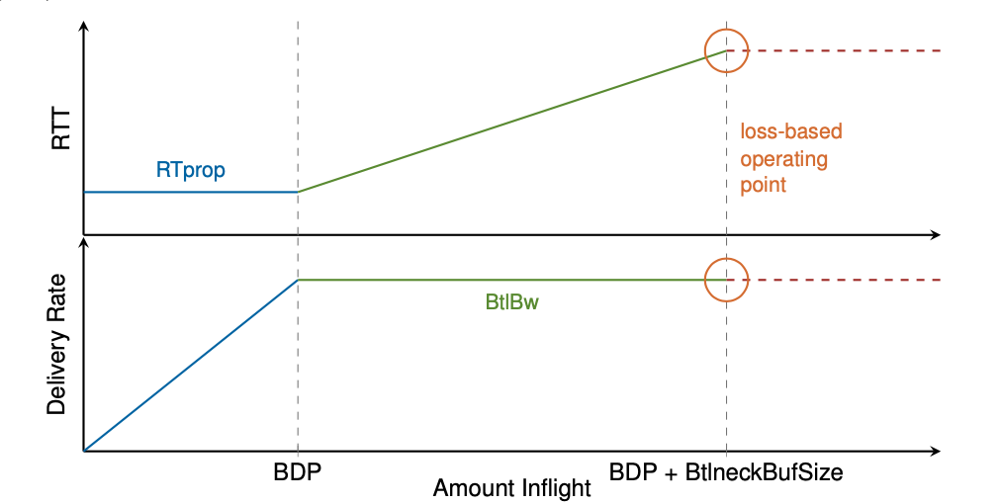

→ TCP RENO

*   Every packet loss is induced by a network overload

*   Therefore, TCP senders should reduce data rate
*   However, think about lossy links!

*   AIMD strategy: Additive Increase Multiplicative Decrease
*   Two modes of operation:

*   Slow start: Exponential growth of congestion window
*   Congestion Avoidance: Linear growth of congestion window

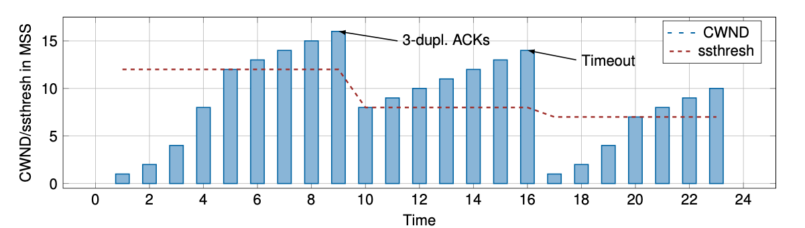

→ TCP Reno Variables

*   CWND: Congestion Window, limits the amount of inflight data
*   sshtresh: Slow Start threshold

→ Slow Start:

*   For every acked MSS increase CWND by 1 MSS
*   Use this mode if CWND < ssthresh

→ Congestion Avoidance

*   For every acked MSS,  increase CWND by 1/CWND

effectively increase CWND by 1 MSS each RTT→ additive increase

*   Use this mode, if CWND >= ssthresh

→ Reception of 3 duplicated acks:

*   Set ssthresh  to CWND/2
*   Set  CWND to ssthresh  (Fast Recovery) → multiplicative decrease

→ Ack timeout

*   Set ssthresh  to CWND/2
*   Set  CWND to 1 MSS
*   Restart with Slow Start

→ Problems with RENO

*   Low performance on lossy links
*   Buffers are filled
*   Increase depends on the RTT → slow growth on long distance links
*   Has problems fully utilizing large BDP links

→ TCP CUBIC

*   Default congestion algorithm in Linux since kernel 2.6.19
*   Same as Reno: Packet losses are considered to indicate a network overload
*   But: scaling should be different
*   Maximum usable bandwidth is estimated
*   That bandwidth should be used, and if nothing is lost, higher bandwidth is explored.

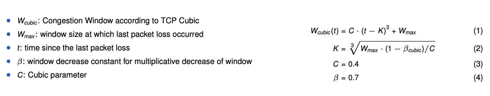

*   Congestion windows is not halved for every packet loss (B= 0.7)
*   Congestion window growth is modeled after a cubic function with plateau W\_cubic
*   Converges fast (concave growth) towards the bandwidth of the last packet loss W\_cubic
*   If this is fine, higher bandwidth is explored (convex growth)

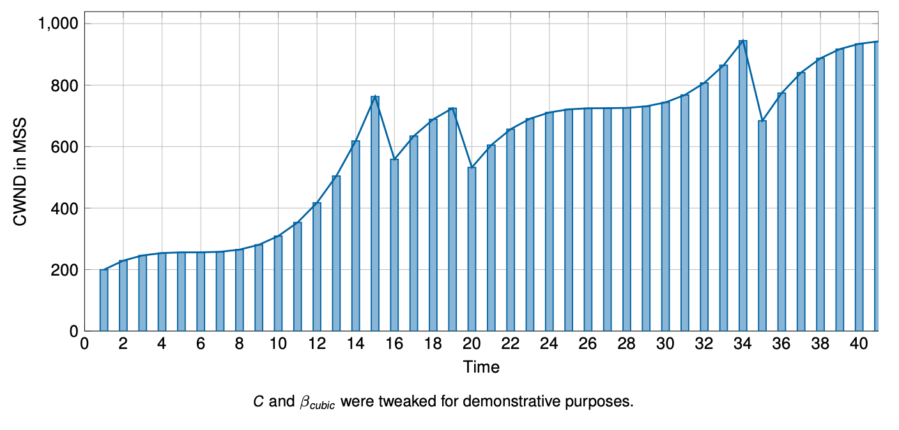

→ TCP CUBIC ADVANTAGES

*   CWND growth is independent of the RTT
*   Scalable to high BDP networks
*   More resilient against single stochastic packet loss than Reno

→ TCP CUBIC DISADVANTAGES

*   Buffers are filled faster (cubic growth function)
*   Buffers are kept full (reduced only by 30 % after packet loss)

→ Delay-Based Congestion Control

*   Use delay to detect congestion
*   Increase in RTT → a buffer is filling up somewhere

     →   Advantages

*   Less restrained by random packet loss
*   Early congestion detection
*   High throughput with low latency

     → Disadvantages

*   One loss-based flow cancels all advantages
*   Poor performance against loss-based flows

→ TCP Vegas

*   Reno relies on losses to detect network congestion
*   At that point something already has gone wrong
*   Vegas tries to detect that congestion is about to happen, and then reduces data rate
*   RTTs are continuously measured
*   RTT increases due to queuing effects
*   If RTT increases, the network is considered to become more congested
*   If RTT decreases, not all available bandwidth may be used
*   AIAD strategy: Additive Increase Additive Decrease

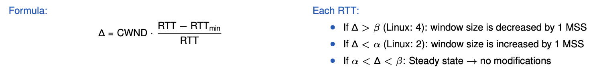

→ DELAY BASED VS LOSS-BASED

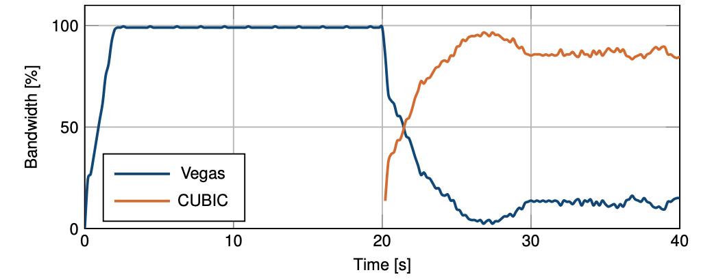

→ Why use delay-based algorithms at all ?

*   Background applications like downloading updates
*   LEDBAT( Low Extra Delay Background Transport)

\- Use hybrid approach for better performance when competing with loss-based algorithms

        -  For example  TCP Illinois:

                - Packet-loss prescribes if CWND is increased or decreased

                - Delay determines the quantity of the change

                        - low delay: faster increase, slower decrease

                        - high delay: slower increase, larger decrease

→ TCP BBR

*   Presented by Google in 2016.
*   BBR: Bottleneck Bandwidth and RTT
*   Aims for the same operation point as delay-based algorithms
*   Maximum bandwidth is determined by a single bottleneck
*   RTT increases due to queuing

→ TCP BBR USAGE

*   Available in Linux since kernel v4.9
*   Used on Google'’ and Youtube's servers
*   Used in Google's B4 backbone network
*   "BBRs throughput is consistently 2 to 25 times greater than CUBIC's"
*   "BBR yielded 4 percent higher network throughput\[.....\] BBR also keeps network queues shorter, reducing round-trip time by 33 percent"

→ ACK-Clocking:

*   Used by Reno, Cubic, Vegas  …
*   CWND limits the inflight data but sending rate is not limited
*   Arrival rate of ACKs determines the sending rate
*   Traffic bursts can create queues even if link is not utilized
*   Slow Start, retransmissions, ACK compression can cause bursts

→ PACING

*   Goal: evenly space the transmission the packets of a window across an entire RTT

→ TCP BBR GOALS

*   Keep 1 BDP of data inflight → full link utilization and no queuing delay
*   Send with the bottleneck bandwidth → no queue can build up

→ Implementation

*   Continuously monitors the network to find the minimal RTT and maximum bandwidth
*   Problem: theses parameters cannot be measured at once

*   RTprop can only be measured if the buffers are empty
*   BtlBw can only be measured while the link is fully utilized and a queue start growing
*   Solution: Alternating measurements

*   Use filters to record those values against sliding windows
*   Requires pacing to match sending rate to the bottleneck bandwidth

        → Internal BBR values:

*   RTprop
*   BtlBw
*   PacingGain
*   WindowGain

        → Four phases

*   Startup
*   Drain
*   Probe Bandwidth
*   Probe Round-Trip Time

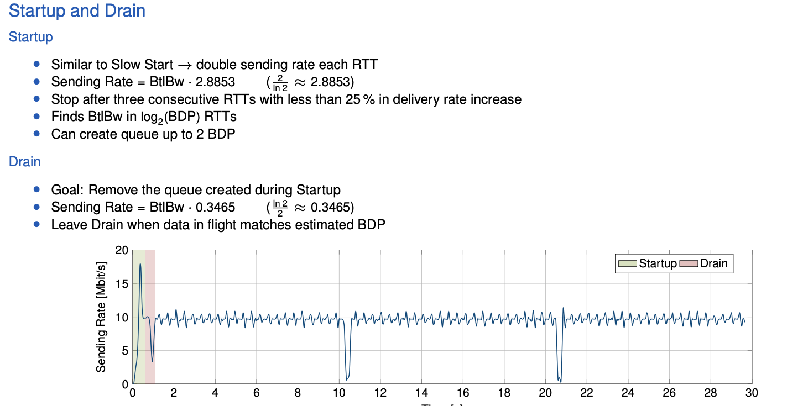

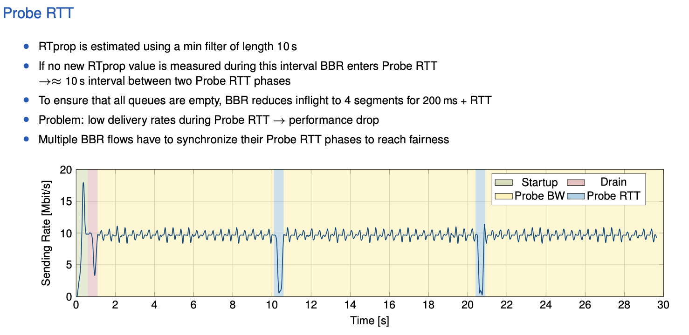

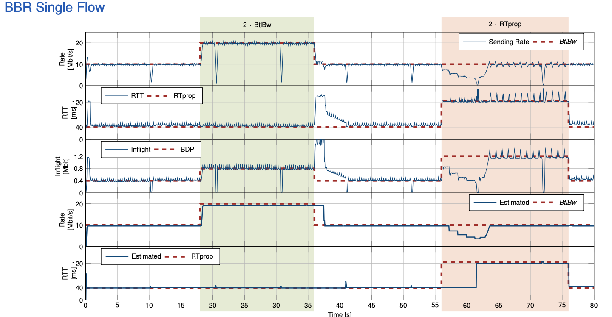

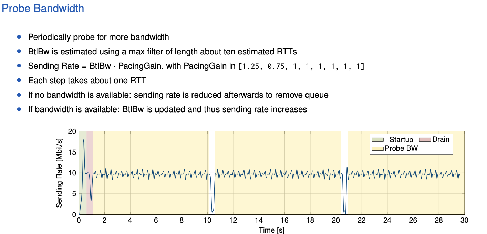

→ Strengths of BBR

*   Robustness against random packet loss
*   Low delay
*   High bandwidth usage
*   Close to the optimal operation point
*   Does not starve when competing with other algorithms

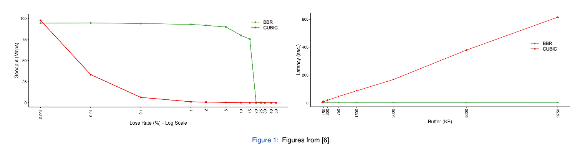

→ Problems with BBR 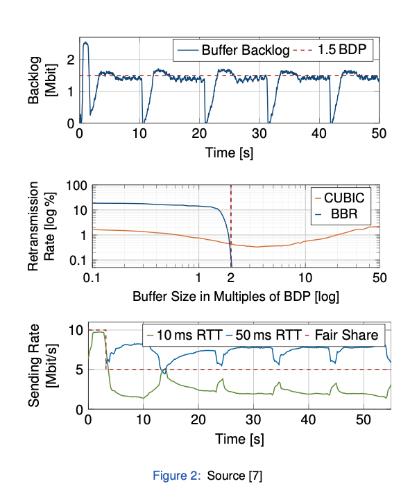

*   Numerous BBR flows fail to keep the buffer empty

*   Flows probe alternating for more bandwidth
*   Sum of the bandwidth estimations is larger than actual bandwidth
*   Flows create a persistent queue of size ~ 1.5 BDP

*   High number of retransmissions in network with shallow buffers

*   If the buffer is smaller than the persistent queue → packet loss
*   BBR does not react to it
*   With small (shallow) buffers BBR can generate 20 % retransmissions

*   RTT unfairness

*   BBR flows with larger RTT receive larger bandwidth shares than flows with lower RTT
*   With Reno and Cubic flows with lower RTT are favored

→ BBR V2

*   During Probe RTT, reduce cwnd to 50% instead of 4 packets
*   Consider detected packet loss for the model
*   Incorporate protocol features like ECN
*   Handle problems with ACK-aggregation
*   Better coexistence with Reno/CUBIC
*   Leave space for new entering flows

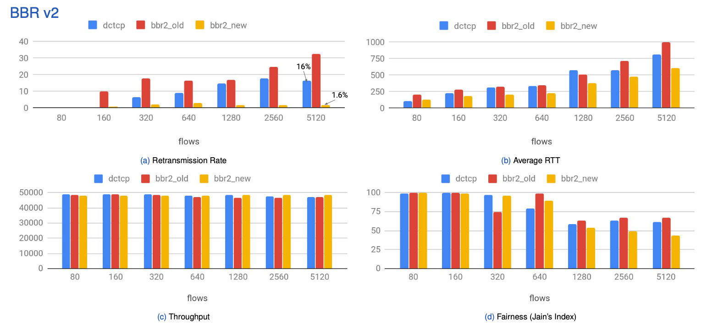

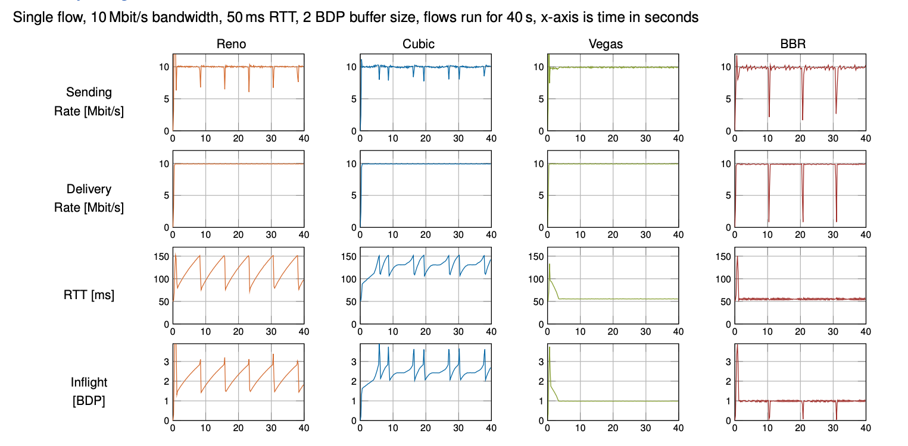

→ UDP

*   User Datagram Protocol
*   A connectionless transport protocol
*   A bit error detection
*   No flow or congestion control
*   No reordering, loss detection or recovery
*   Lightweight
*   Easy to implement

→ Used in:

*   DNS queries
*   Voice-over-IP  (VoIP)
*   Game server-client / client-client communication
*   NTP (Network Time Protocol)

→ UDP Header

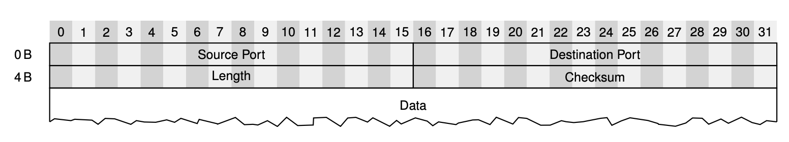

*   Source Port: which application of the sending host sent the datagram
*   Destination Port: which application of the receiving host should receive the datagram
*   Length:  Length of the datagram (L4-PDU)
*   Checksum: Checksum over IP pseudo header, UDP header, data

→ IDEA BEHIND  UDP

*   Multiplexing multiple communication instances between two hosts

→ Why use UDP, if it does not do much ?

*   Thin layer above Ipv4/ipv6
*   Application retains a lot of control
*   Suitable for time sensitive applications

*   No transport layer mechanisms that may impair timing properties

*   Occasional loss of datagrams tolerated or done by application
*   Re-ordering of datagrams tolerated or done by application

→  Example: Real-time video conferencing  

*   One frame is lost during transit: Nobody notices anyways
*   If strict ordering was applied, retransmission would be needed

*   Delays the video for a whole RTT
*   Noticeable stuttering of the video

→ SCTP (Stream Control Transmission Protocol)

*   Goals:

*   "Reliable transport protocol operating on top of a connectionless packet network such as IP"
*   Combines advantages of TCP and UDP
*   Multiple streams
*   Supports of multi-homing

→ Sounds good, so why don't we use it everywhere ?

*   TCP was already established as the default transport layer protocol (network ossification)
*   Poor support in operating systems and applications
*   Many middleboxes (e.g firewalls, NAT) do not work with SCTP → packets are discarded

→ QUIC

*   Originally Quick UDP Internet Connections, but not an acronym
*   Developed around 2012 by Google, deployed in Google Chrome and Chromium
*   A substitute for the TCP/TLS protocol stack, based on UDP
*   2016-2021 standardization by the IETF

→ Motivation and Goals

*   Decrease handshake delay
*   Get rid of head-of-line blocking
*   Faster development cycles
*   Middlebox resistance
*   IP mobility

→ QUIC Features

*   Connection ID

*   Used instead of the 5-tuple as identifier
*   This allows to change IP and port

*   Stream multiplexing

*   Multiple streams within a connection
*   Each stream provides a reliable bidirectional bytestream
*   QUIC packet contains several frames
*   QUIC packet can carry stream frames from multiple streams

*   Different Frame Types

*   Control frames
*   Data and ack frames

*   Flow Control

*   Stream flow control
*   Connection flow control

*   Congestion Control

*   Currently Cubic
*   BBR implementation in progress

*   Different Packet Types

*   Version negotiation packet
*   Initial packet
*   Retry packet
*   Handshake packet

*   Encryption and Authentication

*   Packets are always protected using TLS1.3

*   Loss Detection and Re-ordering

*   Retransmissions have different packet numbers → use Stream Offset for in order delivery
*   More elaborated ack mechanism including selective and negative ACKs (SACKs and NACKs)

→ Decrease Handshake Delay

        → Problem

*   TCP does a 3-way handshake 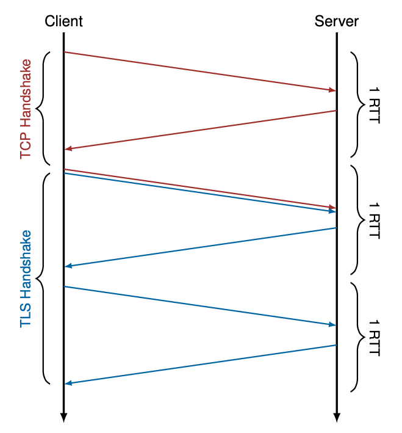
*   TLS does at least 3-way handshake (or more …)
*   Results in a lot of RTTs before data transmission
*   Can in part be decreased using TCP Fast Open (but not widely deployed)

→ Solution

*   Introduce a 0-RTT and a 1-RTT handshake
*   Merge the TCP and TLS component into one protocol
*   Reuse old connections
*   Client saves information about the server

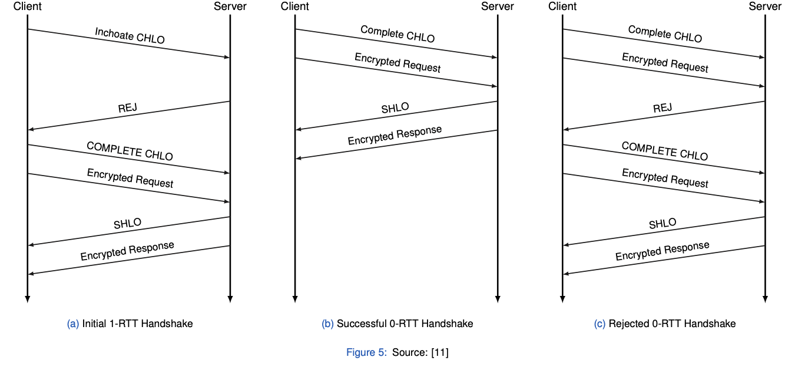

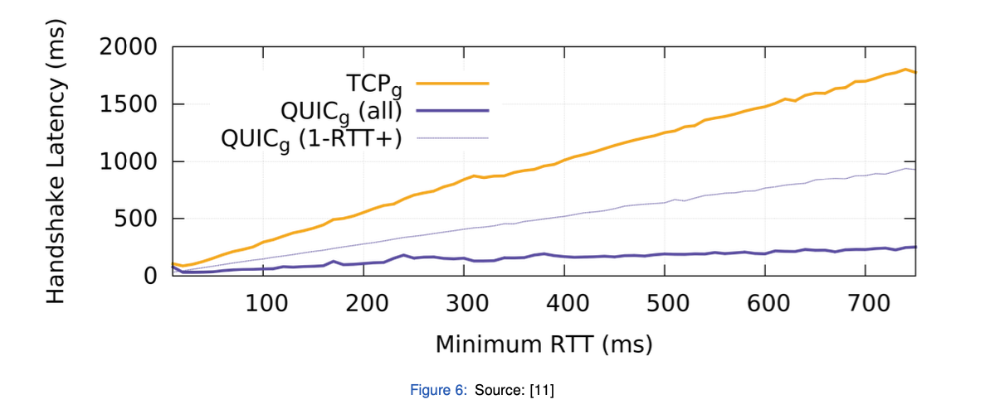

→ GET RID OF HEAD-OF-LINE BLOCKING 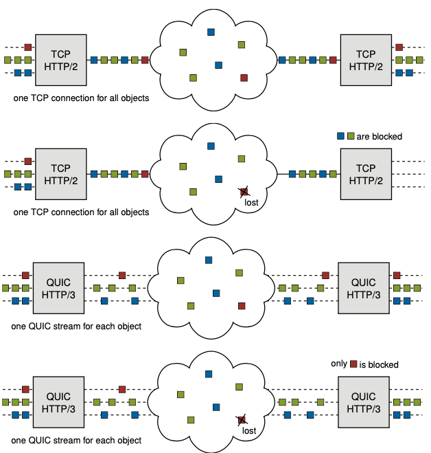

*   If one TCP segment is lost in transit, everything after that has to wait for delivery until successful retransmission (in-order property)
*   Frequent goal: multiplexing multiple data streams over one TCP connection
*   Example: Two videos get transmitted over one TCP connection

*   Server sends videos interleaved
*   One packet containing a part of video #1 gets lost
*   Following parts of video #2 cannot be processed, although they may already be present
*   Result: Video #2 has unnecessary quality impairments

→ Solution

*   Protocol is aware of multiple streams
*   Retransmission is done at stream-level, not connection level

→ FASTER DEVELOPMENT CYCLES

*   TCP is implemented in the kernel
*   Slow deployment of new mechanisms

*   Devices often don't get updated to newer kernel
*   Getting modifications of kernel protocol mechanisms is a slow process
*   Involves a lot of testing with a lot of different applications
*   Running big-scale experiments with TCP is very difficult

→ Solution:

*   QUIC is based on UDP, and implemented in user space
*   The kernel is not involved in the protocol  itself
*   Experiments with new protocol mechanisms are straightforward , as long as user-space is controlled by the application vendor

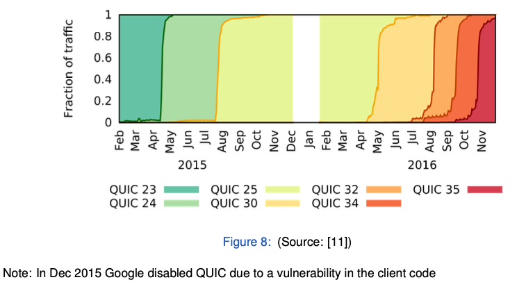

→ MIDDLEBOX RESISTANCE

Why use UDP ? Why not implement a new layer 4 protocol ?

Problem:

*   Middleboxes such as firewalls, "optimizers", etc exist
*   In many cases, they make things worse
*   May lead to obscure behavior
*   Get produced by a variety of different vendors/manufacturers
*   Getting along with middleboxes is like herding cats

→ Solution by QUIC:

*   Encrypt data stream transported by UDP
*    => Protocol headers above are not accessible to middleboxes
*   TCP-like "optimizers" are not possible due to encryption

→  IP Mobility

   Problem:

*   TCP connections are identified by 5 tuple
*   Client IP address may change during the connection
*   DSL connection gets re-established after 24h
*   Mobile clients move from one network to another
*   NAT entry might expire → port changes

Solution:

*   Do not use the 5-tuple as connection identifier
*   QUIC identifies connections by Connection ID
*   Last client IP address to send a valid packet for a given Connection ID is the current IP address of the client

→ IETF QUIC Standardization

*   5 Key Goals:

*   Minimizing connection establishment and overall transport latency for applications, starting with HTTP/2
*   Providing multiplexing without head-of-line blocking
*   Requiring only changes to path endpoints to enable deployment
*   Enabling multipath and forward error correction extensions
*   Providing always secure transport, using TLS 1.3 by default

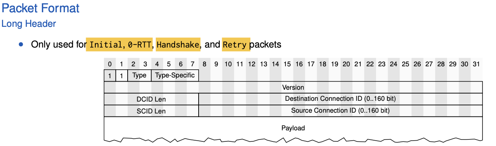

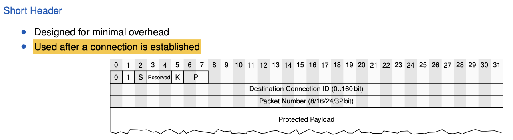

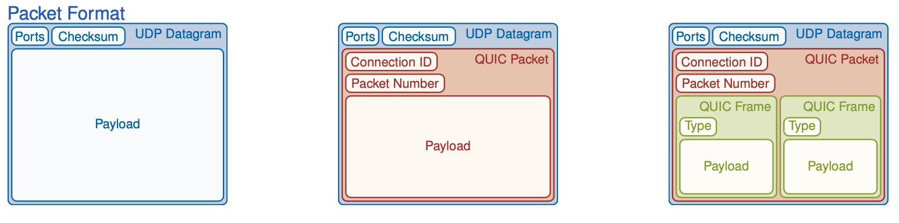

→ QUIC Packet:

*   A complete processable unit of QUIC that can be encapsulated in a UDP datagram
*   Multiple QUIC packets can be encapsulated in a single UDP datagram
*   Connection ID used to get connection, packet number to decrypt payload

→ QUIC Frame

*   Types: PADDING, PING, ACK, STREAM …
*   Some frame types are only allowed in certain packet types, e.g at connection start/end

→ Packet number:

*   Integer in the range 0 to 
*   Used in determining the cryptographic nonce for packet protection
*   Different packet number spaces for initial packets, handshake packets, and application packets
*   Start at packet number 0 and must be increased by at least 1 for subsequent packets

→ Different QUIC packet types:

*   Initial  and Handshake : carries the first CRYPTO frames and ACKs sent by the client and server to perform key exchange
*   0-RTT: used to carry "early" data from the client to the server as part of the first flight, prior to handshake completion, e.g HTTP request
*   1-RTT : used with the short header once 1-RTT keys are available

→ Different QUIC frame types:

*   PADDING, PING, ACK, STREAM ..

→ Variable Length Integer Encoding

*   Ensures that smaller integer values need fewer bytes to encode
*   The two most significant bits of the first byte encode the log\_2 of the integer encoding length in bytes 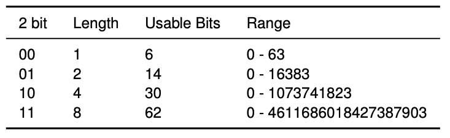

→ QUIC Security

*   Confidentiality (only encrypted data transfer)
*   Authentication (server is authenticated, client optionally)
*   Integrity (message authentication code)

     → TLS 1.3

*   TLS (Transport Layer Security) 1.3 specified in RFC 8446
*   Faster handshake than previous TLS versions, also 0-RTT
*   Removes several outdated/insecure cipher suites
*   Only supports AEAD algorithms

     → AEAD

*   Authenticated encryption with additional data
*   Encrypt and compute message authentication code (MAC) simultaneously
*   Plaintext P, ciphertext C, associated data A, nonce N, key k
*   Encrypt: C = f(k, N, A, P)
*   Decrypt: P = f(k, N, A, C) should return an error if integrity check fails

→ Packet Protection

*   Cryptography:

*   Shared secret S, plaintext P, ciphertext C
*   Derived keys from S using key derivation function

*   key
*   Iv (initialization vector)
*   hp (header protection)

*   Number used once (nonce) N to prevent replay attacks, derived from the packet number

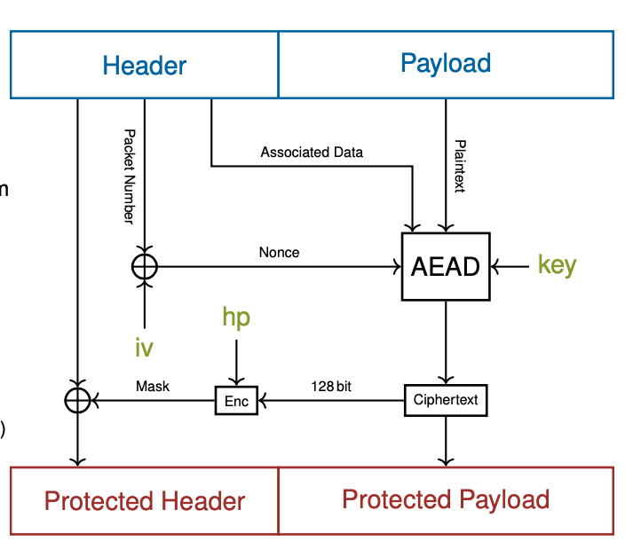

*   Encrypt:

1.  Compute packet nonce N
2.  Compute C = AEAD(key, N, associated data, P)
3.  Add header protection

*   Encrypt certain 128 bit of C with hp key
*   Mask so that only some header fields are protected (e.g. packet number)
*   XOR with original header

*   Decrypt:

1.  Remove header protection
2.  Compute packet nonce N
3.  Compute P = AEAD(key, N, associated data, C)

→   HANDSHAKE

*   Combined Transport and cryptographic handshake (current version uses TLS 1.3)
*   Authenticated key exchange

*   Server is always authenticated (e.g. certificate )
*   Client is optionally authenticated

*   Authenticated exchange of values for transport parameters

*   E.g. max\_idle\_timeout, max\_udp\_payload\_size, initial\_max\_data, . . .
*    Negotiating Connection IDs

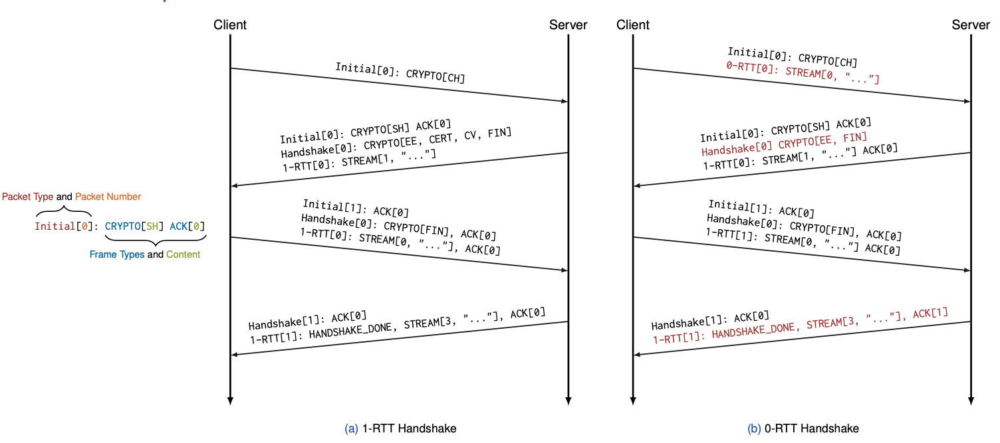

→ Version Negotiation

*   QUIC versions are identified using a 32-bit unsigned number
*   Version 0x0000 0000 is reserved to represent version negotiation
*   The version of the current IETF specification is identified by the number 0x0000 0001
*   Public known versions of different vendors:

*   https://github.com/quicwg/base- drafts/wiki/QUIC- Versions

*   Procedure:

*   Client sends used version in the long header
*   If the version is not supported by the server it replies with a Version Negotiation packet listing all supported versions (its own version field is set to 0x0000 0000)
*   The client can pick a supported version.

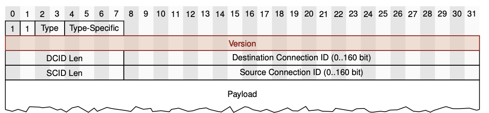

→ Streams and Acknowledgements

*   Streams

*   Lightweight, ordered byte-stream abstraction
*   Bidrectional or unidirectional
*   Stream frames can open, carry data for, or close a stream
*   Unique stream ID (62-bit integer) two bits used to identify initiator and if bi- or unidirectional
*   Multiple streams are sent interleaved, streams can be prioritized (avoidance of head-of-line blocking)

*   Acknowledgements

*   Packet numbers are acked, after all frames have been processed
*   Tries to send ACK frames as often as possible to improve loss and congestion response
*   Trade-off between load generation and short response times
*   ACK frame contains multiple ACK ranges

→ SPIN BIT

*   Most of the QUIC PDU is encrypted, which makes passive monitoring impossible

*   E.g TCP SEQ/ACK pairs and timestamp options are observable

*   Spin bit introduces the possibility to passively measure the connection's RTT

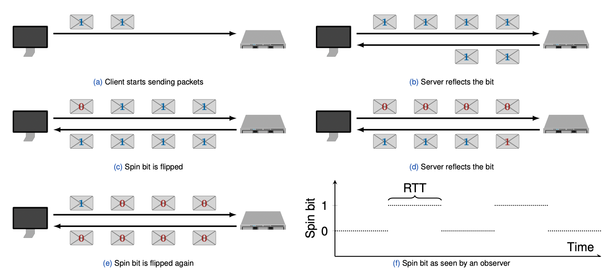

→ qlog and qvis

*   IEFT drafts gives guidelines for implementing the QUIC protocol
*   Implementations widely differ due to different developers/languages

*   Packets on the wire encrypted (requires session keys to analyze)
*   Internal QUIC state/events cannot be analyzed only with packet traces

*   Tool to analyze, compare and verify implementations is needed

→ qlog

*   Based on JSON
*   (timestamp, event type, event specific data)

→ qvis

*   Browser interface to visualize qlog files
*   Different diagram types: sequence diagram, congestion diagram

*   Sequence diagram
*   Congestion diagram
*   Multiplexing diagram
*   Packetization diagram

→ QUIC - Conclusion

*   Still finally standardized earlier this year
*   Higher CPU costs as TCP/TLS, but optimizations is ongoing

*   UDP interface is still far less optimized than TCP
*   QUIC encrypts packets twice (header and payload) each packet has to be encrypted individually

*   Deploying networking protocols in user space

*   Faster and easier development cycles
*   Bypass problems like head-of-line blocking

*   "Layering enables modularity but often at the cost of performance"

*   Achieve lower latency with 0-RTT handshake
*   HTTP/3 is standardized using QUIC instead of TCP

“In other words, QUIC is as simple as the modern internet demands, which is not very simple in absolute terms.” 2

https://www.fastly.com/blog/maturing-of-quic