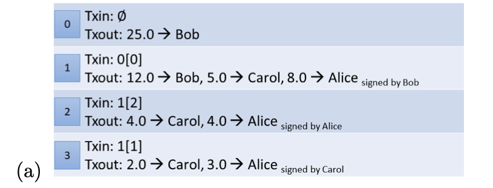
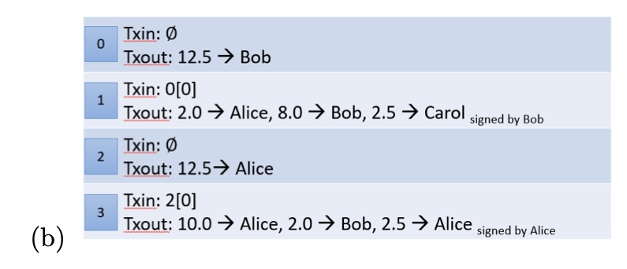
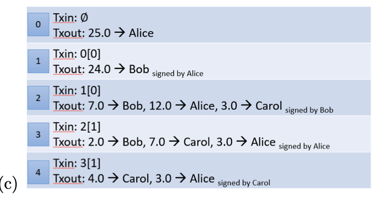
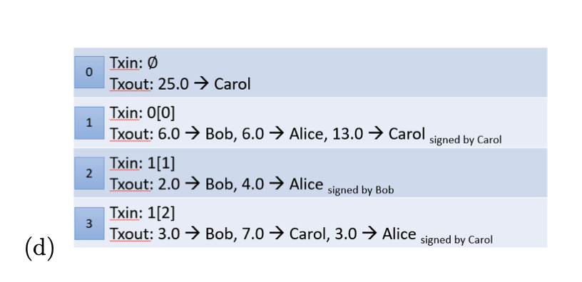
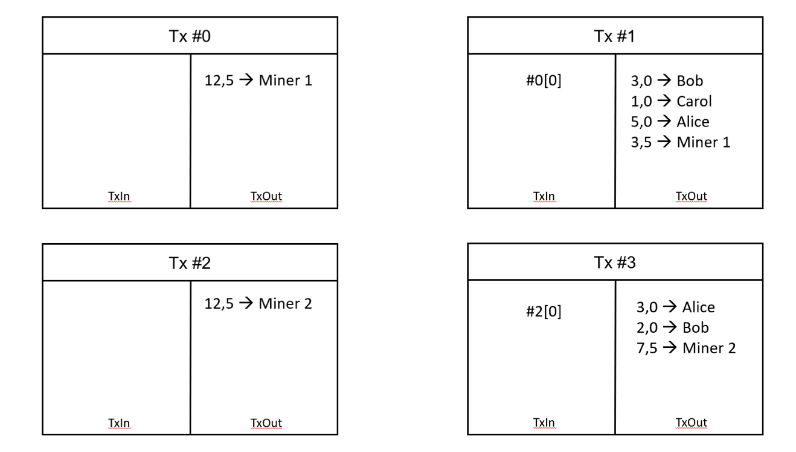
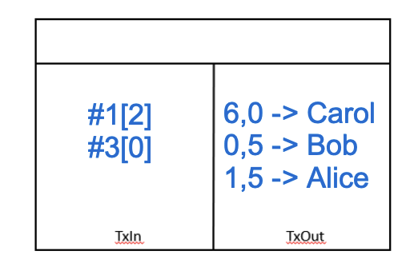

# L3- Bitcoin Basics 

## Bitcoin Network and Storage 

1. Explain the function of the memory pool in the Bitcoin network 

-  Memory pool contains unverified transactions waiting to be verified, part of a future block 

2. We have two investors Alice and Bob. Alice is day trading Bitcoin as a hobby and Bob has bought some Bitcoin as part of his children’s college funds. For each of them, argue whether they should use a hot or cold wallet and suggest a specific wallet as an example

- Since Alice is doing it as hobby, I would suggest her to use trustable, verified one of online wallets. (e.g binance)

- Bob is serious investor on Bitcoin, it would be better for him to go hardware wallet which is never used earlier. 
Since, online solutions had some indicents in past. 

## Transactions 

3. Consider the following transactions in a transaction based ledger. Check if the transactions are valid. If valid, calculate the balances of each person.

- Transactions are valid; end calculation is: Bob > 12, Carol > 6, Alice> 7 

- (b)> Transactions are not valid. Total amount should be equal or less than initial amount. 

- Transactions are valid; end calculation is:  Bob > 9, Alice > 6, Carol > 4 

- Transactions are not valid. Since in Tx2, Alice is signed by Bob, it should be signed by Alice. 

4. Below is the representation of four transactions in the Bitcoin network where Alice receives Bitcoins from two different miners. Transaction fees are ignored.

Alice now wants to make two payments. She wants to transfer Carol 6,0 BTC and Bob 0,5 BTC. Draw the necessary transactions for Alice using the notation of diagram above.

