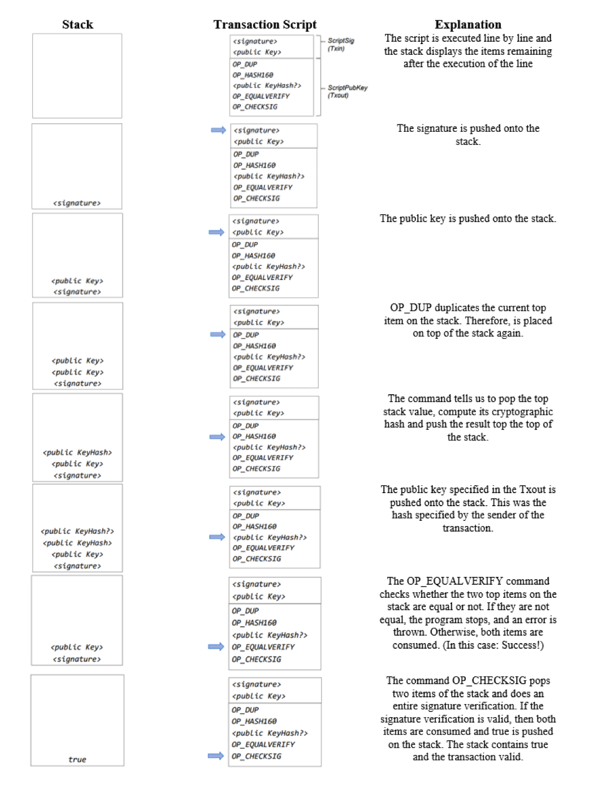

# L4- Consensus 

## Consensus in Bitcoin and Bitcoin Script 

1. The timestamp and difficulty fields are part of the header of a Bitcoin block. How are these values related?

- The timestamp is one of the values requried to govern Bitcoins mining difficulty. Timestamps allow the monitoring of block times, which indicate whether difficulty is currently too low or high. 

2. What does probabilistic consensus mean ? Can a transaction be reverted ?

-  A probabilistic consensus means that, if a network agrees on a certain set of transactions to be executed, it is no 100 % certain to be valid in the long term. Bitcoin and other blockchains which have a probabilistic consensus have no settlement finality directive. This means, it is possible that transactions can be reverted, however with a very low (and decreasing) probability. The reason for such reversal could be a 51%-attack. 

3. Name two functions that are fulfilled by the _coinbase transaction_, the first transaction in a Bitcoin block. 

- It mints new coins providing mining incentive 
- It can be used for data storage

## Introduction to Bitcoin Scripts 

UTXOs are locked using Bitcoin script, making sure only the intended recipient gets to spend them. The simplest type of script is pay-to-public-key.(P2PK) In this case, the receiver must provide the sender with his/her public key. The successor to P2PK is Pay-to-Public-Key-Hash (P2PKH) where the identity is not a public key, but a hash of a public key. A person to redeem the UTXO needs to provide a public key that hashes to the P2PKH and a signature which belongs to this public key. 

**How does the script work ?**

- The scriptSig is concatenated with the scriptPubKey and then executed. 
- The script runs sequentially on a stack machine. There are no registers and no external memory. 
- The script is executed and if the result is true, the UTXO can be spent, otherwise not. 

4. The following transaction output is provided:
  
  `OP_DUP OP_HASH160 8a014218a5a42e2c6fc5d573ab54a91ff555d1de OP_EQUALVERIFY OP_CHECKSIG`

- Can you tell which entity has created this transaction output ?
  - No. As the we only see the transaction output, we only know the receiver of the transaction.

- Can you tell if this transaction output is spent ?
    - No. We do not know if transactions exist which spend the output

- Can you tell which entity is allowed to spend this transction output ?

    - The owner of the private key which corresponds to the public key which corresponds to the hash 8a014...1de.

- What specific data is required to spend the transaction output ? 
    - The public key of the hash 8a014...1de and the corresponding signature. (therefore the private key)
