# Bitcoin Basics Recap 

Bitcoin has three key properties: 

- **Trust-Free:** The system does not require a third party which controls or maintains the system 

- **Tamper-Resistant:** The system is resistant to manipulation. The history of events cannot be changed. 

- **Transparent**: Every participant of the system can read and validate all information and the current state

## Block Details 

- The hash  of the previous block creates the chaining 

- The hash of the Merkle root node of a Merkle tree structure with all transactions 

- The nonce is requered for the consensus mechanism in the network 

- The block's hash used for chaining is calculated from the version until the nonce field

- The height of the block is stored in the coinbase transaction(TX_0)

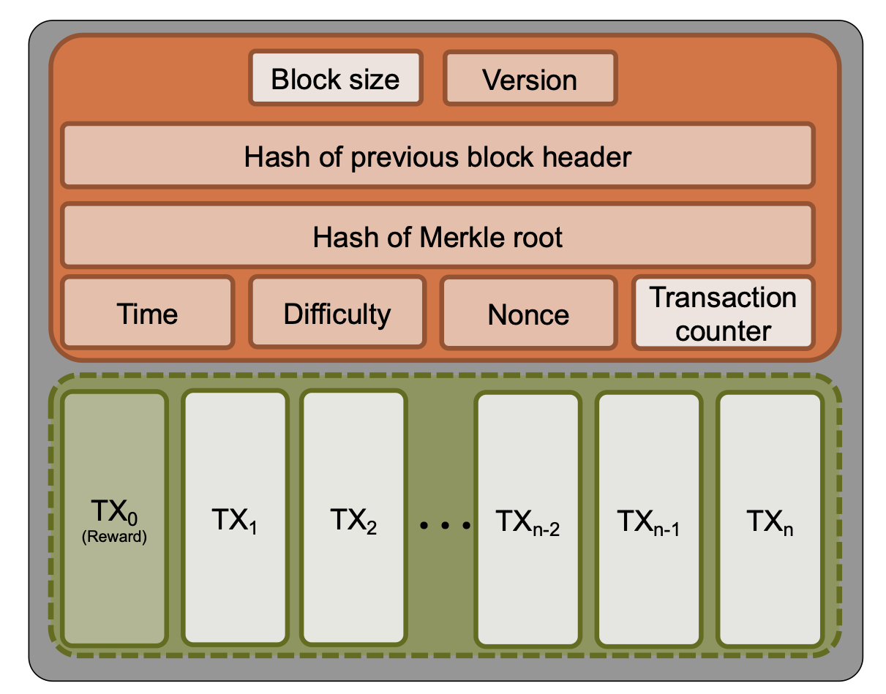

## Genesis Block 

Bitcoin's genesis block:
    - mined at 2009-01-03 18:15:05
    - references as previous block with hash 0 
    - contains only the mining reward transaction --> first 50 BTC which can never be spent 

The fact that it cannot be spent is based on the source code of the current bitcoin-core client. The client searches through all blocks in _ConnectBlock_ and processes all transactions but skips the genesis block. 

## Bitcoin Blockchain 

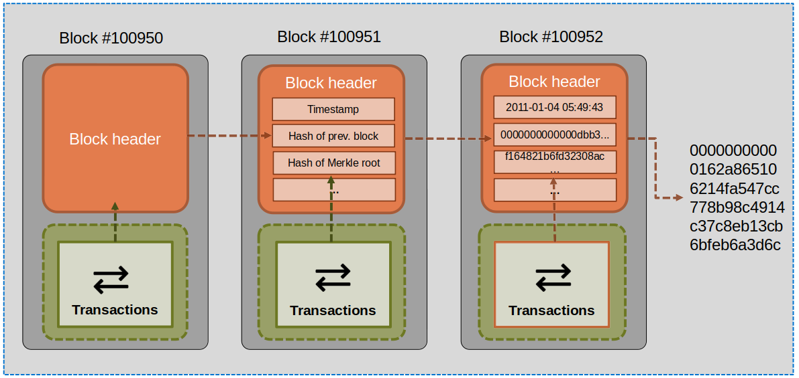

## Account-based Ledger

Transactions            |  World State
:-------------------------:|:-------------------------:
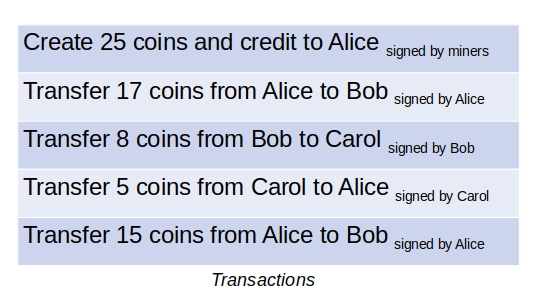   |  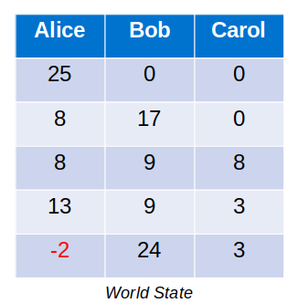

- Intuitively: We consider Bitcoin to use an account-based ledger. However, an account-based approach takes a lot of effort to track the balances of every account. 

- In reality, Bitcoin keeps track of the transactions an account has received and does not add up account balances( on the chain)

- By using a transaction-based ledger, Bitcoin enables wallet owners to define conditional transactions using Bitcoin script

* Bitcoin script is a stack-based scripting language used in Bitcoin transactions. 

## Transaction-based Ledger 

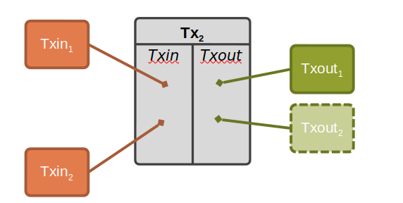

- Transactions (Tx) have a number of inputs and a number of outputs
    - Inputs (Txin): Former outputs, that are being consumed
    - Outputs (Txout): Creation of new coins and transfer of coin ownership

- **In transactions where new coins are created, no Txin used (no coins are consumed)**

- Each transaction has a unique identifier(TxID). Each output has a unique identifier within a transaction. We refer to them (in this example) as #TX[#txout] . e.g 1[1] which is second Txout of the second transaction

### Transactions Connected by Inputs and Outputs 

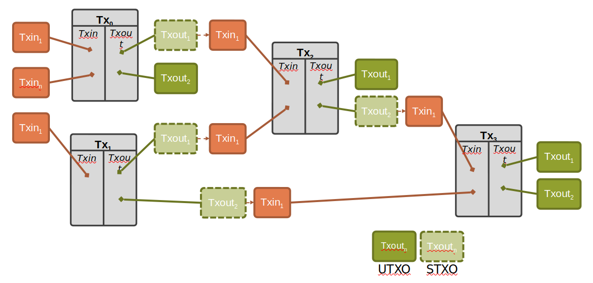

## Transaction-based ledger 

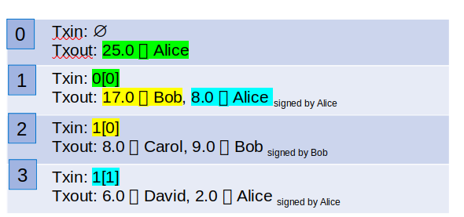

Example: 

0. No input required as coins are created
1. The Tx is used as an Txin. Two Txout are created, one to Bob and one to Alice. (1[0] and 1[1]) The Tx is signed by Alice
2. Uses first Txout of Tx1. Creates two Txout to Carol and Bob, signed by Bob. 
3. Uses second Txout of Tx1. Creates two Txout to David and Alice, signed by Alice. 

### Change Address 

Why does Alice have to send money back to herself ? 

In Bitcoin, either all or none of the coins have to be consumed by another transaction. The address the money is sent back to is called a **change address**. This enables an efficient verification , as one only has to keep a list of **unspent transaction outputs(UTXO)**

### Consolidating funds: 

Instead of having many unspent transaction outputs, a user can create a transaction that uses all UTXO she has and creates a single UTXO with all the coins in it. 

### Joint payments:

Two or more parties can combine their inputs and create one output. Of course, it requires signatures from all involved parties. 

## An Advanced Look at Transactions

As previously stated, transactions consist of inputs and outputs following these principles:
- All inputs reference an existing unspent output or a coinbase transaction.
- Inputs and outputs contain scripts (scriptSig, scriptPubKey) for verification.
- Output scripts (scriptPubKey) specify the conditions to redeem their value.
- Input scripts (scriptSig) provide a signature to redeem the referenced output.
- Only outputs store the BTC value and the receiver‘s address.
- All coins have a history (inputs/outputs) up to the original coinbase transaction that created them

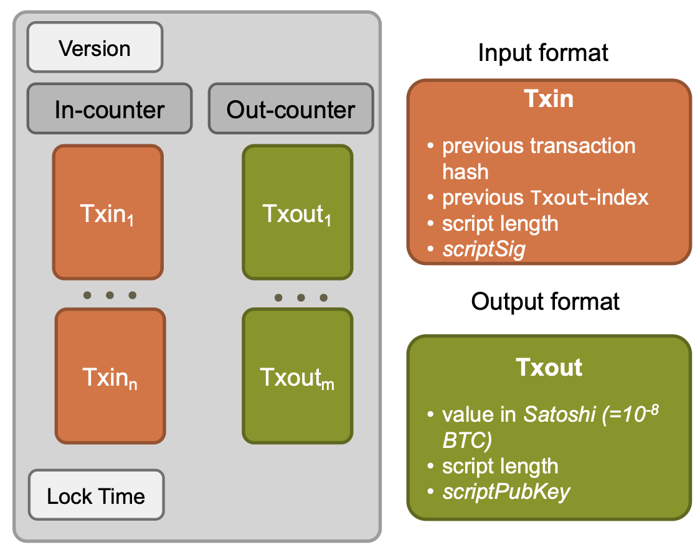

## Logical Data Structure of Transactions

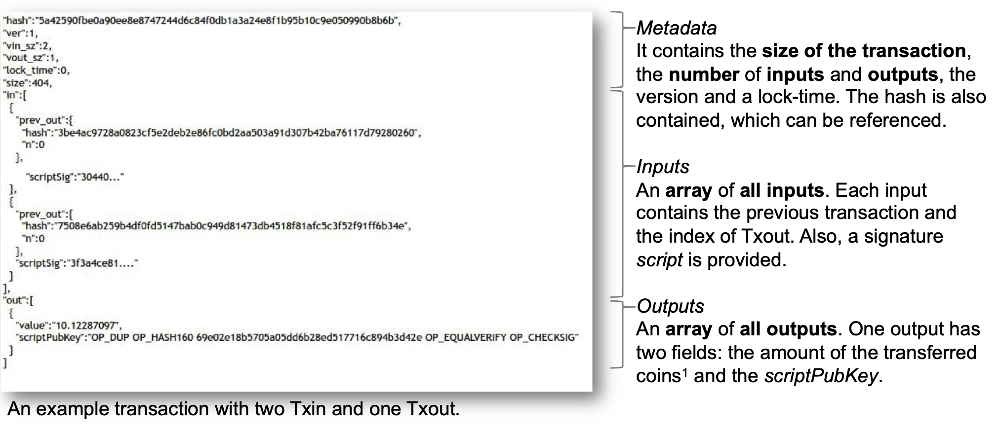

## Anotomy of the Bitcoin Blockchain

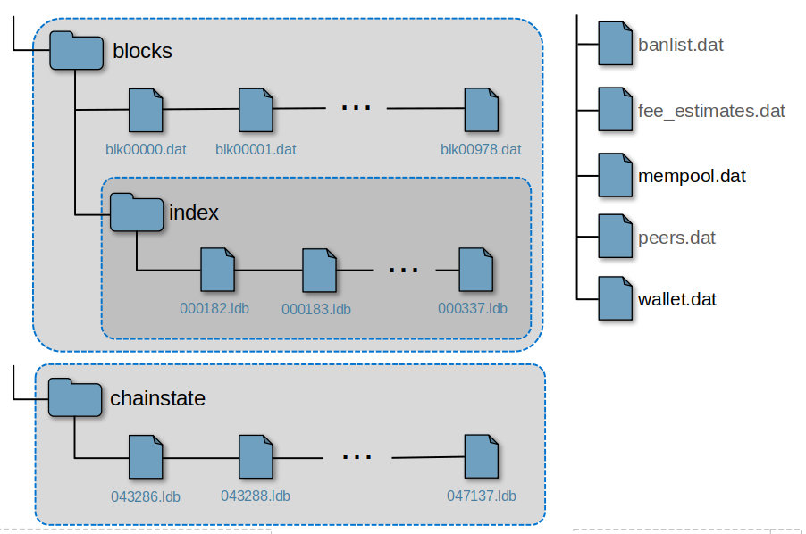

- Raw data is on disk 
- Miners and full nodes organize their data in a certain way. (Bitcoin core)
- As of February 2022, the total data size of the Bitcoin blockchain is 388 GB. 

- **blocks** and **blocks/index**
    - Contains .blk files that contain the actual blockchain in raw network format; index contains a database which stores the location of each block on the disk keyed with its hash. 

- **chainstate**
    - A LevelDB (leveldb.org) database with all currently unspent transaction outputs in the system (UTXO). This is used when operating a Bitcoin  node in favor of the raw blockchain data. 

- **mempool.dat** 
    - A list of unconfirmed transactions to be part of a future block 

- **wallet.dat**
    - Data regarding the user's (owner of the node) personal wallet. 

## Escrow

Escraw in the financial sense means an arrangement where a third party (not the buyer or the seller ) holds funds in safekeeping pending the completion of a promised obligation. 

Since bitcoin can be spent just like real money, you'll need bitcoin escrow to ensure that the bitcoins are only transferred after the promised obligation has been fulfilled. 

## A newly Created Transactions Way into a Block

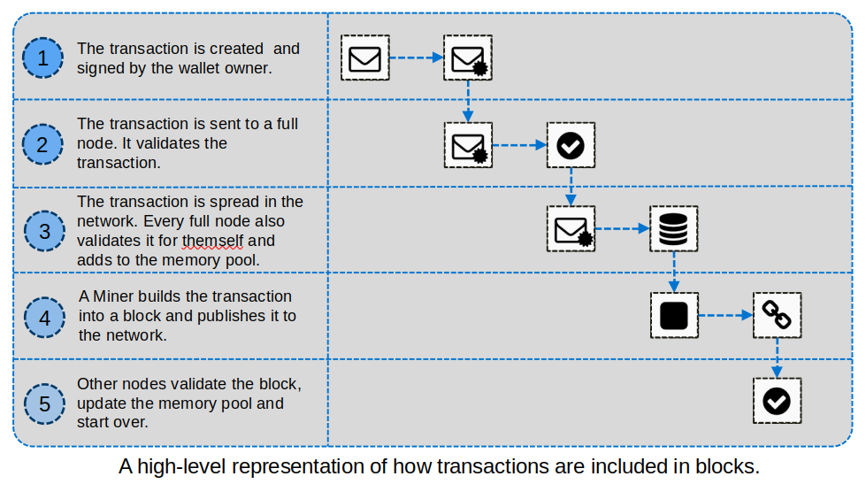

> Note: the sum of all output amounts has to be the same or smaller than the sum of all inputs.The difference is the transaction fee.

##  Roles in the Bitcoin Network 

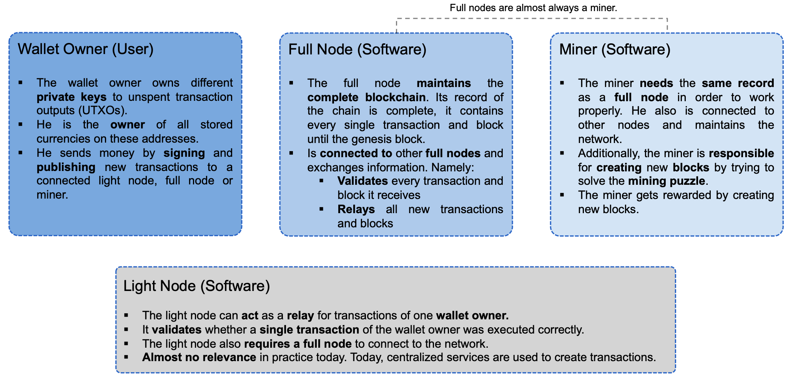

## Storing Bitcoins

- **Storing Bitcoins is all about storing and managing secret keys**

- Different approaches for storing and managing secret keys lead to different trade-offs between **availability**, **security**, **convenience**

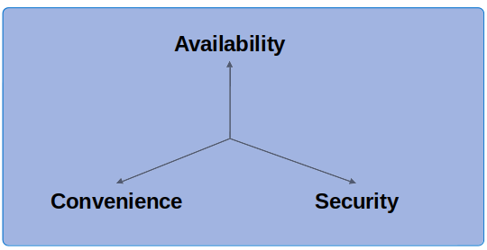

- Availability: being able to access the keys when one wants to 
- Security: restricting access to the keys
- Convenience: easy use 

## Cryptocurrency Wallets

Cold Storage            |  Hot Storage
:-------------------------:|:-------------------------:
Takes some time to "activate" | Is immediately available
Enhances security at the cost of convenience and availability | Enables convenience at the cost of availability and security
Advantage:  Cold storage does not have to be online to receive coins  | Example: Storage on your pc / mobile 

## Wallet Types 

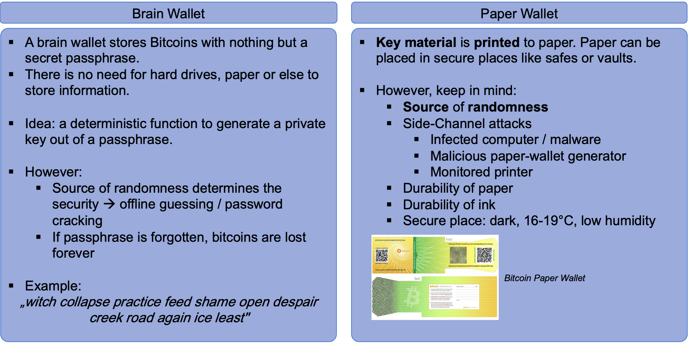

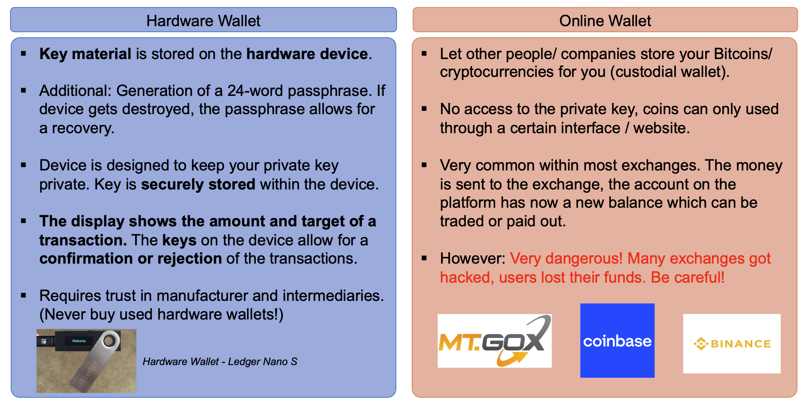

## Useful Resources

- [mempool.space](https://www.blockchain.com/explorer)
    - A block and mempool explorer for Bitcoin
    - Read [this article](https://bitcoinbriefly.com/how-to-use-mempool-space-block-explorer/) to better understand how to use the tool-
    
- [Jochoe’s Bitcoin mempool](https://jochen-hoenicke.de/queue/#BTC,24h,weight)
    - Another mempool explorer with useful insights

- [Blockchair](https://blockchair.com/bitcoin)
    - Some other blockchain explorer