# L5- Evolution of the Bitcoin Network 

As any other software, blockchains also require updates. 

These updates affect two parts of the network: 

- The **software relying on full nodes** (wallets, etc)
- The **blockchain network** (the full node implementations)

Considering wallets and other software, updates have well-known issues. 

1. Incompatibility between old and new software components 
    -> Old and new software components have to check the version available at runtime

2. Incompatibility between historic data and current data schema expected by the software components
    -> Database schema changes and data migration

> Therefore, the Bitcoin network inherits these standard problems. 

Additionally, the immutable blockchain data structure and the decentralized P2P-network lead to evolutionary issues. > Process for protocol update. 

## Process of Bitcoin Protocol Update 

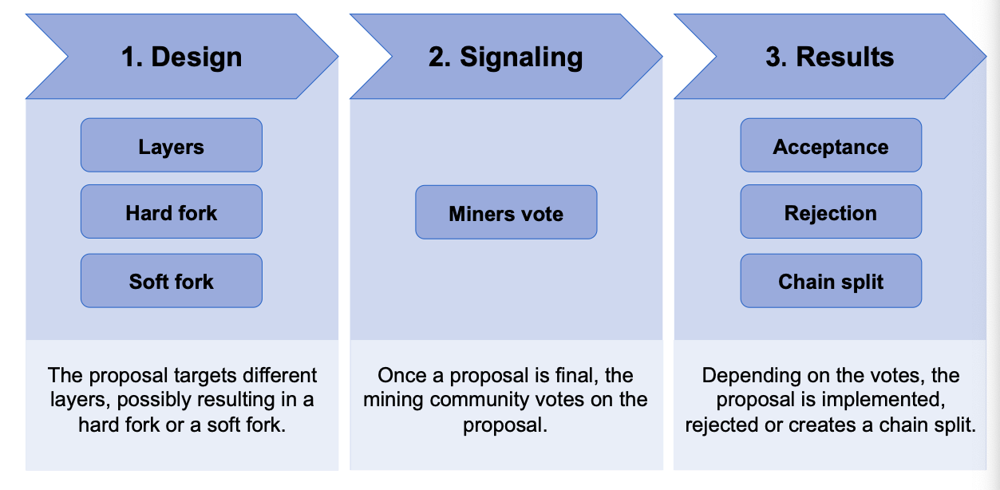

## Design 

- Proposals can target different layer: 
    - Consensus Layer (how to validate states and history)
    - Peer Services Layer (propagation of messages)
    - API/RPC Layer (high-level calls accesible by apps)
    - Applications Layer (high-level structures)

- All proposals in Bitcoin are referred to as **Bitcoin improvement proposals (BIP)**

- A Github-repository maintained by the core-developers contains all BIPs.

- A BIP contained in the repository is not automatically accepted. Furthermore, the miner community decides whether an BIP is implemented. (See signaling)

- A final BIP contains a detailed description as well as **a reference implementation** Developers of other clients should be able to also adopt the BIP. 

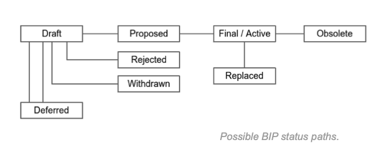

The terms hard fork and soft fork describe changes within the **consensus layer**

- **Hard fork:** Structures, that are invalid under old rules become valid under new rules. 

- **Soft fork:** Some structures, that were valid under the old rules aare no longer valid under the new rules. 

- Other changes applying to other layers are not classified as a hard fork or a soft fork. E.g if a new RPC/API call is introduced, the consensus layer is not affected. 

**Examples**

The Bitcoin core client specifies a maximum block size of 1 MB. 

- An update enabling block size up to 8 MB is considered a **hard fork** 

- An update restricting block sizes up to 0.5MB is considered as **soft fork**

## Signaling 

- The following diagram shows that a soft fork that is not accepted by the majority of miners leads to two chains.

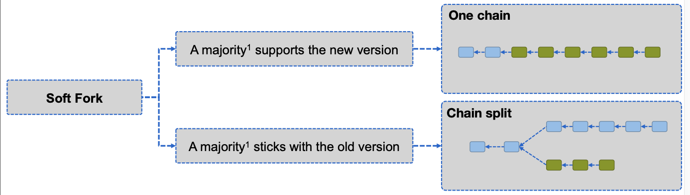

- The disadvantage of a chain split is that both chains compete for users. 
    - A split could be the goal of the designer or not 
- To find out whether a chain split would occur, a signaling phase is used. 

Signaling is the process that is used for voting on proposals. 
Miners are the only network participants who can cast their votes. They gain the right to vote only when they mine a new block. To signal their vote, they include special values in the header of the blocks they mine. 

**How does it work ? **

- The version-field in the block header contains 32 bit. 
- Each author of proposal (reference implementation) selects a bit in this version-field, a start time and an end time. 
- If miners update, their node software uses the bit to signal the support of this miner for this proposal between start time and end time. 

- **Option A** : The overall support for this proposal is higher than a certain threshold (usually 1916 out of 2016 blocks -> 95 % ) in one difficulty period. The proposal is **accepted (locked in)** and the rules apply after further 2016 blocks to allow the remaining miners to update as well. 

- **Option B:** The overall support for this proposal is lower than the threshold until the end time. The proposal is **rejected**

- As of the signaling, miners can vote up to 29 different proposals at the same time. Bits are reused after the end time. 

## Results 

- If the signaling lead to acceptance, the proposal is automatically implemented. 
- Upon a rejection, the community can split (seperate the development and go into different directions) 

> This is called "Chain Split"

Obviously, both communities want to keep the history.

Two main problems arise with the creation of a second chain: 

1. If the community behind the hard fork has less than 50% of the computational power, the new chain will not work as the new software will switch back to old chain, as the old chain will probably have the higher weight. 
2. One transaction can be executed on both chains > Replay attacks. 

To prevent both problems, the new community has to make the new chain/software incompatible with the old chain. This is done via the creation and adaption of new parameters, such that the old chain is not accepted by the new software and the other way around. Another possibility is to define a second "genesis" block which has to be contained in the longest chain. If the second block contains new rules (rejected by the old software) the chains are split indefinitely and can not merge together. 

- There have been numerous successful Bitcoin soft forks like Pay to Script Hash (P2SH)

- We are not aware of a successful Bitcoin hard fork. 

- Some chain splits were executed with varying success, e.g 
    - Bitcoin Cash (8MB blocks instead of 1MB blocks)
    - Bitcoin Gold (changes in the PoW-algorithm for ASIC resistance)

## SegWit and Taproot 

- **Segregated Witness**(SegWit) and **Taproot** are two major upgrades that occurred on the Bitcoin network. 

- Both are **soft forks**

**SegWit**

- Aimed to increase the transaction throughput by reducing the weight of transactions in a block 
- Removed the signature data from the transaction and appended it to the end of the block. 
- Increased the number of transactions that can fit into a block 

**Taproot**

- Introduced a new signature scheme, the Schnorr signature. 
- Schnorr signatures provide a more efficient and secure way to authorize transactions. 
- Improved privacy and efficiency of the network. 

## Attacking the Consensus Mechanism 

Is it possible to steal bitcoins ?  

No: Since UTXOs are secured with the hash of the public key of a user, the attacker cannot generate a valid transaction spending these UTXOs 

Is it possible to block a participant (Wallet Owner) in the blockchain network ?

Assume that a malicious node wants to block all transactions by Bob. This malicious node was selected randomly by the network to propose the new block. It does not include the transaction from Bob, blocking this transaction from getting into its block. However, the next random node (if it is honest) will include Bobs transaction. 

## Double Spending 

The idea of digital cash did evolve around the idea that we need to prevent a double spend. Two transactions spending the same Txout is somehow hard, but not impossible. We will go into the details of this attack. 

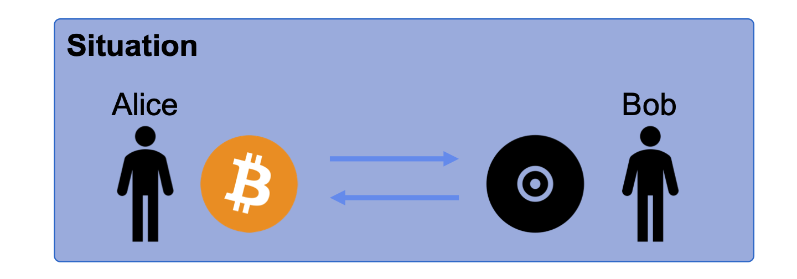

Alice wants to buy a music file from Bob's online shop with Bitcoin. She creates a transaction which sends the Bitcoins to Bob. An honest node sees Alice's transaction and includes it in its block. Bob sees the new block and sees his transaction included in it. He sends the file to Alice, in good faith to have his money. 

So far so good: What are the options for Alice to "double spend" the Bitcoins she sent to Bob ? 

Take a look at the underlying blockchain:

- The blue block (block 3a) contains Alice valid transaction to Bob
- After an honest node proposed this block, Alice was selected to propose the new block. 
- What can she do ? 
    - Option 1: Build on top of block 3a, she accepts the fact that the transaction has happened. 
    This is not what she wants, she wants to double spend !
    - Option 2: Build on top of block 2 a new block 3b (purple), not containing the transaction she sent to Bob, but a transaction spending the same coins (she would have sent to Bob) to herself. This is described as forking. 

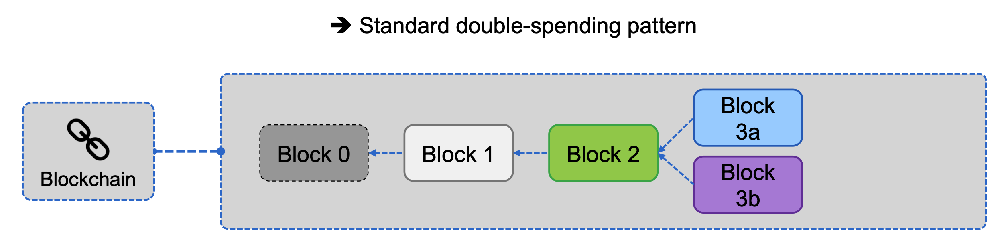

**Does this mean double spending is possible ?**

No. It is impossible to create a valid block or blockchain with two transactions consuming the same UTXO. What happens is that two "realities" are created. Block 3a(blue) declares a reality where Bob is paid and block 3b (purple) declares a reality in which Alice sends the money to herself. 

**How is this conflict resolved?**
The next node that get selected proposing a new block resolves the issue. It has to select the block on which it wants to create its new block. As all nodes adopt the longest chain, one reality (one of the blocks 3) is "orphaned", meaning this block does not have any relevance to the network anymore. 

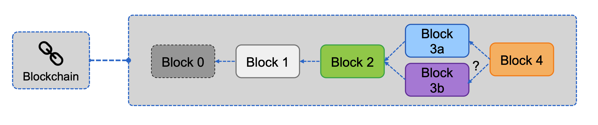

**When is the attack successful ?**

The attack is successful, if Alice convinces the network that her block (purple block) is the valid block that should be included in the longest blockchain. 

From our story, we know that the blue block is the "valid" block. From the perspective of an individual node, both blocks are equally valid. 

**What should Bob do to prevent such an attack?**

Bob should wait until it is clear that the payment to him is actually included in the longest blockchin, ideally with several confirmations (blocks on top of the block containing his transaction) before sending the file. 

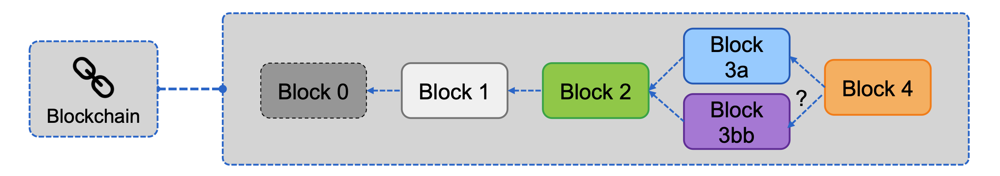

## Replay Attack 

A replay attack occurs when an attacker re-submits the same transaction to the network several times and gets it executed every time. 

- Let's say Alice has a number of Bitcoins. 
- However, the blockchain is about to undergo a **hard fork** that will divide the blockchain into two parts, legacy and the new blockchain. 
- After the split, Alice owns the same number of cryptocurrencies on both blockchains and she decides to send 5 Bitcoins to Bob on the legacy blockchain to pay her debt. 

- The transaction eventually gets included in a block on the legacy chain and Bob receives his coins. 

- Although he is paid, Bob realizes that he can receive even more coins just by replicating the same transaction of Alice on the new chain. 
- Since addresses stay the same, this "repetition" of the transaction is validated by the miners on the new blockchain. 
- With this, Bob has successfully performed a replay attack. 

> **Note: A person who joins the network after the hard fork is not vulnerable to the replay attack as their address has no transactoin history in either of the chains.**

## 51% Attack 

A 51% attack is the worst possible scenario in a blockchain (based on PoW as consensus mechanism) This means that more than 50 % of the hash power belongs to one entity and this entity uses this power maliciously. 
This attack enables: 
- History rewriting: The attacker can build a blockchain with the highest accumulated value, defining all contents: 
    - Blocking/ DoS-ing addresses/ users
    - Collecting all mining rewards
    - Creating successful double-spending patterns (orphaning many blocks)

However: 
- Cannot invent money, cannot propose invalid blocks or transactions, as they would simply be rejected. 
- As of the high hash power, the attacker is highly invested. 
- Entities highly invested have no interest in destroying the network, as they profit the most from it.

> A successful executed 51% attack would destroy the trust in the system and with that, the value of the currency in the system. 

## Selfish-mining Attack 

A selfish-mining attack exploits the probability to be able to propose two blocks one after another. 

It works as follows:

- The attacking node finds a new block 3A, but does not propose it to the network.
    - **Possibility A**: The node finds a second block 4A building on its block 3A. The network is still at block 2. When the network finds another block 3B, the attacker publishes both block 3A and 4A, making the new 3B an orphan block. The network has worked on an old chain, practically wasting its power. 

    - **Possibility B:** When the network proposes a block 3B before the attacker finds a block 4A, the attacker publishes 3A, hoping the network will select block 3A with probability alpha. 

> Attacker is possible for hashing power minimum of 25% with alpha = 50% and 33% with alpha = 0 %

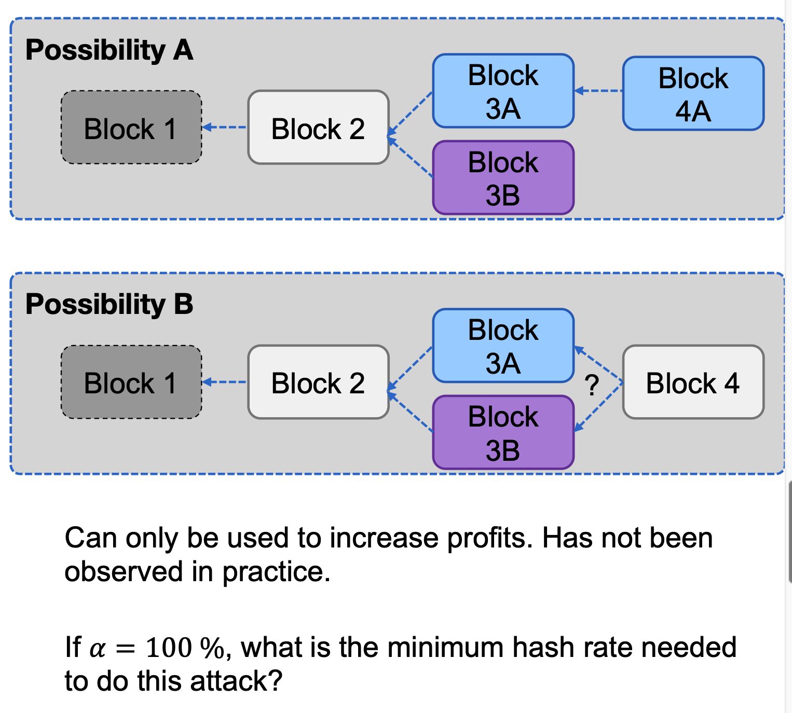

## Bitcoin Transaction Throughput 

In the case of Bitcoin, the current technology and protocol introduces a theoretical maximum transaction throughput, determined by three factors:

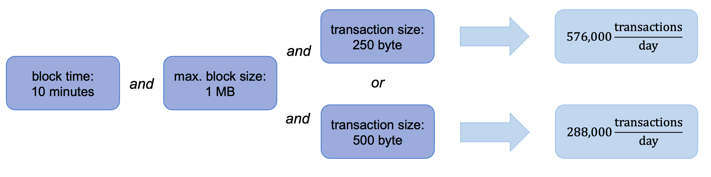

## Blockchain Size 

The blockchain size increases by at most 1 MB every 10 Minutes

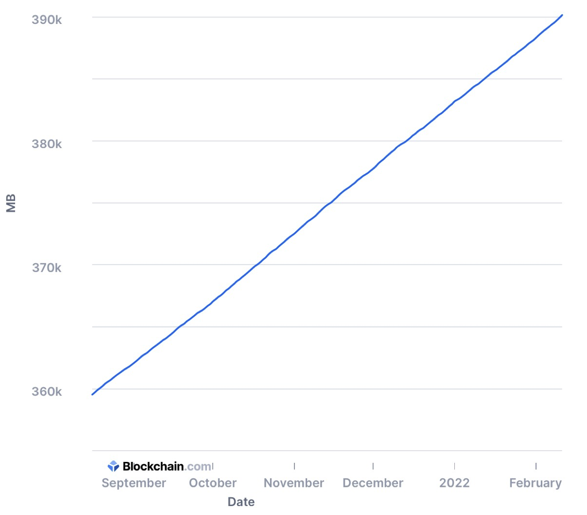

## Energy Consumption of Bitcoin's Proof-of-Work 

Difficulties:

- Miners do not disclose their energy consumption and the hardware used by them. 
- We calculate with the hash rate and the most efficient mining hardware. 

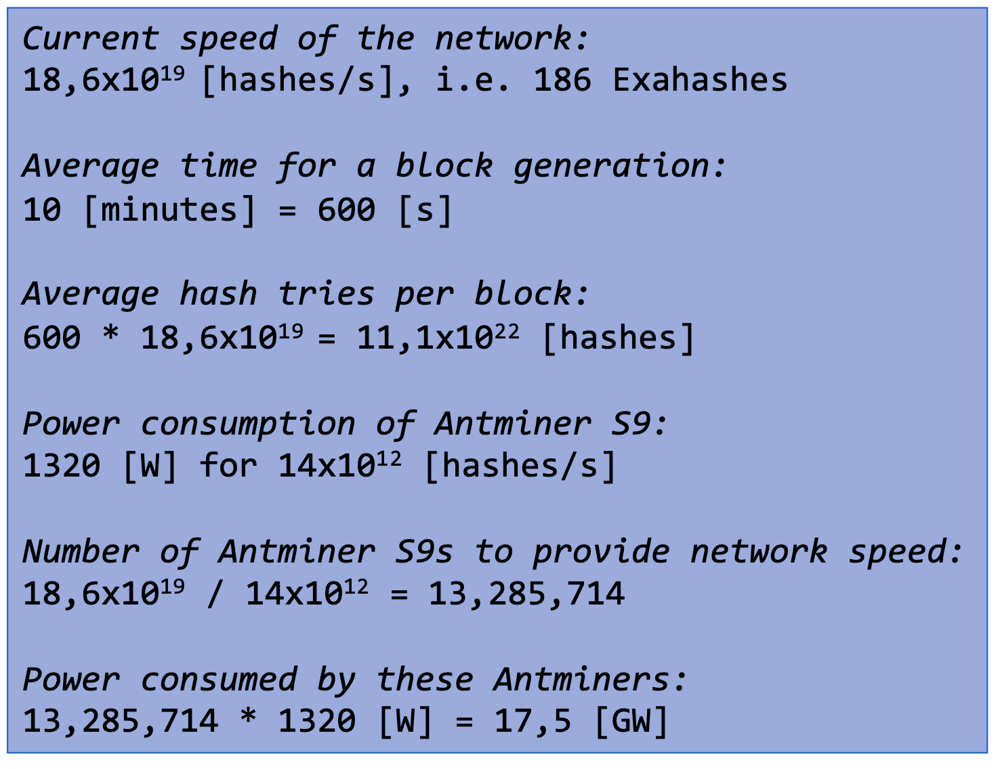

- Energy consumption is one of the main issues of Bitcoin. Critics call it an energy guzzler, while supporters praise it for being less energy-intesive than the present global economy. 

- The amount of energy that is consumed with Proof-of-Work cannot be underestimated, however, it is also not a reason to demonize the system when there is **no better solution** right now. 

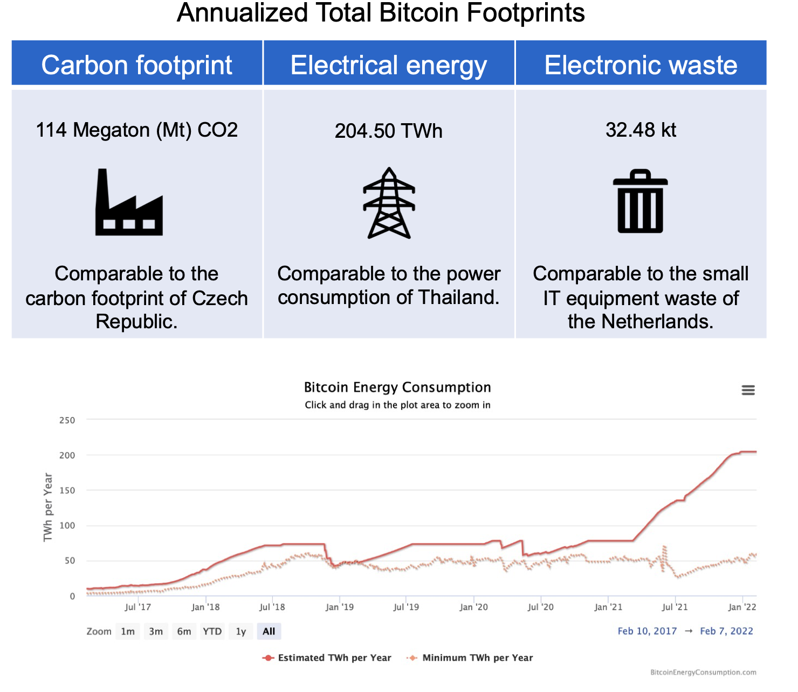

## Bitcoin's Challenges 

- Bitcoin script is **limited in its expressive power!**
    - **Ethereum** and other solutions provide a Turing complete Smart Contract language! 

- Bitcoin does **not scale**/ is too slow !
    - Second layer solutions like **Lightning Network** enable higher transaction throughput with lower fees. 

- Bitcoin is **too volatile!**
    - Stable coins either pegged by fiat currencies (Tether) or by collateral (Dai) provide more stable prices

- **Regulations**
    - On one hand: over-regulations of cryptocurrencies in United States 
    - On the other hand: little or no regulations in many other countries. 

