# L6 Summary - Ethereum Decentralized Applications

## Deploying a Smart Contract 

**Requirements**

- Bytecode of the smart contract (i.e output of the compiler)
- A script to handle deployment steps
- A wallet with sufficient funds 
- Access to an Ethereum node 
    - Run your own node
    - Use a node services like Infura or Alchemy that provides instant access over HTTPS and WebSockets to the Ethereum network. 

## How is a Smart Contract deployed on the Ethereum Blockchain ?

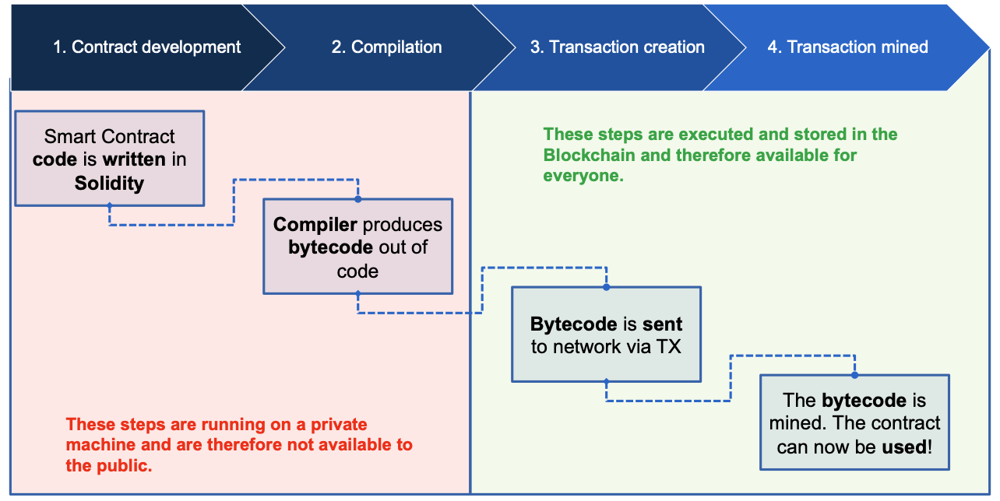

**Source code is typically not stored on the Blockchain, only byte code**

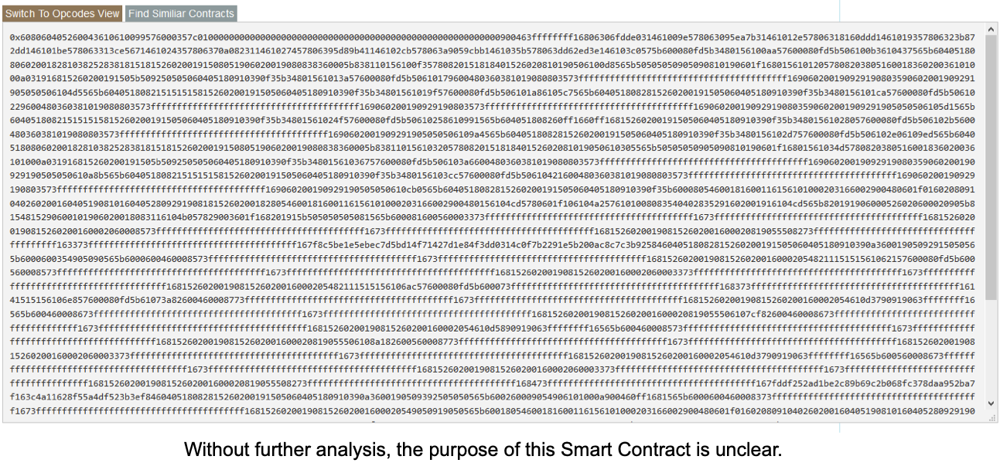

**Source code can be made publicly available**

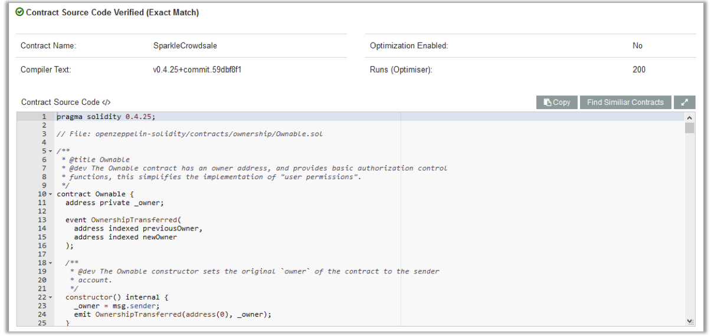

## Motivation 

- Building **UIs on top of smart contracts** to make them accessible to average users 
- The UI **abstracts the complicated function calls** and allows a user to interact with them just like with a regular (web) application. 

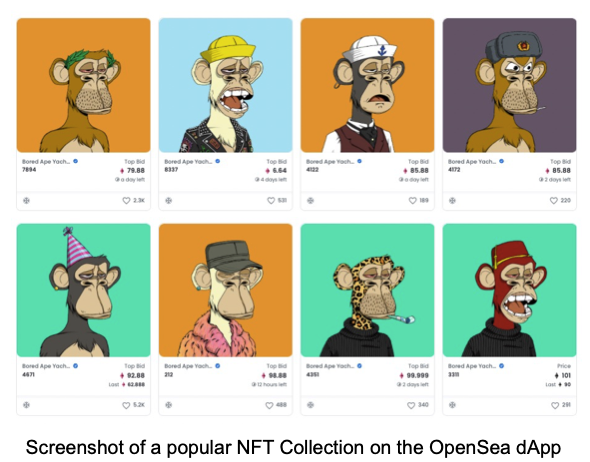

## Definition 

- In this lecture, we consider a dApp as a decentralized application (in terms of Blockchain) based on one or more smart contracts and accessible via a dedicated web-based user interface. 

- In particular, the following properties must hold: 
    - **The core data records of the application must be stored on the blockchain**
    - **The functions that change the core data records must be executed on the Blockchain, i.e : a smart contract**

## Benefits 

The meaninfulness of implmenting a distributed application is dependent on the concrete use case and/ or the problem that is being solved 
Some general properties of Ethereum-based dApps: 

- **Trust**
    - The source code of any verified smart contract can be checked by anyone

- **Payment**
    - Payment is implemented by default since anyone can send/receive Ether

- **Accounts**
    - dApps can be build on top of Ethereum's account system, so there is no need to implement an additional user account management system

- **Storage**
    - dApps can leverage the Blockchain as common (expensive) data storage

## Drawbacks 

Decentralized applications have also some intrinsic disadvantages: 

- **Costs**
    - Any state change and computation costs money. For that reason, only mission-critical data and functionality should leverage the Blockchain 

- **Time**

    - The currenct block time of Ethereum is around 14 seconds, i.e it takes at least 14 seconds from the function call to the definite result of it. 

- **Availability**
    
    - In theory, availability is one of the key advantages of dApps. However, in high transaction scenarios (e.g the release of crypto kitties) it is possible that the network throttles and is not able to process function call anymore

- **Transparency**

- Without third party services, it is impossible to access and verify a Smart Contract source code 

## Web-based dApps

Currently available decentralized applications are usually web-based and run in the browser. 

State of the DApps is a curated and community-driven directory of Ethereum-based decentralized applications. The directory is one of the largest and most relevant of its kind and in some talks referenced by Vitalik Buterin himself. 

As of April 2022, the directory contain 3974 dApps 

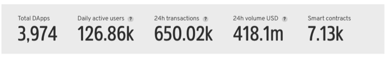

**Examples of current dApps**
- ICOs - Token system that can be used to sell securities for Ether
- Games- Usually collectibles are issued and exchanged for Ether 
- Gambling - Betting and lottery application 
- Exchanges - Decentralized token and ether exchanges

## Architecture of a web-based Ethereum dApp - Server-side blockchain interaction 

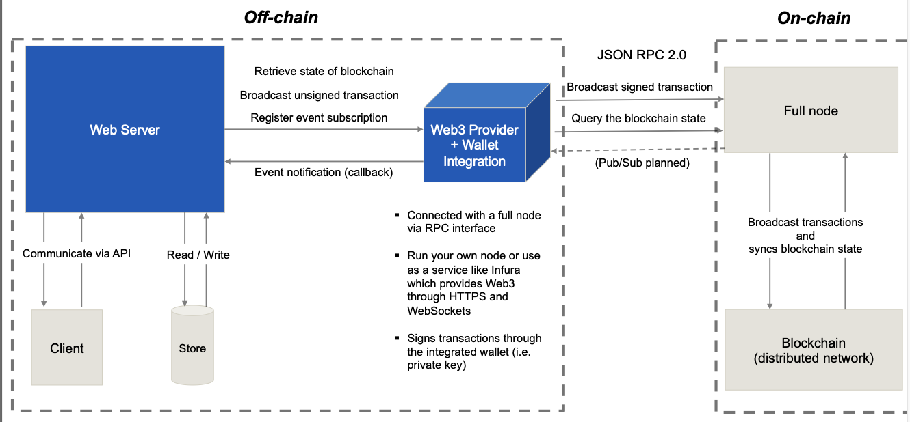

**Example Use case**

- A dashboard to display statistics about the state of the Ethereum blockchain. (e.g blockchain explorer)
    - Last block number
    - Miner of the last block 
    - Number of transactions waiting in the mempool 

- User doesn't directly interact with the blockchain (e.g doesn't sign a transaction) thus user wallet info is not needed 

- The website interacts with the blockchain on the server-side
    - Either runs own full node or uses a node service like infura. 

## Architecture of a web-based Ethereum dApp- Client-side blockchain interaction 

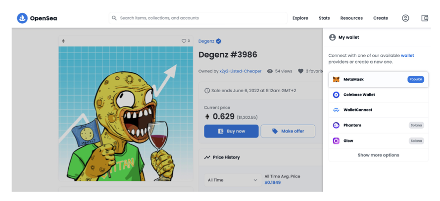

**Example Use Case**

- Imagine a website (dApp) where users can buy NFTs (e.g an NFT marketplace like Opensea)

- To complete a purchase of an NFT, the user has to first connect her/his wallet
    - A wallet connection is required to sign a transaction 

- The website interacts with the blockchain on the client-side 
(i.e through the browser)
    - Web3 must be injected into the client browser

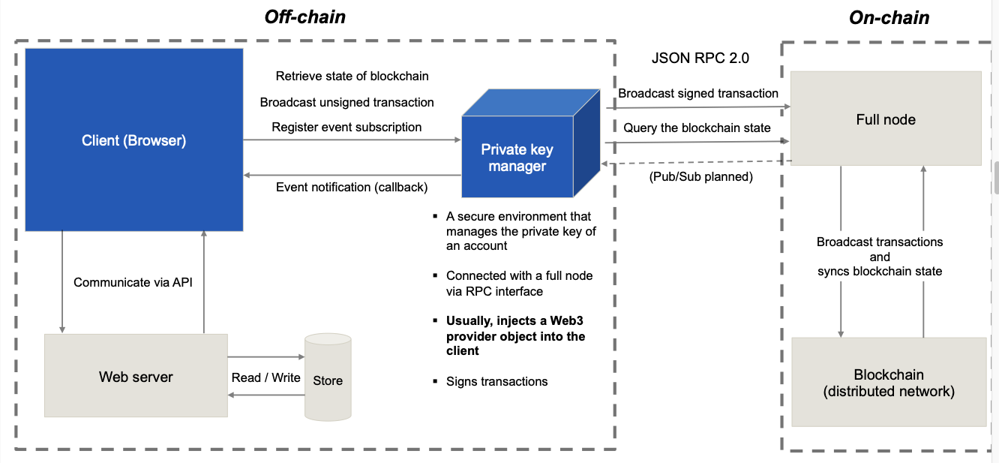

## MetaMask - A popular private key manager and even more (Browser Plugin)

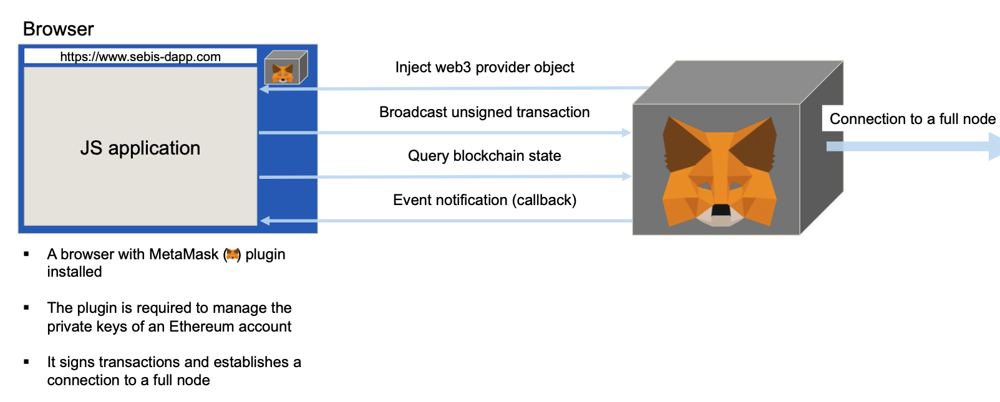

## web3.js 

web3.js is the **official Ethereum JavaScript API** that provides a **wrapper** for the **JSON RPC interface** to interact directly with the blockchain. 

- Can be used on **server-side** and **client-side**
    - On server-side, Web3 is injected by a full node or a node service like Infura 
    - On client-side, Web3 is injected by a private key manager like MetaMask 

- The Framework is available as a npm module (npm install web3)

- Provides **methods** to deploy and **interact** with **smart contracts**

- Provides methods to sign and send transactions 

- Uses callback functions and promises for asynchronous events 

- Widely used framework to interact with the Ethereum Blockchain

Web3 is available for other languages besides JavaScript, too. However, not all of those implementations are officially maintained by the Ethereum foundation.

- **Python (official)**
    - Web3.py - https://github.com/ethereum/web3.py 
- **Haskell**
    - Hs-web3 - https://github.com/airalab/hs-web3
- **Java**
    - Web3j - https://github.com/web3j/web3j 
- **Scala**
    - Web3-scala - https://github.com/mslinn/web3j-scala 
- **Purescript**
    - purescript-web3 - https://github.com/f-o-a-m/purescript-web3

## Example: Getting the balance of a specific account 

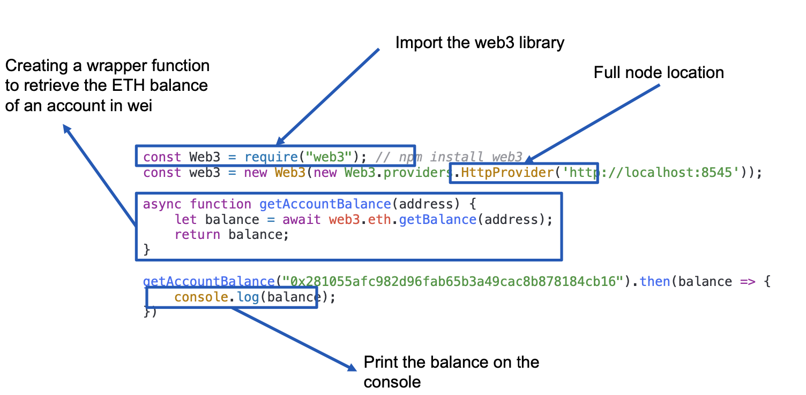

## Example: Sending Ether to another account 

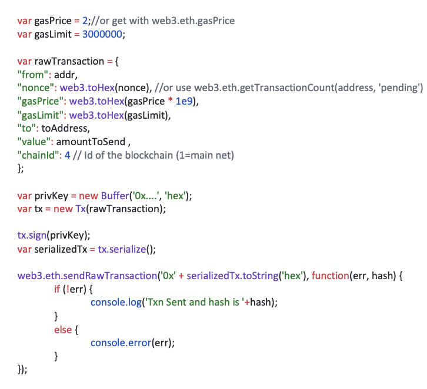

## Deployment lifecycle 

- Compilation of the Solidity source code 
- Generate **Application Binary Interface** (ABI) in JSON that can be used by other appications (e.g dAPPs) to interact with the contract.

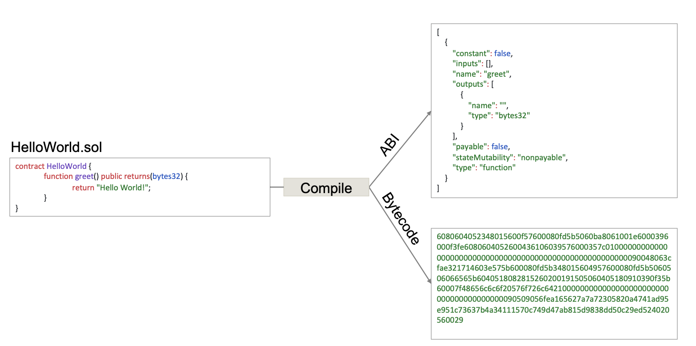

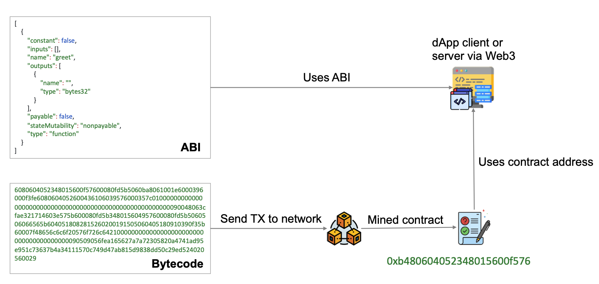

## Working with smart contracts in Javascript 

- Create contract object in Java script that references an existting contract on the blockchain. 
    - Pass ABI object as first contructor parameter 
    - Pass contract address as second parameter 

- Call contract method 
    - Methods defined in the ABI can be accessed via the global methods object 

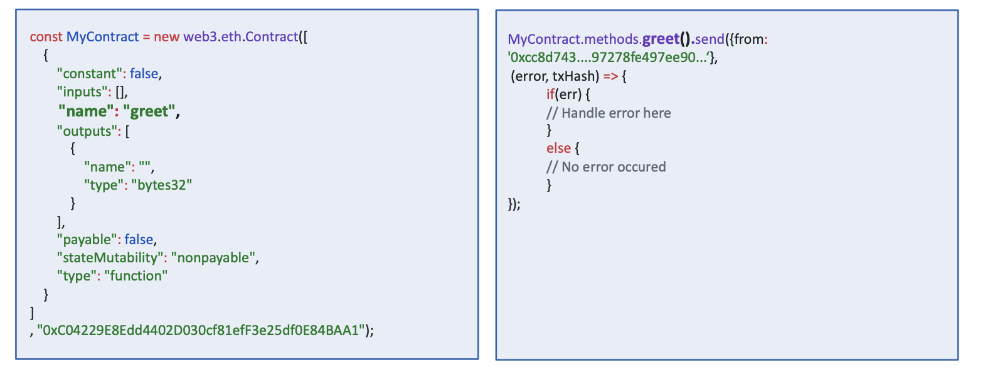

## Truffle - Development framework for smart contracts 

Truffle is a popular framework to facilitate the development of Ethereum smart contracts. The framework provides tools to compile, test  and deploy Solidity contracts. 

- Open source under MIT license and hosted at Github: https://github.com/trufflesuite/truffle

- Built-in network management that allows a developer to deploy a smart contract on various network e.g live and test 

- Web-pack like automated re-compilation on code changes 
- Testing based on Mocha and Chai 
- Provides project scaffolding 

## Ganache - Private Ethereum test network 

Ganache is a local blockchain for Ethereum smart contract development. It can be used to deploy, simulate, and test smart contracts. 

- Open source under the MIT licence and hosted at Github: https://github.com/trufflesuite/ganache

- Integrates a custom block explorer interface with additional debugging features 

- Uses workspaces to provide multiple Ethereum blockchains with different settings. 

- Can be linked to Truffle projects to automate tests for smart contracts

## Test networks 

Test networks provide a convenient way to publicly deploy and test smart contracts in a realistic environment. 

|                        **Ropsten**                        	|                                  **Rinkeby**                                  	|                                                      **Kovan**                                                      	|   	|   	|
|:---------------------------------------------------------:	|:-----------------------------------------------------------------------------:	|:-------------------------------------------------------------------------------------------------------------------:	|---	|---	|
| Free to use                                               	| Free to use                                                                   	| Free to use                                                                                                         	|   	|   	|
| Public                                                    	| Public                                                                        	| Public                                                                                                              	|   	|   	|
| Block time of ~30s                                        	| Block time of ~15s § Proof of authority                                       	| Block time of ~4s § Proof of authority consensus, i.e., one central instance decides what transaction will be mined 	|   	|   	|
| Proof of work consensus                                   	| consensus, i.e., one central instance decides what transaction will be mined. 	| Parity only                                                                                                         	|   	|   	|
| Geth and Parity compatibility                             	| Geth only                                                                     	| Ether distribution via faucet: https://github.com/kovan-testnet/faucet                                              	|   	|   	|
| Ether distribution via faucet: https://faucet.ropsten.be/ 	| Ether distribution via faucet: https://faucet.rinkeby.io/                     	| Github account required                                                                                             	|   	|   	|
| Anonymous                                                 	| Twitter or Facebook account required                                          	|                                                                                                                     	|   	|   	|

Nice resources to look at: 

- https://www.ibm.com/topics/smart-contracts

