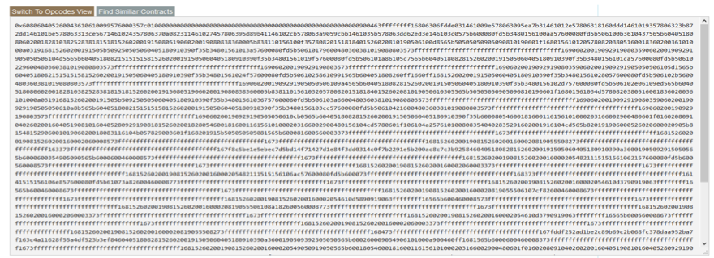
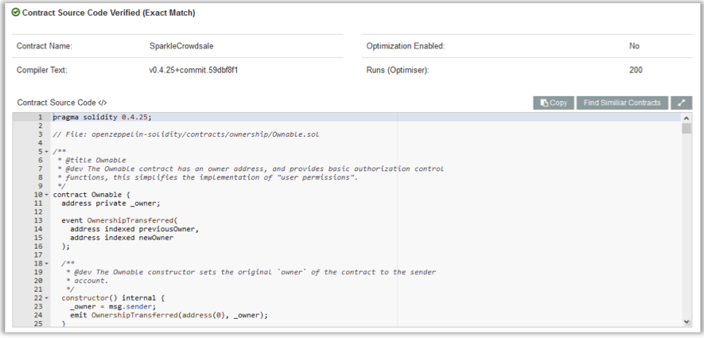
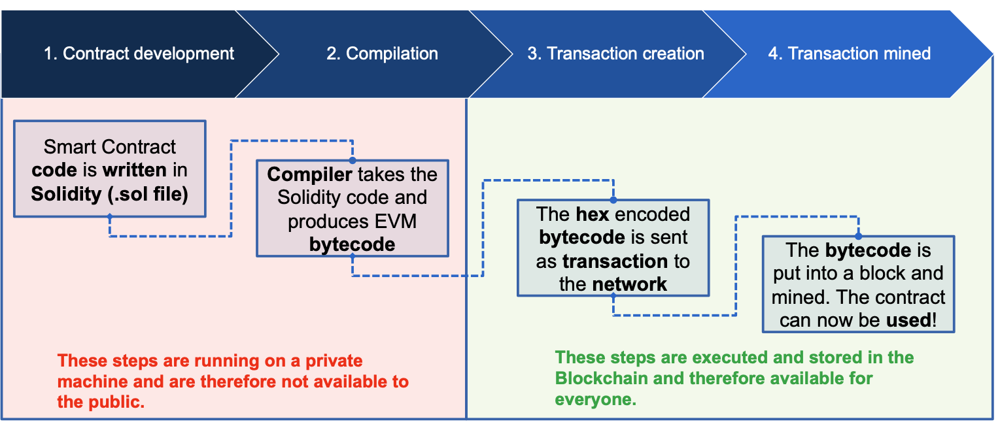
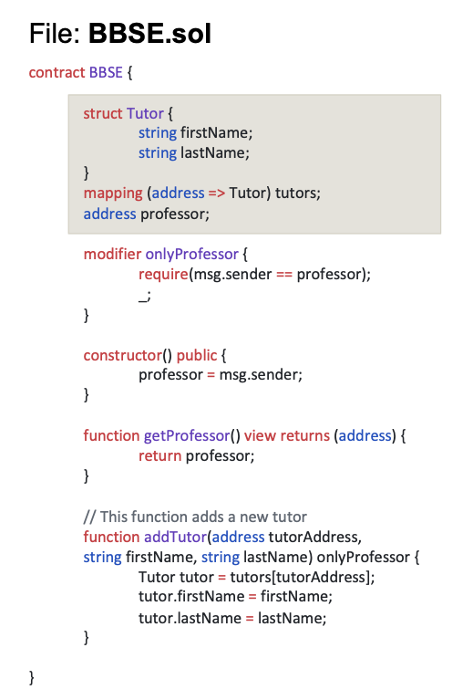
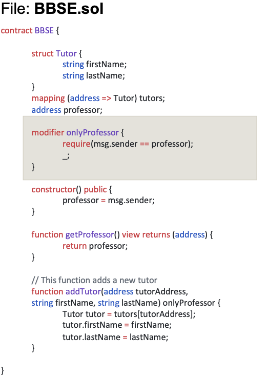
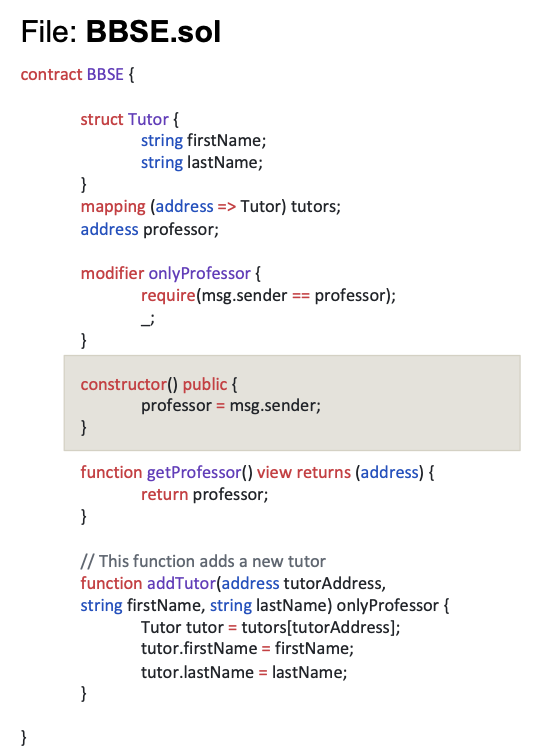
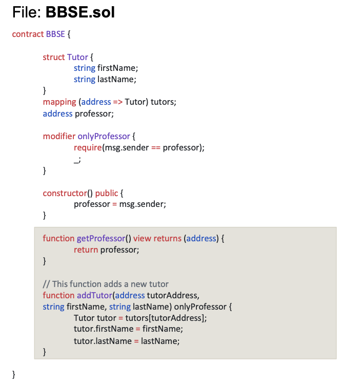
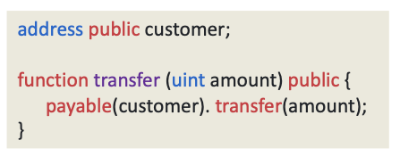

# Ethereum Smart Contract - Recap

- Solidity is a high level language to write smart contracts for Ethereum 
- Contracts can be defined as encapsulated units, similar to classes in traditional object-oriented programming languages like Java 
- A contract has its own, persistant state on the blockchain which is defined by state variabnles in the contract.
- Functions are used to change the state of the contract or to perform other computations. 
- Solidity is compiled to bytecode which is persistent and immutable once deployed to blockchain
    - **No patch deployment** possible 
    - **Smart contracts** must be **perfect before** using them in **production!**

## Source Code 



- Source code is typically not stored on the blockchain, only byte code 
- Without further analysis, the purpose of this smart contract is unclear



- Source code can be made publicly available. 
- Etherscan.io is the only service which verifies source codes and the respective byte code 

## From Solidity Source Code to a Deployed Smart Contract 




1. **Contract development** : Smart contract code is written in Solidity.
2. **Compilation**: Compiler takes the Solidity code and produces EVM bytecode 

> Steps above, running on a private machine and are therefore not available to public

3. **Transaction creation**: The hex encoded bytecode is sent as transaction to the network
4. **Transaction mined**: The bytecode is put into a block and mined. The contract can now be used !

> Last 3,4 steps are executed and stored in the Blockchain and therefore available for public 


## Anatomy of a Solidity Smart Contract File 



- **State Variables**
    
    - State variables are permanently stored in the contract's storage 
    - Changing the state requires a transactions and therefore costs ether 
    - Reading the state of a contract is free and does not require a transaction 




- **Function modifiers**

    - Function modifiers are a convenient way to reuse pieces of code. 
    - Changes the behavior of a function 
    - Can execute code either before and/or after the actual function execution 
    - The low  dash _ indicates where the actual function code is injected 
    - Often used for authentication. 




- **Constructor**

    - The constructor function is executed once when the contract is created through a transaction 
    - The function cannot be called after the creation of the contract 
    - Execution costs gas and more complex constructors lead to higher deployment costs. 




- **Functions** 
    - Functions are used to change the state of a contract 
    - Can also be used to read the state of the contract 
    - Consist of a name, a signature, a visibility, a type, a list of modifiers, and a return type

    Format definition; 

    ```
    function (<parameter types>)
    {internal|external|public|private}
    [pure|constant|view|payable]
    [(modifiers)]
    [returns(<return types>)]
    ```

## Language Features Overview 

Solidity is inspired by JavaScript and comes with a very similar syntax. Furthermore, it implements the standard set of features for high-level (object-oriented) programmming languages. Compared to the dynamically-typed Javascript, Solidity uses static types. 

- **Built-in data types**
    - int, uint, bool, array, struct, enum, mapping

- **Built-in first level objects**
    - block, msg, tx, address 

- **Built-in functions**
    - Error handling: assert(), require(), revert()
    - Math & Crypto: addmod(), mulmod(), sha3(), keccak256(), sha256(), ripemd160(), ecrecover()
    - Information: gasleft(), blockhash()
    - Contract related: selfdestruct()

- **A set of literals**
    - Solidity comes with some Ethereum specific literals (like eth for units, e.g, int a = 5 eth)

- **Flow Control**
    - if, else, do, while, break, continue, for, return , ? ... : ... (ternary operator)

## Function and Variable Visibility 

In solidity, functions can be declared with four different visibility types

- **External**
    - External methods can be called by other contracts and via transactions issueed by a certain wallet. 
    Methods declared as external **are always publicly visible** and **can't be called direclty by the contract itself**

- **Public**
    - Public **can be called internally** by the contract itself but also **externally** by other contracts and via transactions. 
    **State variable** which are defined as public will **by default have getter** method created automatically by the compiler.

- **Internal**
    - Internal methods can only be accessed by the contract itself or by any contract derived from it. They are not callable from other contracts nor via transactions. 

- **Private**
    - Private methods can **only** be called internally by the contract who owns the method. **Derived contracts cannot access** a private method of their parent contract. 


## Special Function Types

- **Payable function**
    - By default, it is not possible to send ether to a function because the function will by default revert the transaction. 
    The behavior is intentional, it should prevent Ether that is accidentally sent from being lost. However, sometimes it is necessary 
    to pay a contract, e.g in case of an ICO. Therefore, Solidity implements so-called payable functions 

- **Example**

```
function buyInICO() public payable {/* ... */}
```

- The keyword ```payable``` is also required for declaring constructors and addresses that can receive Ether (e.g ```constructor payable {/* ... */}, function withdraw(address payable _to) public {/*...*/}). 

- While implicit conversions are allowed from ```address payable``` to ```address```, a casting function called ```payable(<address>)``` must be used for conversions from ```address``` to ```address payable```.




## Address Class
Some contracts may require information about a specific account, e.g the current account balance. Solidity implements a special type for accounts called address. Any Ethereum account, i.e externally owned, as well as, contract, can be represented as address object. 

- An address can be direcly defined via a valid 20 byte hex code representation. 

```address = 0xd5e7726990fD197005Aae8b3f973e7f2A65b4c18```

- An address that can receive Ether must either be defined as ```address payable``` or it should be cast with ```payable(<address>)``` function while sending Ether to it. 

Furthermore, any contract object can be explicitly casted to an address.

```js
contract A {
    function f() {}
}
contract B { function g() {
    A a = new A();
    address contract_a = address(a); address self = address(this);
    } 
}
```

<address>.balance 

- The balance of the address in Wei returned as 256 bit unsigned integer

```js
<address>.transfer(uint256 value)
```

- Transfers the amount passed as value in Wei to the <address>. The function throws on failure. ```Forwards 2300 gas to <address>```(NOTE: Must keep in mind that the called smart contract can quickly run out of gas and make the transfer impossible)


```js
<address>.call(...)
```

- A Low-level function that can be used to invoke functions but also to send Ether. The function returns false on failure and, by default, ```forwards all gas to <address>``` (NOTE: The called contract can execute complex operations that can spend all of the forwarded gas, causing more cost to the caller.) If there is no receive function defined in the called contract>( i.e if the fallback gets triggered gets triggered upon Ether received), then, only 2300 gas is forwarded. 


```js
<address>.delegatecall()
```

- A low-level function that can be used to call a function at <address> int he context/state of the current contract (i.e caller contract delegates the use of its storage to the receiving contract). This function returns false on failure. 
(NOTE: Caller contract needs to trust the receiving contract)

## Message Object 

Some contracts may require information about the caller of a function. e.g for authentication purposes. Solidity provides the global msg object that contains information about the caller. It does no matter whether the caller of the function was an externally owned account or anohter contract. 

The object refers to the last account that was responsible for invoking the function. This can either be a contract or an externally owned account. 

```msg.sender``` 

- The account address of the function's caller, which hash type address (NOTE: Needs to be cast to address payable when calling transfer, send or call)

```msg.data``` 

- The complete payload of the message/transaction 

```msg.sig```

- The function's hash signatures so that the EVM knows which function is called 

```msg.value```

- The amount of Wei that is sent with the message 

## Block Object 

Some contracts may require information about the latest mined block, e.g when a specific function should be time locked. Solidity provides a global variable called ```block``` to access the most recent block of the blockchain. 

```block.coinbase```

- The account address of the current block's miner 

```block.difficulty``` 

- The current mining difficulty as unsigned integer

```block.gaslimit```

- The current block's gaslimit (by the miner)

```block.timestamp```

- The UNIX timestamp of the block (in theory, can by manipulated by the miner)


