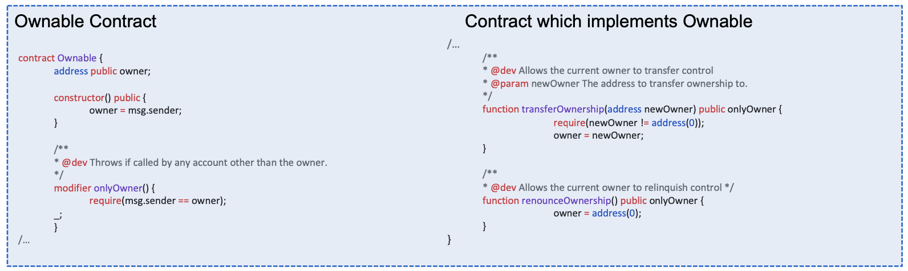
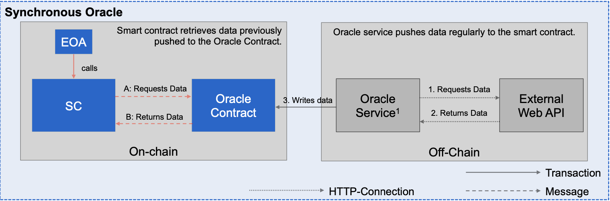
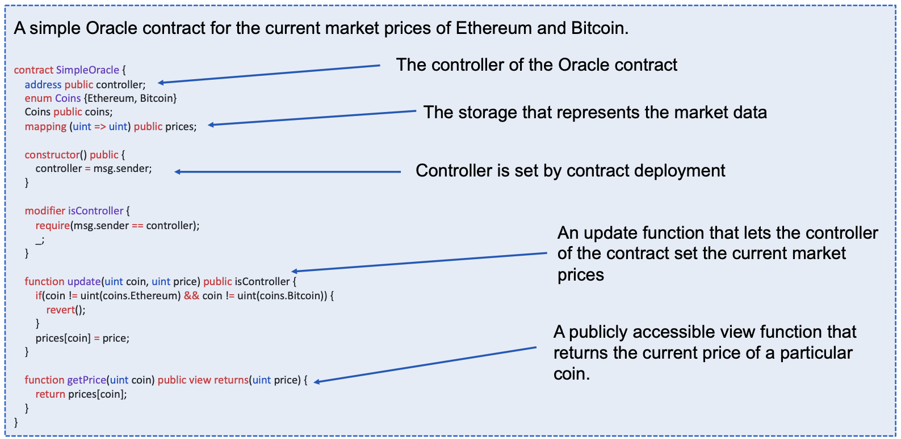
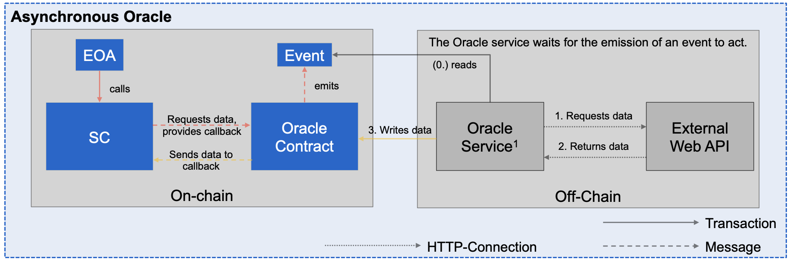
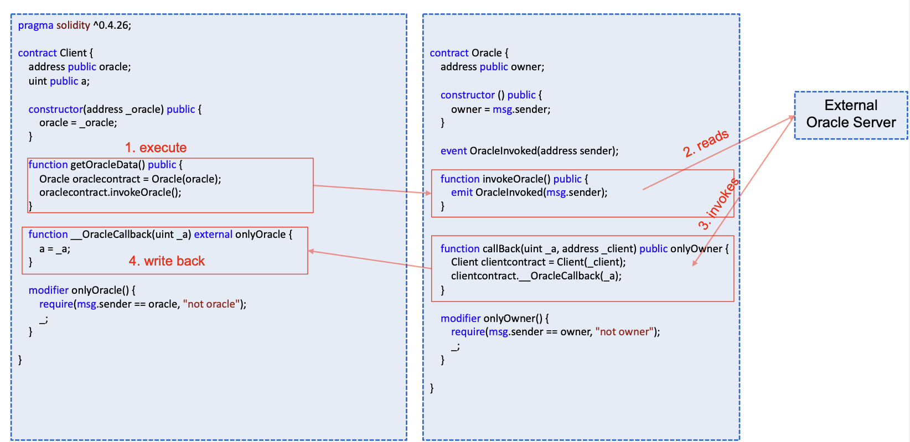
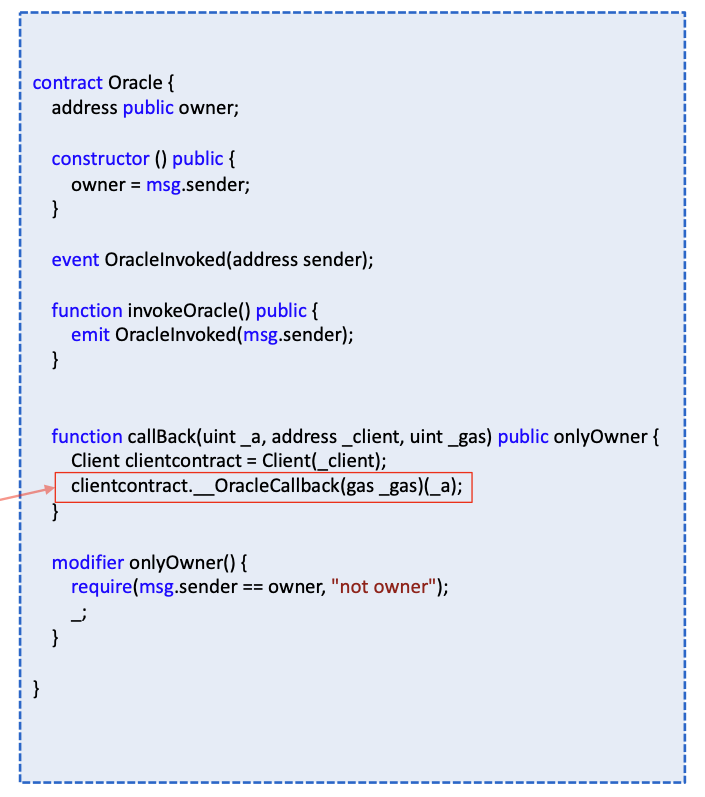

# Ethereum Design Patterns

## Solidity Idioms 

- Programming idioms are language-specific patterns for recurring programming problems 
- Idioms are on a lower abstraction level than **design patterns** which are template solutions for recurring software engineering problems. 
- OpenZeppelin is a library that automates operations and delivers reusable, secure, tested and community-audited code. Most of the critical building blocks that are needed for a contract are already pre-programmed in it, so users should utilize the existing library instead of writing their own code. In this section, we will go through the most prevalent idioms of Solidity smart contract programming through the OpenZeppelin library. 
- `SafeMath` is library that validates if an arithmetic operation would cause an integer overflow/underflow. 
    - Until Solidity version 0.8, it had to be manually included and utilized by the smart contract developer 
    - Since version 0.8, it is implemented on the language level

> A **Solidity idiom** is a practice-proven code **pattern** for a **recurring coding problem**

## Access Restriction Idiom 

### Description 

- Each contract deployed on the main network is publicly accessible. 
- Since all external and public functions can be called by anyone, third parties might execute a function on a contract they should not be allowed to. 
- Misconfigured access restrictions led to largest Ethereum thefts so far. 

### Participants 

- An entity that calls a publicly accesible function in a smart contract
- A smart contract which is called by a transaction or a message 

### Applicability

- To protect contract functions from unauthorized calls. 
- Examples for such funtions; selfdesctruct(), mint()

### Solution 

Restrict access of other accounts to execute functions and to modify the state of a contract. In Solidity, access restriction can be achieved by implementing proper **function modifiers** that check if the caller is allowed to execute the actual function logic. To make the contract code more maintainable, the authorization logic is usually put in a seperate contract. 

## Smart Contract Design Patterns

Designing decentralized applications on the basis of a blockcain infrastructure is a rather new area in software engineering. Similar to traditional software engineering, there are recurring problems that are shared across a large set of smart contracts. 

> **Design patterns** are **template solutions** for **recurring design problems**

Design patterns are specifically important for smart contract development 

- Determinism by design makes use of external data and random numbers challenging. 
- The code of a deployed contract is immutable > Contracts cannot be updated
- In most cases, financial value is at risk. 
- Transaction finality > Stolen money is gone forever. 
- Availability of source and bytecode makes it easier for attackers to find potential vulnerabilities. 

## Oracle Pattern 

### Problem Description  

**Smart contracts can't access** any **data** from **outside** the **blockchain** on their own. There are no HTTP or similar network methods implemented to call or access external services. This on purpose to **prevent non-deterministic behavior** once a function is called. (there are also no functions to generate random values)

### Participants 

- A smart contract which **requires data** from external sources. 
- An external party that is willing to **provide data** from external sources via a **seperate smart contract** 

### Applicability 

Any scenario in which a smart contract relies on external data for computation of future states. 

## Synchronous Oracle 

### Solution 

Currently, the **only way** to write smart contracts **using external data** (e.g weather data, traffic data etc) is to **use oracles**. 
Oracles are basically third-party services that collect data from web services and write the data via a special smart contract to the blockchain. 
Other smart contracts can now call the Oracle contract to get the data. We differentiate between **synchronous**  and **asynchronous** Oracles. 

### Synchronous Oracle Contract Example

## Asynchronous Oracle

### Solution 

In contrast to the synchronous Oracle (in which data is periodically pushed to the Oracle contract and retrieved by the smart contract), the asynchronous Oracle acts as a proxy for the Oracle service to send freash data to the original smart contract. 

### Asynchronous Oracle Contract Example 

## Limit Gas Usage in Asynchronous Oracle Contract

- In case of the asynchronous oracle, the oracle server sends a **transaction** to the oracle contract which **invokes** a **message** to the client contract. 

- In our case, **all gas** from the original transaction **is forwarded** to the message. 
- The Client smart contract could consume this gas for malicious purpose. 
- Therefore, it is advisable to **limit** the **forwarded gas**. The limitation is introduced with an additional parameter. The parameter `_gas` defines the to-be forwarded amount of gas. 

`clientcontract.__OracleCallback(gas _gas)(_a);`

- **Be careful** Low gas can make transactions fail! 

