# IoT

The Internet of Things (IoT) is a system of interreleated computing devices, mechanizcal and digital machines, objects, animals or people that are provided with unique identifiers (UIDs) and the ability to transfer data over a network without requiring human-to-human or human-to-computer interaction. (from Wikipedia)

- Cisco defined the starting point of IoT when the number of devices connected to the Internet exceeded the number of people on earth. 

## Devices 

- Sensors, Actuators, Consumer devices, Industrial machines, Wearables, eScooters, Cars, Planes, Buildings

## Applications 

- **Consumer Applications**
    - Smart home or home automation 
    - Elder care 
    - Autonomous driving 

- **Commercial**
    - Health care 
    - Transportation 
    - Building auotmation 

- **Industrial**

    - Manufacturing 
    - Agriculture 

- **Infrastructure**
    - Smart City
    - Energy management 
    - Environmental monitoring 

## IoT Architectures 

- **IoT Cloud Architecture**
- **IoT Edge Architecture**
- **IoT Fog Architecture**

### IoT Cloud Architecture 

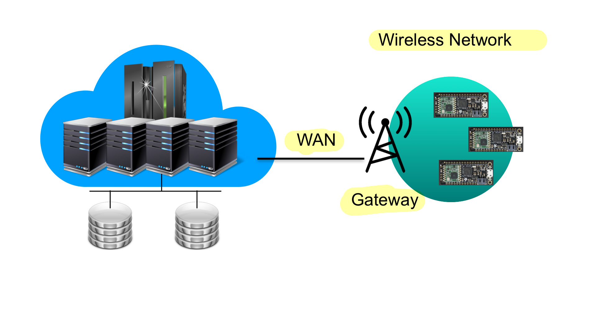

- Wired or wireless connection of sensors and acutators to gateway 
- Sensor data forwarded to IoT platform in Cloud 
- IoT Platform 
    - Scalable in respect to data storage and computation 
        - Usage of NoSQL data storage with eventual consistency 
    - Processing capabilities for triggering actions 
        - Machine learning or rule based 
    - Virtualization services 
    - Supporting data retrieval 
- Latency is a problem, compared to edge computing latency is higher

### IoT Edge Architecture 

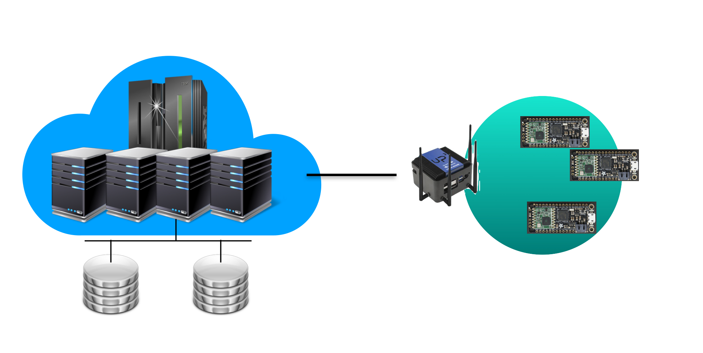

- **Edge Computing**
    - Computation and data shifted to computers at the edge of the network 
    - Extends the centralized cloud model into a distributed model 
    - Intention to bring computation and storage closer to the location where it is needed, 
      to improve response time and save bandwidth
    
- **Specific applicaiotns in a fixed location**
    - Serving a limited number of small devices 
- **Examples**
    - Computation in an autonomous car 
    - Computation in or connected to the gateway on a remote farm 
    - Computation in Industry 4.0 in a robot controller or the gateway connecting it to the internet 

## IoT Fog Architecture

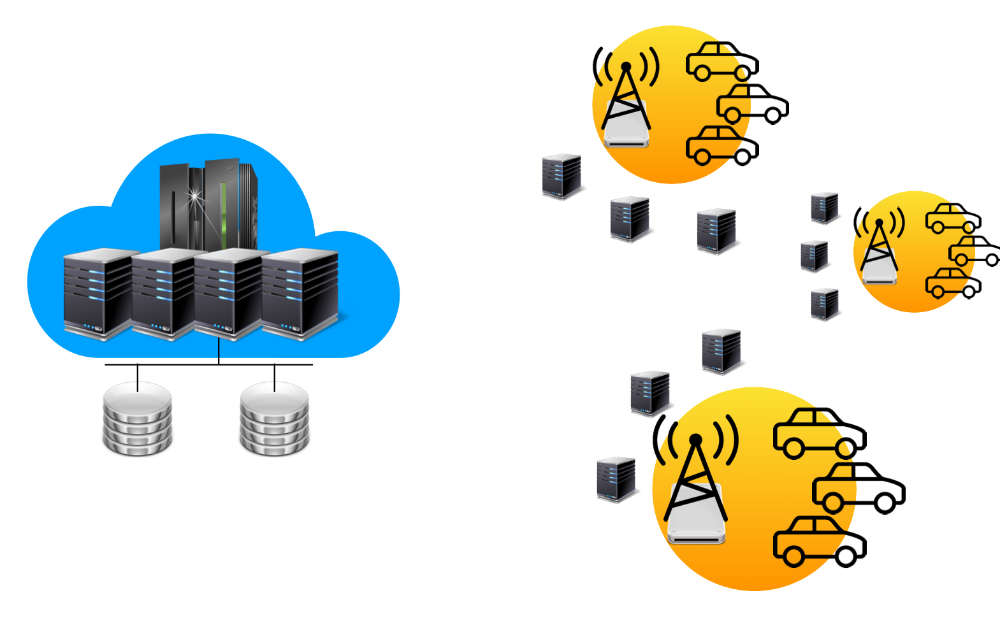

- Extension of edge computing: use of coupled edge systems for adaptivity 
- Replacement of cloud with edge: distributed location-aware shared infrastructure. 

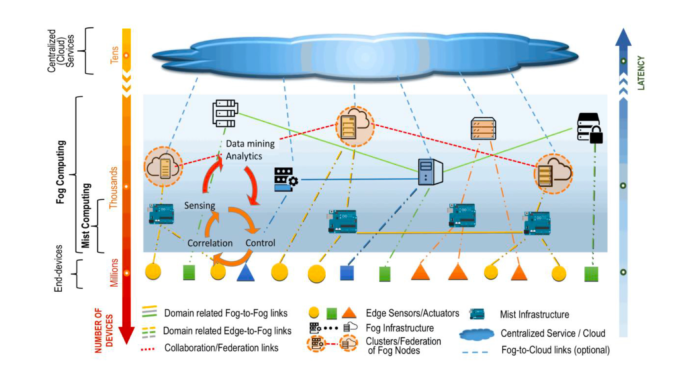

- **NIST Special Publication**

    - "Fog computing is a layered model for enabling ubiquitous access to a shared continuum of scalable computing resources. The model facilitates the deployment of distributed, latency-aware applications and services, and consists of fog nodes (physical or virtual), residing between smart end-devices and centralized (cloud) services.

    - Fog nodes are either physical components (e.g gateways, switches, routers, servers, etc) or virtual components (e.g virtualied switches, virtual machines, cloudlets, etc.) that are tightly coupled with the smart end-devices or access networks, and provide computing resources to these devices. A fog node is aware of its geographical distribution and logical location within the context of its cluster. 
    
    - ....

    - To deploy a given fog computing capability, fog nodes **operate in centralized or decentralized manner and can be configured as stand-alone fog nodes that communicate among them to deliver the service or can be federated to form clusters** that provide horizontal scalability over disperse geolocations, through mirroring or extension mechanisms. "

### Fog Computing Essential Characteristics

- **Contextual location awareness and low latency**
    - For nodes are aware of their location in the context of the entire system 
    - They are also ware of the latency costs 
- **Geographical distribution**
- **Heterogeneity** 
    - Supports collection and processing of data of different form factors 
- **Interperability and federation**
    - Services like real-time streaming require cooperation of different providers
    - Hence, fog computing components must be able to interoperate to enable federated services across domains 
    
- **Real-time interactions**
    - Support for real-time interactions instead of batch processing

- **Scalability and agility of federated, fog node clusters**

    - Fog computing is adaptive in nature 
    - Support for elastic compute and resource pooling 
    - Adaptation to data-load changes and network condition variations. 

### Fog Computing Service Model 

- **Software as a service**
    - The capability provided to the fog service customer is to use the fog provider's applications running on a cluster of federated fog nodes managed by the provider. 

- **Platform as a service**
    - Provides a platform on top of federated fog nodes for customer-provided applications. 

- **Infrastructure as a service**
    - Provides fundamental computer resources to the customer. 

### Fog Node Deployment Model

- **Private Fog node**
    - Provisioned for exclusive use by a single organization
- **Community fog node**
    - Provisioned for the exclusive use of a specific community of consumers 
- **Public fog node**
    - Provisioned for open use by the general public 
- **Hybrid fog node**
    - Composition of two or more distinct (private, community or public) fog nodes 

## IoT Network 

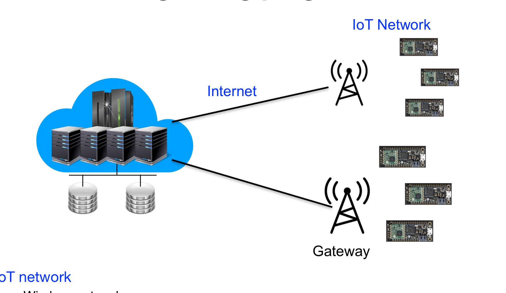

- Wireless network
- Connecting sensors and actuators to a gateway 
- Gateway forwards data to the Internet / Cloud

### Sensor Network 

- For rural areas servers communicate to each other to deliver information to Gateway 

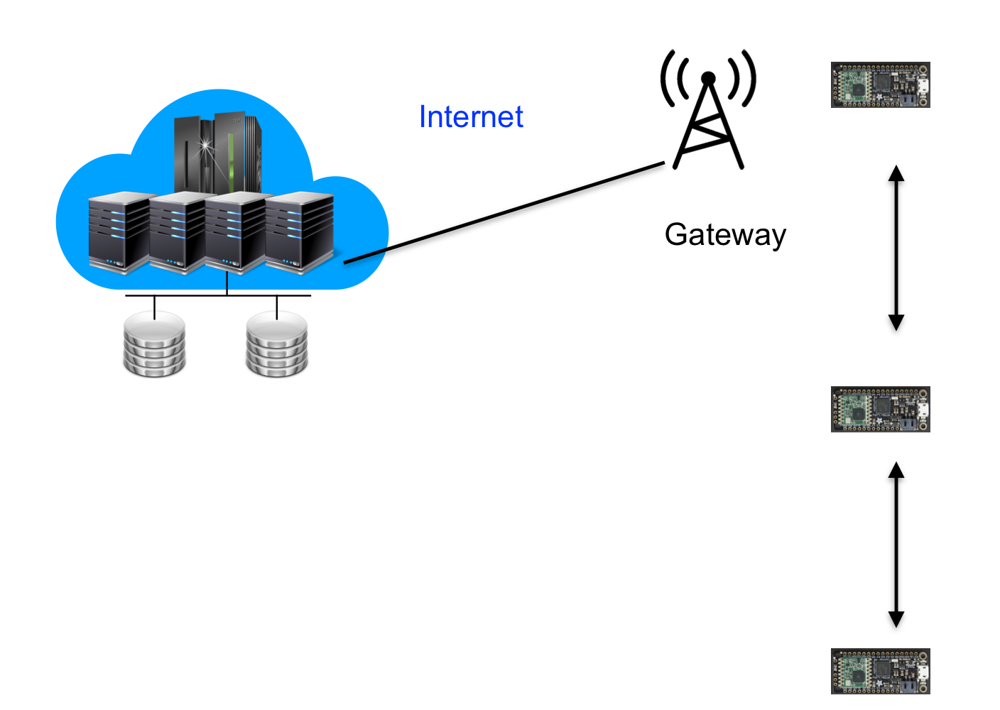

### Use cases for IoT Network Technologies 

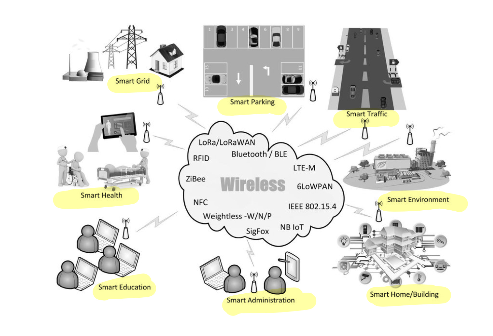

### IoT Networks 

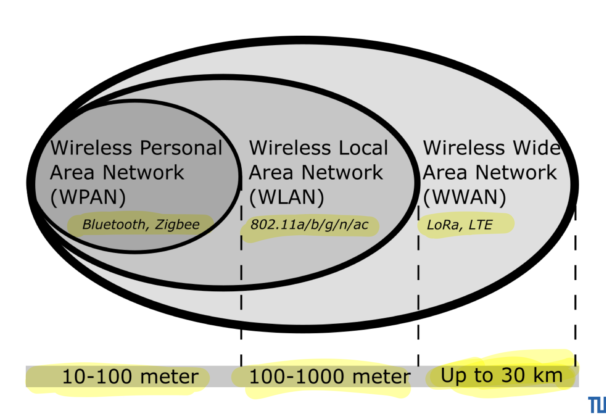

### Low Power Wide Area Networks (LPWAN)

- Connect sensors over long distance 
- Enable long lifetime of battery powered sensor devices 

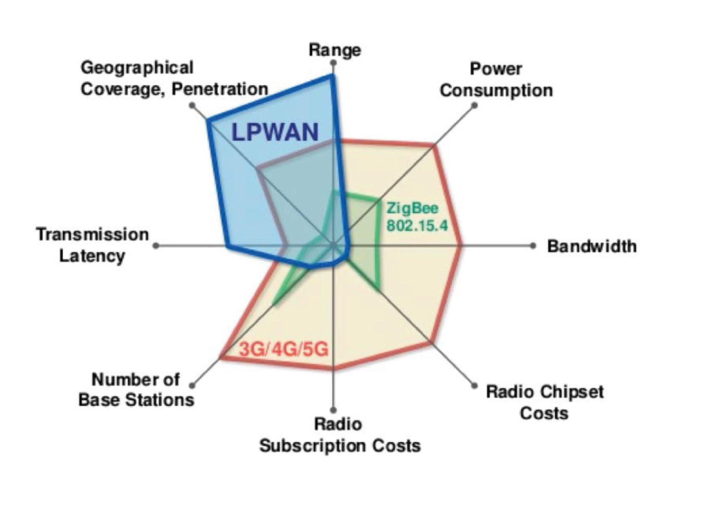

### Long Range Wide Area Network (LoRaWAN)

- LoRa is the physical later (OSI 1), LoRaWAN defines Medium Access Layer 
- Low power wireless communication technique for long distances > 10 km in rural areas; excellent connection in buildings
    - Trading communication bandwidth for low power and long range 
    - Suited for transfor of messages of a few bytes, **not for streaming videos etc. (even not for pictures)**

- Used in IoT infrastructures

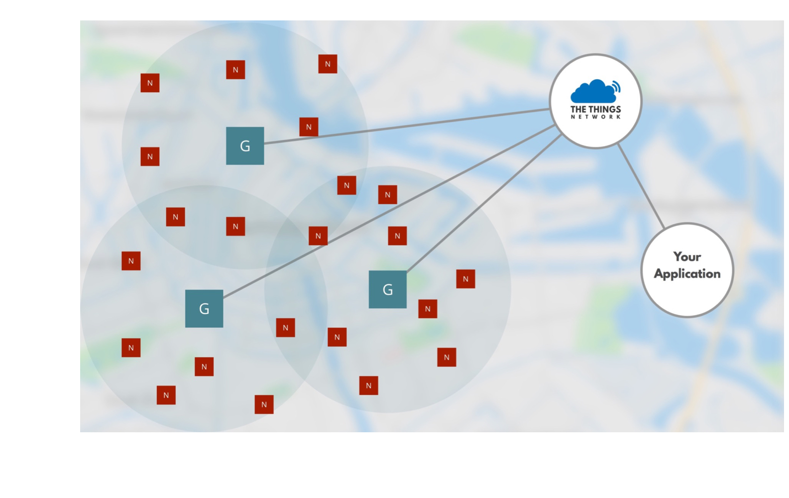

### LoRaWan

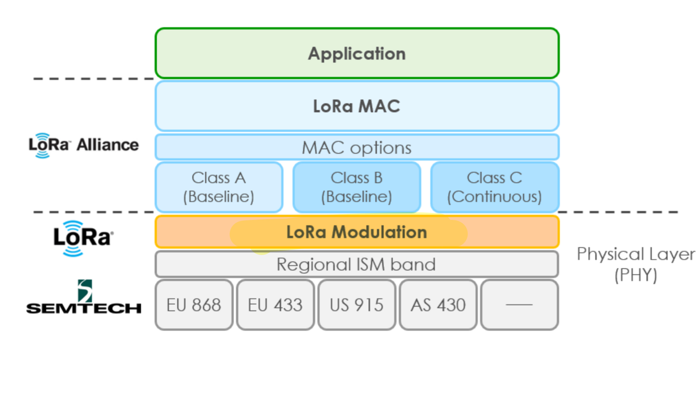

## LoRa 

- **Based on Chipr Spread Spectrum (CSS) modulation**
- **Uses spectrum of free frequencies (868 Mhz Germany, 915 MHz US)**
- **Device types depending on bidirectional communication support**
    - **CLASS A:** Transfer to gateway followed by two receive windows
    - **CLASS B:** Download window at predetermined points in time 
    - **CLASS C:** Permanent receive state 

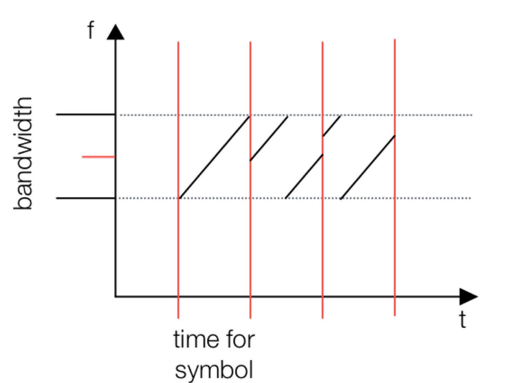

- Spreading factor determines #bits and time per symbol. Higher --> more reliable transmission 

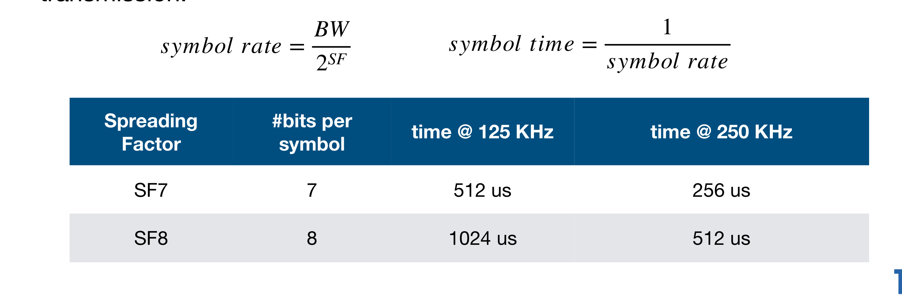

