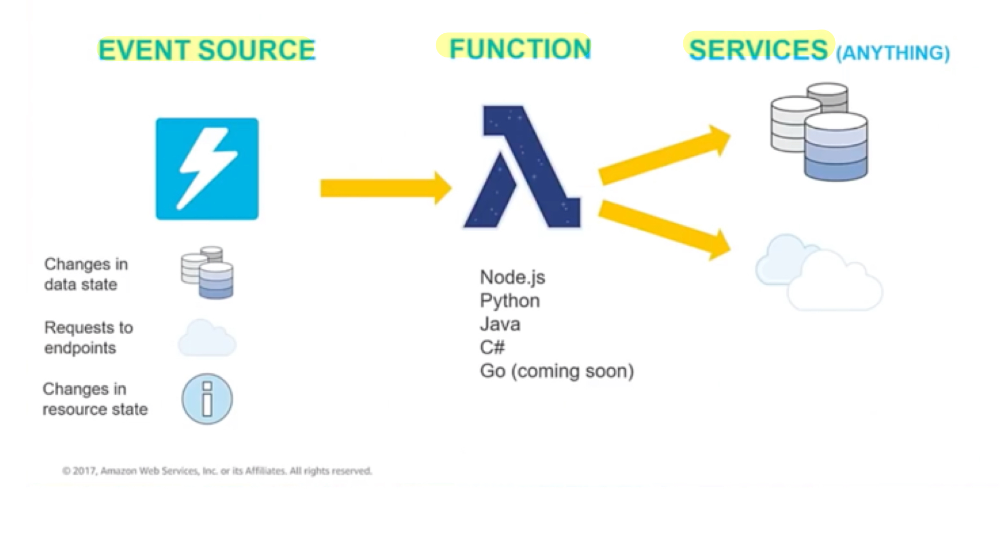
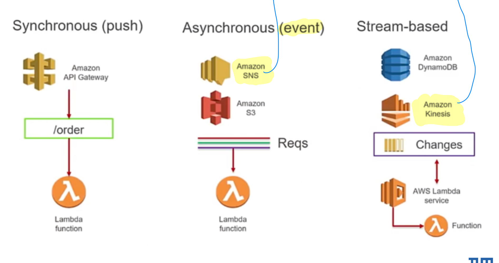
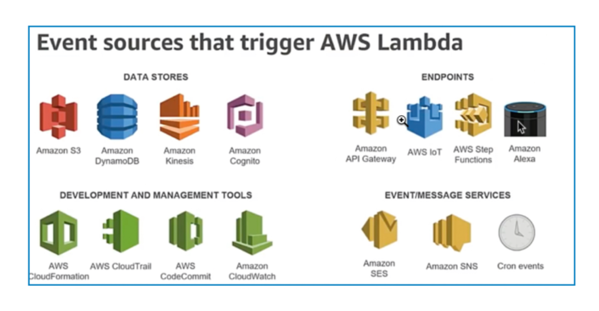
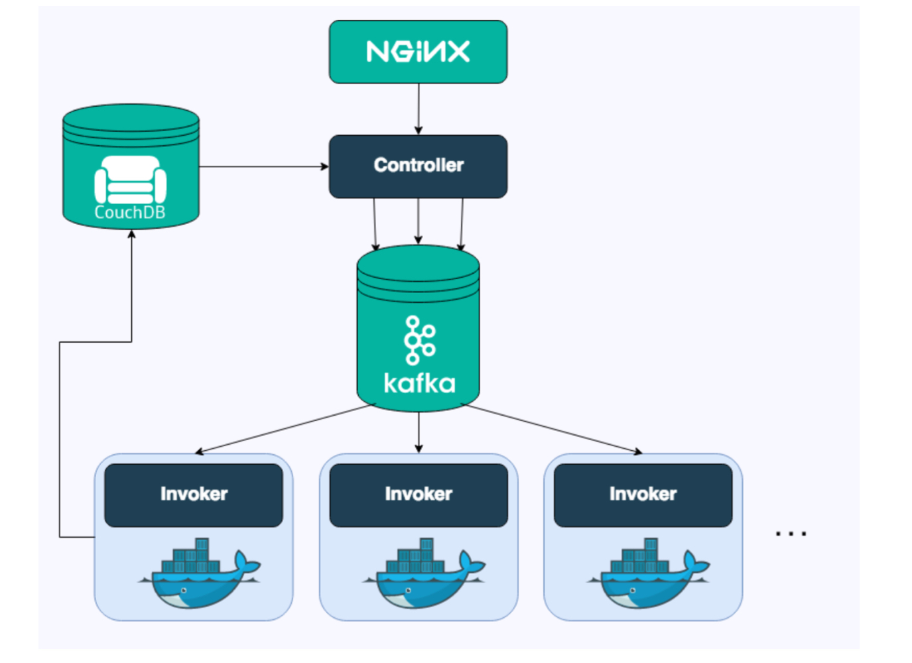
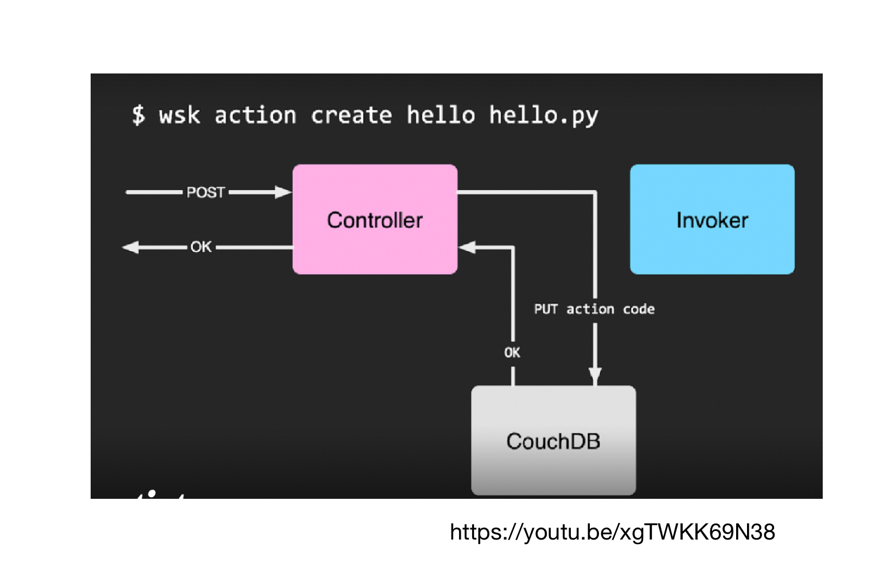
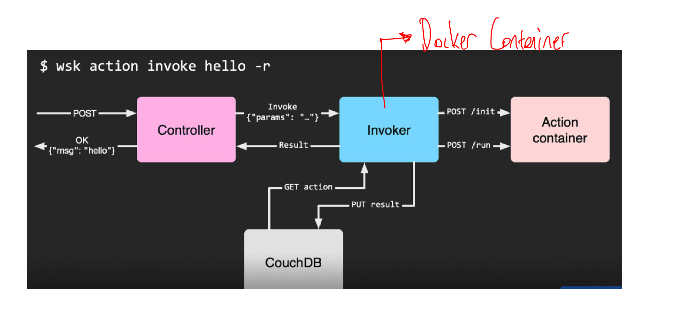
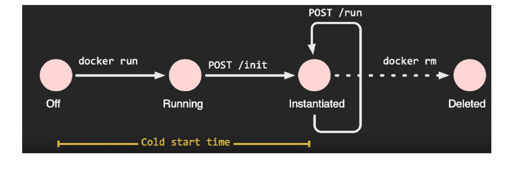
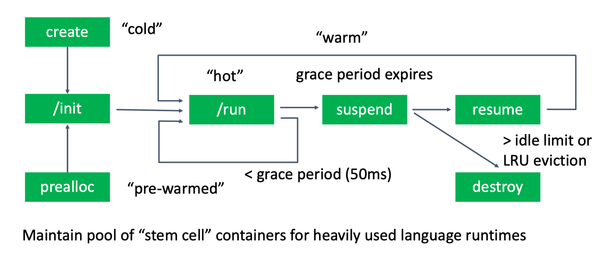

# Function-as-a-Service

- Platform as a service model 
- Application programming model 
    - Event driven computing model 
    - Events trigger stateless functions 
    - Functions
        - May be programmed in any language 
        - May access backend services( cloud services, private databases, web services ...)
        - Have a short execution time
- Payment 
    - Per function invocation 

## Serverless Computing 

- Synonym for FaaS 
- Serverless means : **Application owners do not have to worry about the underlying execution infrastucture, most importantly physical or virtual servers**
- Serverless computing platform can provide one or both of following: 
    - **Functions-as-a-Service (FaaS)**, event-driven computing. Developers run and manage application code with functions that are triggered by events or HTTP requests. Developers deploy small units of code to the FaaS, which are executed as needed as discrete actions, scaling without the need to manage servers or any other underlying infrastructure. 
    - **Backend-as-a-Service (BaaS)**, whicha are third-party API-based services that replace core subsets of functionality in an application. Because those **APIs are provided as a service that auto-scales and operates transparently**, this appears to the develer to be serverless. 

## Advantages

- No provisioning of servers 
- Automatic scaling 
- Reduction of costs. Do not pay for idle VMs and do not run replicas for resilienc 
- Underlying servers shared among different function invocations

## Disadvantages 

- Focused on stateless functions 
- Performance variation due to restart latencies
- Not suited for heavy computation workloads own VMs might be cheaper
- Limited security: shared VMs, no control over the network 

## Amazon Lambda 

- 2014, first serverless offering by a public cloud provider 
- Designed use cases such as: 
    - Image or object uploads to Amazon S3 
    - Updates to DynamoDB tables 
    - Responding to website clicks 
    - Reacting to sensor readings from an IoT connected device 
    - Backend implementation for custom http requests
- Metering 
    - Increments of 100 ms

## Lambda Functions 

- Anonymous functions in functional programming. 
    - Not bound to an identifier
    - Often used as arguments being passed to higher-order functions or constructed as a result of a higher-order function 
    - heavily used in node.js applications 

## Main features 

- **Bring  your own code**
    - Node.js, Java, Python, C#
    - Bring your own libraries ( even native ones)
- **Flexible use**
    - Synchronous or asynchronous
    - Integrated with other AWS services 

- **Simple resource model**
    - Select power rating from 128 MB to 3 GB 
    - CPU and network allocated proportionately 

- **Flexible authorization**
    - Securely grant access to resources and VPCs 
    - Fine-grained control for invoking your functions 

## Lambda execution model 

- Event sources that trigger Amazon Lambda 

## User Management 

- **Amazon Cognito** 
    - Secure user sign-up, sign-in, and access control 
    - Support integration with social and enterprise identity services 
    
- **Procedure**
    - Create a user pool and appliation id
    - Easy integration of registration and verification of email address in web site
        - Cognito can be configured to send email with verification code

## Serverless Service Backend 

- Handle request to send a unicorn to a place 
- JavaScript running in the browser will need to invoke a service running in the cloud 
- Implement a lambda function that 
    - will be invoked each time a user requests a unicorn
    - will select a unicorn from the fleet.
    - record the request in a DynamoDB table and 
    - respond to the front-end application with details about the unicorn being dispatched 

- **The function is invoked from the browser using Amazon API Gateway**

## DynamoDB 

- **Create Table**
    - Note table name and define partition key 
        - Data are distributed across 10GB storage units (partitions)
        - The partition key is input to a hash function determining the partition 
    - Note the Amazon Resource Name (ARN) of the table
- **Create Identity and Access Management (IAM) role for the lambda function**
    - Needs permission to write log entries to CloudWatch 
    - Create an IAM role and define a policy giving CloudWatch log permission and **PutItem** permision for the DynamoDB table Specify table through ARN. 

## OpenWhisk 

- Developed by IBM and Adobe, now an Apache Incubator project 
- Concepts 
    - Trigger (events)
    - Actions (code)
        - Functions or binary code in a container
        - Json object as input parameter and as return value 
    - Rules connect triggers with actions 
    - Actions can also be called from the command line, OpenWhisk API, iOS SDK. 

- **Invocations of actions**
    - Blocking or non-blocking 
    - API gateway for OpenWhisk
        - Allows to map API endpoints to OpenWhisk actions 
        - Provides Web Actions with HTTP method routing, authentication through client id/secrets. rate limiting and CORS 

- **Action chaining**
- **Open event emitters: Periodic, Kafka, CouchDB...**
    - Own emitters though a public REST API

## Architecture 

## Optimization in OpenWhisk 

- **Warm Containers** 
    - Do not delete the containers immediately, grace period 
    - Re-use container for subsequent invocation of same function 

- **Pre-warmed containers**
    - Keep a pool of initialied containers (stem cell container) with a certain language runtime

    

## OpenWhisk on Kubernetes 

- **Support for different container factories**
    - Docker Container Factory 
    - Kubernetes Container Factory 
    - Mesos Container Factory 

- **OpenWhisk on top of Kubernetes**
    - Kubernetes manages the control plane of OpenWhisk (Controller, Invoker, ...)
    - Docker Container Factory 
        - Docker is used to create the containers
    - Kubernetes Container Factory 
        - Small number of invokers (<< #worker nodes)
        - User containers are wrapped into pods
        - Invokers starts pods on a worker node 
        - **Advantages**
            - Reuses infrastucture from Kubernetes
            - Can be use with other container runtime, e.g containerd 
        - **Disadvantages**
            - Longer cold-start latency 

- **Small, simple, stateless functions**
    - Require sequences for more complex operations
        - e.g First detec the language of a document and then translate it 

- **Different approaches**
    - Client side: client calls the functions 
    - Server side: New function that calls the elementary function and passes the result 
    - Event driven composition: First function triggers the next 
    - Primitive sequence in OpenWhisk

## Primitive Sequence in OpenWhisk 

- **Advantages**
    - Requires no change or knowledge of the composed functions 
    - Requires no change to the client code 
    - Does not inflate costs
    - Build into OpenWhisk runtime

- **Alternative: Apache OpenWhisk Composer**
    - JS library to program compositions
    - Workflow compositions: sequence, loops, parallel, if ... 

- **AWS Step Functions**

## Serverless Framework 

- **Cross-platform deployment and management tool**
    - Support for major FaaS implementation of cloud providers 
    - Templates for cloud provider and function language 
    - Command line tool that works for all cloud providers 

- **Specification of application for deployment**
    - Functions 
    - Triggers 
    - Resources 

- **Automatically instrumentation**
    - Enabling monitoring and debugging

- **Dashboard**
    - Investigate monitoring data and errors 

## FaaS providers 

- **Cloud Providers**

- Google Cloud Functions since 2016 
- IBM Cloud Functions 
- Microsoft Azure Functions 
- Huawei Cloud Functions 

- **Open Source**
    - OpenWhisk 
    - Fission on top of Kubernetes
    - Fn: Started by Oracle and runs on top of docker
    - Nuclio: Focusing on real-time and data-driven applications
    - Kubeless: Kubernetes-native serverless framework 
    - OpenFaaS: Running on top of a number of container orchestrators

## When to use serverless ?? 

- **Use when**

- Easily decomposable functions 
- Highly-variable demand (fast response time needed)
- No high frequency in triggering
- Overhead of running instances is high (people/mgmt cost)
- Need for tight integration to cloud events

- **Use caution if**
    - You do not want to lock-in to cloud 
    - Demand is not variable 

