# Virtualization

Virtualization is a computer architecture technology by which multiple virtual machines aere multiplexed int he same hadrdware. 

It is an art ofcreating virtual resourcds such as server, storage, network and so forth in a layer abstracted from the real hardware. 

Virtualization is a old concept -- the idea of VM is from 19602. It is applied in Clouds !

## Objectives of Virtualization 

- To enhance the resource sharing by many users at a time 
- To replace and upgrade hardware on the fly (a sort of isolation among guests)
- To add new devices such as network cards, processors, without reboots. 
- VMs help to reduce the down time
- Virtualization techniques offer administractive tasks such as installing software planning new VMs, optimizing number of VMS, and so forth at runtime. 
- Faster provisioning of multiple machines 

## Basics - Modes of Operation

Generally, the Operating System operates in two modes

-> Kernel mode and User mode 

## Kernel Mode 

- In this mode, OS allows all CPU instructions to execute on the underlying hardware.
- Kernel codes do not execute in the USER mode. 

## User Mode
- OS allows only a few instructions to be executed (for e.g The instructions that process data -- User applications)
- If the user applications ahave to execute the privileged instructions, the applicatoins ask kernels to the work (for eg via a system call)
- User applications can't open files, send network packets, print to the screen, or allocate memory. 

**NOTE**

- Kernel processes run in the KERNEL mode with the supervisor privilege or superuser privilege
- User processes run in the USER mode with the user privilege
- OS manages processes and threads. 

## System Calls and CPUs 

 - OS does:
	- Process management (start, run, stop processes)
	- Memory management (Allocate, Deallocate memory)
	- File management (Open, Close, Modify, Read, Rename, Create)
	- Network Management, Scheduling, Timing, etc. 

- At user mode, the user applications initiate a system call to get OS related services 
- A system call is a user space request of a kernel service 
- There are hundreds of system calls in a 64bit OS. 
	E.g: sys_enter and sys_exit
- the x86_64 provides > 322 system calls and the x86 provides > 358 different system calls. 
- Typically a system call takes around 242 cycles.

## Bare-Metal Virtualization 

- As multiple OSs should function in a single machine here: 
	- hypervisor acts at Ring 0. 
	- Guest OSs operate at Ring 1.
	- Applications operate at Ring 3. 
- This type of hypervisor is named as "Bare-metal hypervisor"
- Eg. Hyper-V, VMware ESX/ESXi, Xen

## Hosted Virtualization 

- Here, the hypervisor is loaded on top of an OS. 
- Similar to a computer application/program
- The Guest OS runs on the hosted hypervisors. 
- Virtualization due to this technology is also named as 
	- Hosted virtualization
- Eg. VMware workstation, VMware fusion, Oracle Virtualbox, Parallels, Solaris-Zones

## Full Virtualization 

- Here, the guest OS is not modified.
- Guest OS works in Ring 1: VMM works in Ring 0 
- What happens when privilege instructions are executed ? 
	- Every privilege instructions are trapped due to the execution in the less privileged ring
	- The VMM intercepts such traps and emulates the instructions on the fly. 

## Impacts of System Call and I/O virtualization 

- Impact of system calls: 
	- A binary translated system call with the 32-bit guest OS running on ring 1 takes 2300 cycles. 
		- This is due to the fact that CPU issues fault message for every system calls. Later, they were translated and executed. 

- Impact of I/O virtualization
	- I/O virtualization is a major issue compared to CPU virtualization. 
		- CPUs could be added by replacing dual-core CPU to quad cores. 
		- But, memory bandwidth or data path or I/O chipset could not be easily modified/upgraded in a computing machine/ 

	- All guest OS should wait for the physical I/O 

### Impact of Memory Virtualization 

- In fact, virtual memories were introduced in order to reduce system crash !!
- Virtual memory is a memory management technique
	- It maps programs' memory addresses (called as virtual addresses) to the underlying physical machine memory (in computer). 
	- Usually, OS maintains the mapping of virtual memory to physical memory. 
	- **Adv. increased security, isolation; freeing applications**

- In VMs, we have hypervisors !!! Mapping works differently !!! 

	- Here, programs' memeory addresses (virtual addresses of VMs) are mapped to Virtual Physical Memory and then to physical memory. 
	- It is a 2-stage mapping process for any guest OS 
	- Thus, guest OS cannot direclty access the machine memory. 
	- The page table in VMM is called as a **shadow page** table
	- The shadow paging process takes 3 to 400 times more cycles than native situations. 

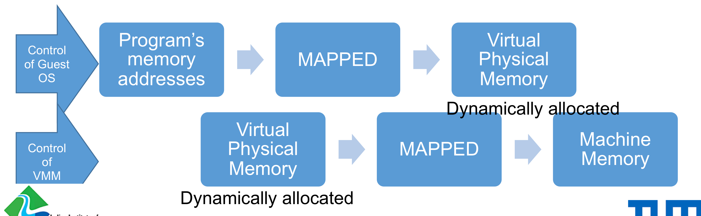

## Para Virtualization 

- Here, guest OS needs to be modified at the source code level - i.e no need for trapping and binary rewriting ...
- Runtime changes are avoided 
	- It avoids on-the-fly modifications due to code transformation (eliminates traps)

- Hypervisor provides interfaces to accommodate critical kernel operations such as memory managemen and intterrupt handling. 
- Performance is comparatively good. 
	- Because, paravirtualization **avoids unnecessary trapping** of critical instructions
	- **Thus, the advantage of paravirtualization is to have a lower virtualization overhead.** <- CRUCIAL POINT
	- But, the challenge is that you need **a modified guest OS**!!! 
	- KVM is a para-virtualization tool. 

## Hardware-Assisted Virtualization 

- A hardware-assisted virtualization support is also available for Intel and AMD 
	- VT-x - named as Virtualization Technology 
	- Eg. Intel VT-x (formerly, Vanderpool Technology)
	- Eg. Intel VT-i (Vanderpool Technology for itanium)
	- Eg. AMD has AMD-v
	- H/W virtualization support should be enabled in the BIOS setup. 

- **PURPOSE OF HARDWARE-ASSISTED VIRTUALIZATION**
	
	-  The purpose of hardware assisted virtualization is **NOT to JUST add hardware for doing binary translation !!!**
	-  The main idea is **to quickly identify** the privilege instructions and to **efficiently execute** them. 
		- To do so, one more high priority layer was introduced at the hardware level 
		- VMM works at this level and guest OS could operate at Ring 0. 

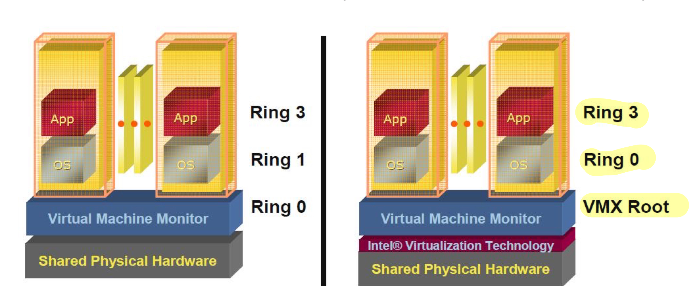

## Hosted Virtualization 

- Bare-metal virtualization can be slower (w.r.t migrations)
- Resource requirements are comparatively low
- High scalability
- Multiple VMs can share a single machine/cluster 
- In cloud, 1000s of VMs are required ... 
- Thus, hosted virtualization is a better solution in terms of scalability 

### HOSTED VIRTUALZATION - OS LEVEL 

- Hosted Virtualization 
	- i.e VMM is on top of Host OS. 

- Building blocks of hosted virtualization 
	- Namespaces and cgroups are two building blocks of OS-level virtualization

- **LINUX NAMESPACES - a feature of linux kernel**

	- Namespaces are used in linux to **limit the views**
	- The namespaces wrap a group of resources
	- Several kinds of Namespaces exist....
		- **PID NAMESPACE**
			- allows us to create another set of PID starting from PID 1 for that specific namespace. If not, init process gets PID 1. 
			- Without namespaces, all processes descend from the init process. i.e PID 1. 
			- Proceses within the new namespace cannot view the parent process. 
			- But, the parent processes could view the child processes !

		- **CGROUP NAMESPACE**
			- This offers new views to root directories (/rootdir) for processes 
			- In fact, chroot() may set root directory to any process. But, it just modifies the pathname lookups for the process (and its child processes)
			- There is no security in chroot()
			- Cgroup namespace isolates and manages resources (directories)

		- **NETWORK NAMESPACE**
			- This offers a new view for network resources (i.e localhost, eth0, routing table, iptables, and so forth)
			- If a container is assigned a new Network namespace, the intter processes of it may get new Network interfaces (for instance lo)
			- However, a virtual network interface must be created along witht the inner routing process (ensure mapping of global namespace to locally framed new namespaces.)

		- **MOUNT NAMESPACE**
			- It provides isolation of mountpoints (i.e we could see new distinct single directory hierarchies)

		- **USER NAMESPACE**
			- Isolates User and group IDs. 

	- **NAME SPACES ARE MANAGED USING APIS**
		- clone(), setns()

## OS-level Virtualization- cgroups and namespaces 

### Cgroups - control groups 

- It is a linux kernel feature which limits the application to a specific set of resources. 
- i.e It provides a mechanism for aggregating/partitioning set of tasks
	- i.e How much to use ? and What to use ?

- It has **3 main tasks on a group of processes**

	- **To limit resources** < IMPORTANT
	- **To isolate resources** < IMPORTANT
	- **To audit the utility of resources** < IMPORTANT

- Limiting resources of a group of processes
	- Resource **limitations may be set** for a group of processes starting from linux 2.6.24
	- Why should we limit the utilization ? 
		- To guarantee a certain amoun of resoures (CPU, memory, disk I/O) for a group of processes. (which executes applications)

- Cgroups information are located in /sys/fs/cgroup/*

### Types of cgroups 

- **memory cgroup**
- **cpu cgroup**
- **blkio cgroup**
- **cpuset cgroup**
- **devices cgroup**
- **freezer cgorup**

## Memory cgroup

- Generally, it is a memory resource controller
	- Isolates the memory behavior of a group of tasks from the rest of the system 
	- It creates a cgroup with a limited amount of memory
	- It seperates the memory-hungry applications from other applications
	- A cgroup with memory controller is called as **"memory cgroup"**

### Features of memory cgroup 

- Accounting
	- How much memory pages are utilied by a specific group of running processes ? 
		- in file pages (pages on disks)
		- in anonymous pages (pages are not located on disks, they are from heaps, stacks...)
- Limiting
	- Soft limit - memory is allocated if available
	- Hard limit - memory is not allotted to the group of tasks 

## Impact on Exceeding Hard Limit 

- **While exceeding the hard limit**
	- The kernel triggers OOM killer (Out-of-memory) process to kill any running processes (based on badness score)
	- Hence, it is advisable to run **only one application** on a container. 

- **Customied solution for overriding hard limits**
	- The OOM killer process can be customized 
	- If so, the following steps are done:
		- Step 1: All processes are stopped processing (Freeze option)
		- Step 2: Notify user space 
		- Step 3: User could kill specific processes 
		- Step 4: Or, User could increase the hard limit specified in the cgroups
		- Step 5: When done, unfreeze the group.

## Containers - A global Perspective 

- Containers use the kernel features (cgroups and namespaces)
- Thus, container technology provides an environment where the **hardware is shared** amoung multiple users. It is a **lightweigh VM;** less space; and can get a shell on it via SSH. 

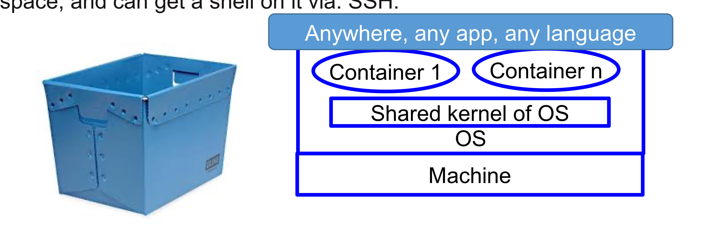

- Container solutions allow multiple isolated Linux systems of **same kind** on a single host. Thus, it is called as Self-Contained Execution Environment. 
- Containers cannot boot different Operating Systems and it cannot have its own kernel modules (diff. from Type I VMs)
- E.g LXC, OpenVZ, BSD Jails

## Docker 

- Docker utilizes the container technology (cgroups and namespaces)
	- It easily ports containers
	- It replicates containers across environments. 

- Thus, it reduces the time between writing code and producing them

- It removed unnecessary configurational hurdles of applications. 

- Since 2014...

## Docker vs Virtual Machines

- Problems with VM - size, memory, integration

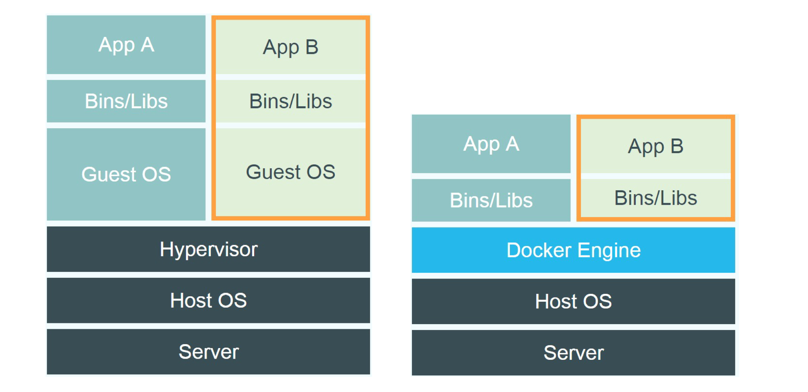

- It utilies union filesystem - 

	- Unionfs is a filesystem service for Linux, FreeBSD, and NetBSD which implements a union mount for other file systems. It allows files and directories of seperate file systems, known as branches, to be transparently overlaid, forming a single coherent file system. 

## Docker Containers -- OPERATIONS 

- Docker **caches** the layers the **first time** of building them. 
	- For eg. Golang || Apache

- For the initial install, Ubuntu is cached or golang; 
- For the second build, only apache or mysql is built rather than initiating the build procdess from Ubuntu base !!!
- Thus, the deployment is faster using dockers. 

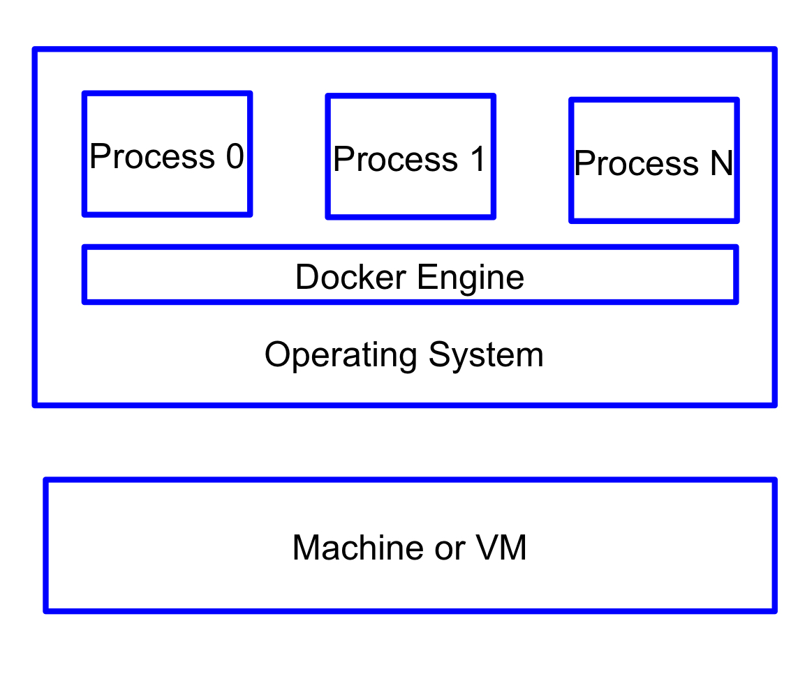

## Docker Architecture 

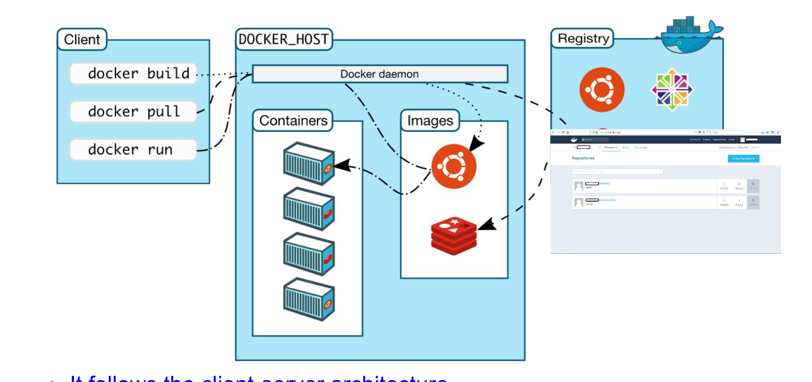

- It follows the client-server architecture 
	- Docker client talks to the docker daemon 
	- The docker daemon does the following
		- Building, running, distributing docker containers
	- The docker registry stores docker images 
		- Either in local registry or in public registries (such as docker hub, docker cloud)

## Docker Container States 

## Docker Tools 

- **Docker Desktop**  
	- A bundled package which contains all components of dockers- docker engine, cli, credential helper and so forth

- **docker-compose**  
	- It is a tool for defining instances specific to certain applications
	- It is able to build and run the multi-contaner docker applications 
	- It is represented as YAML files 

- **docker swarm** 
	- It is a tool to manage docker containers hosted on clusters 
	- It has features such as scaling, multi-host orchestration, service discovery, load balancing, and so forth. 
	- It follows init and join approach (as like in Kubernetes.)

## VMWare- vSphere Product

- It _virtualizes and aggregates_ the underlying physical hardware resources of a datacenter
- It promotes private cloud (or hybrid) rather than a public cloud concept !!! (DIFFERENT from AMAZON or similar clouds)
- VMWare extended their previous virtualiation products such as VMWare ESX, workstation, and so forth. 
- **vSphere is called as a cloud OS - aggregates the infrastructure of a datacenter** < IMPORTANT
- vSphere is a Type-1 virtualization
- It enables us to manage IT resources. 

## VMWare Topology

- **With this architecture, we can create a virtual datacenter**
- **vCenter server** 
	- Provides a central poing of control to the datacenter
	- It is responseible for performance monitoring, management and configuration
- **Server groups with computing servers**
	- They run ESX or ESXi based x86 servers on bare metal. 
	- These servers could be grouped as clusters too. 
- **Storage networks/arrays**
	- 3 types
		- Fibre channel SAN 
		- Internet Small Computer Storage Interface (iSCI)
		- NAS

## VMWare Topology 

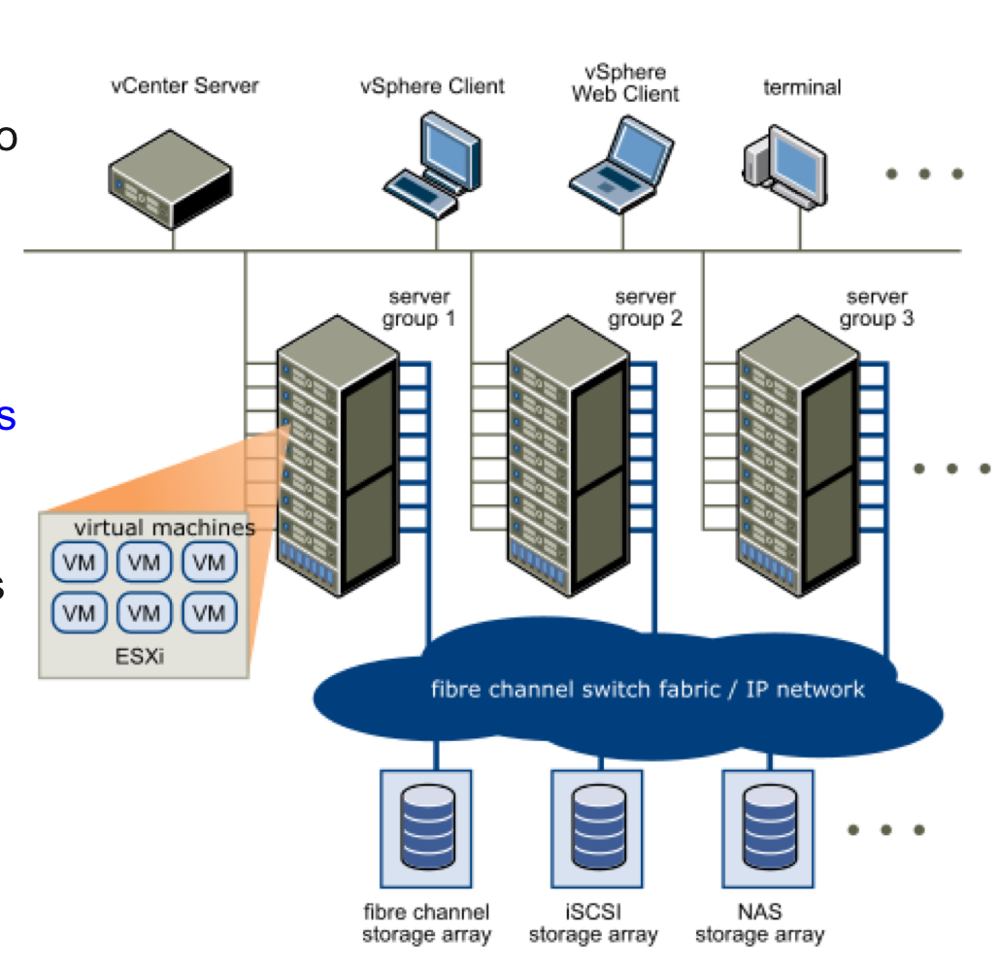

- **Management clients**
	- vSphere client
	- vSphere CLI 
	- vSphere Management Assistant (MA)

## VMWare- Components 

- Vmware ESX or ESXi server 
	- A server with virtualization layer.
	- It abstracts the underlying hardware for provisioning resources to VMs. 

- A _Virtual Machine File System_ (VMFS) among ESXi servers. 
	- High performance cluster filesystem - e.g Parallel FileSystem, HDFS 

- vCenter Management Server 
	- Centralized component for provisioning and managing VMs 

- Virtual Infrastructure Clients 
	- An interface for client connections 

- Virtual Infrastructure web access
	- An interface for users/admins to manage vms
	- The configurations can happen at cluster level 

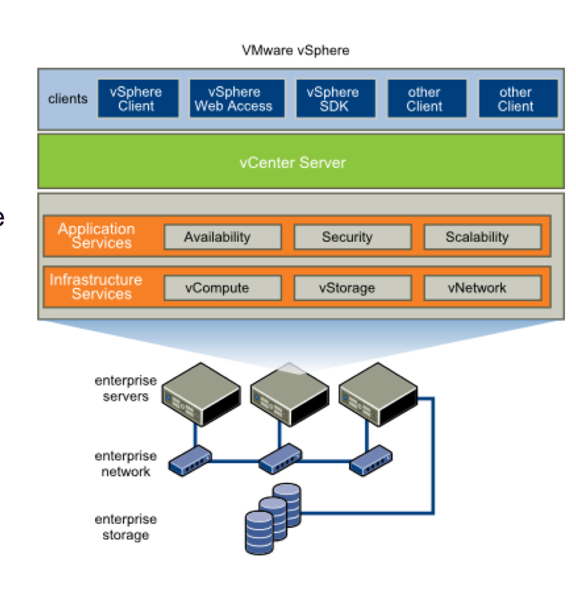

## Distributed Services 

- VMware VMotion 
- VMware Storage VMotion
- VMware Dynamic Resource Scheduler
- VMware High Availability
- Fault Tolerance

## VMWare vMotion

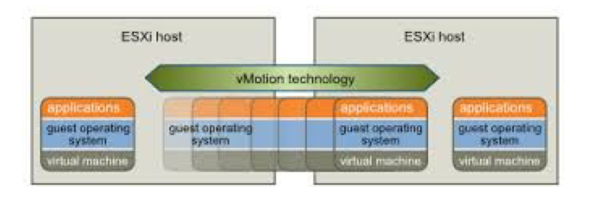

- It enables the migration of virtual machines from one **host memory to another host memory** without service interruption (with no downtime) < **IMPORTANT !**
	- But, the disk and the other files are stored in the shared memory. 

- This allows administrators
	- To off-load virtual machines from one storage array to another to perform maintenance
	- To resolve out-of-space issues
	- To upgrade VMFS

## Storage vMotion (SVMotion)

- Does the same as vMotion, but it moved storage information in addition to moving guests. 
	- i.e snapshots could also be moved 

- This enables datacenter level VM migration
- Note: Vmotion cannot do a datacenter level VM migration

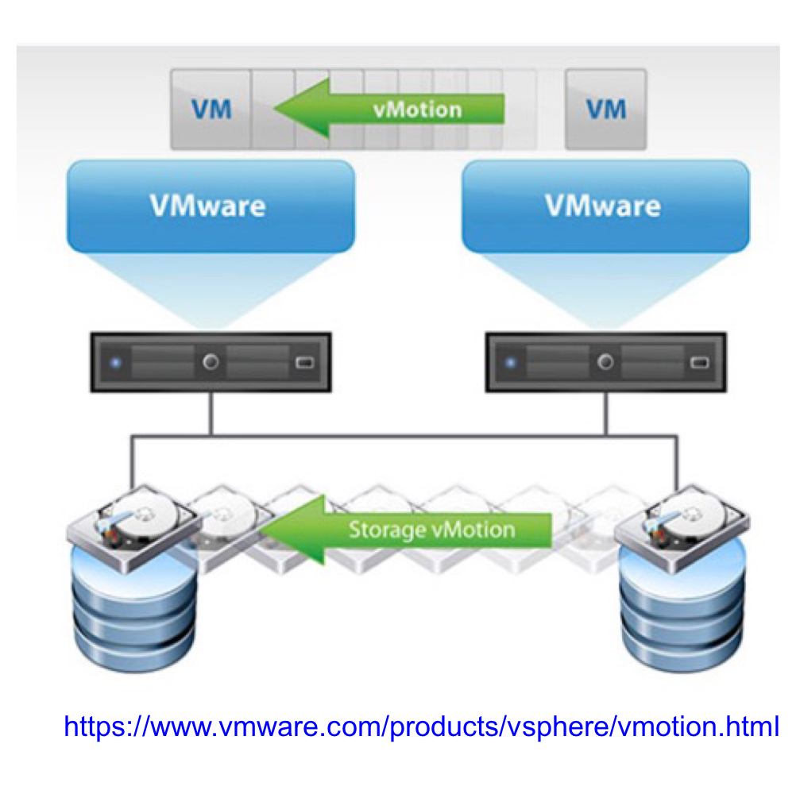

## VMWare - Insights 

- **Dynamic Resource Scheduler**
	- It schedules the resources based on loads or capacity requirements 
	- It has features to do automatic scheduling of cluster configurations. 

- **Consolidated Backup**
	- It is utilized for the backup of ESX servers. 

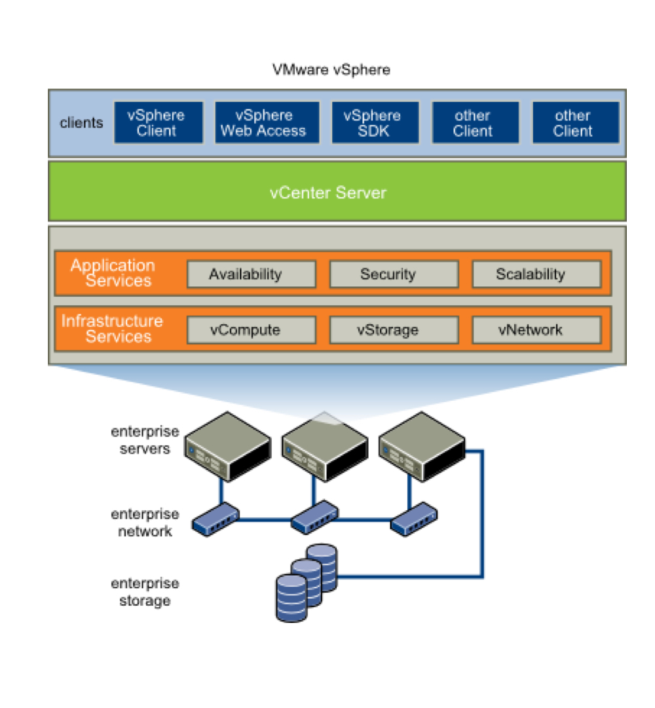
