# L4- IaaS - AWS

- AWS started IaaS service model
	- Compute
	- Network
	- Storage

## AWS - Resource Distribution 

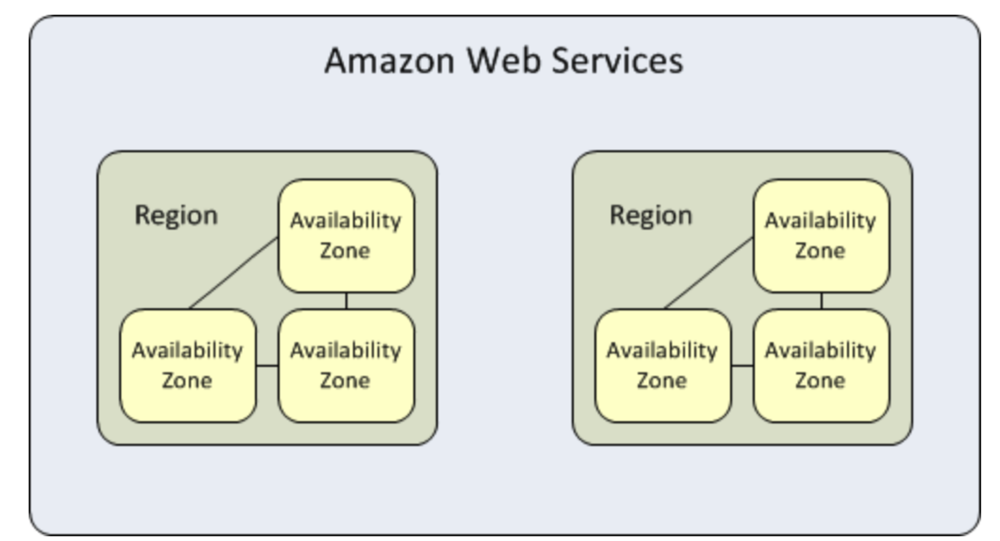

## AWS- Regions

- Geographic cluster of availability zones
- Currently >26 regions + US Gov and Chinese regions
- Account has on or more available regions
- User can control where resources are allocated
	- Meet legal requirements such as in EU
	- Have short latency access for customers

- Regions are isolated for fault tolerance and stability
	- You see only your VMs in the current region
	- Communication among regions is not free

## AWS- Availability Zones

- Availability Zone > Think about a data center

- Two availability zones have no common points of failure, thus servers in two zones gain infrastructural redundancy
- Naming  > region_code + letter, us-east-1a
- User can control the zone in which a VM is started for fault tolerance reasons, otherwise AWS will select a zone
- Number of zones in a region might be different for accounts
- Communication in a zone is free, between zones it has to be paid

## AWS- SLA

- Region-Level SLA guarantees 99,99 % region availability.
	- Region is unavailable when all of your running instances or running tasks, deployed
	in two or more AZs, concurrently have no external connectivity

- Instance-Level SLA guarantees 99,99 % reachability of an EC2 instance
	- Instance is not available, when your Single EC2 Instance has no external connectivity

## AWS- Elastic Compute Cloud - EC2

- Virtual machiens runnig inside the Amazon Cloud
- Ephemeral Storage tied to the virtual machine (node)
- Network accessible block storage that persists across time and can be mounted in the VM
- Virtual firewall to secure your netowrk in the Cloud

- Based on Xen hypervisor
- AWS announced end of 2017 to switch to an own hypervisor based on KVM
for new highend Intel processors

## Xen Hypervisor

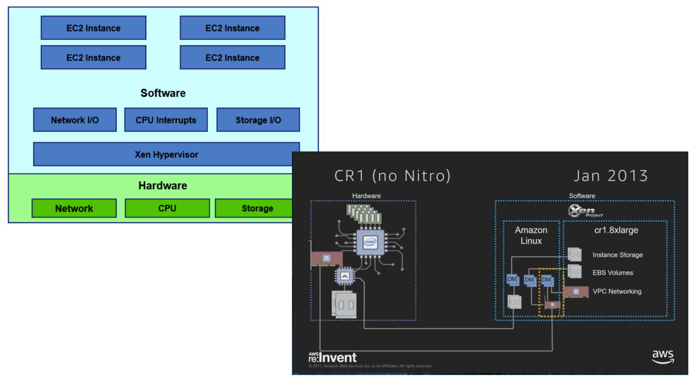

- Three level of virtualization

	- Bare Metal: hypervisor sits in between the hardware and the host OS/VMs
	- Hosted virtualization: hypervisor runs on top of the host operationg system
	- OS-level virtualization: containers running on top of the OS kernel

- Xen is a bare metal hypervisor

	- One VM is called Domain 0 (DOM0) and runs the host OS
	- It starts first and runs the Xen management software, manages other VMs, has drivers for hardware and provides
	virtual disks and network access to unprivileged VMs

## Nitro Hypervisor

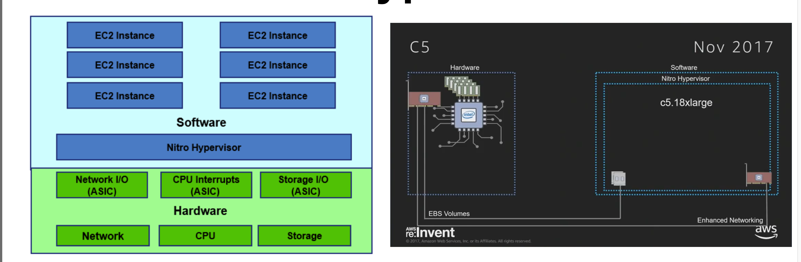

- Special interface cards
	- Network, interrupt handling and block Storage
	- Management happens in hardware instead of software in DOM0
	- Offer limiters to guarantee resource distribution, e.g : network bandwidth

- Hardware is faster
	- Entire Dom0 can be removed
	- No cores reserved for Dom0

## Amazon Machine Image

- AMI also called VM template
		- Copy of a server with OS and preinstalled software
		- Predefined AMIs from Amazon and third-parties, user-defined AMIs possible
		- AMIs are stored in S3
		- Difficult to select an AMI, they could even include Trojans or backdoors
		- Amazon provides reviews and ratings for them

## AWS Storage

- Amazon Elastic Block Storage
- Amazon EC2 Instance Storage
- Amazon Elastic File System (Amazon EFS)
- Amazon Simple Storage Service (Amazon S3)

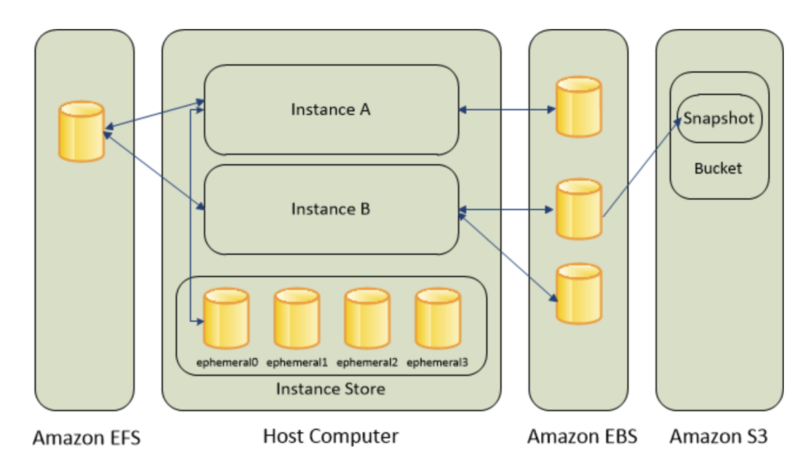

## Storage in Data Centers

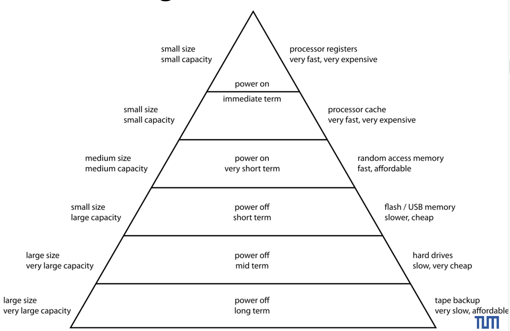

## Local storage

- Flash or disk drives attached to the computer
- Disks are larger and cheaper but slower and more power hungry

## RAID

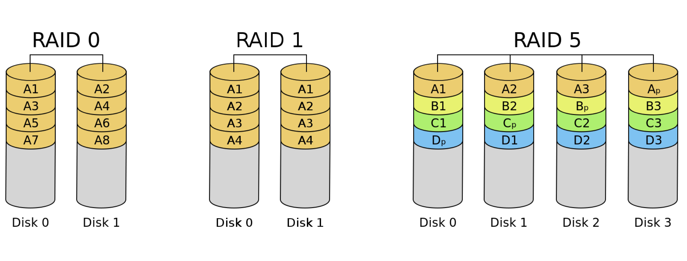

## Non-volatile memory, FLASH

- Write
	- A high positive voltage (10-13V) between gate and source lets electrons tunnel into
	the floating gate. (tunnel injection)

- Read
	- The charge od the floating gate partially cancels the electric field from the control gate.
	- Thus, a higher voltage is required to make the channel conduct
	- With a certain threshold voltage, the state of the transistor can be sensed.

- High negative voltage removed the charge
	- Reset is done for blocks. Isolation is damaged by reset

## Single and Multi Level Cells (SLC/MLC)

- SLCs store one bit
- MLCs store multiple bits ina single cell
	- Instead of only checking the presence of the current, the strength is sensed.
	Thus, more precise measurement is required
	- The states are determined by the amount of charge in the floating gate. Thus, precise control of the charge
	deposit is required
	- Higher density, lower cost
	- Larger bit-error ratio
	- Lower write speeds, lower number of program-erase cycles and higher power consumption

## Data center Storage

- Pressure on storage due to server consolidation
	- Storage comparison moved from EUR / GB to EUR/IOPS

- Enterprise storage solutions
	- All flash arra, vs Hybrid Flash Array

- All Flash
	- Only based on Flash storage or SSDs
	- Combination with RAID
	- Higher IOPS, lower latency, higher bandwidth
	- More expensive

## Provisioning of Storage

- Direct Attached Storage

	- Storage devices are attached to the individual computer
	- Leads to over-provisioning

- Storage Area Network (SAN)

	- Network providing access to block level data storage
	- Typically specialized network seperated from LAN
	- No file abstraction, only block-level operations
	- Shared pool of spare resources

- Network Attached Storage (NAS)

	- Storage devices connected to a file server
	- Access available at a file-level for other computers.

## Storage Area Network

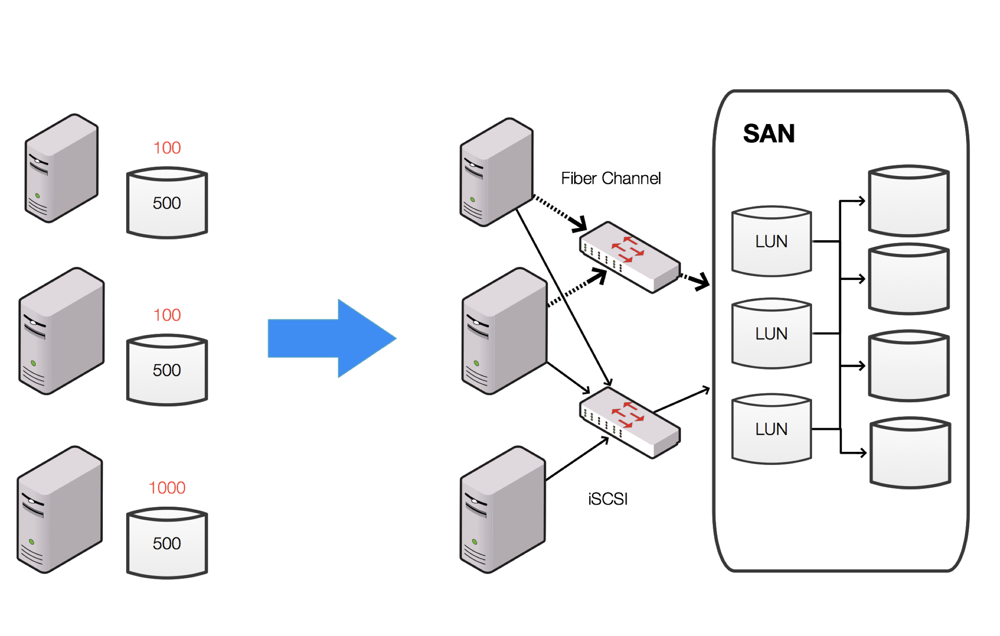

- SAN protocols
 	- Fibre channel, iSCSI, ATA over Ethernet (AoE), HyperSCSI

- Storage device visible to client as disk
	- It can be mounted after formatting with a file system

- Drawbacks
	- Shared network bandwidth
	- Shared performance of storage devices
	- Security concerns due to transfer of data through netowrk

- Advantages
	- Flexible distribution of devices between clients, no adaptation of cabling.
	- Easy replacement of faulty servers with new servers booting from the same unit
	- Easier disaster protection

## Network Attached Storage

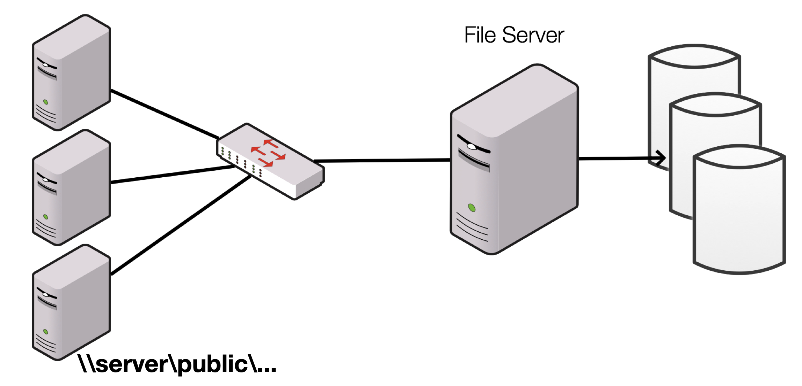

- File server attached to the network
- Has a file system and provides access to files for clients
- Implementations
	- Computer based
	- Embedded systems based
	- ASIC based

- Access to files using network file sharing protocols, e.g NFS

- Frequently using internally a RAID

- Clustered NAS
	- Provide ability to distribute files and meta-data across multiple NAS servers

## Storage Virtualization

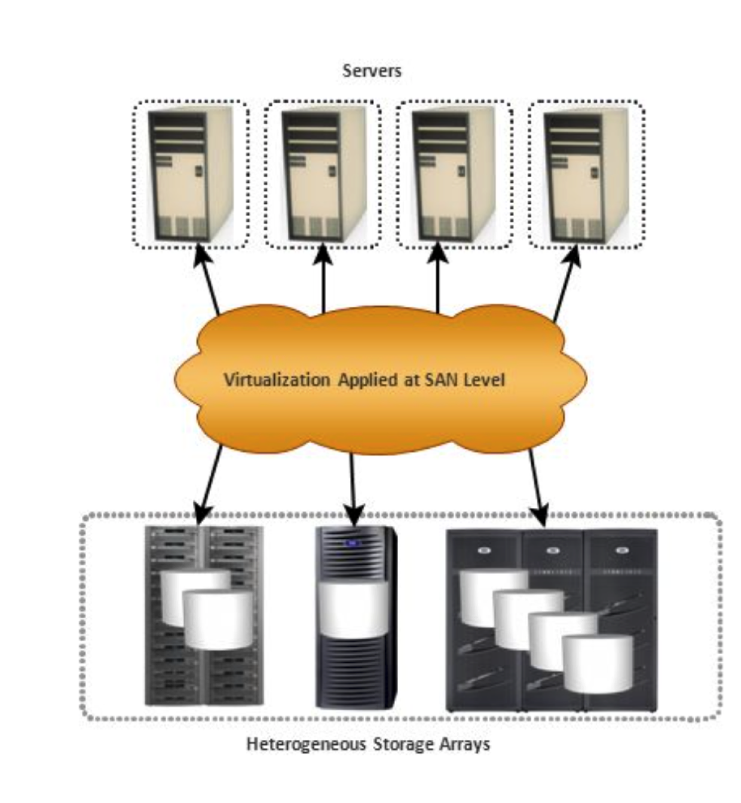

- Block virtualization or file virtualization
	- Both provide location transparency

- Block virtualization
	- Meta data determine mapping of virtual disk and block number (local in the client systems) to
	physical disc, block number
	- IO redirection based on the meta-data

- Usage
	- Flexible mapping
	- Thin provisioning
	- Disk expansion and shrinking
	- Non-distruptive data migration
	- Improved utilization

### Block virtualiation: Implementation

- Host Based
	- Host runs virtualization software
	- It maps logical units to physcial units

- Storage device based
	- Disk array, e.g RAID, provides a virtualization level.
	-	New disk arrays provide storage controllers that allow the attachment of other storage controllers
		- The primary storage controller provides pooling and meta-data management
		and might provide replication and migration services

- Network Based
	- The virtualization device is in the LAN and connected to a SAN
	- It provides the virtualization services
	- Most frequent implementation
	- In-band vs out-of-band

## File virtualization

- File systems
		- E.g NFTS, FAT32, UFS store files on a block based storage

- Clustered NAS
	- Clustered NAS combines NAS from the same vendors

- Distributed File System
	- Allow files located on multiple NAS to appear as if on a single NAS, e.g Windows DFS, Linux DFS, AFS: Andrew File System from CMU
	- Distributed File System can combine NASs from different vendors

## Amazon Block Storage

- Block storage volume
	- Block-level storage which can be mounted
	- It can be formatted as appropriate
	- Multiple can be combined into a virtual RAID
	- Snapshots of block storage volume are stored in S3 for backup or replication

## Amazon Instance Storage

- Disks attached to the physical host
- If you stop or terminate an instance, any data on instance store volumes is lost
- Some instance types use NVMe or SATA-based solid state drived (SSD) to deliver high random I/O performance.

## Amazon Elastic File System

- Scalable file storage

- Can be created and mounted into instances
- Files can be shared among instances
- File system has to be explicitly created and destroyed

## Amazon Simple Storage Services (S3)

- Reliable and inexpensive data storage Infrastructure
	- Supports objects from 1 btye to 5TB
	- Two-level namespace:
		- Buckets: flat collection of buckets, namespace is shared across all Amazon customers
		- Objects: File in the buckets
- Slow compared to local discs or EBS

- Access
	- In EC2
	- From the web
- High durability but  low availability
- Most users use S3 for short-term or long-term backup

## Amazon EC2 Instance

- Instance
	- Running VM which is based on an AMI  

- Instance Type
	- VM with different compute and memory capabilities

- Storage
	- Boot device volume
		- Elastic Block Storage
		- Instance Storage
- Instance store volumes: local discs of the server
- Both are lost, when the instance is terminated
- For persistency use EFS, EBS
- Elastic IP address
	- Static IP address is required if you want to use an instance that must always be accesible by the same IP address
	- You pay for address independent of the usage
- Account limit of number of VMs of a certain type

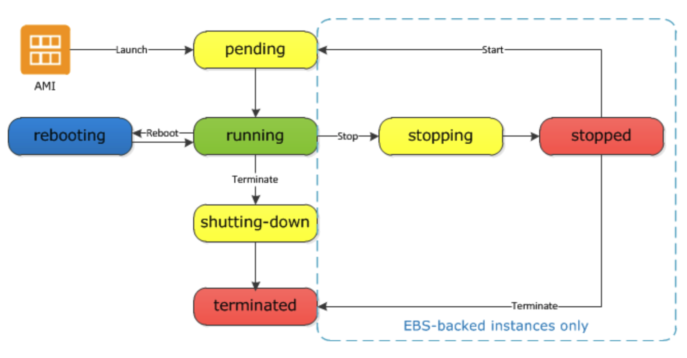

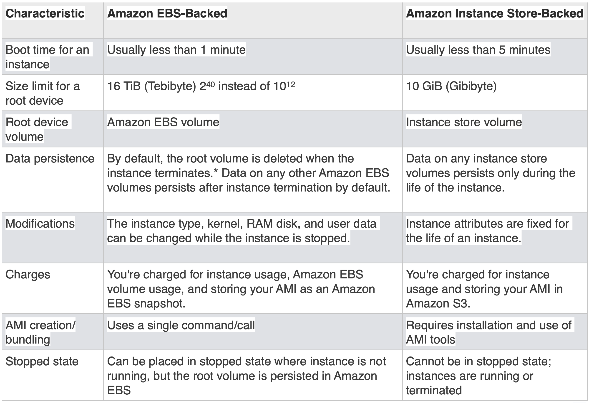

## Lifecycle

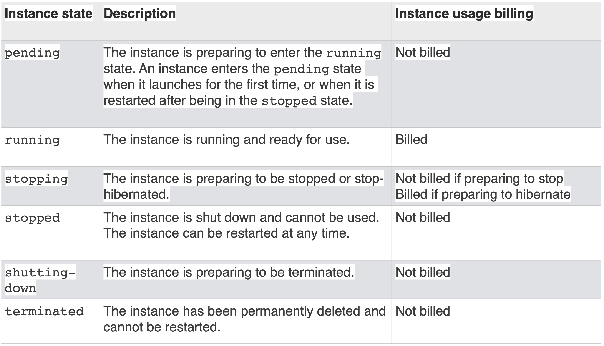

## Security

- Two platforms:
	- EC2 classic
	- EC2-VPC (Virtual Private Cloud )

- New accounts since 2014 only in EC2-VPC

- Virtual Private Cloud
	- Your resources are launched into your VPC
	- VPC resembles your network in your own data center
	- Configuration
		- IP address range, create subnets, and configure route tables, network gateways, and security settings
		- Connect instances to the internet
		- Connect your VPC to your data center
- Amazon created a default VPC but additional VPC can be created by the user.

## EC2 Access

-  Primary means is throught a web services API
- Interactive tools on top of the API
	- Amazon Web Services Console
	-	Amazon Command Line Tools
- Third-party Infrastructure tools
	- Management of a whole infrastructure with multiple servers, accouts, reports,
	- Right scale: www.rightscale.com

- Access to your server is by private/public key pair.

## AWS Cloud Formation

- Model your infrastructure
	- Infrastructure as code
	- Specify all resources in a textual way as a json template
	- Allows to standardize components across your institution
	- Automatic deployment of all resources, controlled and predictable
	- Use code editor and versioning tools

## Amazon EC2

- Insfrastructure as a service
- Offers also platform as a service Lambda, IoT
- Flexible instance types
- Large variety of Amazon Machine Instances
- Pricing: On-Demand, reserved, spot market pricing
