# FaaS 

- Advantages 
	- No provisioning of servers 
	- Automatic scaling 
	- Reduction of costs
	- Underlying servers shared among different function invocations

- Disadvantages
	- Focused on stateless functions 
	- Performance variations due to restart latencies 
	- Not suiable for heavy compute-intensive workloads, own VMs might be cheaper
	- Limited security: shared VMs, no control over network

## Serverless Computing

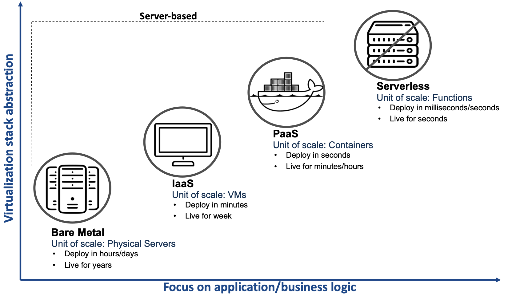

## Kubernetes Architecture 

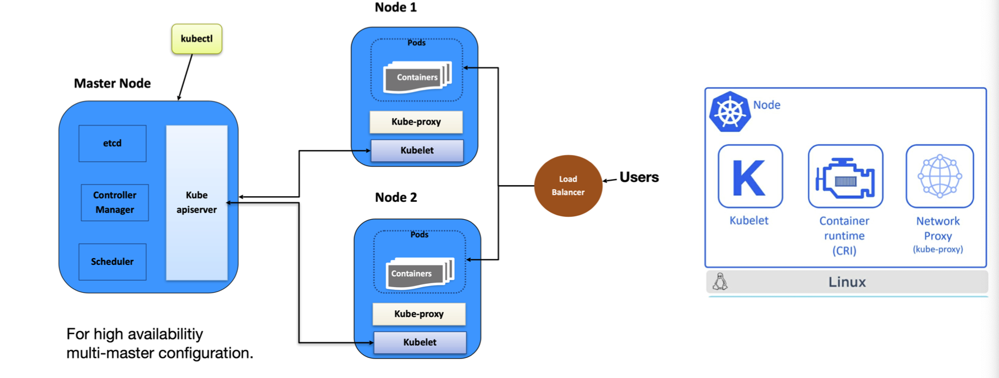

## Containers vs VMs 

### Containers 

- Using Linux primitives 
- Share Linux Kernel 
- Fast Starts, minimal overheads
- Flexible location 

### Virtual Machines 

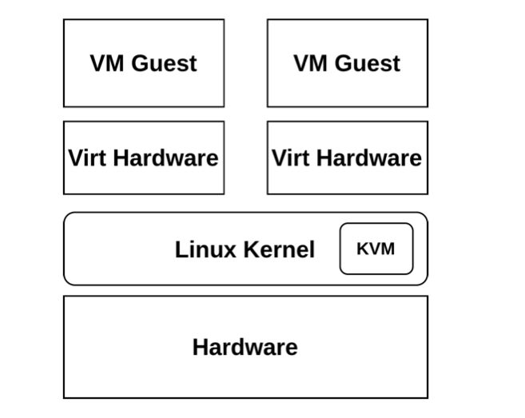

- Virtualiation or emulate hardware components 
- Completelty seperate kernels 
- Slower starts, must boot kernel and set-up hardware. 

## Container Ecosystem 

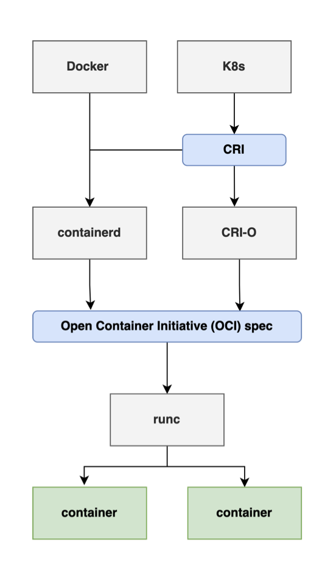

- CRI 
	- Defines an API between K8s and container runtime

- OCI 
	- Specifications for container images and running containers 

- Runc 
	- Implementation of the OCI Spec 
	- Responsible for creating and running the container processes

## Containerd

- Industry-standard container runtime 
- Available as a daemon on Linux 
- Manages complete container lifecycle of its host system, e.g image transfer and storage, container execution and supervision
- Fully supports OCI runtime 
- Supports snapshotting 
- Supports running sandboxes through containerd-shims

### What is a shim ? 

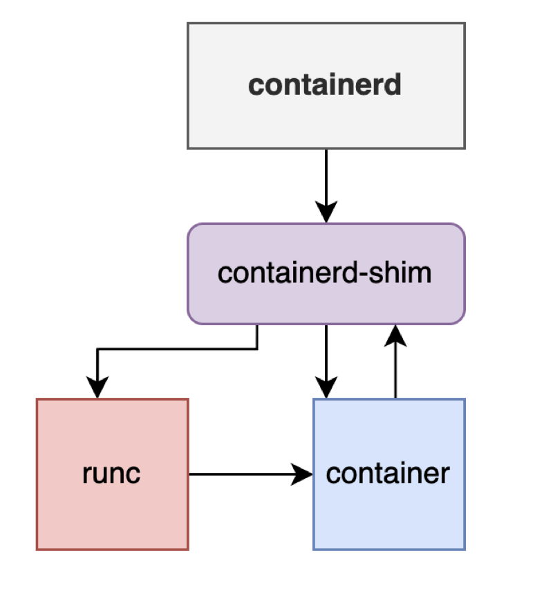

- Piece of software that resides between containerd and a low-level container runtime (runc, runsc)
- Abstract low-level runtimes. 
- Lives as long as the container process 
- In contracts, OCI runtimes just start a fork/exec container process and then exits
- Intercepts container's stdin, stdout and stderr streams and redirects them to logs. 

## Containerd Ecosystem 

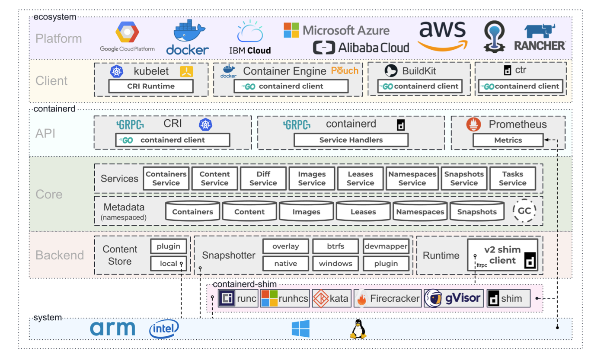

### More isolation is required 

- Linux kernel has 27.8 million lines of code 
- 319 native 64-bit syscalls in Linux x86_64
- Prevention of kernel bugs from untrusted userspace code 

- **Types of Exploits**
	- **System API**
		- Interface for interaction with the Host Kernel or Hypervisor with system calls and traps 
		- Bugs within the kernel/hypervisor can be exploited via the API 
	- **System ABI**
		- Hardware and software explotigs targeting execution path in response to events 
	- **Side Channels** 
		- Exploiting indirect effects of the system or hardware 

## gVisor 

- Open-source, secure-container runtime, developed by Google 
- Written in Go 
- Used in production in GCF and GCR 
- Minimize the system API attack vector 
- Sandboxed Host System API 
- Independent user-space application kernel 
- Support for docker/containerd
- Two modes ptrace/KVM 
- Support for x86_64, aarch64 

### gVisor Architecture 

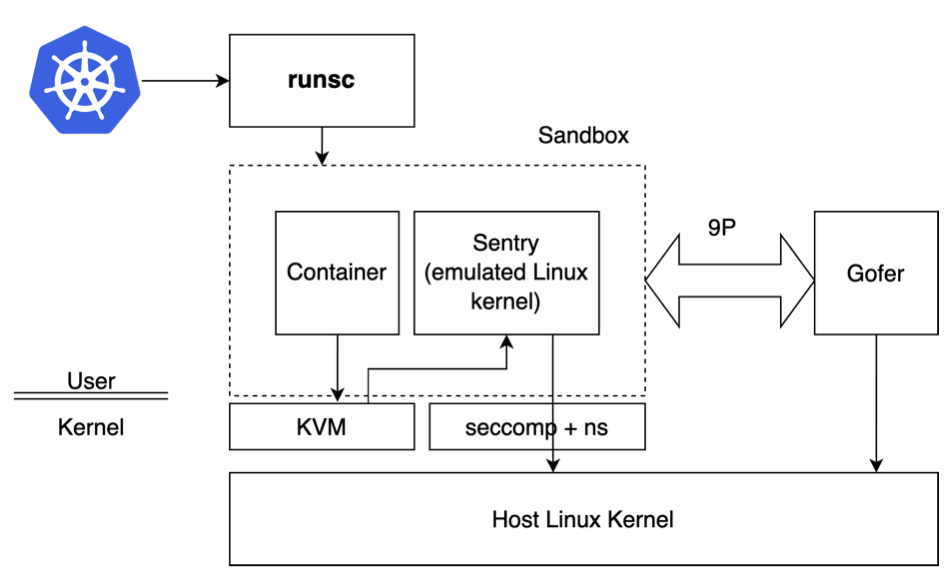

- Sentry intercepts the syscalls made by the application 
- Only few syscalls are made by the sentry to the host linux kernel 
- Seccomp profile for filtering allowed syscalls by the sentry 
- Access to filesystem via a separate process called gofer. 

- **Drawbacks**
	- Not well suited for syscall heavy workloads 
	- Not all syscalls are implemented 
	- Uses containerd-shim-v1 API, not high performant, it creates a daemon for every container in a pod which is running. 10 containers = 10 containerd-shim daemons attached to single four core containerd

	- in containerd-shim-v2 API, it only creates a daemon for a pod, does not matter how many containers running inside the pod. (More scalable)

> Note: First level of isolation is sentry, second level of isolation is seccomp profiler. 
> All file IO calls goes to gofer, legacy protocol ninty is used not performant. 

## AWS Firecracker 

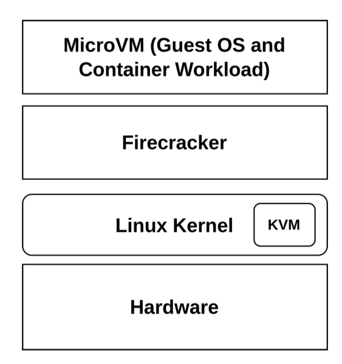

- VMM that uses KVM to create and manage microVMs 
- Specifically designed for serverless computing
- No need for monitoring like qemu since everything is stateless.
- Implemented in Rust 
- Minimalist design
- Enchanced security and workload isolation over traditional VMs
- Reduced startup time and memory footprint 
- Open-source 
- Integration with container ecosystem: 
	- firecracker-containerd 
	- kata containers 

- Used in AWS Lambda and AWS Fargate 

### Firecracker Architecture 

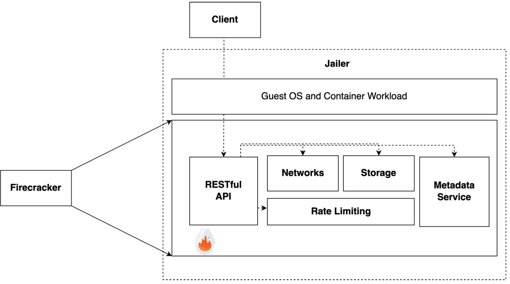

## Kata Containers

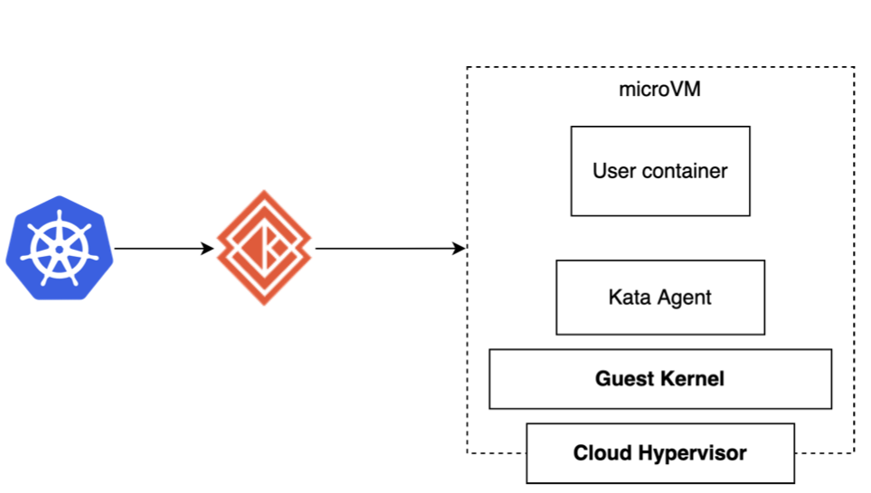

- OpenStack Foundation Project 
- Secure and isolated containers with a seperate kernel 
- OCI compliant

Kata Agent: (v2)
	- Implemented in Rust
	- One per VM 
	- Managing user containers and their workloads 
Cloud Hypervisor: 
	- Lightweight VMM based on the Rust VMM project 
	- Minimal design 

Implements containerd-shim-v2:
	- One shim daemon per pod 

- Supports pulling container images directly in the VM 

## WebAssembly 

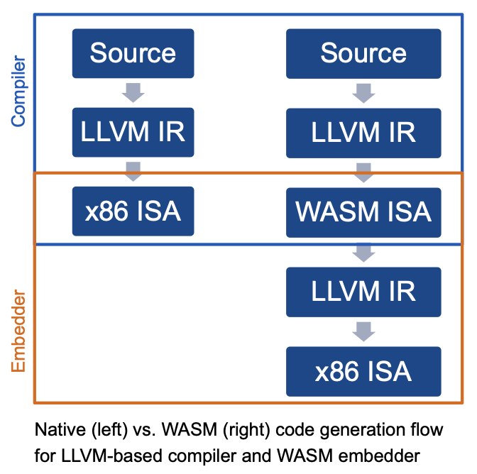

- Binary format, with alternative human-readable text representation
- Virtual ISA
- Linear 32-bit memory space  (4 gb of memory)
- Isolated from host by default 
- Import/export system for granting capabilities 

### Webassembly Module 

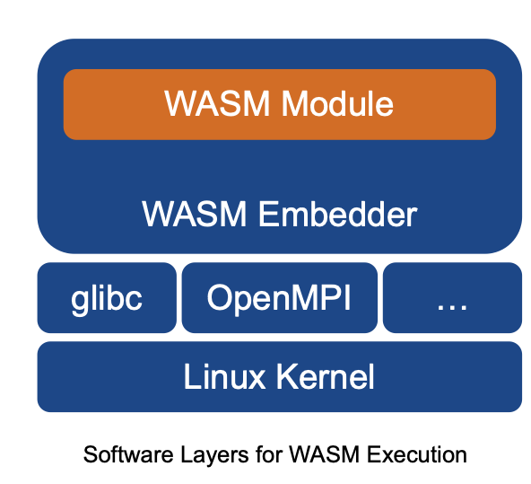

- Application code as WASM ISA
- Defines functions, globals, memories, imports, exports, static data 
- Instantiated by an embedder 
- Portable
- WASM equivalent to ELF  / Mach-O / PE

### Webassembly Embedder

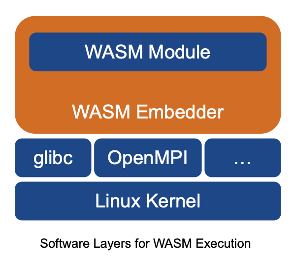

- Parses WASM modules and executes the application code
- Execution strategies
	- Interpreter (Blockchain Smart Contracts, Browser)
	- JIT (Browser, Standalone)
	- AOT (Standalone)
- Provides implementations for module imports 
- Manages module memory space 
- Not portable 
- Links against native libraries
- System Interactions through WASI 
- Isolation 
	- Software Fault Isolation
	- Control Flow Integrity 

## Krustlet 

- Enables running WebAssembly workloads natively on Kubernetes 
- Implements the kubelet API 
- Runs as a kubelet on Kubernetes worker nodes 
- Accepts wasm32-wasi workloads
- Uses wasmtime (ByteCodeAlliance) as the embedder 
- Pulls wasm modules from an OCI compatible registry 
	- wasm-to-oci project 
	- similar to docker hub 

## Runtime Classes In Kubernetes 

- Feature for selecting container runtime configuration 
- Container runtime configuration is used to run a Pod's containers 
- With the help of containerd out-of-the-box support gor Gvisor, Firecracker, Kata containers ...

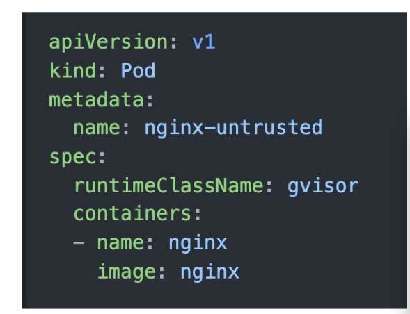

## Knative 

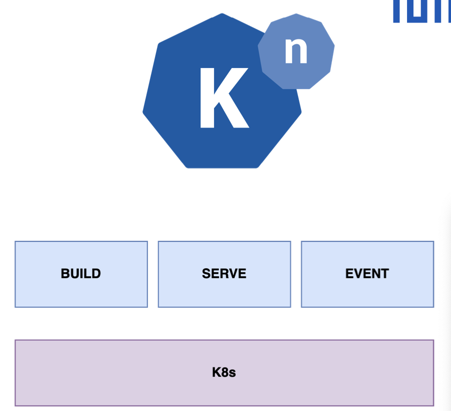

- Platform which deploys on top of k8s 
- Three main components  : Build, Serve, Event 
- Build provides k8s-style resources for declaring CI/CD-style pipelines 
- k8s + knative serving > serverless 
- Knative eventing enables event-driven architecture for applications, e.g producer/consumer 

### Knative Serving 

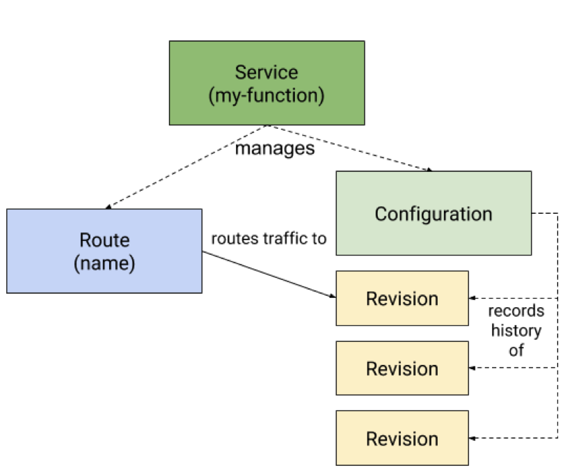

- Provides scale-to-zero, request-driven functionality 
- Defines four objects as CRDs 
- Default autoscaling provided by Knative Pod Autoscaler 
	- Supported metrics concurrency, rps 
- Possible to configure HPA (Horizontal Pod Autoscaling)
- Used in GCR, IBM Code Engine, Red Hat Openshift.

### Knative Service 

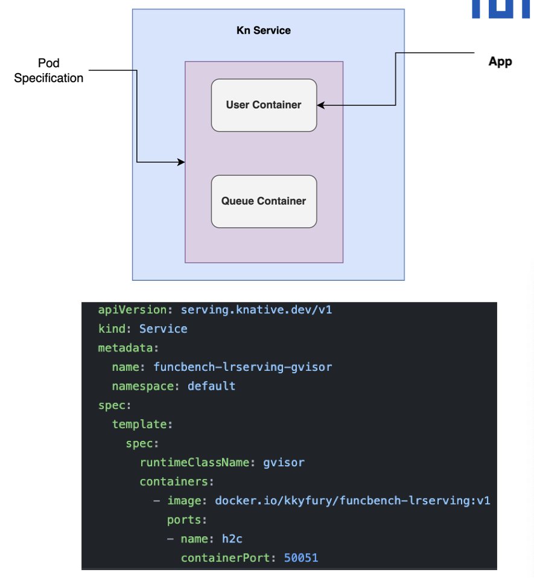

- Knative injects queue container into the pod specification on deployment 
- Reverse proxy to the user container 
- Intercepts all requests to the user container 
- Responsible for collecting and reporting statistics to KPA 
- Deployment using YAML files or CLI called kn. 

