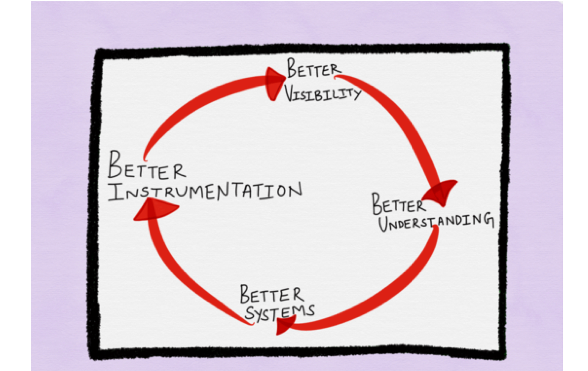
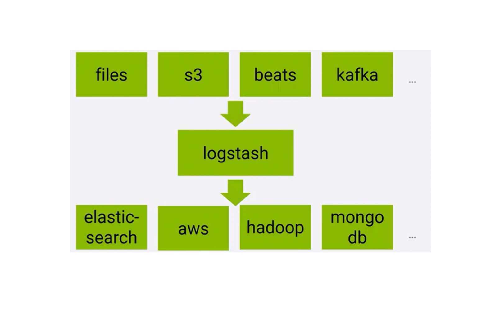
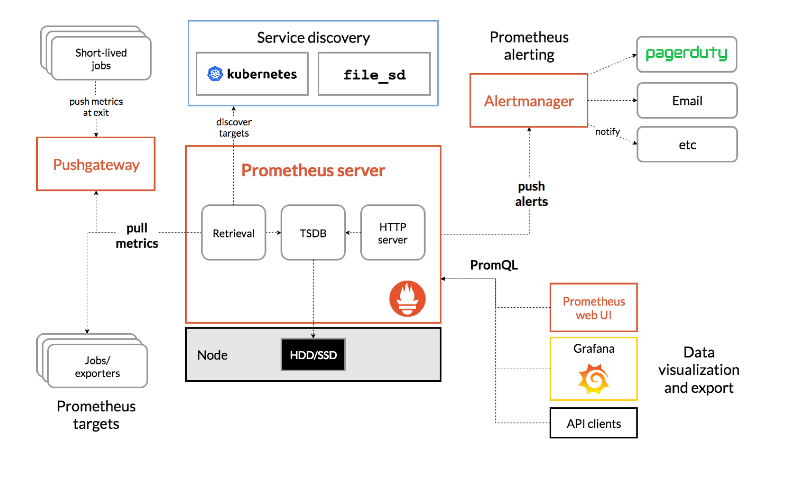

# Cloud Monitoring 

- **Monitoring**

-  Monitoring in the cloud is the process of collecting status information of applications and resources
- The data can be used to observe application and insfrastructure

- **Monitoring System**

- It consists of all compoenents for gathering monitoring data at runtime. 

- **Monitoring Data** 

- All (raw) data captured by the monitoring system

## Information 

- **Definition**

    - Information is gained by processig, interpreting, organizing and visualizing raw data. It increases the knowledge. 

- **Example**

    - Raw data are CPU and memory utilization
    - Information is that there is a trend for an overload

- **Required information is not always clear in the Cloud**

    - Collecy any data available

- **Proactively creating information**
    - Continuous analysis for triggering alarms or to give an overview of the status of the system. 

- **Reactively**
    - Triggered through events such as an incident
    - E.g root cause analysis and autoscaling

## Purposes 

- **Infrastructure level**

 - Resource management
 - Incident detection
 - Root cause analysis 
 - Accounting or metering for payment
 - Intrusion detection
 - Auditing 

- **Application level**

 - Performance analysis 
 - Resource management, e.g scaling decisions 
 - Failure detection and resolution
 - SLA verification 
 - Auditing

## Target system 

| **Parallel System**                          | **Cloud**                                                           |
|----------------------------------------------|---------------------------------------------------------------------|
| Batch system                                 | Interactive system                                                  |
| Data are collected during an application run | Data are continuously produced- Realtime Data                       |
| Execution is reproducable                    | Realtime analysis                                                   |
|                                              | Data used for    - Immediate action    - Study past system behavior |

## Three pillars of Monitoring

- ### Metrics 
- ### Logs 
- ### Traces

## Monitoring Data 

- Raw data
    - **Metric**: execution time 
        - Semantics 
        - Unit
    - **Context:** server, application service, ... 
    - **Representation**
    - **Aggregation:** sum, min, max, mean, percentiles, histogram
    - **Measurement frequency**: every second, minute, 5 minutes

## Important Metrics 

- **Latency**
    - The time it takes to service a request
    - Selectively measure successful and error request 
- **Throughput or Traffic**
    - Web service: requests/second
    - Streaming system: network I/O rate or concurrent sessions
    - Database: transactions/second or retrievals per second

- **Error rate**
    - Rate of requests that fail. Explicilty (HTTP 500), implicitly (wrong reply contents), or by violating an SLA. 

- **Utilization or saturation**
    - Percentage of capacity
    - CPU, memory, I/O 

## Monitoring and Cloud Layers

|                                                       	| **Context**                   	| **Metric**  _Aggregation: no, min, max, mean, percentile_                                      	| **Purpose**                                   	|
|-------------------------------------------------------	|-------------------------------	|------------------------------------------------------------------------------------------------	|-----------------------------------------------	|
| **Client** _Request_                                  	| Request type                  	| #requests, latency, Availability                                                               	| SLA check  Alerting                           	|
| **Application** _Microservices_                       	| Service name  Service id      	| #requests, request rate Latency, # replicas, CPU time, memory usage                            	| Autoscaling Performance tuning                	|
| **Platform** _Kubernetes_ _Docker_                    	| Container id                  	| CPU & memory quota, utilization,  incoming & outgoing bytes                                    	| Container distribution Autoscaling VM cluster 	|
| **Infrastructure** _VM, volumes_ _Queuening services_ 	| VM id, volume id Service name 	| CPU & memory, # read/write, I/O latency # requests size of requests of infrastructure service  	| Root cause analysis                           	|
| **Hardware** _Servers, network_ _SAN, disks_          	| Server id, switch id          	| Disk utilization,  traffic                                                                     	| Management of VMs                             	|

## Monitoring system requirements 

- **Compherensive**
- **Low intrusion**
- **Extensibility**
- **Scalability** 
- **Elasticity**
- **Accuracy** 
- **Resilience**

## Blackbox and Whitebox Monitoring 

- **Blackbox Monitoring**

- The monitored system is handled as a block box 
- No data are gained from the inside of the system 
- E.g only the request interface of a service is visible nothing about the internal structure 

- **Whitebox Monitoring**

- Data is also from the inside of the system 
- This gives more context and more detailed insights 
- E.g internal organization of a service is visible, e.g asynchronous internal handling of requests. 

## Overheads 

- **Overheads lead to inrusion**
- **Lot of reasons for overheads**
    - Instrumentation 
    - Computation for aggregations
    - Memory overhead for buffering 
    - Time to push to disk or transfer to collector 
    - Storage overhead for long-term storage 

- **Reduction techniques**

    - Number of metrics
    - Measurement frequency
    - Representation 
    - Batching 
    - Sampling 
    - Long-term coarsening

## Logs 

- Definition log
 - A log is a sequence of immutable records of discrete events 

- **Event logs come in three forms**

    - Plaintext - most common format of logs 
    - Structured - much evangelizzed, typically JSON
    - Binary  - think logs in the Protobuf format 

- **Typically detailed**
    - Logging can be configured to levels
    - Allow to drill down 
    - Difficult to analyze

## ELK stack 

- Elastic search 
- Logstash 
- Kibana

### Elastic Stack 

- ELK + Beats and X-Pack 

### Logstash

- Parsing, transforms and filters 
- Derive structure 
- Anonymize personal data 
- geo-location lookups 

### X-Pack 

- Extensions to ELK 

    - Authentication and authorization
    - Monitor ELK 
    - Alerting 
    - Report generation of Kibana contents 
    - Machine learning, e.g anomaly detection and forecasting
    - SQL interface for elastic search 

### Beats 

- Agents to collect data 
- Filebeat for logs 
- Metricbeat for metrics 
- Heartbeat for health

- Elastic stack also provides integrations for data injection for major systems. 

## Prometheus for Metrics 

- **Prometheus is an open source monitoring system**
- **Feaures**
    - Metric collectino in form of time series 
    - Storage by a time series database 
    - Query language for accssing the time series
    - Alerting 
    - Visualization

## Cloud Native Computing Foundation

 - Promotes the concept of Cloud Native Computing 
 - Pushes for a sustainable ecosystem for Cloud Native Computing
 - Hosts several fast-growing open source projects including Kubernetes 
 - Runs CloudNativeCon
    - Europe 2022
    - KubeCon and CloudNativeConn
    - May 16-20 
- CNCF.io 

## Prometheus Architecture 

## Prometheus Scraping 

- Metrics retrieved through /metrics endpoint 
- **Metric types**
    - **Counter**: cumulative metric monotonically increasing 
    - **Gauage**: numerical value arbitrarily going up and down 
    - **Histogram**: counts for buckets, total sum, number of events
- **Metric has**
    - Name 
    - Labels giving the context 
- **Metric name and labels define a time series** 
    - e.g *api_http_requests_total{method="POST", handler="/messages"}*
    - samples are a float64 value plus a millisecond timestamp

