# L5- Application Elasticity

Native Cloud Applications are scalable; capacity can grow to very large workflows. 

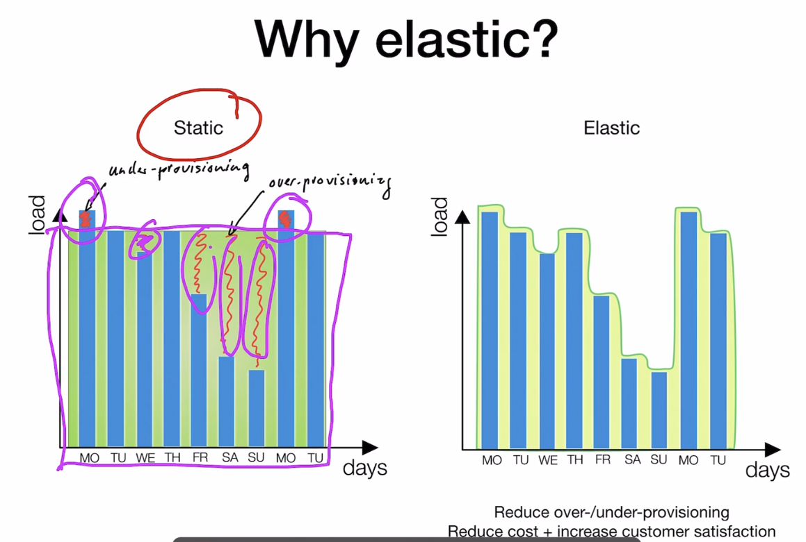

## Resource Requirements of Applications 

- **Resources**
    - CPU Time 
    - Memory 
    - Disk 
    - Network 

- **Resouce requirements**
    - Constant
    - Dynamic 

- **Application examples**
    - Desktop
    - HPC
    - Banking Software 
    - Web applications  

## Dynamic Resource Requirements 

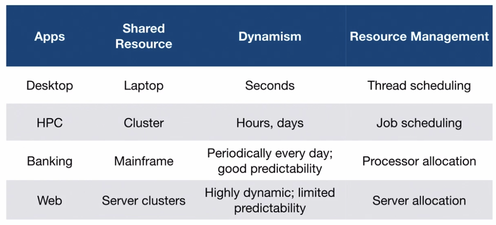

## Scalability

- More resources
    - More performance (Individual requests handled faster & Decreased latency)
    - Ability to handle more workload in the same time. (Increased throughput)

**Scalability Limit** 

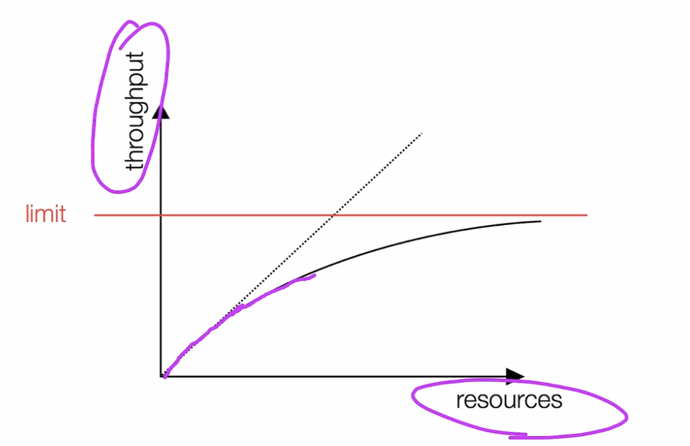

- Limit is the upper bound.
- Sequencual parts dominates paralel part of the program. 
- When there is no parallel execution, still there might be some shared resource. 

- **Scalability of applications**
    - Characteristic of an application to increase its capacity (throughput) with the amount of resources

- **Capacity of an application depends on**
    - Available resource capacities
    - Application design 

- **Scalability Limits**
    - Maximum application capacity 
    - Throughput can be limited by maximum resource capacities and/or by the application design. 

- **Application with poor or low scalability**

    - Low scalability limit 
    - Significant drop in efficiency

## Application scaling 

- **Adding more resources leads to more performance**
    - Performance can be time, work/time, throughput

    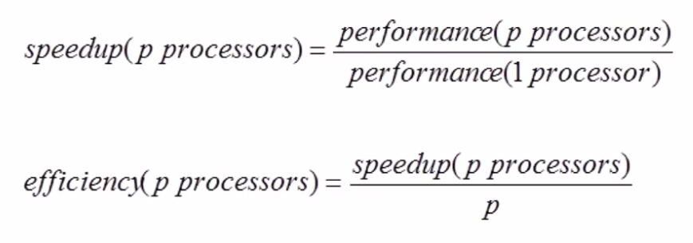

## Efficiency

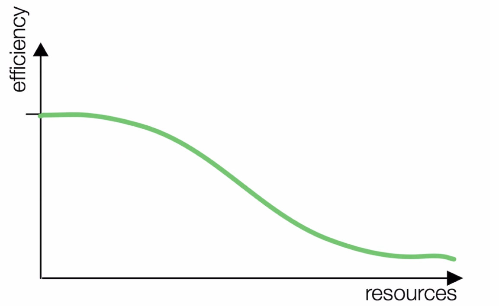

**Elasticity of applications**

- **Elasticity**
    - Dynamic adaptation of the capacity to a change in the workload 
    - No shutdown/restart required
    - Shrink capacity, if workload decreases
    - Increase capacity, if workload increases 

**Capacity planning in traditional IT**

- Goal: Plan the reosurces to avoid under-provisioning
- Accepting high costs due to over-provisioning
- No elasticity, planning period years 

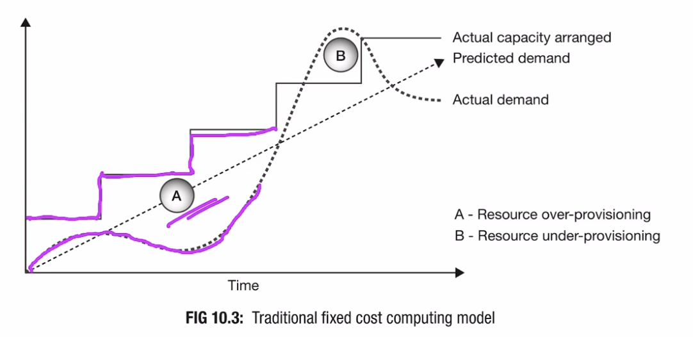

**Capacity planning in the Cloud**

- Goals: 
    - Avoid under- and over-provisioning to increase business success and reduce costs 
- **Possible due to dynamic resource management and pay-per-use cost model**
- High elasticity

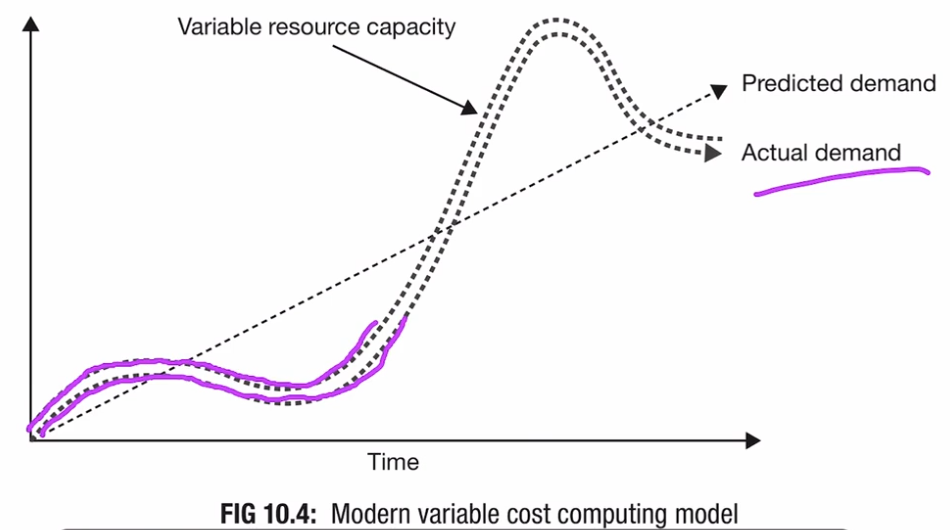

## Application Architecture 

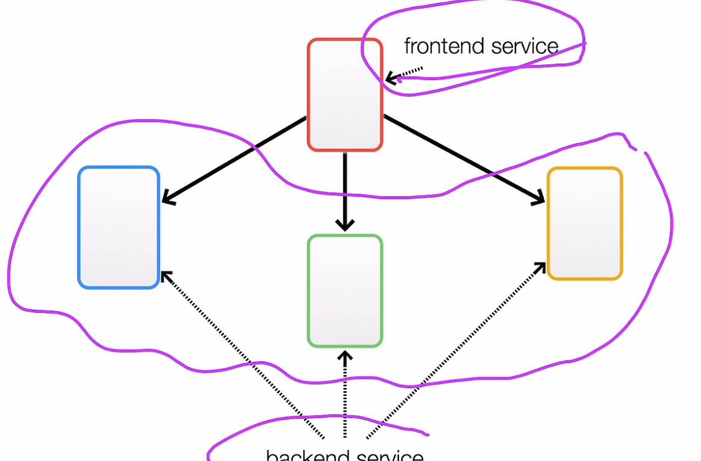

## Vertical Scaling - Scaling up 

- Increase capacity of a single service instance by increasing its resources 
    - Increase CPU time percentage 
    - Increase clock frequency
    - More cores 

- Advantage 
    - No change in the service required. 

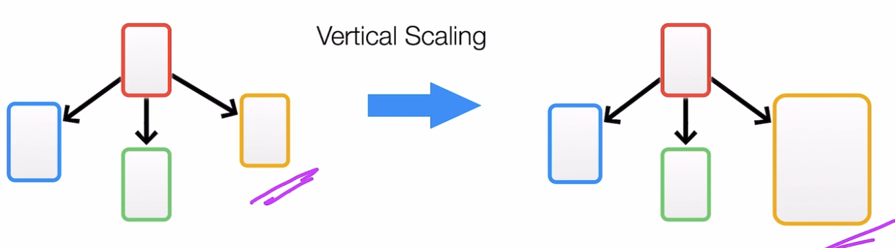

- **Replace existing resources with more powerful resources**

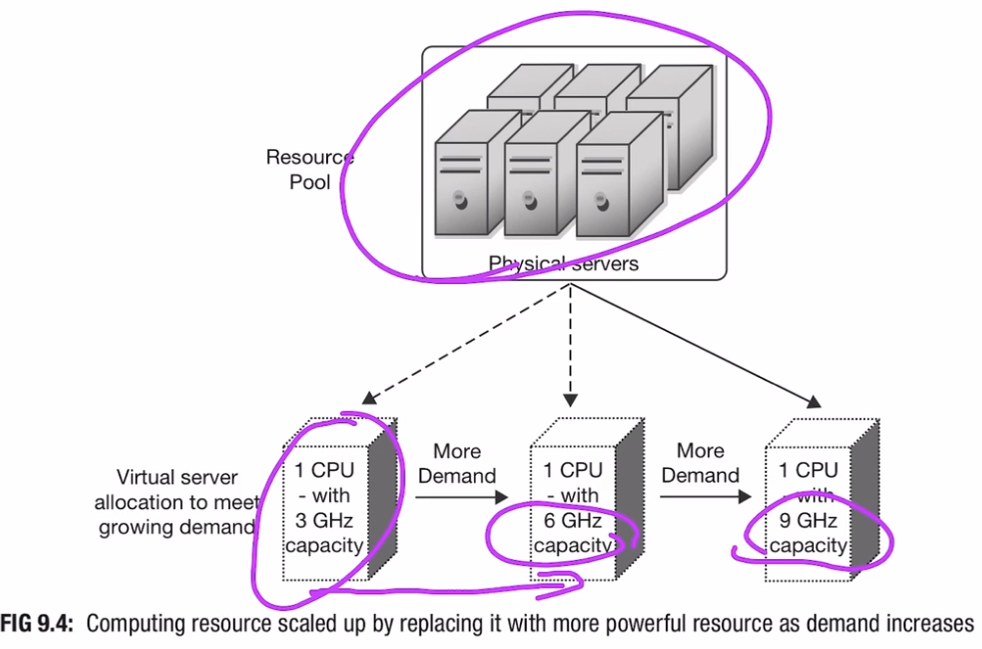

- **Advantages**

    - It is easy to replace a resource with a more powerfuil resource 
    - It does not require a re-design of the application 

- **Disadvantages**
    - More powerful resource might be too expensive 
    - Resource capacity is limited 
    - Replacement of resource causes service interruption

## Horizontal Scaling - Scaling out 

- Capacity increase of service by creating more instances 
    - Assumption: Each service instance comes with own resources

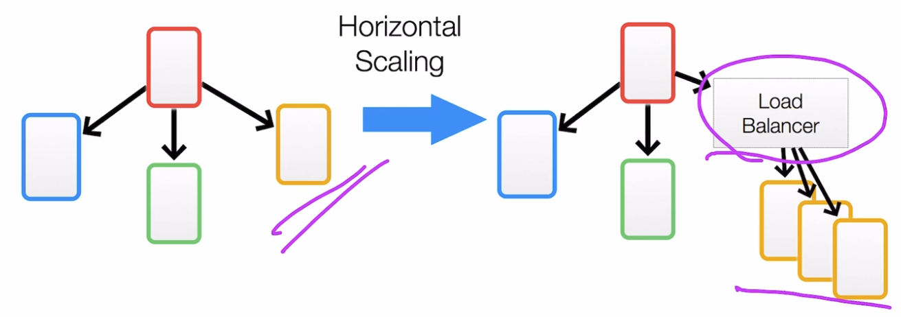

- **Increase the amount of resources**

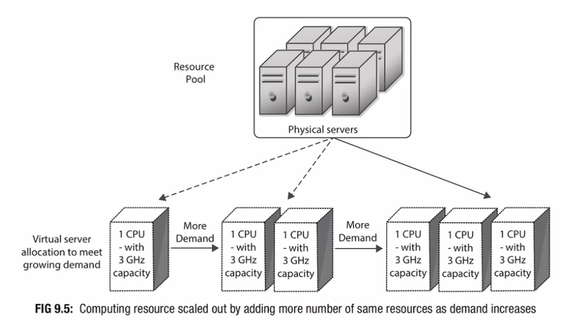

- **Advantages**
    - Scaling through adding more resources 
    - No requirement for more powerful hardware 

- **Disadvantages**
    - Increased amount of resources comes with more management overhead 
    - Horizontal scaling requires a distributed software architecture 

## Comparison horizontal and vertical scaling 

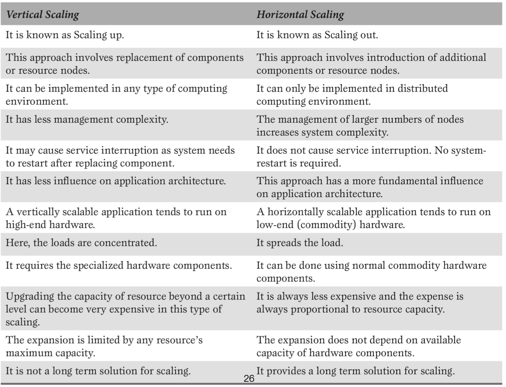

## Autoscaling 

- **Autoscaling**
    - Automatically scale an application to meet the service level objectives under a varying workload while minimizing service costs. 

- **Service Level Objective (SLO)**
    - Latency of requests < latency threshold 
    - Failed request rate < failed request threshold 
    - Service availability > availability threshold 

- **Service Level Agreement (SLA)**
    - Contract specifying SLOs
    - Fines 

- **Costs**
    - #VMs, storage, network traffic, I/O traffic

## Autoscaling System 

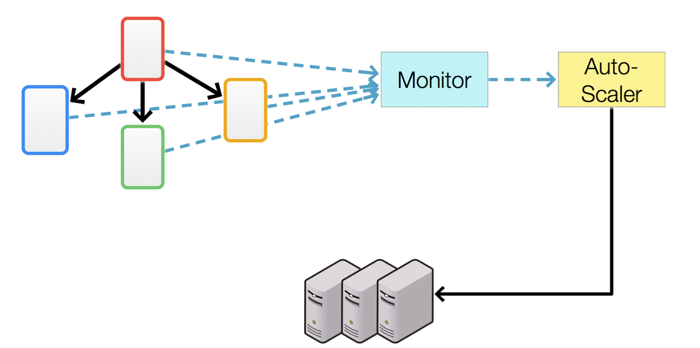

## Autoscaling Policy 

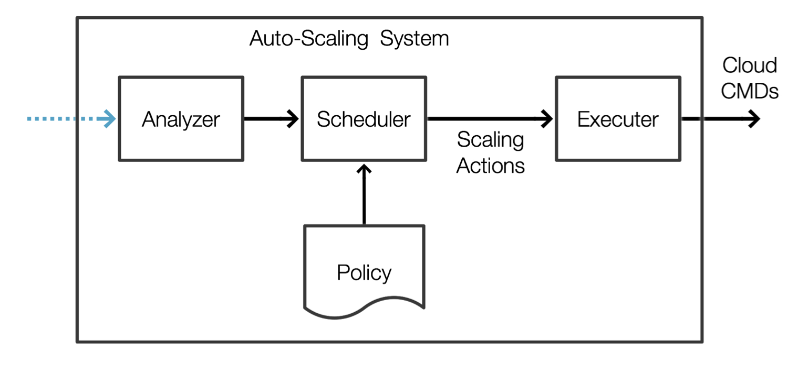

## Autoscaling Approaches 

- **Reactive**
    - Detect under-/overloaded service 
    - Scale in/out or down/up according to policy 

- **Scheduled**
    - Policy specifies scaling events (time stamped scaling actions)
    - Apply scaling actions at appropriate time 

- **Predictive**
    - Continuously predict future workload 
    - If workload will charge, schedule scaling actions ahead in time. 
    - Goals 
        - Circumvent scaling latency
        - Enable more time consuming scaling decisions 

## Resource and Service Centric Auto-Scalers 

- **Resource centric**
    - Scaling actions modify resources 
    - Services are implicitly adapted 

- **Service centric**
    - Scaling actions modify #service instances 
    - Resources are implicitly adapted

## AWS Reactive Autoscaling 

- **Resource centric**
    - Scaling of #VMs 
- **Launch template**
    - ID of the Amazon Machine Image( AMI )
    - Instance type 
    - Key pair, security groups, and other parameters used to launch EC2 instances 
- **AWS Auto Scaling Group** 
    - Set of VMs with same launch template 
    - Determines a target #VMs. Restart in case of failures 
        - Instances can be on-demand and spot instances 
    - Defines min, max, desired #VMs 
        - Scheduled actions to redefine those 
    - Set of scaling policies 
    - Optionally a load balancer 

## AWS Scaling Policies 

- **Target tracking scaling**
    - Utilization metric that drops with more resources 
    - Specification of target value 
    - Automatically adjust resources to meet target 

- **Simple Scaling**
    - Trigger based on: metric, threshold, condition
    - E.g metric >= threshold 
        - +/- #VMs 
        - Change to #VMs 
        - +/- percent of #VMs 

- **Step Scaling**
    - Depends on amount of breach 
    - Specify metric, threshold, steps based on amount 
        - +0% ... +10%: 0%
        - +10% ... +20%: 10%
        - +20% ... +infinity: 30%
        - 0% ... -infinity: 10 %

- **Policies have a cooldown period specification**
    - Only after this time, breaches are handled again. 

## Predictive Autoscaling 

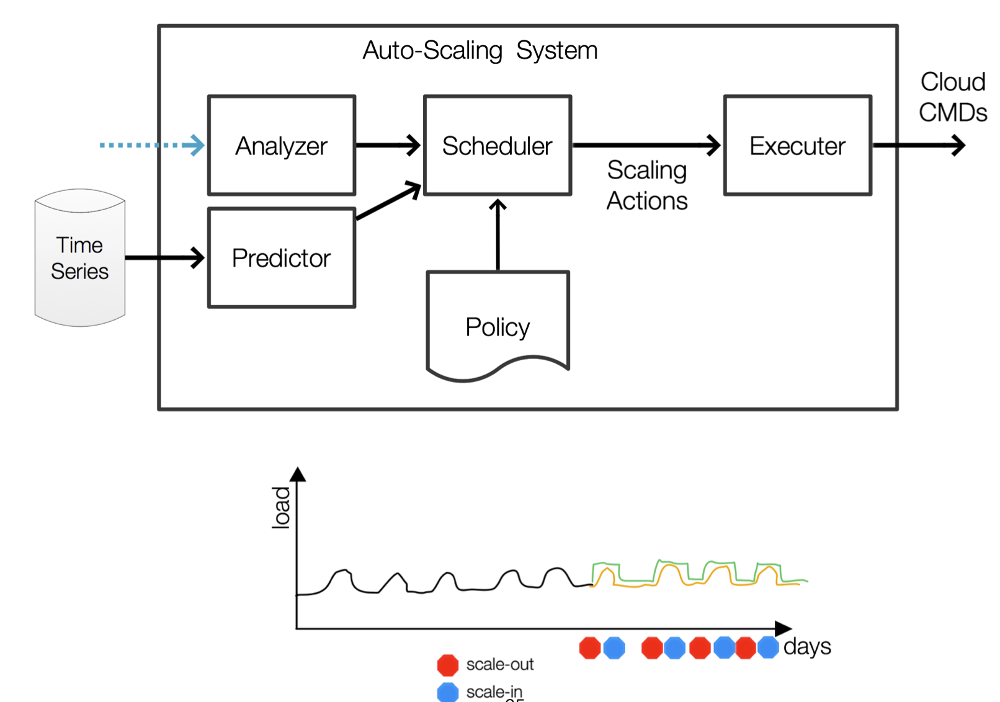

## AWS Predictive Autoscaling 

**Determines proactively minimum of auto scaling group**
- Supported metrics 
    - CPU utilization 
    - Network in/out 
    - Custom metric with aggregation method over VMs 
- Threshold value 
- Forecast update period 
- Cool down time 

- **Forecast only mode vs forecast and scale mode** 

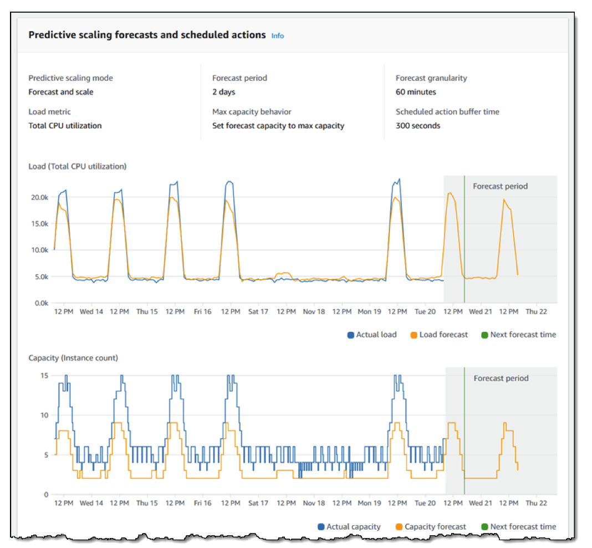

## Load balancing 

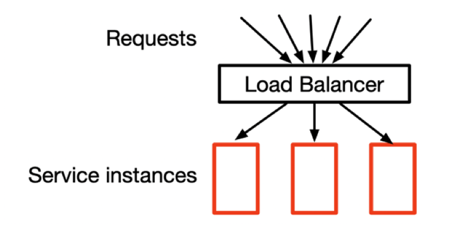

- **Important in case of multiple service instances**
- **Scaling out**
    - Works only if all replicas are equally busy 
    - Load balancer required to distribute requests 

- **Goals**

    - Efficient utilization of a set of resources 
    - Exploit aggregated capacity of replicas to reduce response time and failure rates 
    - Increase availability 
        - LB performs periodic health checks 
        - Stops accessing faulty replicas 
        - Restart faulty replicas 

- **Enables non-disruptive management**
    - In case of provisioning and de-provisioning of resources 
- **Implementation**
    - Hardware: Multi-level switches 
    - Software 

## Multi-layer Load balancing 

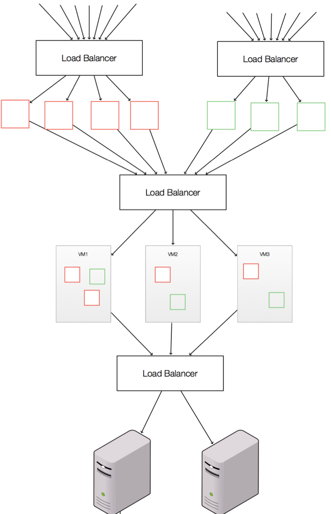

- **Layers**
    - Different Goals
    - Interaction 

- **Strategies**
    - Preemptive vs non-preemptive
    - Static vs dynamic 

- **Scalability**

## Static vs Dynamic Load Balancing

- **Static**
    - No feedback 
    - E.g (weighted) round robin 
- **Dynamic**
    - Feedback on the status

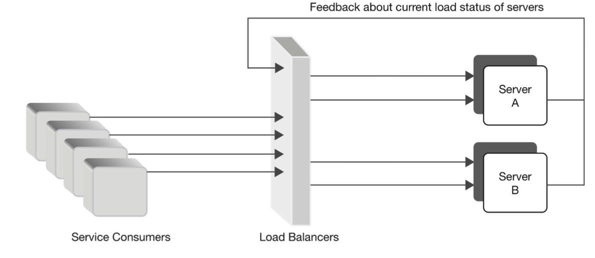

## Dynamic Load Balancing 

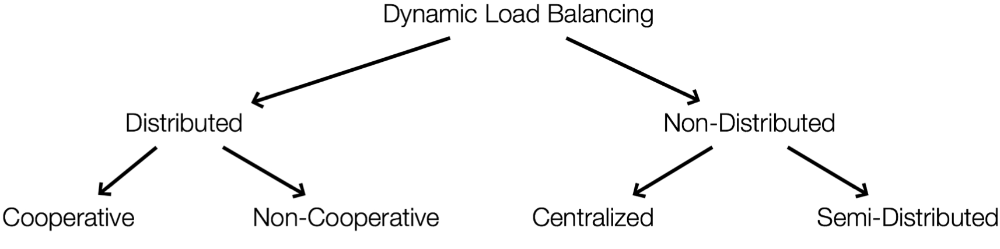

- **Distributed:** Nodes collaborate
- **Cooperative:** ... have the same goal 
- **Non-Cooperative:** ... different goals 
- **Centralized:** one central LB 
- **Semi-distributed:** Nodes are partitioned and one LB responsible for partition 

## Approaches for web applications 

- **Round-robin DNS**
    - Domain name mapped to multiple IP addresses
    - IP addresses are given to clients in a round-robin fashion. (Valid for a certain time)
- **DNS delegation**
    - Structure domain (in.tum.de) into two zones
    - Each zone has its own name server 
    - DNS request is forwarded (delegated) to both zones 
    - The one resolving the address first wins the request 
- **Client-side random sampling**
    - Client receives a list of IP addresses 
    - It select randomly one to connect

- **Server-side load balancing**
    - LB receives requests at a given port and distributes them. 

## Session Persistance 

- **Situation**
    - Information must be kept over multiple requests(Sessions)
- **Handling sessions**
    - Stickiness: requests go to the same server 
    - Sharing of session data 
- **Characterization of session**
    - Client address 
    - Or cookies 

## Classes of LB Algorithms 

- **Class-aware**
    - Based on classification of requests into sensitive, best-effort, undesired 
    - E.g based on port numbers 

- **Content-aware**
    - Based on request content, e.g URL 
    - E.g directing similar requests to same server to exploit access to same information 

- **Client-aware**
    - Based on packet source 
    - Can improve performance as before 

##  Load Balancing Algorithms 
- **Round Robin and Weighted Round Robin**
    - Weight represents capability of server 
- **Least Connection and Weighed Least Connection** 
    - Distributes to server with the least number of active connections 
- **Resource Based** 
    - CPU Load of the servers is taken into account
- **Weighed Response Time** 
    - The response time for a health check is used to compute the weights. 
    
## AWS Elastic Load Balancing 

- **Distributes incoming traffic across the instances in the Auto Scaling Group** 
    - Can use load balancer metrics (request counts per target) for auto scaling 
    - Can use it for health checks 
- **Classic Load Balancer** 
    - Listeners checks client connection on a certain port (http, https, TCP) 
    - Distributes requests evenly across availability zones or evenly across all registered instances in the target group 

- **Application Load Balancer (VPC only, Application Layer)** 
    - Routes HTTP requests based on contents to specific target groups 
- **Network Load Balancer (VPC only, Transport Layer)** 
    - Forwards TCP packets for a certain part to a target group 
- **Gateway Load Balancer (VPC only, Transport and Network Layer)**
    - Forwards ingress traffic to network appliances, like intrusion detection or monitoring 
    - Forwards response traffic from network appliances to target after inspection.
