Refer following paper for more information
> [HSS+14] Martin Hirzel, Robert Soulé, Scott Schneider, Buğra Gedik, and Robert Grimm. 2014. A catalog of stream processing optimizations. ACM Comput. Surv. 46, 4, Article 46 (March 2014), 34 pages. DOI: https://doi-org.eaccess.ub.tum.de/10.1145/2528412

## Pattern Structure 

- Each optimization pattern in the paper is described w.r.t five dimensions: 

1. Example 
2. Profitability 
3. Safety
4. Variations
5. Dynamism 

## Basics

-  There are few assumptions, concepts and terms that are used throughout the following optimization patterns 
- We assume a disributed operator graph, where operators can be placed on different hosts/compute nodes 

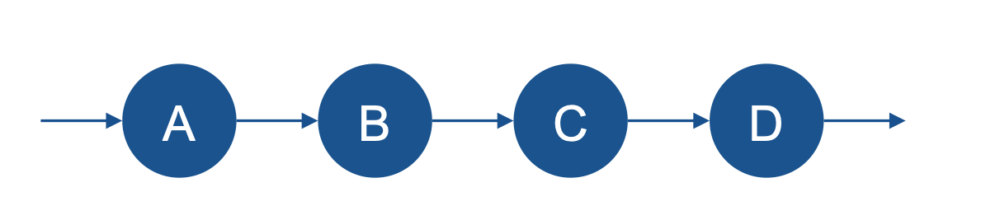

- Sometimes, it matters where these operators are placed, sometimes not 

**Important concepts**

- Stateless operator 
- Stateful operator 
- Operator selectivity 

## Stateless Operators

- A **stateless** operator processes incoming events independently
    - Event by event 
    - No state is maintained in the operator 
    - Same results regardless of the input order 
    > This does not mean the process is stateless, it means that there is no state for the events. 

- **Consequences**
    - No windowing - windowing brings context, ordering, state, etc. 
    - Stateless operators are: 
        - Commutative (= same results regardless of input order)
        - Trivially parallel (= easy to process input events in parallel threads or compute nodes)
- **Examples**
    - Filtering 
    - Event transformation, enrichment, etc. 

## Stateful Operators 

- A **stateful** operator processes incoming events with regard to a context
    - Previous events (e.g in a window )
    - Internal state is maintained in the operator (e.g a counter, sum, partial pattern match, etc)

- **Consequences**
    - Windowing is possible
    - Stateful operators are: 
        - Not commutative (in the general case)
        - Harder to execute in parallel (care has to taken about the internal state)

- **Examples**
    - Pattern matching (e.g SEQ(A;B;C))
    - Aggregation, moving average, etc. 

## Selectivity

- Selectivity tells how many events are in average emitted per ingested input event 
- Example: Selectivity 0.1 > Per 10 input events, the operator emits 1 output event 
- This tells us about the **event rates**  to be expected in the operator graph. 

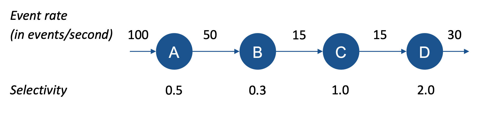

# Optimizations 

## Operator Re-ordering 

> Move selective operators upstream to filter data early

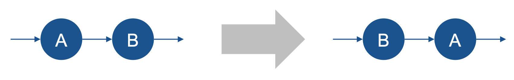

- **Example**
    - Operator A: Enrich data 
    - Operator B: Filter data 

- **Better to first filter, then enrich the remaining data !** 

### Profitability 

- Reordering is protifable if it moves selective operators before costly operators 
    - Selectivity: number of output events per input event 
    - Cost: How long it takes to process one input event 

**Example**

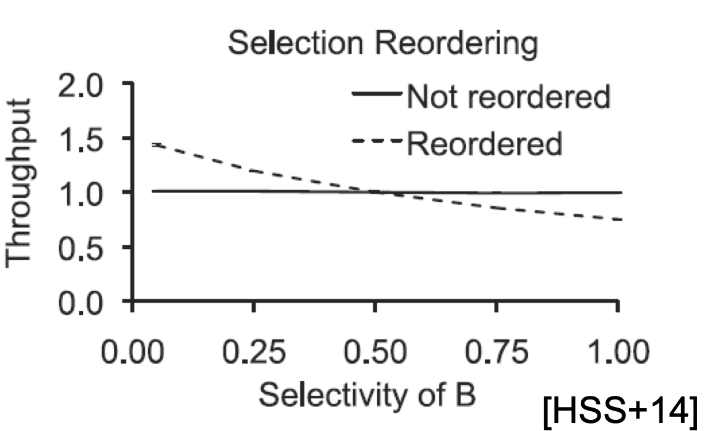

- Two operators A and B of equeal costs 
- Selectivity of A is fixed at 0.5 
- Selectivity of B varies (x-axis)

### Safety 

Operator reordering between operators A and B is safe under the following conditions:

1. **Attribute Availability**
    - Second operator B relies only on attributes of event that are already available before A 
    - Set of attributes that B reads is disjoint from set of attributes that A writes 

    - **Positive Example**
        - Operator A encriches temperature measurements with information about the corresponding room
        - Operator B filters events with a temperature value below 15 degrees Celcius 
        - **All attributes that operator B nneeds are already available before A processes the events**

    - **Negative Example**
        - Operator A: same as above
        - Operator B filters events that are in a specific room 
        - **The room attributes is only known after enrichment by operator A**

2. **Commutativity**

    - Result of executing B before A must be the same as when A before B 
    - **Automatically given if A and B are stateless**
    - There are also cases of commutative statul operators 

    - **Positive Example**
     - Enrichment and filtering, as exemplified above (operators are stateless)

    - **Negative Example**
        - Operator A computes a moving average of temperature measurements 
        - Operator B filters events whose temperature value is below 15 degrees Celcius
        - **If you filter before computing the average, you get different results**

## Dynamism 

- Optimal ordering of operators may depend on input data
    - Selectivity of operators dependent on input 
    - Cost of operators dependent on input 
    - Safety of reordering operators dependent on input 

- Dynamic ordering via the "Eddy" operator

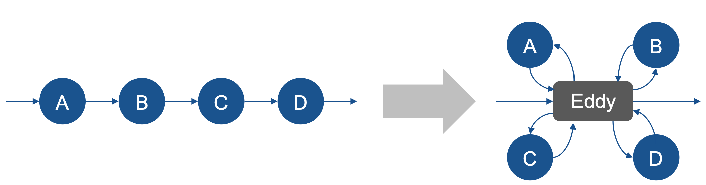

> Ron Avnur and Joseph M. Hellerstein. 2000. Eddies: continuously adaptive query processing. In Proceedings of the 2000 ACM SIGMOD international conference on Management of data (SIGMOD '00). ACM, New York, NY, USA, 261-272. DOI=http://dx.doi.org.eaccess.ub.tum.de/10.1145/342009.335420

## Redundancy Elimination 

> Eliminate redundant computations 

- **Example (telecommunication domain)**
    - Two event processing applications 
        - A -> B to calculate the costs of long-distance calls 
        - A -> C to perform quality of control based on dropped calls 
        - Operator A: Deduplication and enrichment of events -> A is shared by both applications ! 

- **Better to execute A only once !**

### Profitability 

- Profitable if resources are limited and the cost of redundant work is significant
- **Example**
    - Two applications share a CPU core, one with operators A->B, the other with A-> 
    - Total cost (sum of costs) of A, B and C is held constant
    - Chart shows effect of redundancy elimination with chaning fraction of cost of A 

- **If A causes (almost) all the cost, redundancy elimination will cut the total cost by 50 % as A is executed only once instead of twice**

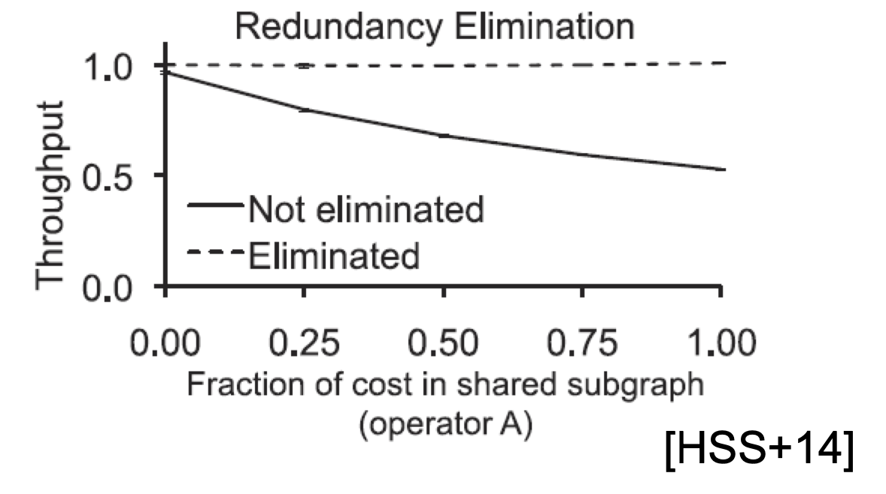

### Safety 

Redundancy elimination is safe under the following conditions:

1. **Same algorithm**
    - Redundant operation must perform an equivalent computation
    - Sufficient condition: Operators (both A's) have identical code
    - Alternative: Equivalence based on algebra (dependent on query language)

    - **Positive Example**
        - Upper operator A implements a filter that detects condition (X and Y), 
        lower operator A implements a filter that detects condition (Y and X )
        - **both A's are equivalent** 

2. **Combinable State**
    - Redundant operators must be combinable  -> a problem of internal state
        - Sufficient condition: Stateless operators 
        - For stateful operators, more care is needed

    - **Positive Example**
        - Operator A enriches incoming events with additional information 
        - **--> stateless operator**
    
    - **Negative Example**
        - Operator A implements a simple event counter
        - **counter on combined stream differs from separate counters on sub-sets of the stream**

## Operator Separation

> Separate operators into smaller computational steps 

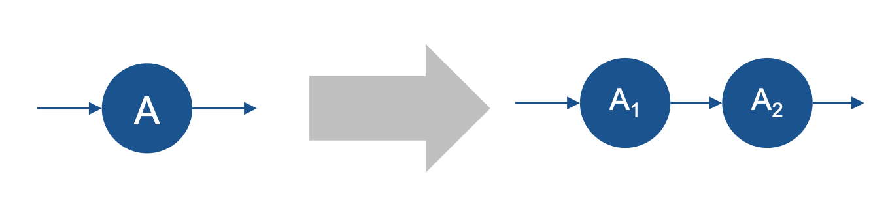

**Example**
    - Operator A has two filter conditions 
    - Separate them into two different operators A_1 and A_2

-  **This is an enabling optimization: After separation, other optimizations can be applied:**
    - Operator reordering
    - Fission / Data parallelism 
    - Pipelining 

### Safety 

Operation separation is safe, if the combination of the separated operators is equivalent to the original operator: 

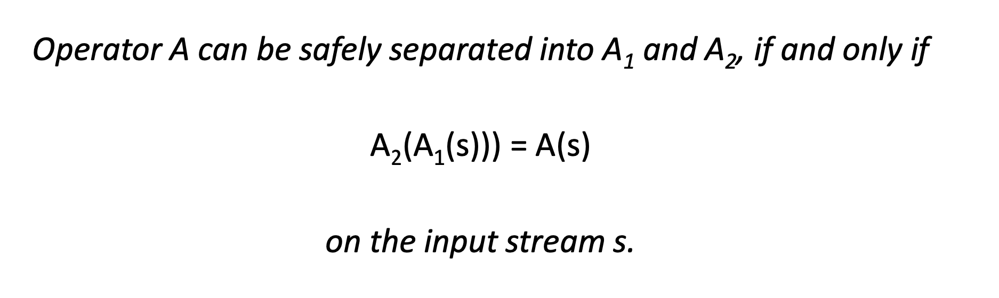

## Fusion

> Avoid the overhead of data serialization and transport

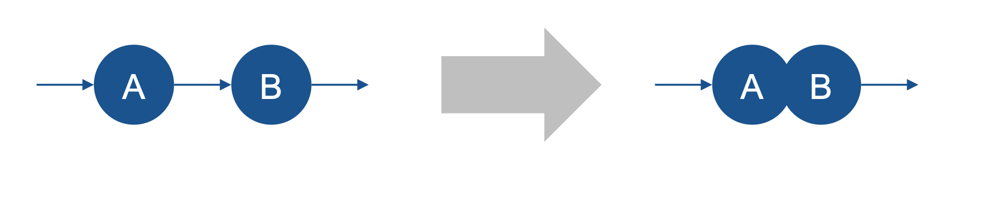

**Example: Security application**

- Operator A parses log messages 
- Operator B filters out log messages that are irrelevant for security breach detection 
- B is lightweight compared to the cost of transferring an event from A to B 

**Fusing A and B prevents the unnecessary data transfer !** 

- Combine them together, since B is very cheap.

### Profitability 

- Fusion trades communication cost against pipeline parallelism
    - When two operators are fused, communication between them is cheaper 
    - But without fusion, they can have pipeline parallelism 

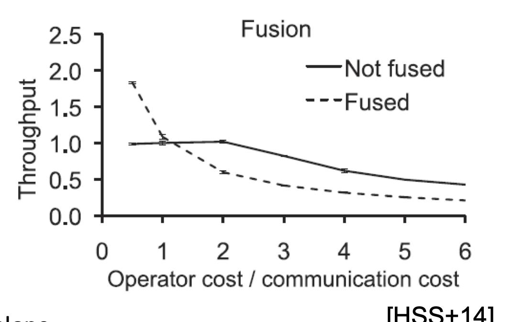

- Chart shows throughput given two operators of equal cost
    - **Nonfused case**
        - If operator cost < communication cost, 
        throughput is bounded by comm. cost 
        - Else, it is determined by operator cost 

    - **Fused case**
        - Performance is determined by operator cost alone 
        - Fused operator is 2x as expensive as each individual operator (lack of pipelining)
        - Break-even pointer -> When operator cost equals communication cost

### Safety 

Function is safe under the following conditions: 

1. Required resource kinds are available on the same host (accesses files, specialized hardware, etc)
2. Required resource amounts are available on the same host
3. Avoid infinite recursion 

- **danger when fusing cyclic operator graphs into local function calls**

## Fission (a.k.a Data Parallelism)

> Parallelize computations

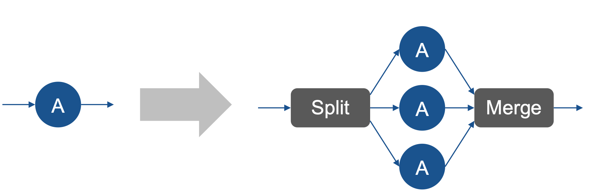

**Example**

- Streaming work-count on window
- Split by first character, count on parallel instances of A 
- Merger: Compute top-k words 

### Profitability 

- Fission is profitable if the replicated operator is a **bottleneck in the operator graph**
- Split and Merge induce additional overhead, which must be lower than the cost of the replicated operator itself 

- **p/s/o:**
    - p: cost of parallel part (parallelized operator)
    - s: cost of sequential part of the operator graph
    - o: overhead of fission (parallelized operator)

- 1/1/0: Paralllel and sequential part of operator graph have same cost, overhead is 0
- 1/0/1: Fission has to overcome an initial overhead
- 1/0/0: Fission is profitable right away 

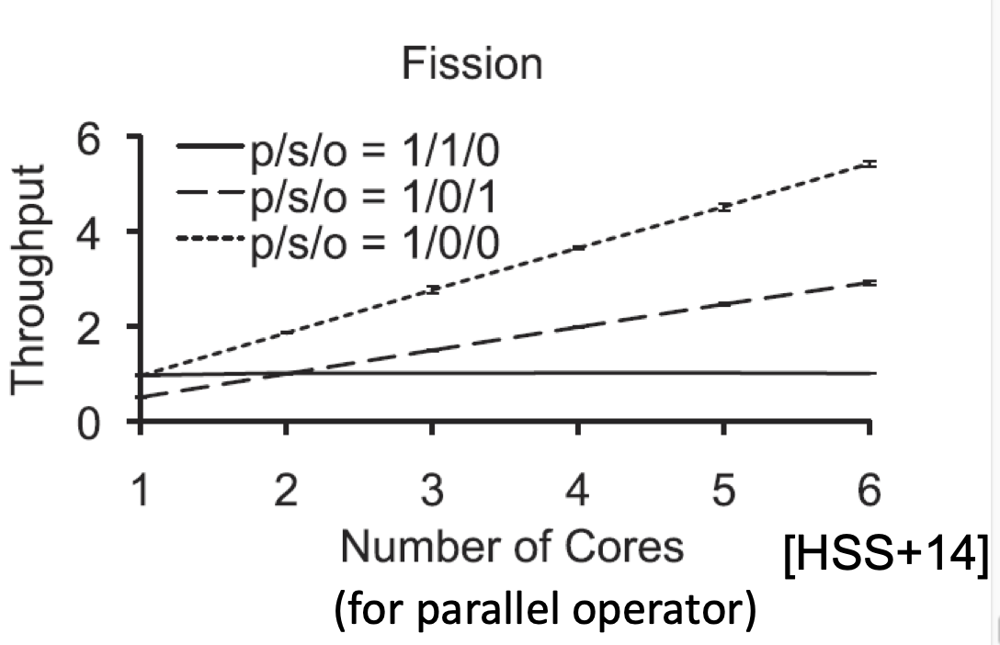

**These results correspond to Amdahl's low** (the achievable speedup is limited by the sequential part of an operation)

### Safety 

- **Stateful operators: State must be kept disjoint or synchronized**
    - Partitioned state: key-partitioned, window-partitioned, pane-partitioned
    - Synchronization of shared state using locks

- **Avoid deadlocks in synchronization**
    - One operator instance waits for a lock while another (holding the lock) waits for an event on the stream (*Move communication out of the critical section*)

- **Avoid deadlock at in-order merge:** Split cannot send data (buffers full), merge cannot receive data (an input channel is empty)

- **Send periodic dummy messages**

## Placement 

> Assign operators to hosts and cores 

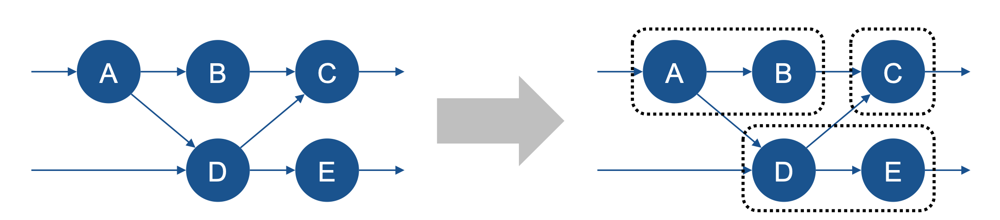

**Example**

- A is expensive, B is cheap and has low selectivity ( -> reduces output data rate)
- C is also expensive 

> B cann be placed with AB or BC, however B has low selectivity it reduces the output rate that's why it is more logical to place B with A. This way we send less via network. 

- **Place A and C on distinct hosts. Place B together with A**

### Profitability

- Placement trades communication resource utilization
- Operators placed on the same host compete for common resources 

**Example: Two operators competing for disk I/O**

- If communication cost (network) between the operators is low, they do not benefit from colocation. 
- If communcation cost is high, the benefit from avoided network communication outweighs the cost of competition on disk I/O

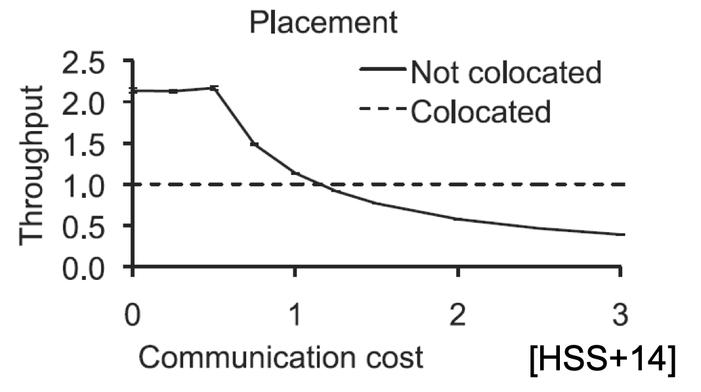

### Safety 

1. Required resource kinds are available on the host where an operator is placed
2. Required resource amounts are available on the host where an operator is placed
3. Obey other **restrictions** on operator placement:
    - security restrictions (certain operators can only run on trusted hosts)
    - licensing restrictions (software package can only be installed on a certain number of hosts)
    - privacy restrictions 

### Differences to Fusion

- On first sight, there are many similarities between placement and fusion
    - Decision on colocation vs. separation on different hosts
    - Profitability depends on communication costs
    - Safety requirements are similar 

- **Differences are:** 
    - **Pipeline parallelism**
        - Fusion means that the operator logic will be fused to a sequential execution (one process)
        - At co-located placement, operators' logic is still separated, so that pipelining is possible 

    - **Resource competition**
        - A fused operator is a single operator, there is no concurrent competition for resources 
        - Resource competition is a central property of co-located placement. 

## Load Balancing 

> Distribute workload evenly across resources 

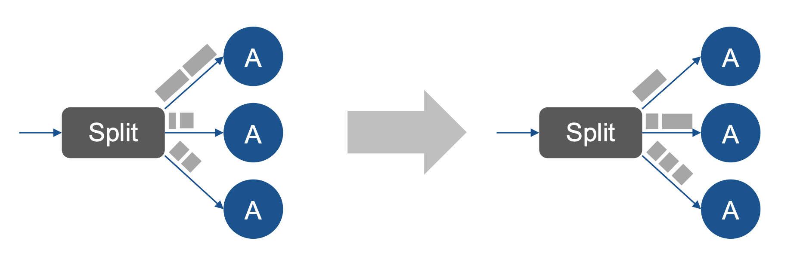

- Load balancing is always important when fission is applied.
- Depending on the split logic, the load can be imbalanced even when using round-robin distribution: Different key distributions, different window sizes, etc. 

- **Distribute the workload such that no operator stays idle while another operator is overloaded !** 

### Profitability 

- Without load balancing, there is skew in the load of the replicas 
- Load balancing removed that skew
- The profitability depends on how much skew there is which can be removed by load balancing 
- Caveat: **In practice, it can be hard (impossible) to establish perfect load balancing!**

- Example shows the profitability of load balancing at growing skew. 

### Safety 

- **Stateless operators:**Always safe to re-balance load 

- **Stateful operators:**
    - Shared state: Make sure state access is possible. Take care of synchronization at re-balancing (no "overtaking" of events!)
    - Partitioned state: take care that state partition is also migrated at re-balancing! 

## State Sharing 

> Optimize for space by avoiding unnecessary copies of data

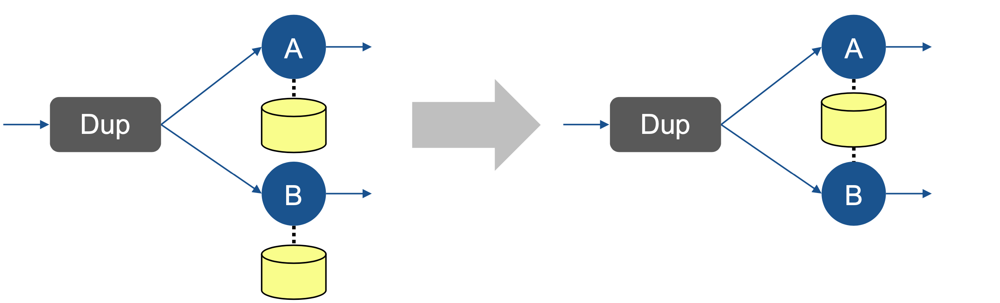

- **Example:**
    - Different operators that compute some window-based aggregation on same events
    - Both keep a copy of the events of their local window --> redundant event copies !

- They can share the events to reduce the overall memory footprint !

### Profitability 

- Profitable if reduced memory footprint leads to better performance 
    - Less disk I/O because the state now fits into memory
    - Less stalls due to cache misses because the state now fits into the CPU's caches

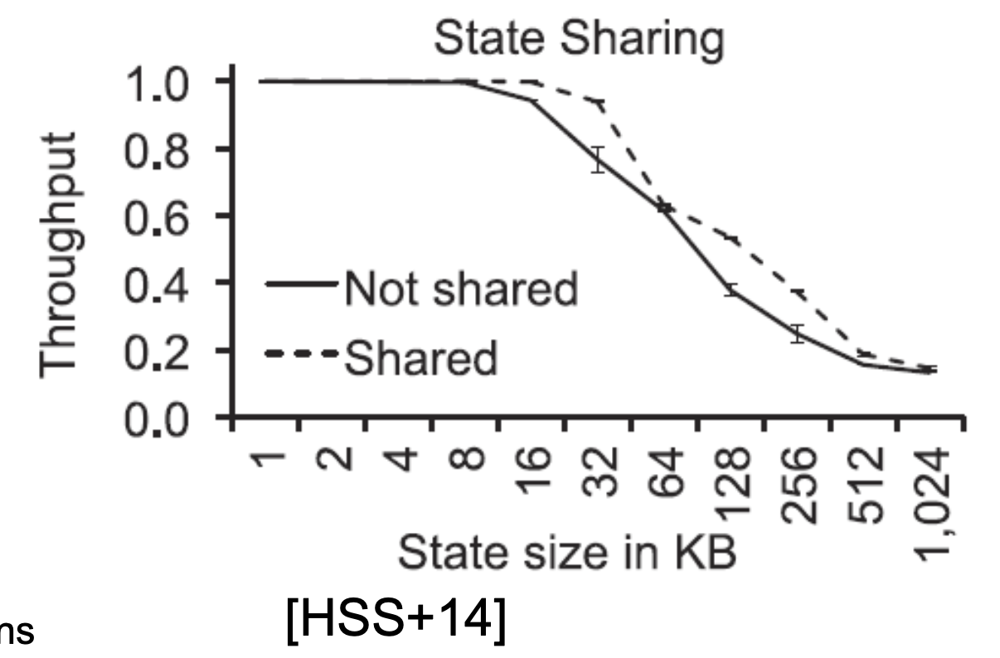

- **Example:** Two operators share events for their window
    - If state size (window size) is very low, all states fit into L1 cache 
    - At growing state size, shared state fits into L1 cache while non-shared doesn't 
    - At event larger state size, shared state fits into L2 cache while non-shared doesn't 

### Safety 

The following safety conditions must be met: 

1. Provide common access to the shared state
2. Avoid race conditions
3. Manage memory safely (avoid memory leaks)

## Batching 

> Process multiple data items in a single batch

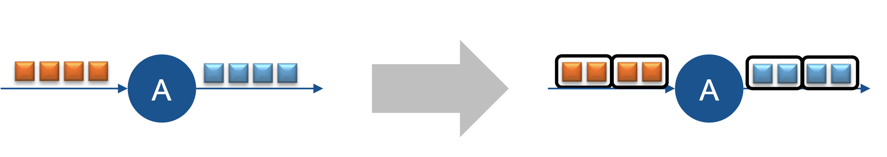

- **Example:**
    - Each function call (to process one event) writes an updated value into a database or a log 
    - This indicates a lot of overhead: Context switching, I/O operations, locks in database ... 

- **Batch together processing of multiple subsequent input events.**

### Profitability 

- Batching trades **throughput for latency**
    - Amortizes operator-firing and communication costs over more events: 
        - Deeply nested function calls 
        - Warm-up costs, e.g instruction cache 
        - Scheduling costs, e.g context switch
        - Database or file writes
    - Higher latency, because events are buffered until the entire batch is available 

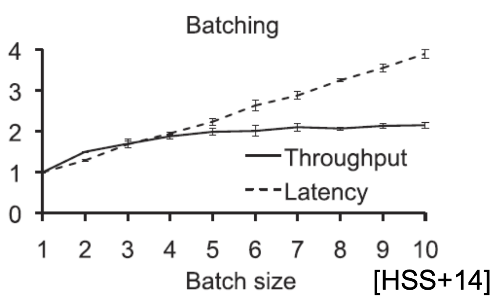

- **Example**:
    - **Latency increases linearly with batch size**
    - **Throughput improvement eventually flattens out**

### Safety 

The following safety conditions must be met: 

1. **Avoid deadlocks**
    - **Deadlock when the operator graph is cyclic:**
        - Operator A waits for a number of events to form a batch
        - Some of those events must go around a feedback loop 
        - Feedback loop is depleted because the operator is waiting 

    - **Deadlock if batched operator shares a lock with upstream operator**
        - Batched operator B waits for events while holding lock 
        - Prevents upstream operator A from sending the events to complete the batch
    
2. **Safisty deadlines: Bound the delay introduced by batching**

## Algorithm selection 

> Use faster algorithm for implementing an operator 

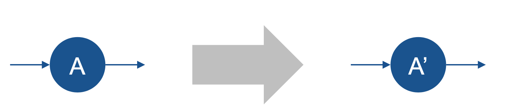

- **Example**
    - Operator A implements join on two input streams 
    - Implementation is a nested-loop-join

- **Use faster join algorithm, such as hash join (A')**

### Profitability 

- Profitable, if it replaces a costly operator with a cheap operator 
- Problem: in some cases, neither algorithm is better in all circumstances
    - Algorithm A is faster for small inputs, while algorithm A' is faster for large inputs
    - Or algorithms A and A'  optimize for different metrics (e.g throughput vs latency)
    - (e.g ranges of input data)

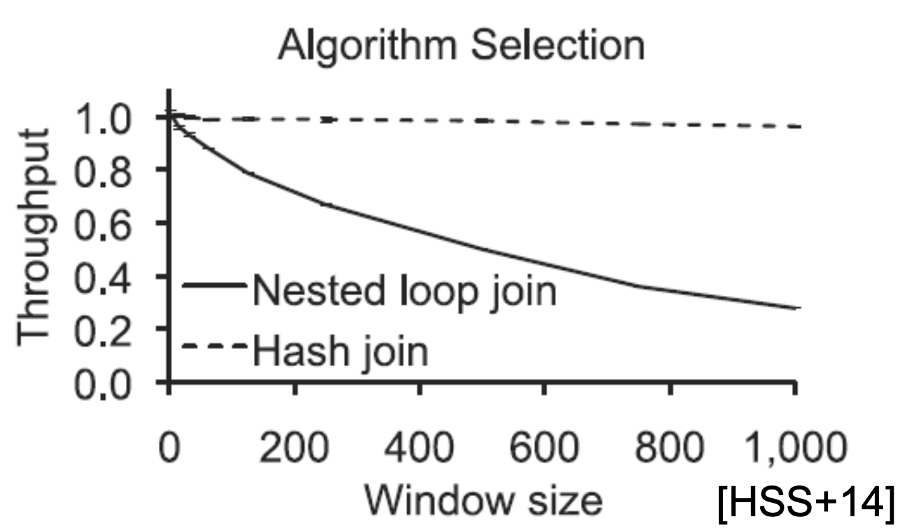

- **Example: Nested loop vs hash join**
    - At small window size, performance is equal
    - But hash joins are less general, as their join condition must be an equality, not an arbitrary predicate

### Safety 

The following safety conditions must be met: 

1. The same behaviour of A and A' must be ensured. 
2. If algorithm A' is less general than A, then choosing A' is only safe, if A' is general enough for the particular usage.

### Variations 

1. **Physical query plan:** The algorithm selection happens during translation from logical to physical operators
2. **Auto-tuners:** Tune algorithm to a specific hardware platform by running performance experiments during installation
3. **Different semantics:** Algorithm selection as a simple form of load shedding. Use approximate algorithm instead of the exact one. Also known as "sketching" **Potentially unsafe**

## Load Shedding 

> Degrade gracefully when overloaded

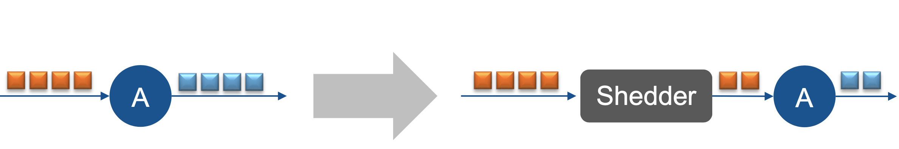

**Example: Emergency management application**
    - **Normal conditions:**system can keep up with the load
    - **Disaster strike:** The increases drastically and exceeds the capacity of the system

- **Shed some of the load, degrade accuracy for some subscribers, so that others can still receive complete, accurate and timely results**

- Throwing away some of the data from the stream

### Profitability 

- Improves throughput at the cost of reducing accuracy

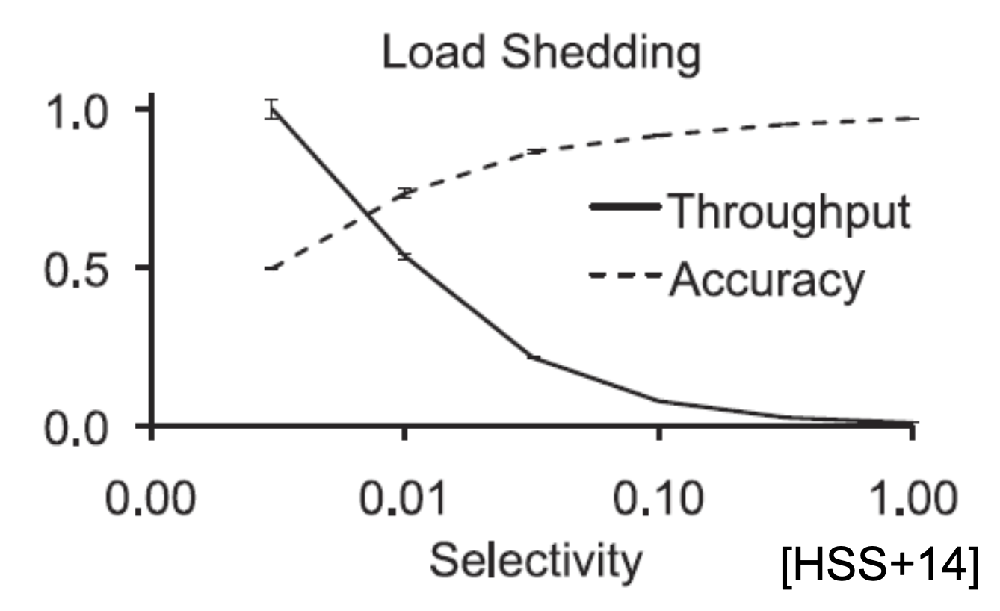

- Example: Aggregation operator constructs a histogram over windows of 1000 events. 
- For each window, it counts each event as belonging to a "bucket"(depending on the value in its payload)

- Selectivity of shedder = how much is shed
    - 1.00 --> nothing is shed
    - 0.10 --> 90% is shed
    - 0.01 --> 99% is shed

- The more is shed, the higher is the throughput, but accuracy suffers. 

### Safety

- **Load shedding is by definition not safe!**

- However, depending on the application, the accuracy decay may be acceptable
- Some applications deal with inherently imprecise data from the beginning, e.g sensor readings
- Other applications produce outputs where correctness is not a clear-cut issue, e.g advertisiment placement and prioritization. 

## Conclusions 

- Distributed operator graph enables a large number of optimizations
- Before applying an optimization, think about the following questions:
    - **Profitability: Does it improve the performance in my case ?**
    - **Safety: How to ensure the resulting operator graph is executed safety ?**
