# L4- Fault-Tolerant Event Processing 

**Motivation: Reliable Event Detection**

- Event processing monitors mission-critical systems
    - Failure detection in cyber-physical systems
    - Fraud detection in financial transactions 
    - Detect accidents and jams in the traffic flow
    - **Goal: React to detected situations in the surrounding world**

- Failures can happen all the time 
    - Node failures
    - Network failures
    - Software failures / bugs

## What is "Reliable" Event Processing ?

- The **absence** of **false negative** and **false positive** event detections
    - **False negative**
        - A complex event happened but was not detected
        - "There is an accident between two cards, but it was not detected"
    
    - **False positive**
        - A complex event has not happened, but was detected 
        - "The system reports an accident between two cars, but there is none"

- Avoid deviations of the detected event's **properties** from reality

- "There is an accident between three cars, but the system detects an accident between two cars"

## Impact of Missing Events on Complex Event Detection

- If a node or the network fails, a subsequent operator may receive incomplete input event streams 

- This can lead to 
    - **false negative**
    - **false positive**
    - **diverging event processing**

## Failure Models

- Failure models tell us about what kind of failures are expected to happen
- Here, we focus on **crash failures**
    - A node stops (halts), but is working correctly until it stops. 
    - As opposed to other types of failures, e.g arbitrary failures (Byzantine)

- **Fail-stop:** When a compute node fails, it just stops, not producing any outputs any more. This failure **can be detected** by other components of the system. 

## Overview

- What can we do to avoid inconsistencies in event detection when operators fail ?

- Three general approaches: 

1. **Active replication**
2. **Passive replication**
3. **Upstream replication**

## Active Replication

- Active replication is based on the concept of **state-machine replication**
- **A state machine consists of:**
1. A set of **states**
2. A set of **inputs** 
3. A set of **outputs**
4. A **transition function** (input x state -> state)
5. A **output function** (input x state -> output)
6. A distinguished state called **Start**

--> (i). State machine begins at Start. 
--> (ii). Each input received is passed through the transition and output function to produce a new state and an ouput
--> (iii). The current state is held stable until a new input is received, while the output is communicated to a receiver. 

**State Machine Replication**

- We require the state machine to be **deterministic**

- Multiple copies of the same state machine that... 
1. ... begin in the start state and 
2. ... receive the same inputs in the same order 
... will arrive at the **same state** having generated the **same outputs**

**This applies to event processing operators (as long as they do not trigger computations based on processing time!)**

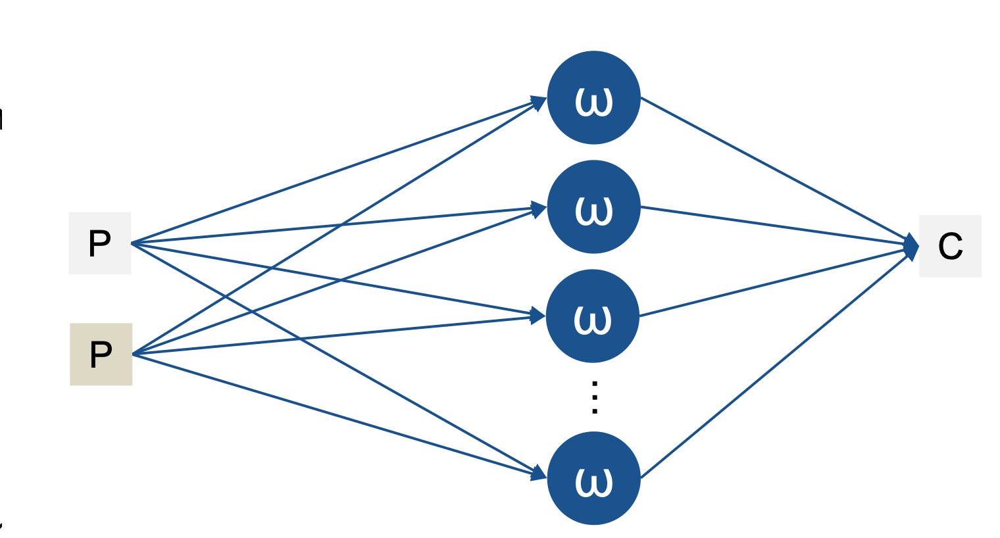

- Instead of only a single copy, we run multiple copies (replicas) of the operator
- Each receives the same input events in the same order > **reach the same state**

- We need **k+1 replicas** to survive **k crash failures**
- Problem: How to guarantee all of these replicas receive the same events in the same order ? 
- Generally: Needs **consensus** among the replicas on what to process next 
(see Atomic Broadcast Paxos > Distributed Systems Lecture)
- But: **In event processing , ordering way be given implicitly by event-time timestamps, sequence numbers and watermarks**

## Active Standy 

- One of the replicas is the primary instance (red), others are secondary 

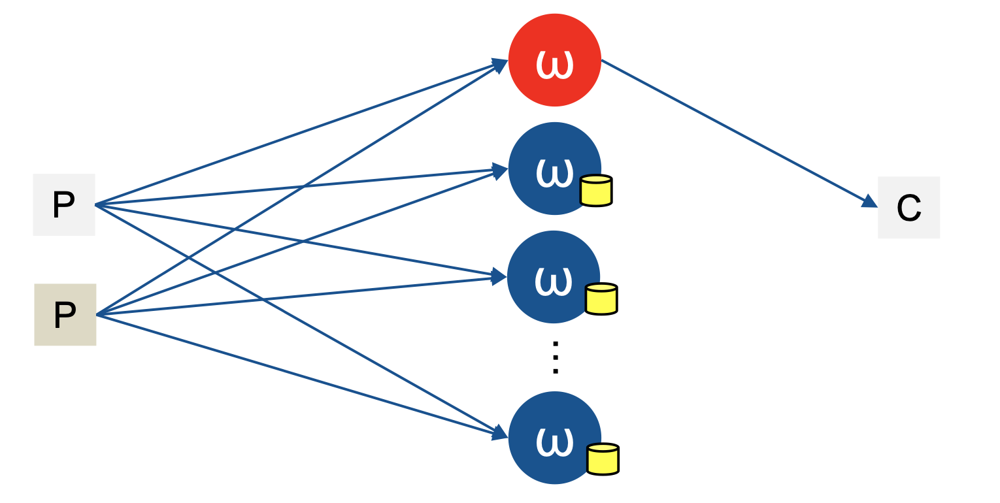

- All instances process all input events (like in previous slide)
- Only primary emits output events to the consumer, secondaries keep output log 
- Advantage: consumer only gets one input stream (no duplicates)
- However, nodes need to synchronize to be able to prune the output log. 

## Passive Replication 

- One of the replicas is the primary (red), others are secondary 

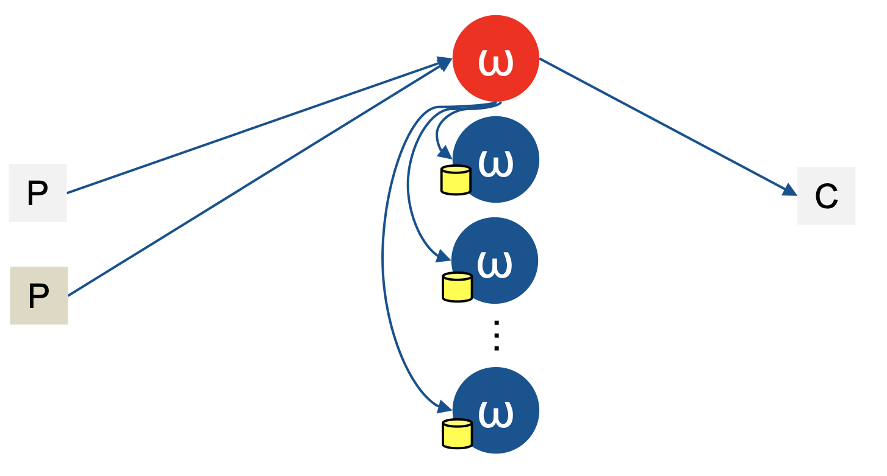

- Producers send events only to the primary 
- Primary processes input events, emits output events to consumer
- Primary copies its new state (snapshot/checkpoint) to the secondaries
- In case of failure, a new primary is selected (e.g via leader election protocol)

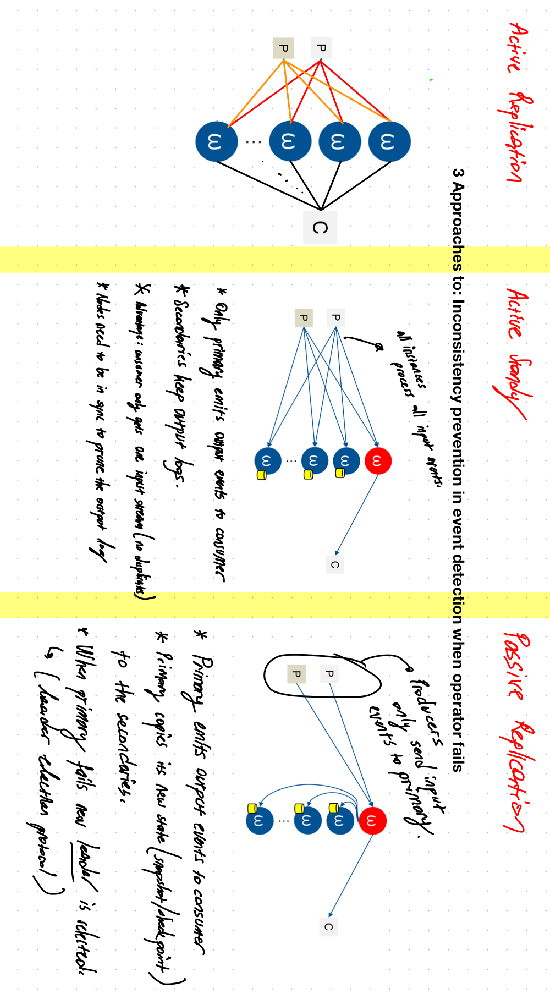

## Checkpoint-based Recovery 

- Primary takes periodic checkpoints and sends them to the secondaries
- A checkpoint captures all internal state needed for recovery 
(We do not need to take snapshot of entire memory)
- **Challenge 1**
    - Avoid downtime while taking the checkpoint

- **Challenge 2**
    - How to recover to a consistent state when multiple subsequent operators fail ?

## Distributed Checkpointing Needs Coordination

- Consider some arbitrary operator graph

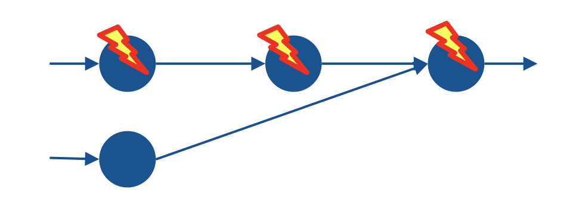

- Each single operator could make its own checkpoint independently, and if it fails, it would recover using that checkpoint. 

- **Problem: Inconsistent checkpoints**
    - E.g an event could be in the checkpoint of two subsequent operators
    - If multiple operators fail at the same time and then recover, the recovered state contains the event **twice**

## Simple Consistent Checkpointing 

- Simple approach: Stop all operators subsequently, make a checkpoint at each of them proceed. (leads to downtime)
- E.g done in Naiad ( distributed dataflow system from Microsoft, SOSP 2013)

- **Advantage: Simple Approach, easy to implement**
- **Disadvantage: Downtime while checkpointing**

- **Better way of handling this issue would be Lambort Algorithm**

## Chandy-Lamport Algorithm 

- Describes a snapshot algorithm for determining global state of distributed systems 
- Properties
    - Taking snapshots does not interfere with normal application behavior
    - The recorded state is consistent to a **possible** global state
        - Impossible states are not recoded ( e.g with the duplicate event)
        (e.g A does not read a message but B received a mesasge with A, this is NOT possible)

- Relies on local checkpointing mechanism 

### Assumptions (System Model)

- **Communication reliable, exactly once, no duplicates, no loss**
- **Channels are unidirectional**
- **Channels are FIFO ordered**
- **The graph is strongly connected, there is a path between any two processes**

### Requirements

- Snapshotting must not interfere with normal application actions 
    - In particular, applications do not need to stop communication while a snapshot is recorded 
    
- Each process is able to record its own state (checkpointing)
- Collection of global state in a disributed manner (no centralized component)
- Any process can initiate the snapshot 

### Algorithm  (Initiator)

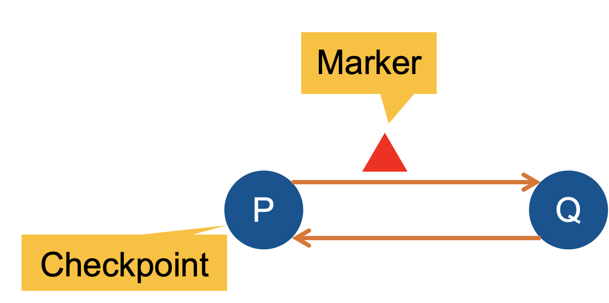

1. Initiator records its own state 
2. Creates a special message called marker 
3. Sends the marker to all other processes 
4. Starts recording incoming messages on each incoming channe

### Algorithm (Receiver)

- **If** thisis the first Marker received ... 

1. Record own state
2. Mark the state of input channel as empty 
3. Send a Marker message to each output channel
4. Start recording incoming messages on each input channel 

- **else**

Mark the state of input channel as **all messages that have arrived on it since recording was started**

### Algorithm (Termination)

Algorithm terminates when

- All processes have received a Marker from all input channels
    - Own state recorded 
    - State of all channels recorded 

A central server can collect all partial states to create the full global snapshots (optional)

### Algorithm (Pseudocode)

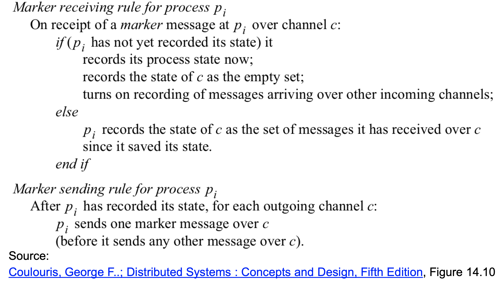

### Discussion of Checkpointing 

- **Pro: Well-established, general approach**
    - Any operator state can be checkpointed 
    **No assumption on event processing mechanism**
    - Checkpointing internal allows for trading between checkpointing overhead and recovery overhead/delay

- **Contra: Considerable overhead**
    - Checkpointing makes a lot of work (even if no failure happens)
    - Does not exploit mechanisms of event processing operators 

## Upstream Backup 

### Recovery of Event Streams (Upstream Backup)

- Idea: Upstream operators act as backups for their downstream neighbors 
- But not by storing checkpoints !
- Instead: Logging output tuples so they can be re-sent and reprocessed if needed (if downstream neighbor crashes)

- Keeps the output events logged until "fully processed"
- Main challenge: when is an event "fully processed" and can be discarded from the output log ? 

### ACKs

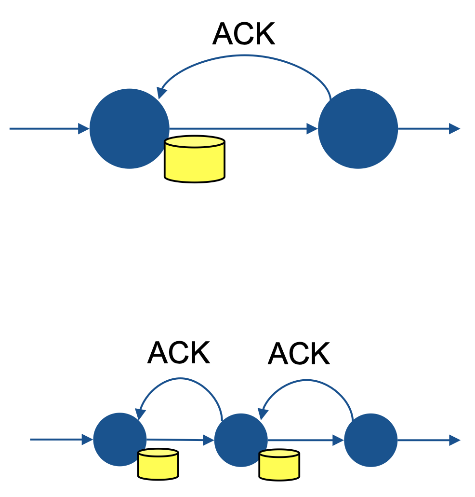

- Pruning happens via ACKs (acknowledgements) that are propagated upstream (i.e against the event stream)
- **An ACK means: "I have fully processed this event and will never ever need to see this event again even in case of a crash and recovery"**
- This could, for instance, be when an event has been **evicted** from the current window 
- Things get more complex when we consider multiple (f) failures -> Multi-layer ACKs 

- **Advantages**
    - No checkpoints needed 
    - No operator replicas needed 

- **Disadvantages**
    - Needs to keep output events in a log
    - Recovery takes time, as event streams need to be recomputed 
    (possibly over multiple layers)

## Conclusions

- Failure recovery is needed to keep consistennt, highly-available event processing inn case of failures 
- **There are different methods of recovery**
    - **Active replication**
    - **Passive replication** 
    - **Upstream backup** 

- These involve different tradeoffs (runtime overheads, recovery time, etc.)

## Chandy-Lamport Examples 

### Example 1 

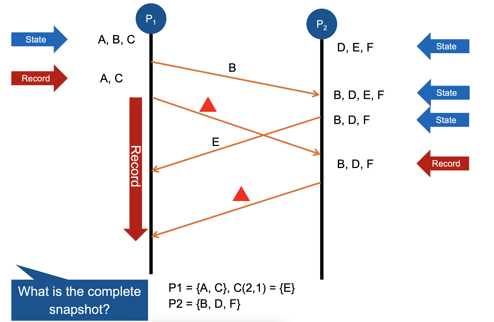

### Example 2 
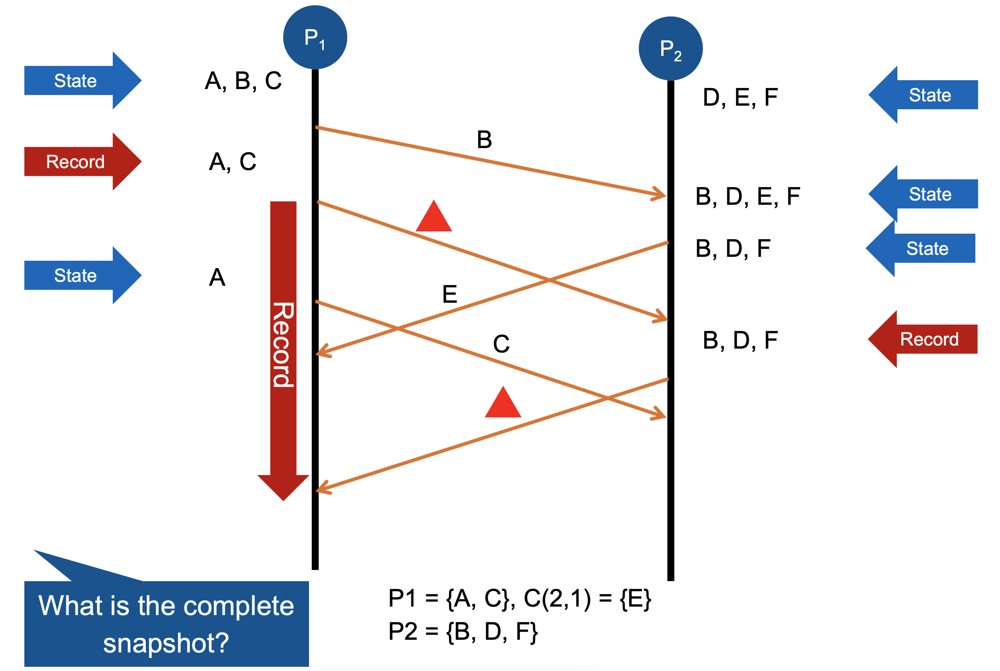

### Example 3 

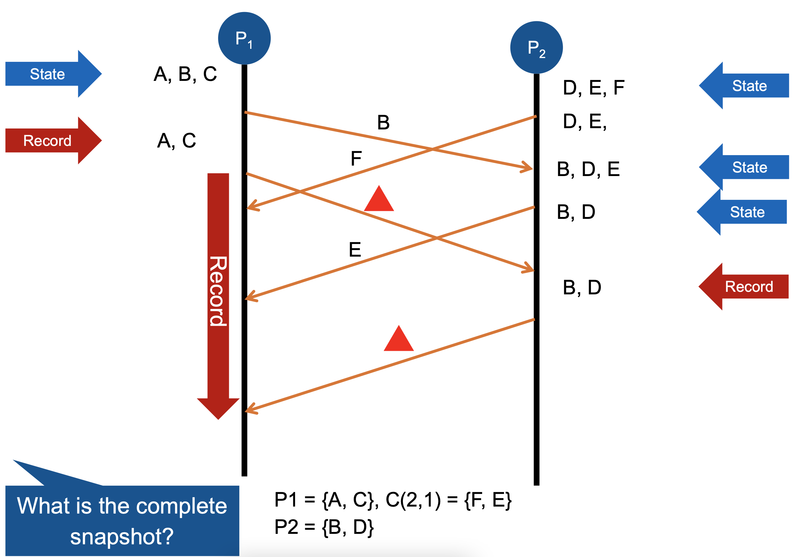

