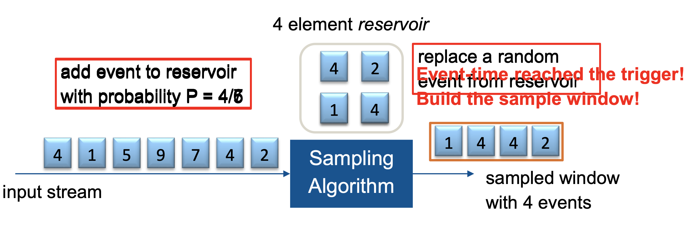
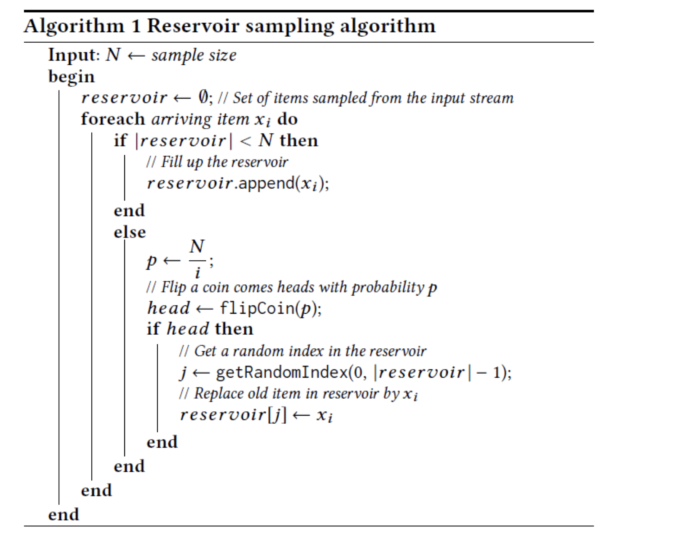
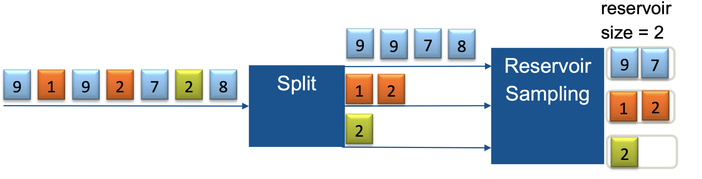
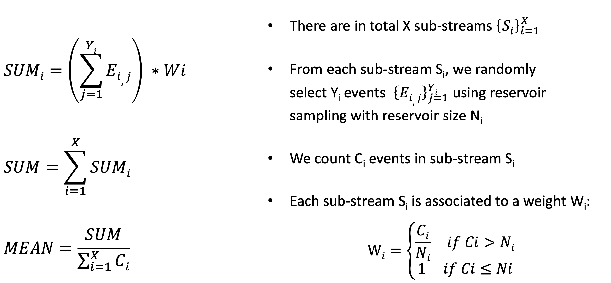
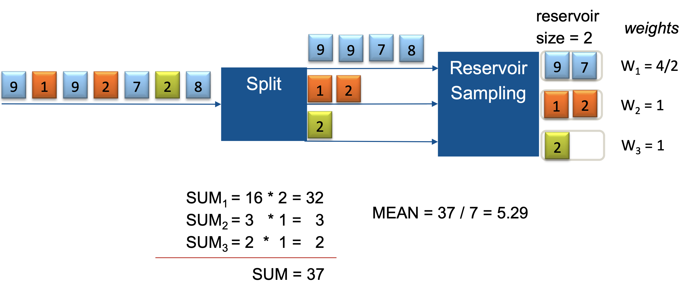
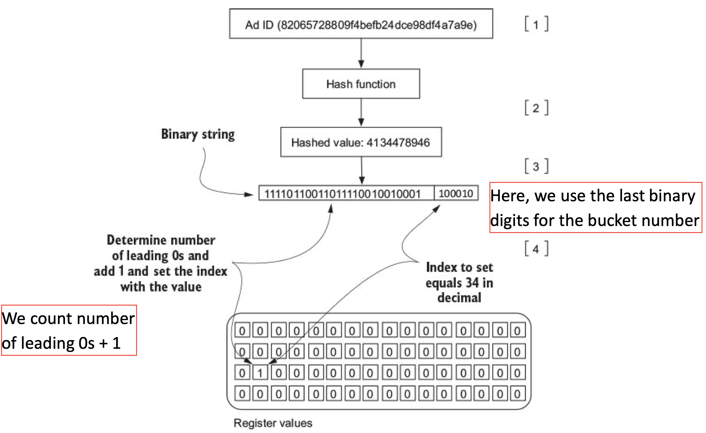
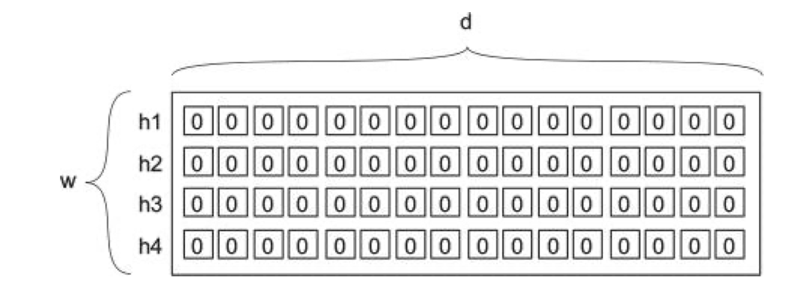
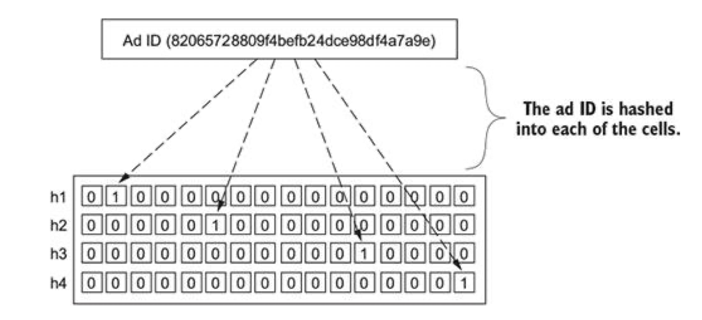
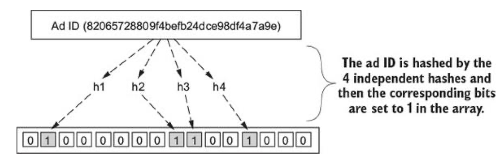

# L5- Approximate Event Processing

**Motivation**

The nature of event processing ...**DATA IN MOTION !**

- Endless streams of events
- Not all events can fit into memory
- It is extremely difficult to provide exact answers
    - *What is the current average temperature in the building ?*
    - --> **It fluctuates all the time !**
    - *What is the current ad click rate for advertisements on topic XYZ?*
    - --> **It is not stable either !**

- **Can we settle for approximate answers if it saves us time and resources ? and how ?**

## Sampling 

- Basic idea: Only process a sub-set of events from the input event stream, dropt the rest 
    - a.k.a Load Shedding

- Problem: Which events to drop, which events to process ? 
    - Sampling strategy 

- Some sampling strategies to be discussed 
    - **Random sampling**
    - **Reservoir sampling** (unlimited stream but limited resources; give every event a chance to be in the sampling)
    - **Stratified sampling**

## Random Sampling 

**Randomly choose a sample of N items from the stream**

- Problem: Stream has infinite / unknown number of events
    - For each event e in the stream, what should be the probability to choose it, such that we get N events at the end of the sampling period and each event has the same chance to end up in the sample ?  

- We could buffer all events from the input stream until we need to sample, and then choose events uniformly at random from the buffer. 
    - Problem: We would have to store a large amount of events ! 

**Better approach: Reservoir Sampling**

## Reservoir Sampling 

**Maintain the sample in a buffer (called reservoir) of size N**

- First, populate the reservoir with the first N events from the stream
- For the i-th event, i > N, replace a random event from the reservoir with the new event with probability N/i
- **Reservoir sampling ensures that each event in the stream has an equal probability of being selected for the reservoir once the sample is finalized.**

> Jeffrey S. Vitter. 1985. Random sampling with a reservoir. ACM Trans. Math. Softw. 11, 1 (March 1985), 37-57. DOI: https://doi-org.eaccess.ub.tum.de/10.1145/3147.3165

- When you stay in reservoir longer probability of being kicked out is high. 
- When you are event which happened at later point, you have low probability of being selected (N/i) but you also have low probability to be kicked of from reservoir.

### Reservoir Sampling: Algorithm 

> Do Le Quoc, Ruichuan Chen, Pramod Bhatotia, Christof Fetzer, Volker Hilt, and Thorsten Strufe. 2017. StreamApprox: approximate computing for stream analytics. In Proceedings of the 18th ACM/IFIP/USENIX Middleware Conference (Middleware '17). ACM, New York, NY, USA, 185-197.

### Limitations of Reservoir Sampling 

- Input stream may be composed of multiple sub-streams with different distributions of arrival rates
- Reservoir sampling may overlook some sub-streams that only consist of few events --> not represented in the sample
- This can lead to high variance and low accuracy in the sample

## Stratified Sampling 

**Divide the events from the input stream into substreams (strata) and sample each stratum independently**

### Approximate Weighted Sum

**Compute approximate weighted sum of all items received from all sub-streams**

### Example (Stratified Sampling )

## Counting Distinct Elements (Cardinality Estimation, HyperLogLog Algorithm)

**Count distinct items in a stream (or in a window)**

Constraint: Limited memory, cannot store the entire stream (or window)

- How many distinct people have I met at the conference ?
- Write a list with all names ?? 

- Idea: Ask them for the last 4 digits of their phone number 
- Note down the number of leading 0s
- Remember the largest number of leading 0s encountered

- E.g 2 leading 0s -> must have spoken to 100s of people

### HyperLogLog Algorithm

**Use the patterns of bits that occur at the beginning of the binary value of each element of the stream**

- Observation: *The cardinality of a multiset of uniformly distributed random numbers can be estimated by calculating the **maximum number of leading zeros** in the **binary representation** of each number in the set*

- **If the maximum number of leading zeros observed is n, an estimate for the number of distinct elements in the set is 2^(n+1)**

> Flajolet, Philippe; Fusy, Éric; Gandouet, Olivier; Meunier, Frédéric (2007). „Hyperloglog: The analysis of a near-optimal cardinality estimation algorithm“. In Discrete Mathematics and Theoretical Computer Science Proceedings.Download: https://citeseerx.ist.psu.edu/viewdoc/summary?doi=10.1.1.76.4286

- A **hash function** is applied to each event to obtain a multiset of uniformly distributed random numbers with the same cardinality as the original multiset. 
- Challange: simple estimate has large variance.

- HyperLogLog minimizes variance: 
    1. Split the multiset into multiple subset / buckets
    2. Calculate the cardinality in each subset / bucket
    3. Use the harmonic mean to estimate the cardinality of the whole set.
    (harmonic mean is very tolerant to outliers; smoothing outliers)

- **Back to the Phone Example**

1. Instead of asking for the last 4 digits, ask for the last 5 digits
2. Use the 1st or the last of those digits as the bucket number 
3. Use the other 4 digits to check the number of leading 0s
4. Compute harmonic mean across the maximum order of leading 0s of each bucket.

### HyperLogLog Data Structure

**Compute the Estimate**

- **Estimate: (Harmonic mean over all bins) x (number of bins used)**

- Example: 
    - 2 leading bits for bin, next 4 bits for entries, count leading zeros from left to right. 

- Observed a number of elements with the following distinct 6-bit binary hashes

* 001100
* 010010
* 101010
* 110101

- Bins: bin[0]=1, bin[1]=3, bin[2]= 1, bin[3]=2 (always:  "max leading 0s" + 1 )

- **Estimate**
    - Harmonic mean over bins: H = 4 / (1/2ˆ1 + 1/2ˆ3 + 1/2ˆ1 + 1/2ˆ2)
    - Estimate = 2.91 * 4  = 11.64 distinct elements are in the stream

## Frequency Estimation (Count-Min Sketch)

**How many times has event X occurred ?**

Idea: "First count, then compute the minimum"

- Set of w counters (numeric arrays of length d)

- Each counter is associated with a different hash function (pairwise independent)

- Initialized to 0. 

### Updating Data Structure 

Hash the event's value using the hash function for each respective row. 

Increment by 1 the count for all cells the value hashes to. 

### Querying the Data Structure 

After some time has passed, we want to estimate how many times event e has appeared in the stream: 

**Estimated count (e) = min {h1(e), h2(e), h3(e), h4(e)}**

Explanation: 
- Each hash points to a distinct counter 
- We take the minimum from all counters that count occurrences of e
- This value approximates the number of occurrences of e 

## Membership Estimation (Bloom Filter)

**Has event e ever occured in the stream before?**

- **Bloom Filter**

- Data structure that answers the question above: **HAS EVENT e BEEN SEEN BEFORE ?**
- Properties: 
    - **No false negatives**
        - ***If the Bloom filter reports the event has not been seen, this is always be true!***
    - **False positives are possible:**
        - *If the Bloom filter reports the event has been seen there is a small chance that this is false!*

- Binary bit array of length m 
- Associated with a set of k independent hash functions. 

- Collisions are possible: If an entry is already 1, it remains so.

### Querying the Bloom Filter

**Has event e ever occured in the stream before?**

*Membership of event e = h1(e) ∧ h2(e) ∧ h3 (e) ∧ h4(e) ∧ .... ∧ hk(e)*

- Compute each of the hashes of e 
- Check the data structure to see if all the elements are 1
    - If this is the case, the Bloom filter reports that the event has probably been seen before 
- If at least one of them is 0, it is guaranteed that the event has not been seen before
    - If it was, the process of adding an event would have set that element to 1 via the corresponding hash function

- Control the false-positive rate via the size of the Bloom filter and number of hash functions. 

### Limitations 

- False-positives are possible (as discussed above)
- Another limitation of Bloom filters is that an element once added to the filter cannot be removed any more !
    - Cannot simply "revert" a 1 to a 0 -> the 1 could have been set by multiple other events 
    - Else, the guarantee of no false negatives could not be held. 

- **Solution: Counting Bloom Filters**

## Counting Bloom Filter 

- Extend the buckets from single bit to an n-bit counter
    - Insert operation increments the value of the buckets
    - Lookup operation checks that each of the required buckets is non-zero
    - Delete operation decrements the value of each bucket 

- Problem: Arithmetic overflow (too many increments to keep in bits)
    - If it occurs, the counting bloom filters must be turned into a non-counting one
    - Increment and decrement operations must leave the bucket set to the maximum possible value to remain the guarantees of a Bloom filter (i.e no false negatives)

## Conclusions 

- Approximate data structures and algorithms are important for efficient event processing 
- There are different solutions for different purposes 
- It is worthwhile to study the "classics", they can be helpful in many situations
    - not only for stream processing, but for any kind of "Big Data" processing.