# Incremental Processing 

- Sliding window -> overlap between subsequent window instances 
- Often event processing involves aggregation 
- Recomputing the window from scratch induces a lot of overhead 

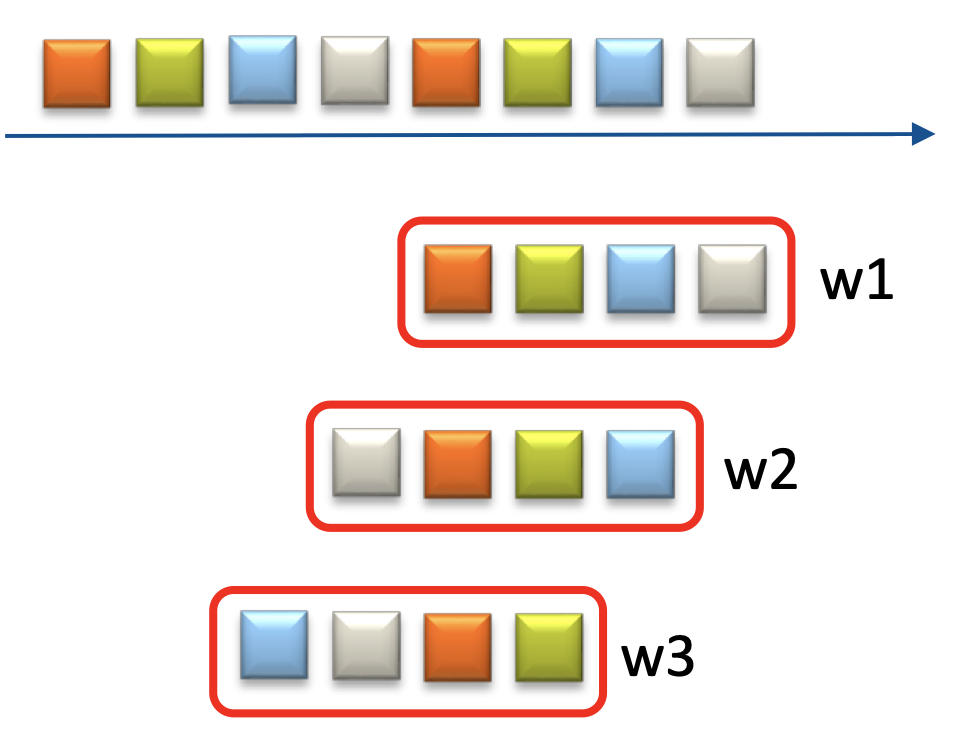

- Many aggregation operations can be incrementalized
    - SUM, MEAN, MAX
    - What about more complex ones ?

- What operations can be incrementalized ?
- How can incremental processing be implemented?
- What are the guarantees in time and space complexity for incremental aggregation ?

## Simple Example: Sum on Sliding Window

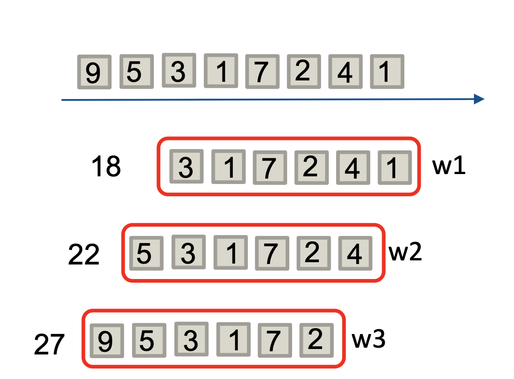

- Sum over a count-based sliding window (count: 6, slide: 1)
- Compute from scratch: 6 operations per window instance 
- Instead: Keep the running sum; decrement upon event eviction; increment upon event arrival 
--> 2 operations per window instance

## Algebraic Properties and Algorithmic Complexity 

- To generalize this idea, we first  analyze algebraic operations
    - Invertible: there exists some funtion F such that (x+y) F y=x for all x and y 
    - Associative: a + (b+c) = (a + b) + c
    - Commutative: a + b = b + a 

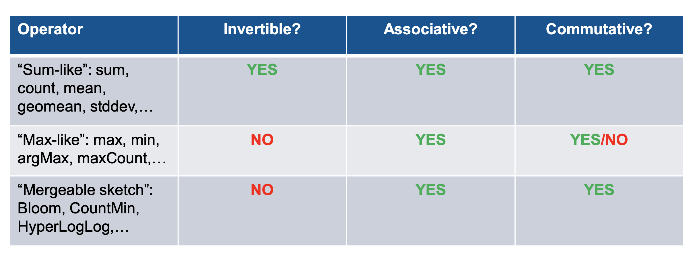

## Algorithmic Complexity

- Important characteristics: Time complexity and space complexity 
    - Time: How log the algorithm runs 
    - Space: How much memory the algorithm consumes
- "Big O Notation": limiting behaivour of a function
    - O(1) constant, O(log n): logarithmic, 0 (n): linea, O(nˆ2): quadratic, etc. 
- Worst-case analysis vs amortized analysis 
- Example of amortized analysis: Dynamic array (e.g ArrayList in Java)
--> **insert is in O(1)** in amortized analysis 
but in worst case, it may trigger a resize that incorporates
copying all elements(O(n))

## Strategies

- Three strategies for incremental aggregation:
    - Recalc 
    - Subtract-on-Evic
    - Two-Stacks / DABA 

- Those have different properties w.r.t complexity and restrictions on the operator characteristics

## Recalc Strategy

- Simply recalculate the whole window

- Algorithmic complexity 
    - Time: Worst-case O(n)
    - Space: O(n)

- Restrictions: none

## Subtract-on-Evict (SOE) Strategy

- Upon every insert, SOE updates the current aggregation value using ⊕
- Upon every evit, SOE updates the current aggregation value using ⊖

- Algorithmic complexity
    - Time: worst case O(1)
    - Space: O(n)

- Restrictions: Applies only to **invertible** operations

## Two-Stacks and DABA 

## De-Amortized Banker's Aggregator (DABA) Strategy 

- Problem with previous approaches: Either too expensive (time complexity) or too restrictive (only for invertible operators)

- DABA has been introduced in a 2017 ACM DEBS paper: 

> Kanat Tangwongsan, Martin Hirzel, and Scott Schneider. 2017. Low-Latency Sliding-Window Aggregation in Worst-Case Constant Time. In Proceedings of the 11th ACM International Conference on Distributed and Event-based Systems (DEBS '17). Association for Computing Machinery, New York, NY, USA, 66–77. DOI:https://doi.org/10.1145/3093742.3093925

- Later been refined in an VLDB journal paper: 
> Tangwongsan, K., Hirzel, M. & Schneider, S. In-order sliding-window aggregation in worst-case constant time. The VLDB Journal (2021). https://doi.org/10.1007/s00778-021-00668-3

- Only two restrictions: 
    - **Operator must be associative** (a + b) + c = a + (b + c)
    - **The window has first-in first-out (FIFO) semantics (i.e: we only evict the oldest event)**

### DABA: Intuition 

- Idea: Start with an algorithm that has amortized O(1) time complexity 
- "De-amortize" it 

- Why is amortized O(1) problematic in event processing ?
--> **Because of latency spikes !**

- Consider the dynamic array example: Where there is a resize when adding an event, this event will suddenly experience very high latency !!

## Starting Point: Two-Stacks Algorithm 

- Uses an "old trick" from functional programming to represent a FIFO queue with two stacks 
- A stack has two O(1) operations: PUSH(e) and POP()
- A FIFO queue has two operations: ENQUEUE(e) and DEQUEUE()

- Implementation of queue using two stacks: 
    - ENQUEUE(e) --> PUSH e on stack_1
    - DEQUEUE() --> POP from stack_2. If stack_2 is empty, then FLIP: POP the entire contents of stack_1 and PUSH it into stak_2. Now simply POP from stack_2 and return the result. 

- **Expensive operation: FLIP --> transfer all data from one stack to the other.** 
--> this causes undesired latency spikes !!

**Example of Two-Stacks FIFO Queue**
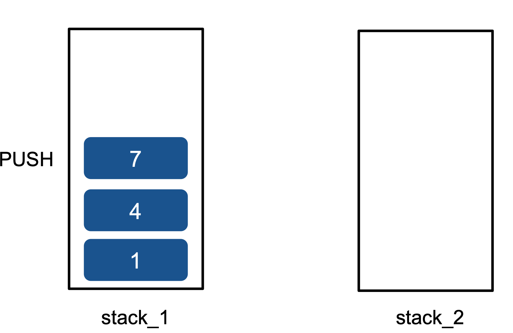

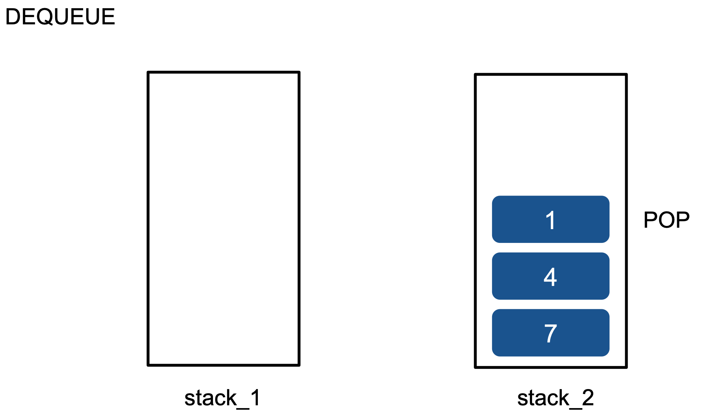

### Two Stacks: Aggregates 

**Extension of Two-Stacks with Aggregates**

- For our purpose, we extend each entry in the stack with an **aggregate**

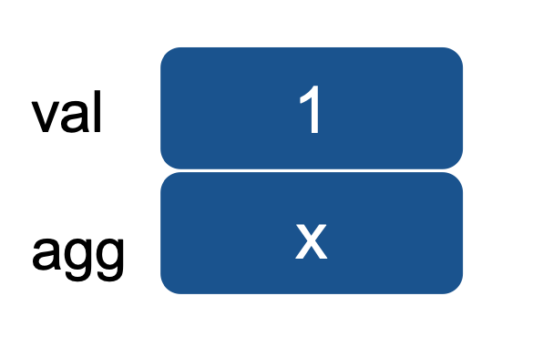

- We call one of the stacks front stack **F**, the other one back stack **B**

- For better visualization, we rotate our stacks by 90 degrees 90 degrees left (F) and right (B)

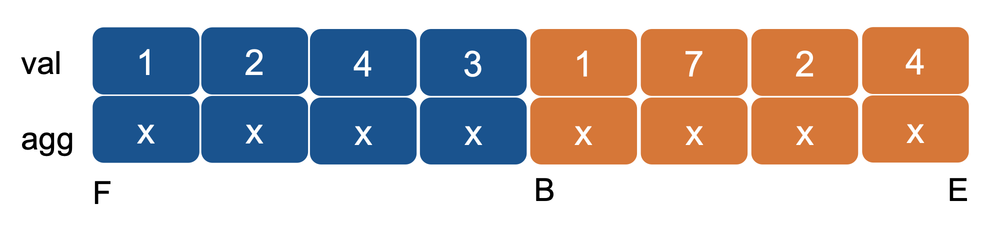

**Aggregate Example: maxCount**

- Yields the number of times the maximal value occurs in the window

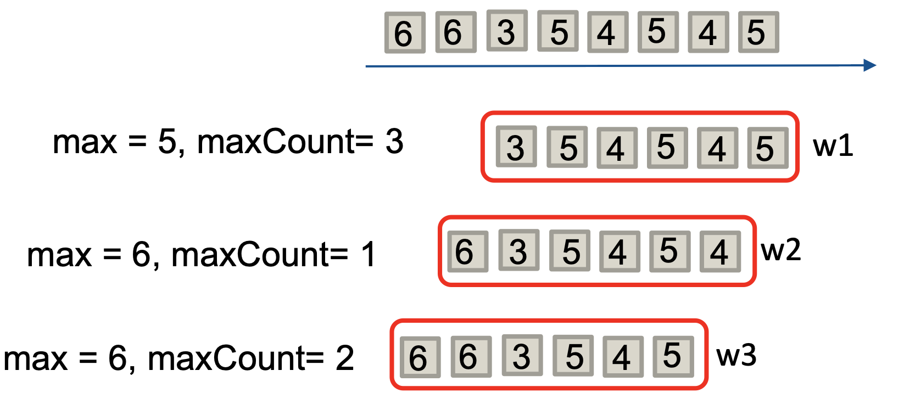

--> **Two-Stacks with maxCount Aggregate**

- Aggregate keeps the current maxCount for each data element 

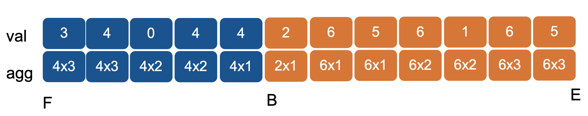

- Notation: 4x3 --> max = 4, maxCount = 3
- The front stack aggregates to the right --> easy eviction from the left 
- The back stack aggregates to the left --> easy insertion from the right 

-> **Two Stacks: Query, Insert and Evict**

### **Querying the Data Structure**

- Query returns the concatenation of the "latest" aggregate of front stack and back stack 
    - The max of the front stack is on top of F (i.e on the left)
    - The max of the back stack is on top of E (i.e on the right)
    (Remember that our visualization rotates both stacks in different directions by 90 degrees)

- Example: Front stack: 4x3, back stack: 6x3
--> result: 6x3 (max = 6, maxCount = 3 )

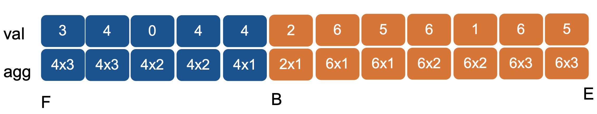

### Insert 

- Insert simply pushes onto B 
- Constant-time operation to update B and compute the new agg value 
- Example: Initial structure: 

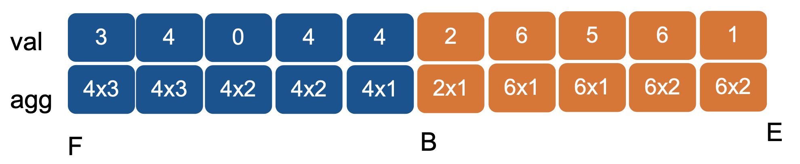

- After inserting new element with **value 6**: 

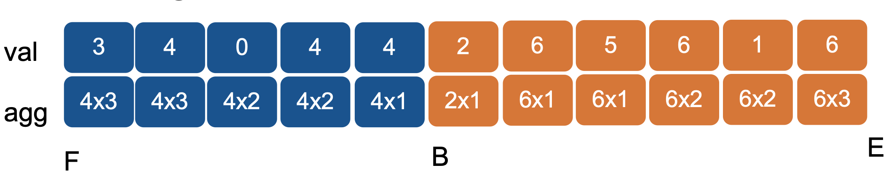

### Evict (Case 1)

- Evict pops from F, if F is non-empty

- Example. Initial structure: 

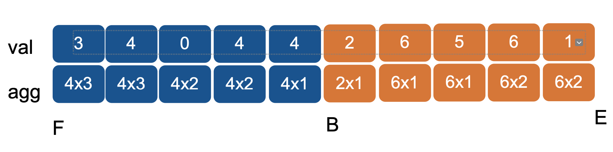

- After eviction: 

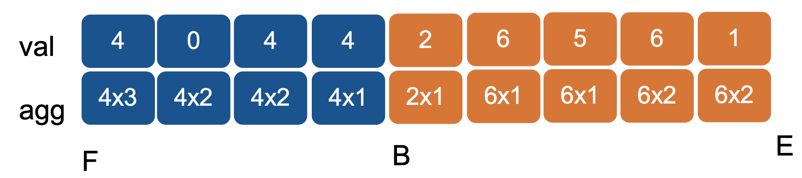

### Evict (Case 2)

- If F is empty, then evict must first do a FLIP 
- The FLIP operation pushes all values from B onto F and reverses the direction of aggregation
- After the FLIP, evict simply does a POP on F as in [Case 1](#evict-case-1)
- FLIP is expensive (O(n)) and leads to latency spikes

**EVICT EXAMPLE**

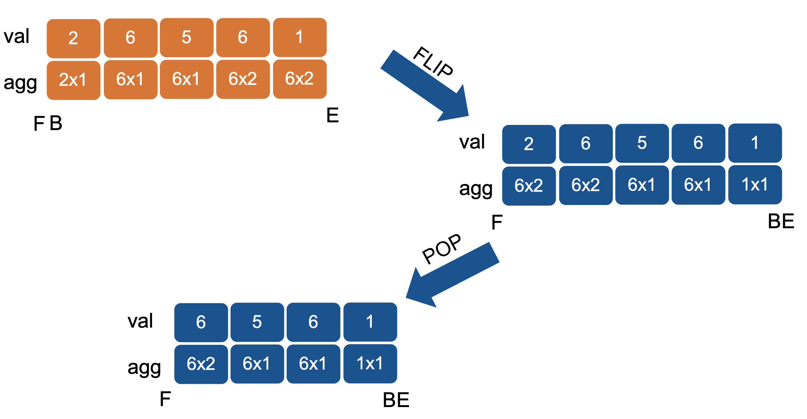

## DABA: Intuition

**DABA Algorithm**

- Observation: Evict in the Two-Stacks algorithm is only amortized O(1), but worst-case O(n)
- Idea of de-amortization: Spread out the expensive operation 
- Expensive operation in Two-Stacks is the loop for reserving the direction of aggregation during FLIP
- Differences in DABA comparaed to Two-Stacks: 
    - DABA does the FLIP earlier, when the front and back stack reach the same length
    - Instead of doing the reversal loop at the time of the flip, DABA spreads out the steps for reversing the direction of aggregation 
- Implementation is a bit complex (check the paper)

## Summary & Conclusion 

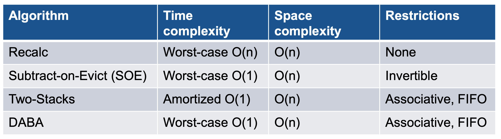

> Tangwongsan K., Hirzel M., Schneider S. (2018) Sliding-Window Aggregation Algorithms. In: Sakr S., Zomaya A. (eds) Encyclopedia of Big Data Technologies. Springer, Cham. https://doi- org.eaccess.ub.tum.de/10.1007/978-3-319-63962-8_157-1

### Conclusion 

- Incremental processing can save processing overheads 
- Many aggregation operators can be incrementalized 
- Differentiate between worst-case and amortized time complexity 
--> important for real-time event processing
- We introduced a couple of algorithms; there are more 

- Implementation of many incremental algorithms is available online: 

--> https://github.com/ibm/sliding-window-aggregators