## Attacks

(Originally written in google docs:  [Google Docs Link](https://docs.google.com/document/d/11Z7e7iP-Vsr0iJ-i2DxmUouLBMaZyZf9RFGsalihHco/edit?usp=sharing) )

- SYN Flood - With forged IP addresses, SYN packets sent, half open connections leads to unavailability to legitimate users

- Protection to SYN Flood,

- TCP SYN Cookies

- SYN Cookie: Particular choice of the initial sequence number by Bob.
- Bob generates the initial sequence number alpha such as:
  - alpha = h(K, S\_syn)

where

- K is a secret key
- S\_syn denotes the source address of the SYN packet
- h is a one-way function
  - Usually h is a cryptographic hash function (implies one-way function)
- At arrival of the ACK message, Bob calculates alpha again
- Then, he verifies if the ACK number is correct If yes he assumes that the client has sent a SYN message recently and it is considered as normal behavior
- Advantages
  - Server does not need to allocate resources after the first SYN packet
  - Client does not need to be aware that the server is using SYN cookies
  - SYN cookies don't requires changes in the specs of the TCP protocol.

- Disadvantages
  - Calculating alpha may be CPU consuming
    - Moved the vulnerability from memory to overload to CPU overload
  - TCP options cannot be negotiated using cookies, in all implementations
    - Use only when an attack is assumed
  - ACK/SEQ number are only 32 Bit long
  - Efficient implementation (fast but insecure crypto) may be vulnerable to cryptoanalysis after receiving a sufficient number of cookies.
    - The secret needs to be changed regularly, e.g by including a timestamp

## Symmetric Encryption

Modes of Encryption

- Electronic Code Book Mode -ECB
- Cipher Block Chaining Mode -CBC
- Output Feedback Mode - OFB
- Counter Mode -CTR

Symmetric encryption uses a **shared secret symmetric key k**

- Some implicit assumptions:
  - k is shared between two (Alice and Bob) or more (group) participants
  - Besides these participants, nobody else knows k -\> k is secret
  - k is used to encrypt and decrypt -\> k is symmetric

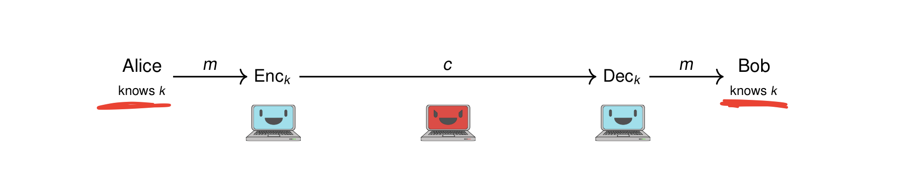


Following security goals are fulfilled and not:

- Confidentiality 👍, fulfilled
- Integrity: No, encrypted does not mean integrity protected.
- Authenticity, if integrity is not guaranteed, authenticity cannot be guaranteed as well.

### One-Time-Pad (OTP)

- Type of a stream cipher
- Stream ciphers make use of XOR operation and a key stream
- For OTP, we call this key the "one time pad" (k = otp)

- As large as message size
- Used only once
- Must be perfectly random

### Kerckhoffs's Principle

"The **cipher method must not be required to be secret** , and it must be able to fall into the hands of the enemy without inconvenience."

– Auguste Kerckhoffs

- Consequences
  - The cipher i.e the encryption algorithm can be public (In fact it should be )
  - If the cipher is public, security depends on the key, which must be kept secret
- Benefits
  - If security would depend on the cipher's obscurity and the cipher leaks we would to build a new one
  - You don't have to come up with a new cipher for each communication partner; selecting a new key is sufficient
  - If the cipher does not need to be hidden, we can perform review procedures that increases confidence in the cipher

####


####


#### **Examples of secure real world symmetric ciphers**

- AES (block cipher)
- 3DES (block cipher)
- ChaCha20 (stream cipher)
- One-Time-Pad (stream cipher)

Why we can trust them ?

- The ciphers are published,
- And they have been publicly reviewed/analyzed by cryptographers
- They are standardized
- Well-tested/optimized implementations are available in the library of your favorite programming language

- **Encryption only provides confidentiality not integrity or authentication.**

- **Don't claim "it is encrypted, it is secure"**
- **Forgetting integrity and authenticity may be worse than any information leakage ! - \> e.g Padding Oracle Attack**

### Attacking Symmetric Ciphers

- Attack scenarios:

- **Ciphertext-only-attack**
  - Attacker only knows c and tries to learn something about m or k
  - Weakest attack type
  - g attacker tries to guess k, statistical attacks/crpytp analysis of c,

- **Known-plaintext attack**
  - The attacker knows a ciphertext/plaintext pair (m,c) and tries to learn something about k

- **Chosen-plaintext or chosen-ciphertext attack**
  - Similar to prev. attack but att. can choose m or c freely
  - Attacker tries to learn something about k
  - Requires that there is some service (called "oracle" ) with a weakness that you can exploit
  - E.g replaying eavesdropped and modified ciphertext to server → Padding oracle attack
  - Strongest attack type

**Drawbacks of OTP:**

- Necessary key length in bits : length(otp) = length(m)

- tp must not be reused
- Key generation and key distribution is difficult
- Applicability in many real-world use cases difficult

- Wish list for practical ciphers
  - length(k) \<\< length(m)
  - Key of fixed length e.g 128bit
  - Key reusable for several messages
  - Unavoidable implication (for length(m) \>\> length(k)):
    - k can be brute forced ( due to fixed length)
    - Ciphertext-only attack succeeds w.h.p when a k is found which decrypts c to an "ïntelligible" m
    - If m is not perfectly random, c cannot be perfectly random

## Block and Stream Ciphers

- Assumes: shared symmetric k of fixed length

- Block cipher
  - Encrypts and decrypts inputs of length n to outputs of length n
  - Block length n, padding if required
  - Examples: AES, DES, 3DES, Blowfish, Twofish …

- Stream cipher
  - Generates a random bit stream called key stream of arbitrary length
  - c = keystream XOR m
  - Examples: ChaCha20, RC4

Which Crypto Cipher should I use ?

- Probably AES

- Reasons to use AES:
  - Fast: 200 MBit/s in software and \> 2GB/s with intel AES-NI
  - Hardware implementations for embedded devices available
  - A well-tested implementation is available in your library
  - Secure (attacks exist, but AES is practically secure)
  - AES seems to be the best we have, and it is among the most researched algorithms
  - Strong keys up to 256 bits possible
  - Hint: Signal uses AES to encrypt data

### Modes of Encryption - Motivation

- **Block ciphers handle messages of length x**
- **Problem: length(m) \>\> x**
- **Solution : Modes of Encryption**

→ **We split m into blocks m\_i where length(m\_i) = x**

→ **m = m1 m2 …. mn**

→ **if length(m) is not a multiple of x, the last block is filled up** **(padding)**

#### Electronic Code Book Mode - ECB

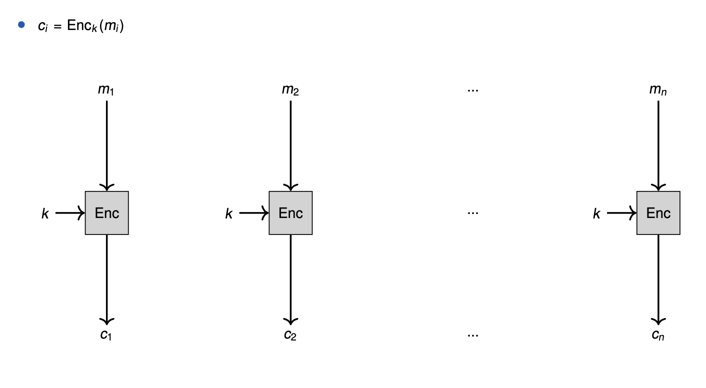

- m = "This is network.This is network.Security"
- Enc = AES-128, mode = ECB
- c=
```
2d 3c ab 1b a0 80 77 ec e8 1d 56 0d 09 2b f6 77
2d 3c ab 1b a0 80 77 ec e8 1d 56 0d 09 2b f6 77
16 ea 2c 19 97 e7 40 db 06 a0 35 93 49 5c 37 0b
```
- Why are line 1 and line 2 identical?
- Identical plaintext blocks are encrypted to identical ciphertext!
- m1 = "This is network."
- m2 = "This is network."
- m3 = "Security" + padding

**ECB Drawbacks**

- **Ciphertext blocks do no have any connection with each other**
- **For this reason, an attacker can**
  - … **reorder blocks**
  - … **repeat blocks**
  - … **delete blocks**
- **Ciphertext can even be decrypted; possibly to reasonable plaintext**
- **Once more: Encryption does not protect integrity !!!**

#### Cipher Block Chaining Mode CBC

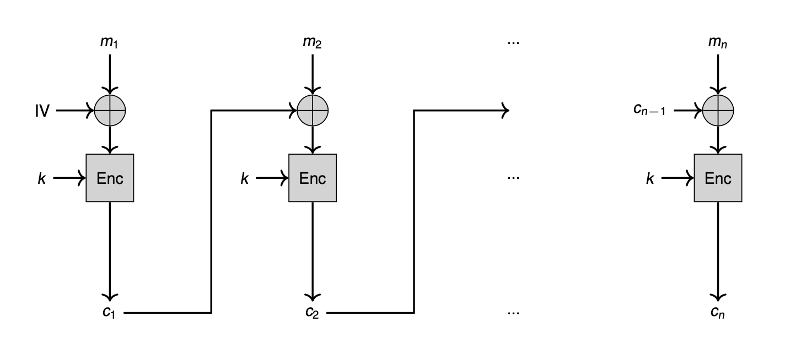

• CBC Encrypt: ci = Enck (ci≠1 ü mi )

• Why the XOR with the previous block?

• Identical plaintext blocks are encrypted to non-identical ciphertext. (\*HUGE BENEFIT)

• Further consequences:

- Decrypting a block depends on the previous block's ciphertext.
 In case of a transmission error in ciphertext block cn, the decryption of cn+1 yields garbled data.
 → Drawback; however, we can deal with transmission error →TCP!
- For the same reason, reordering, repeating or deleting ciphertext blocks typically causes that decryption results in garbled data

→ Seems like an advantage... But: CBC encryption does not provide integrity protection!

**Initialization Vector (IV)**

- **C\_0 = IV**
- **IV may be public**
- **IV must be fresh → identical plaintext messages are encrypted to non-identical ciphertexts**

- Sending m encrypted over UDP, using CBC.
- m is split into blocks for the block cipher.
- m= m1 m2 m3 m4 m5 m6
- m is split over two UDP packets.
- A new and random IV is put in clear at the beginning of the payload of every packet.

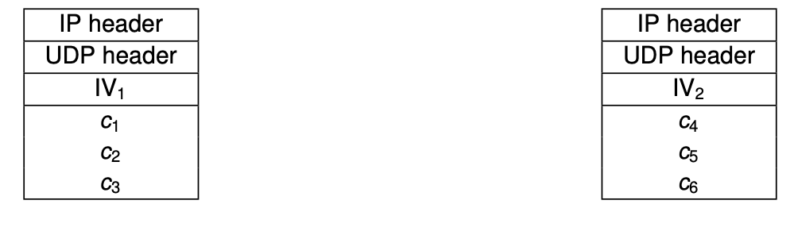
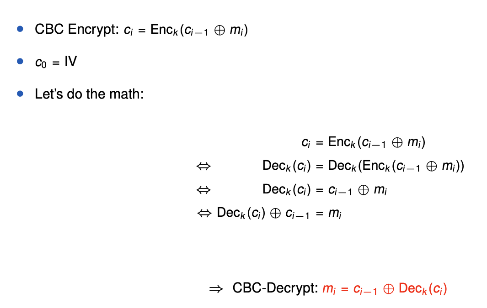

#### Output Feedback Mode

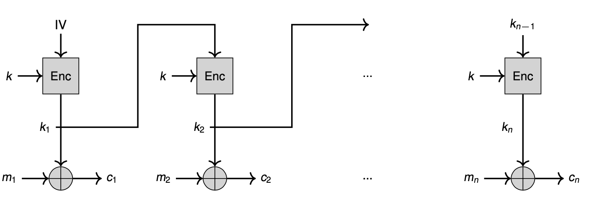

- Transforms a block cipher into a stream cipher
- IV may be public but must be fresh

→ Pros:

- Decryption does not depend on previous blocks

A transmission error in ciphertext block c\_n only affects decryption of this block

- Reordering, repeating or deleting of ciphertext blocks impossible due to feedback.
- If n is too small, the key stream repeats itself ! → use new iv for a fresh key stream

#### Counter Mode

ctr\_i = IV || i

For example: i = 0..n

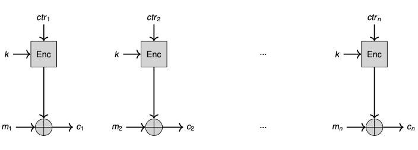

- Transforms a block cipher into stream cipher
- IV may be public but must be fresh

→ Pros and Cons

- Decryption does not depend on previous blocks

A transmission error in ciphertext block c\_n only effects decryption of this block

- Reordering, repeating or deleting of ciphertext blocks impossible due to counter
- If n is too small, the key stream repeats itself ! → Use new IV for a fresh key stream

## Hash Functions

- Common practice in data communications: error detection code, to identify random errors introduced during transmission
  - Most simple error detection code: Parity
    - 7 data bits, 1 parity bit
    - Prefixes data with 1 (0) if number of set data bits is odd (even) • 00110011
 10110010
  - Further examples: Bit-Interleaved Parity, Cyclic Redundancy Check (CRC)
- Underlying idea of these codes: add redundancy to a message for being able to detect, or even correct transmission errors

- The decision whether to use an error detection/correction code at all, the selection of the code to be used and of its parameters ...
  - influences the ability to detect and/or correct errors and how many,
  - adds a varying amount of overhead (computational and increased message length), and
  - depends on the probability/characteristics of errors on the transmission medium.

### Motivation

- Essential security goal: Data integrity
  - We received message m. Has m been modified by an attacker ?
  - It is a different (and much harder) problem to determine if m has been modified on purpose
  - Why ?
    - It is unlikely that a random error that modified a message also "fixes" the messages error detection code
    - An attacker can modify the message and fix the respective error detection code
  - Consequently we need to add a code that fulfills some additional properties which should make it computationally infeasible for an attacker to tamper with messages

→ Methods:

1. Cryptographic Hash Functions
2. Message Authentication Codes

### Hash function

- A function h is called a hash function if:

→ Compression: h maps an input x of arbitrary length to an output h(x) of fixed length n:

h: {0,1} \* → {0,1}^n

→ Ease of computation: Given h and x it is easy to compute h(x)

- A function h is called a one-way function if:

→ h is a hash function

→ For all pre-specified outputs y, it is computationally infeasible to find an x with h(x)=y

- Example:
  - Given a large prime number p and a primitive root g in Z\*\_(p) = {1… p-1}ˆ1

g is a generator of Z\*\_(p) if g ˆx mod p = {1 … p-1}

Let h(x) = g^x mod p

Then h is a one-way function, as the exponentiation can be efficiently calculated, whereas computing the discrete logarithm^2 is computationally difficult .

→ A function H is called a **cryptographic hash function** if:

1. H is a one way function

For all pre-specified outputs y, it is computationally infeasible to find an x with H(x) = y

"For any hash value y, I cannot efficiently find any input x which has this hash value"

→ 1st pre-image resistance

1. Given x it is computationally infeasible to find any second input x' with x != x' such that H(x) = H(x').

"Given a message x, I cannot efficiently find a different message x' which has the same hash value"

→ 2nd pre-image resistance

Note: this property is very important for digital signatures

1. It is computationally infeasible to find any pair (x, x') with x != x' such that H(x) = H(x')

"I cannot efficiently find a pair of different input values x and x' that have the same hash value "

→ Collision resistance

1. It is computationally infeasible to distinguish H(x) from a random n-bit value

→ Random oracle property

→ CRC: Cyclic redundancy checks (CRC)

- Based on binary polynomial division with Input / CRC divisor
- The remainder of the division is the resulting error detection code
- CTC is a fast compression function

Why not use CRC as cryptographic hash function ?

- CRC does not provide 2nd pre-image resistance and collision resistance
- CRC is additive
- CRC is not a cryptographic hash function
- CRC is useful for protecting against noisy channels
- But not against intentional manipulation

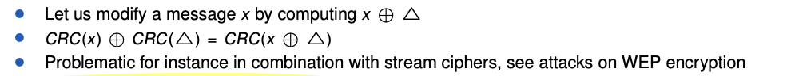

Can hashing ensure integrity ?

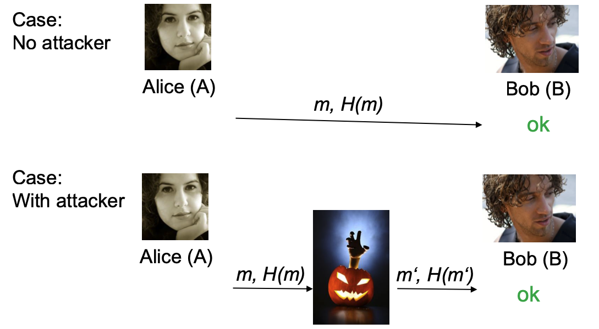

- Applying a hash function is not sufficient to secure a message against intentional manipulation: hash functions are public (cf. Kerckhoffs's principle) and the attacker knows m
- How it can be mitigated \> Message Authentication Code

→ Approach:

- Include a shared secret k in the hash → Message Authjenticaion Code MAC\_k(m) = h(m,k)
- Since the secret key k is unknown to the attacker, the attacker cannot compute MAC\_k(m')

→ Other applications of cryptographic hash functions which require some caution:

- Although this property has not been proven in a mathematical sense for common cryptographic hash functions it is often used in the context of
- Pseudo-random number generation
  - Start with random seed, then hash
  - b0=seed
  - b(i+1) = H(bi | seed)
- Encryption
  - Remember: Output Feedback Mode

Encryption by generating a pseudo random stream using a block cipher and performing XOR with plain text

- Generate a key stream as follow;
  - k0 = H(Ka,b | IV)
  - k(i+1) = H(Ka,b | ki)
  - The plain text is XORed with the key stream to obtain cipher text

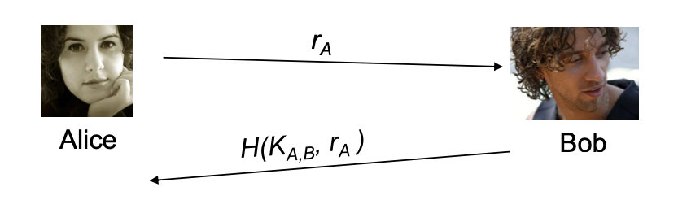

- Given only Alice and Bob know the shared secret KA,B, Alice knows that an attacker is not able to compute H(KAB , rA ). Therefore the response must be from Bob.
- Mutual authentication can be achieved by a 2nd exchange in opposite direction
- This type of authentication is based on a authentication method called challenge-response and used, for example, by HTTP digest authentication

• It avoids transmitting the transport of the shared key (e.g. password) in clear text

- Another type of a challenge-response would be, for example, if Bob signs the challenge "rA " with his private key
- Note that this kind of authentication does not include negotiation of a session key
- Protocols for key negotiation will be discussed in subsequent chapters
- Also note: this challenge-response protocol would allow chosen-message attacks that might allow an attacker to learn about k

### Common Cryptographic Hash Functions

- **Message Digest 5 (MD5, considered broken)**
  - Invented by R.Rivest, Successor to MD4

- **Secure Hash Algorithm 1 (SHA-1, considered broken)**
  - Invented by the National Security Agency (NSA) Inspired by MD4.
  - Old NIST standard

- **Secure Hash Algorithm (SHA-2)**

  - Invented by the NSA, Similarities with SHA-1
  - SHA-1 attacks have not been successfully extended to SHA-2
  - The SHA-2 family consists of six hash functions with digests (hash values) that are 224, 256, 384, or 512 bits
  - Current NIST standard

- **Secure Hash Algorithm (SHA-3)**
  - Keccak algorithm by G. Bertoni, J. Daemen, M. Peeters und G. Van Assche. (October 2012)
  - Current NIST standard (since August 2015), alternative to SHA-2.

#### MAC

- (Cryptographic) hashes alone do not protect against intentional tampering!
- MACs include a secret key K in addition to the message m they aim to protect
  - Only the persons with knowledge of K can (re-) compute the MAC
- Procedure
  - Sender s computes MAC\_k(m)
  - \<m, MAC\_k(m)\> is sent to receiver r
  - r receives \<m', MAC\_K(m)\>
    - r can compute MAC\_k(m') based on this knowledge of K and m'
    - If MAC\_k(m') = MAC\_k(m), he known that m=m', since nobody else had knowledge of K.
- MACs
  - **Do prove message integrity**
  - **Do detect tampering**
  - **Cannot be forged**
  - **Can be replayed (for same m)**

- Do MACs prove authenticity ?
  - It depends on scenario
  - If k is shared between Alice and Bob, Alice (Bob) knows that Bob (Alice) must have computed MAC\_(k)(m); comparable to challenge/response authentication
  - Also, an external observer cannot validate MACk(m) as k is unknown
- Is sMAC(m) = EncK (h(m)) a good MAC construction?
- Let us assume we use a stream cipher, so EncK (x) = x XOR s
 s is a bit stream generated by a pseudo-random number generator using k
- Problem: Attacker knows m, so they can compute h(m)
- The attacker now computes sMAC(m) XOR h(m) = EncK (h(m)) XOR h(m) = h(m) XOR s XOR h(m) = s!
- Note: The attacker does not know k , but for them it is sufficient to know s
- Now the attacker can simply compute h(m') XOR s = EncK (h(m')) = sMAC(m')
- Answer: With a stream cipher certainly not.
- With AES encryption this construction appears to be secure, as the attacker cannot use h(m) to break k

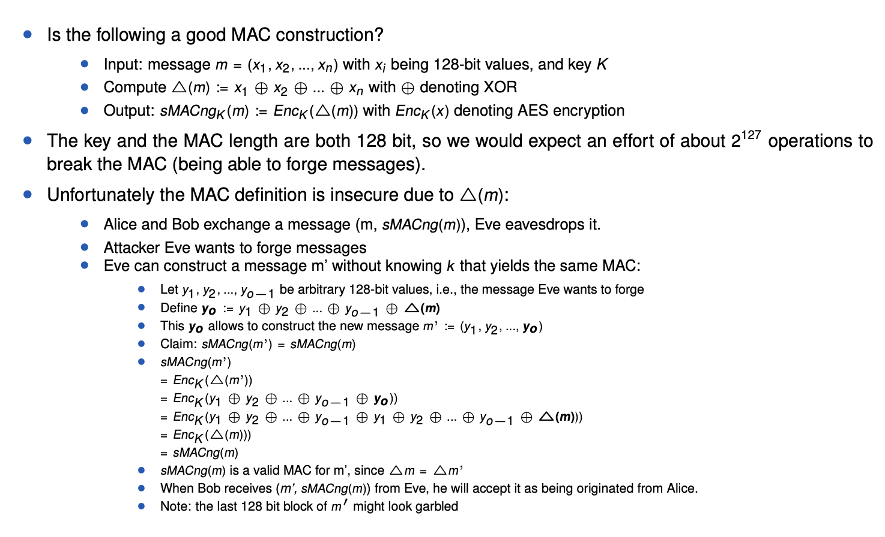

### Common MAC Functions

#### HMAC

- Standardized in RFC2104
- Used in conjunction with cryptographic hash functions (e.g SHA-3)

→ The construction H(K | m | K), called prefix-suffix mode, has been used for a while

- It has been also used in earlier implementations of the Secure Socket Layer (SSL) protocol. (until SSL3.0)
- However, it is not considered vulnerable to attack by the cryptographic community

→ The most used construction is **HMAC: H (K ❎ opad | H ( K ❎ ipad | m))**

- The length of the key K is first extended to the block length required for the input of the hash function H by appending zero bytes
- Then it is XOR'ed respectively with two constants opad and ipad
- The hash function is applied twice in a nested way
- Currently no attacks have been discovered on this MAC function

#### CBC-MAC

- Cipher Block Chaining MAC
- Recommended by NIST
- Based on CBC mode encryption (with AES)

→ A CBC-MAC is computed by encrypting a message in CBC Mode and taking the last ciphertext block or a part of it as the MAC:

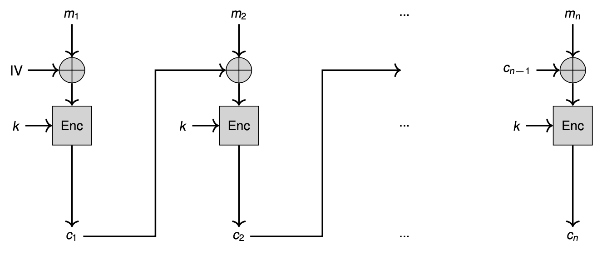

- MACk (m) = c\_n for some publicly known, fixed, IV.
- This MAC needs not to be mixed with a secret any further, as it has already been produced using a shared secret K.
- This scheme works with any block cipher (AES, Twofish, 3DES, ...)
- It is used, e.g., for IEEE 802.11 (WLAN) WPA2, many modes in SSL / IPSec use some CBC-MAC construction.

→ CBC-MAC Security

- CBC-MAC must not be used with the same key as for the encryption
- In particular, if CBC mode is used for encryption, and CBC-MAC for authenticity with the same key, the MAC will be equal to the last cipher text block
- If the length of a message is unknown or no other protection exists, CBC-MAC can be prone to length extension attacks. CMAC resolves the issue.
- Why the public, fixed IV ?
  - The IV is often part of the packet header and not protected
  - An attacker that exploits this vulnerability could then modify m1 to m1' without changing c\_n! (the MAC)
  - The attacker only needs to modify IV and use IV' so that

m1' ❎ IV' = IV ❎ m1!

→ CBC-MAC performance

- Older symmetric block ciphers (such as DES) require more computing effort than dedicated cryptographic hash functions, e.g MD5, SHA-1 therefore, these schemes are considered to be slower.
- However, newer symmetric block ciphers(AES) is faster than conventional cryptographic hash functions
- Therefore, AES-CBC-MAC is becoming popular.

#### CMAC

- Cipher based MAC
- AES-CMAC is standardized by IETF as RFC 4493 and its truncated form in RFC 4494

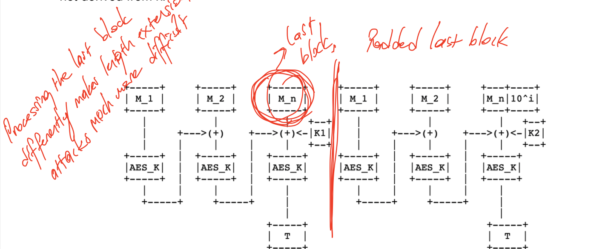

- CMAC (RFC4493) is a modification of CBC-MAC

- No IV, c.f. previous slide
- Compute keys k1 and k2 from shared key k.
- Within the CBC processing
  - XOR complete blocks before encryption with k1
  - XOR incomplete blocks before encryption with k2
  - k is used for the block encryption
- Output is the last encrypted block or the l most significant bits of the last block.
 • XCBC-MAC (e.g. found in TLS) is a predecessor of CMAC where k1 and k2 are input to algorithm and
 not derived from k.

What is the difference between CBC-MAC and CMAC

CBC-MAC (Cipher Block Chaining Message Authentication Code) and CMAC (Cipher-based Message Authentication Code) are both types of message authentication codes (MACs) that are used to provide data integrity and authenticity. However, they have some differences in terms of their construction and security properties.

- CBC-MAC is a type of MAC that uses the CBC (Cipher Block Chaining) mode of operation of a block cipher, such as AES, to generate a message authentication code. In CBC-MAC, the input message is divided into blocks and each block is processed through the block cipher in CBC mode, with the output of one block being used as the input to the next block. The final output is used as the MAC. One of the main security properties of CBC-MAC is that it is secure against chosen plaintext and chosen ciphertext attacks.
- CMAC, on the other hand, is a variant of the CBC-MAC that uses a simplified construction that eliminates the need for the decryption operation in CBC-MAC and increases the performance. CMAC uses a keyed function (such as AES) to generate a message authentication code. It is also a block cipher-based MAC and it also uses a block cipher in a specific mode of operation, known as the OFB mode (Output Feedback Mode) to generate the MAC. CMAC is also secure against chosen plaintext and chosen ciphertext attacks, and is considered more efficient than CBC-MAC.

In summary, both CBC-MAC and CMAC are types of message authentication codes that use a block cipher to generate a message authentication code, however, they differ in the specific construction and mode of operation of the block cipher used. CBC-MAC uses the CBC mode of operation, while CMAC uses the OFB mode, and CMAC also eliminates the need for decryption operation making it more efficient.

#### Poly1305

- Standardized in RFC 7539

→ Reasons for constructing MACs from cryptographic hash functions

- Cryptographic hash functions generally execute faster than symmetric block ciphers (Note: with AES this is not much of a problem today)

- There were (are) no export restrictions to cryptographic hash functions

→ Basic idea: "mix" a secret key K with the input and compute a hash value

→ The assumption that an attacker needs to know K to produce a valid MAC nevertheless raises some cryptographic concern

- The construction H(K || m) is not secure
- The construction H(m || K) is not secure
- The construction H(K || p || m || K ) with p denoting an additional padding field does not offer sufficient security
- The length extension attack might be possible
  - Idea: Attacker has m, MAC = H (K || m) appends something to m → m…x initializes H with MAC continues to feed x into H → H(K || m || x)

→ Chapter 7

## Random Numbers

### Entropy

- Randomness can be described by unpredictability
- And unpredictability is good for security, as an attacker, e.g cannot predict a secret key
- A measure for "unpredictability" is entropy
- Let X be a random variable which outputs a sequence of n bits,
  - g X={0,1} or X= {00,01,10,11} , etc
- The Shannon information entropy of X is defined by:

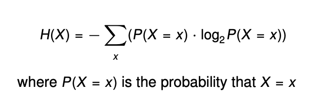

- Entropy is maximized for a uniform distribution
  - Every bit is equally likely
  - Def:: truly random
- In this case H(X) = n^1
- Examples for n = 2: H(X) = 2 for n = 4 H(X) = 4

### Entropy of a 128 bit vector

- A key of 128 bit (=16 Byte) should have an entropy of 128
- Let us assume we obtained the following key from a random variable
  - 010101 0001010100…010101010001010100 (16 Byte = 128 Bit)
- What is the entropy of this key ?
- It depends on what we know about the key ?
- Let us assume all random keys are 16 character passwords in ASCII encoding:

TTTTTTTTTTTTTTTT (uses 16 Byte = 128 Bit ASCII encoding)

- ASCII needs only 7 bit of a byte; for this reason the 8th bit is set to zero
  - In other worlds: every 8th bit is not random !
  - This reduces entropy to 128 - 6 = 122
- Let us assume all random passwords consist of 16 equal ASCII characters
  - When all 16 characters are equal, entropy drops to 112/16 = 7
- Let us assume all random values are printable
  - Entropy is about 6.56
  - (As there are 95 printable ASCII characters, so we need to log\_2(95) = 6.56 bits to encode)

### Collecting Entropy

#### Hardware based

- (Approach: observe physical non-predictable phenomena)
- Time between emission of particles during radioactive delay
- Thermal noise from a semiconductor diode or resistor
- Frequency instability of a free running oscillator
- The amount a metal insulator semiconductor capacitor is charged during a fixed period of time
- Noise of microphone or camera
- Lava lamps

#### Software based

- The system clock (Caution: low entropy → attacker might guess correct time)
- User input ( mouse movement, keystrokes, time between keystrokes, etc)
- OS stats, e.g network or CPU load
- Content of buffers
- In practice: use /dev/random and combine sources !

→ Attacker must not able to guess/influence the collected values


### Pseudo-Random Number Generator (PRNG)

- Getting entropy is expensive
- Pseduo-Random Number Generator (PRNG):
  - Deterministic algorithm
  - Input: Small amount of initial entropy, ideally from a hardware RNG(Seed)
  - Output: Sequence of random looking numbers calculated using the seed as input
- "Cheap" randomness

→ Cryptographically Secure Pseudo Random Number Generator (CSPRNG)

- **Important: The length of the seed should be large enough to make brute-force search over all seeds infeasible**
- The output should be indistinguishable from truly random sequences
  - No polynomial-time algorithm can correctly distinguish between an output sequence of the generator and a truly random sequence
- The output should be unpredictable for an attacker with limited resources, without knowledge of the seed.
  - No polynomial-time algorithm can predict the next bit of the generator with probability \> 0.5 ("next-bit test")

- Mathematically proven CSPRNG:
  - Blum-Blum-Shub generator
  - Blum–Micali algorithm
  - Note: Both approaches are relatively inefficient
- Used in practice:
  - CSPRNG based on cryptographic hash functions
  - CSPRNG based on symmetric encryption mechanism
  - Note: In both cases, security of the approach couldn't be shown mathematically.
 However, not efficient/working attacks are known.

- A CSPRNG produces a bitstring of 2048 bit
- What is the max. possible entropy of this string?
- min(Length of the seed, 2048)
- usually: Length of the seed

→ Chapter 8

## Asymmetric Cryptography

### Public Key Cryptography

#### Motivation

→ Why would we need Public Key Cryptography ?

- Introduced ciphers and authentication mechanisms require a common, pre-shared, secret key.
- Out-of-band sharing is not always an option
- Key exchange needs to be conducted securely
- Symmetric mechanisms require a considerable amount of keys in the system 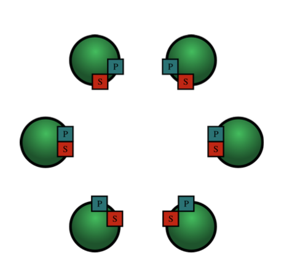
- Asymmetric Crypto reduces this number

→ Assume n parties, only unique keys and **asymmetric** crypto:

- Every party has a public key and private key
- Every party keeps their own private key secret
- Every party publishes their public key
- Amount of secret keys in the system:

- Different keys used for en-/decryption:

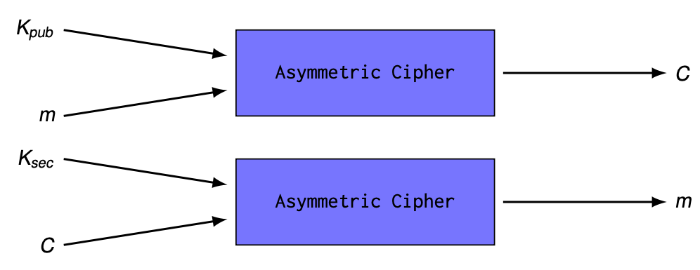

#### Symmetric vs Asymmetric Encryption

- Benefits of asymmetric encryption mechanisms include
  - Number of keys needed in a communication system is reduced
  - Public keys are not required to be exchanged between participants of the communication system via a secure channel that guarantees confidentiality of the key
- But what about integrity and authenticity of the exchanged public key ?
- Example: Can we just ….
  - … publish a public key on a website?
  - … send a public key via mail to friends ?
- Certainly not, as the integrity and authenticity of the received key cannot be guaranteed
- Note:
  - Additional mechanisms are needed that map an identity (name, email address, URL, … ) of an entity to their public key
  - Examples: X.509 public key infrastructure, PGP/GPG Web of Trust, etc.
  - Security of network communication secured by asymmetric cryptography heavily depends on the correctness of this binding


### RSA Cipher

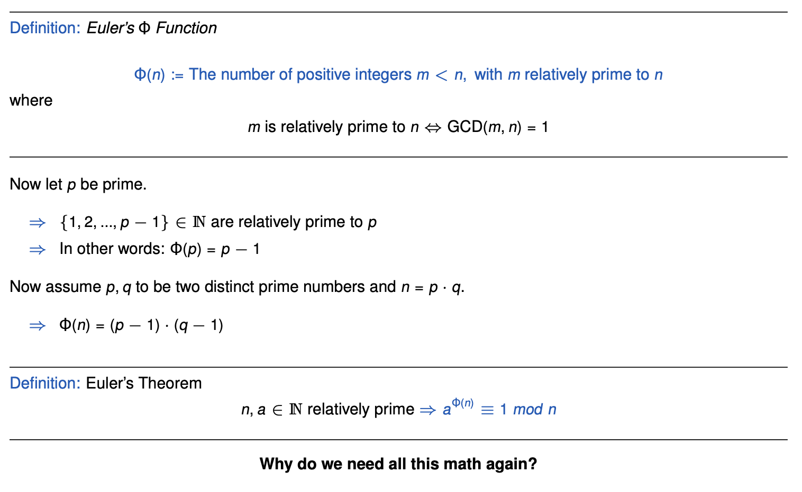

#### Key Generation Process

1. Randomly choose distinct, large primes p,q
  1. Large primes ⇒ Hundreds of bits, 100-200 digits each
2. Compute
  1. n=p.q
  2.
3. Pick e ∈ ℤ such that:
  1. 1 \< e \<
  2. e relatively prime to
4. Find d using the Euclidean Algorithm such that:

- 97ie . d ☰ 1 mod
- d is multiplicative inverse of e modulo

→ The generated keys are:

Kpub = (n, e)

Ksec = (n, d)

→ Security of the scheme based on hardness of prime factorizing n in p and q, which allows to compute and subsequently the private exponent d.

### Public Key Algorithm

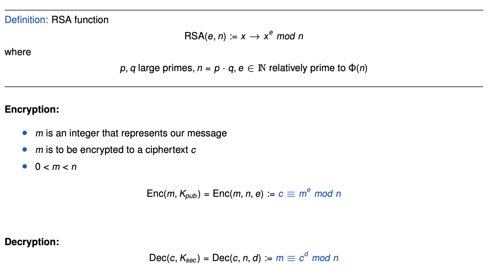

### RSA Cipher

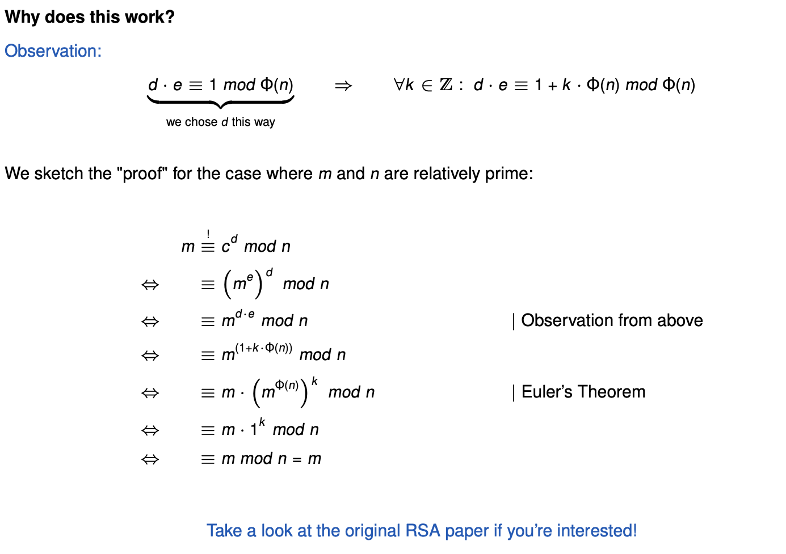

### RSA for Confidentiality

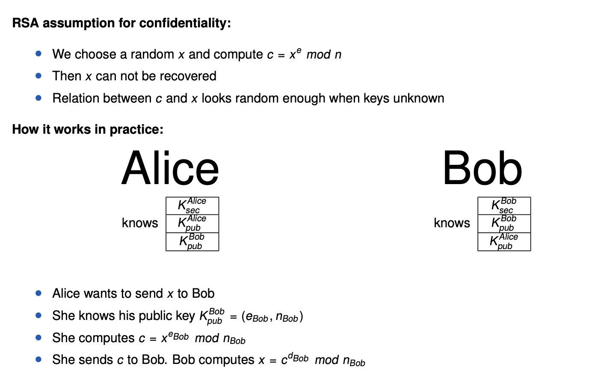

→ Problems:

- Pure Textbook RSA is deterministic
- Thus, same inputs correspond to same outputs c.f AES-ECB etc.
- Chosen-Plaintext-Attack scenario:
  - Adversary A wants to decipher cj
  - A sends messages mi
  - A receives corresponding ciphertexts ci
  - If cj = ci , A can infer that mj = mi
- Other issues
  - What if m = 0? ⇒ c = 0
  - What if m^e \< n ? ⇒ c = m^e mod n = m^e ⇒ m = eKOKc

⇒ In order to achieve confidentiality we need to use a suitable encryption scheme based on RSA !

**Solution:**

- Employ Padding ("enlarges m")
- Add random bits ("adds non-determinism". "Avoids 0")
- Schemes PKCS, OAEP

→ OAEP (Optimal asymmetric encryption padding)

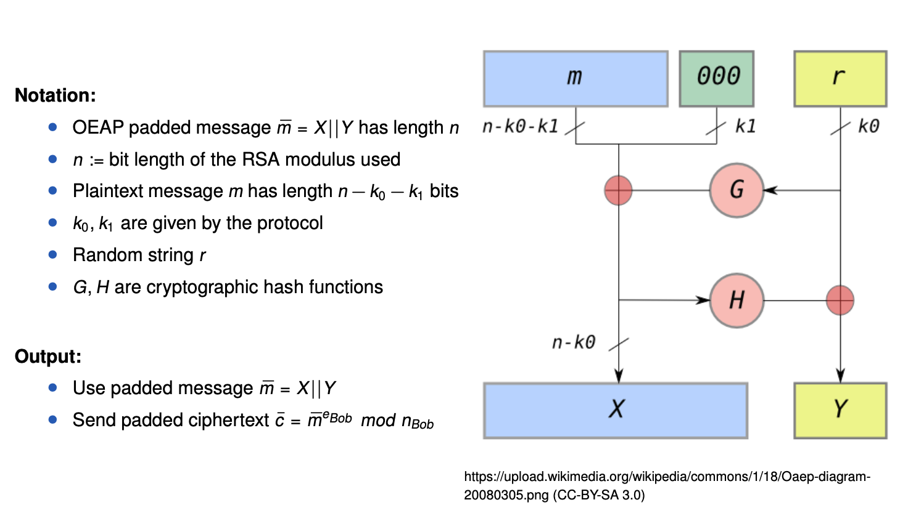

### RSA for Integrity

If Ksec is used for encryption, anyone knowing Kpub can decrypt!

• Encryption with private key Ksec generates a signature

• Remember the definition of our signature function: m, fi := sign\_k (m)

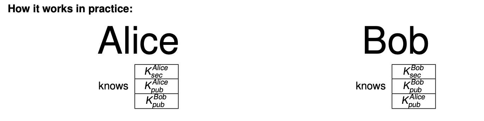


→ **Can we do better ?**

- Dedicated signature schemes exists
- Example: RSA-PSS part of PKCS standards
- RSA-PSS hashes m twice, adds padding and salt
- Result is encrypted with K\_sec

## Hybrid Encryption Scheme

→ Problems with Asymmetric Crypto

- Very expensive
- Orders of magnitude slower than symmetric crypto or hashing
- Unsuitable to encrypt larger amounts of data

→ Idea

- Hybrid Encryption Scheme
- Use public key cryptography to securely exchange (ephemeral) symmetric key
- Use symmetric cryptography to encrypt the actual payload data

#### Key Agreement

→ New idea

- Alice does not decide and send a symmetric key
- A key agreement protocol is used to establish a shared key
- Key agreement protocols usually also
  - Authenticate the entities
  - Provide additional communication problem
- Well-known example: **Diffie-Hellman key exchange Protocol**

### Diffie-Hellman Key Exchange

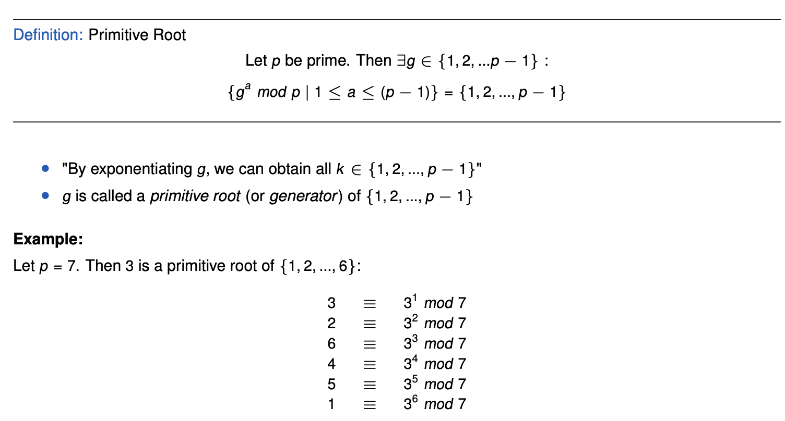
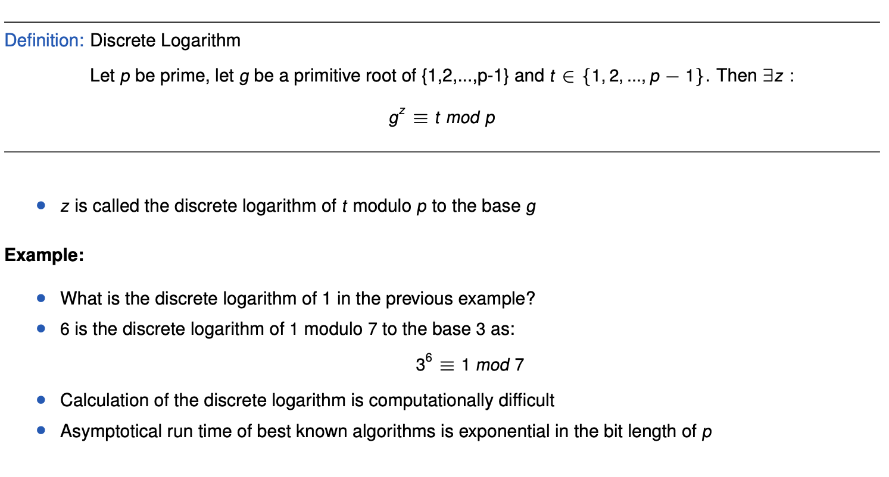
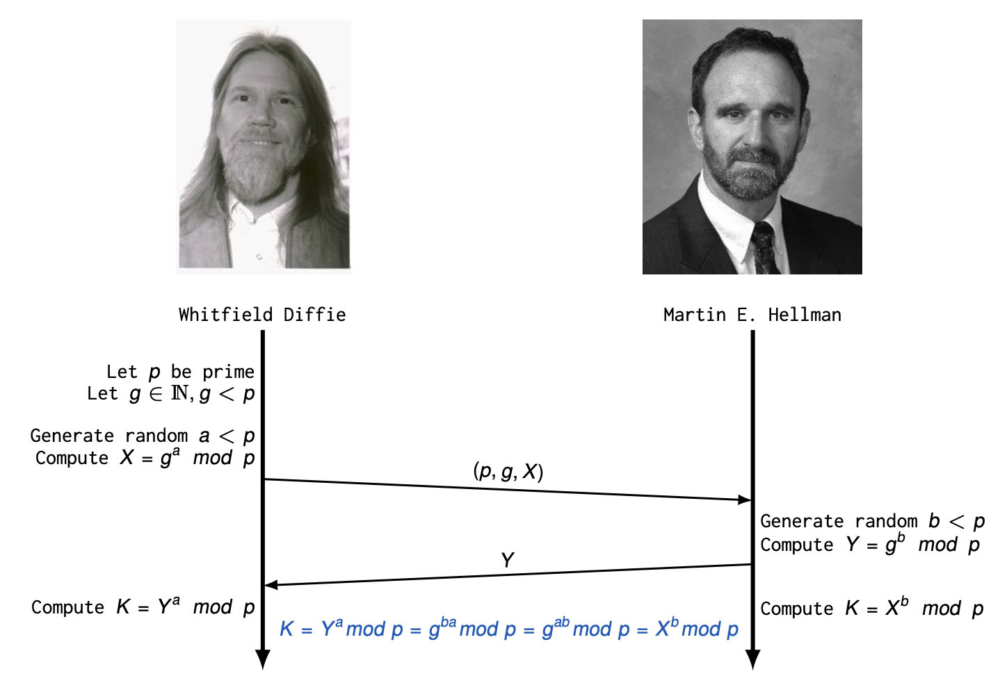


→ Remarks:

- The diffie-hellman construction contains weak values e.g a = 0, b = 0
- Certain combinations of g and p
- There is also Diffie-Hellman based on Elliptic Curves called ECDH

→ Maybe even more important:

- The previous protocol protects against passive attacks like eavesdropping
- However, an active Machine/Man in the middle attacker (eve), might intercept communication between Alice and Bob
- Eve performs two DH key exchanges: one with Alice, one with Bob
- Result: Eve established K1 between herself and Alice and K2 between herself and Bob
- Eve is now able to decrypt, re-encrypt and forward messages between Alice and Bob
- Alice and Bob are unaware of this problem !
- Important: Integrity and authenticity of DH key exchange messages must be protected with digital signatures → This is called **Authenticated DH !**

#### Perfect Forward Secrecy

Alice sends messages to Bob, messages are encrypted with a session key, attacker eavesdrops all messages (including key exchange-related ones) and saves them for later (ab)use …

→ Scenario 1:

Each session key is picked by Alice and sent to Bob encrypted with Bob's public key.

Old session keys are deleted

- If the attacker gets access to Bob's private key (long-term key)...
- … they **can decrypt saved old and new key exchange messages** and …
- … they **can decrypt saved al and new messages using the obtained session session keys !**

→ **Scenario 2:**

For every new session a new session key is agreed on using authenticated Diffie-Hellman.

Old session keys and DH parameters are deleted

- If the attacker gets access to Bob's private key (long-term key),...
- … **they cannot compute old session keys (and decrypt messages) as the security of session keys does not depend on the long-term key but on the DH problem !**
- But: an active attacker can impersonate Bob in future runs of the authenticated DH key exchange protocol.

### Public Key Cryptography

- Elliptic Curve Cryptography (ECC) is another public key crypto variant
- ECC requires les key bits to achieve similar security to RSA
- ECC is usually more efficient than RSA
- Comparable level of security:
  - 256 bit ECC
  - 3072 bit RSA/DH
  - 128 Bit Symmetric Key Crypto
  - 256 Bit Cryptographic Hash function
- Also, exciting novel cryptographic systems are emerging → Threshold Signature Schemes

### Threshold Signature Schemes

→ Motivation:

- Identified challenges with classical public key cryptography
  - What if the Ksec key gets compromised ?
  - What if the node that stores Ksec is not available or gets destroyed ?
  - What if we need more than one entity to sign, think "distributed system" ?

- Approach
  - Distribute K\_sec into n shares
  - Each share is stored on an individual node
  - Threshold signature schemes requires t out of n nodes to be active during the signing

- Threshold signature schemes solve above challenges
  - Attacker needs to compromise t nodes to compromise the Ksec
  - If at least t nodes remain functional, a signature can be computed - availability
  - Each node can decide if it want to participate in the signing process.

- Variety of interesting use-cases:
  - Cryptographic wallets - both custodial and private wallets
  - Public key infrastructure (PKI)
  - Byzantine Fault Tolerance (BFT) protocols

→ Focusing on signing scheme, three main steps:

1. Key generation (Setup)

- Trusted setup - relies on trusted 3rd party
- Untrusted setup - Distributed Key Generation (DKG)

1. Signing
  1. Always distributed
  2. Varies for different threshold signing scheme - ECC based or RSA based
  3. Deterministic signature e.g BLS [1] are easier to implement than non-deterministic schemes e.g ECDSA
  4. Challenges with non-deterministic schemes comes due to generation of random nonces
2. Verification
  1. Nothing changes compared to classic public key cryptography
  2. e private key is distributed, public key is not
  3. Public key is sufficient to verify threshold signature

#### Key Genaration – Trusted Setup – Shamir's Secret Sharing

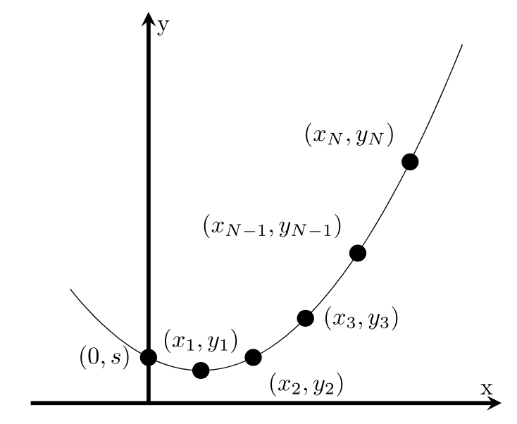

- **Points on a curve :** Trusted party generates Ksec and distributes to n shares, polynomial of degree t - 1 with n points

- **Secret key** : Ksec is a point on the (0,s)

- **Signing** : Ksec is never reconstructed again during the signing

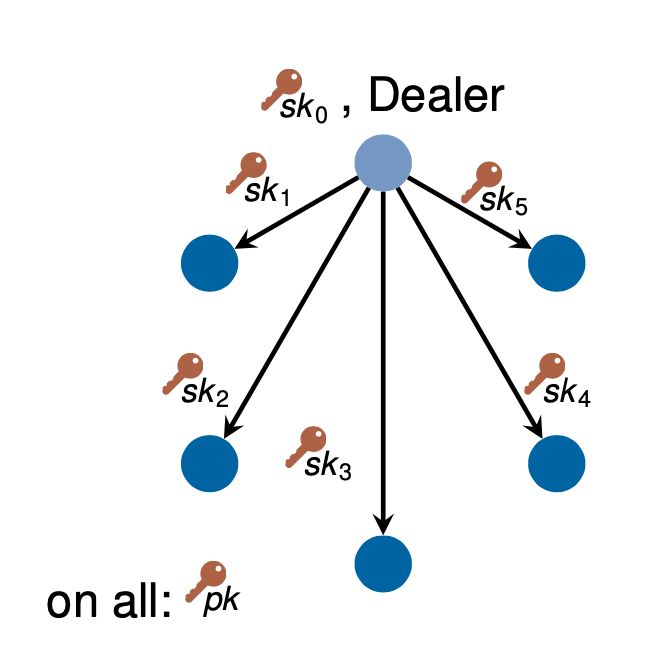

→ Key generation - Trusted Setup

- **Initialization:** Trusted party generates Ksec and distributes to n shares, polynomial of degree t-1 with n points
- **Secret sharing:** Stores Kseci on individual nodes in the system
- **Signing:** Each part uses Kseci for signing

-m, 𝝈 := sign\_Kseci (m)

→ Key Generation - Untrusted setup (DKG) using verifiable secret sharing (VSS)


- **Initialization** : No part has a Ksec at a single place, parties collaboratively agree on key shared Kseci
- **Secret sharing:** Each node in the system has at the end Kseci
- **Signing:** Each party uses Kseci for signing

-m, 𝝈 := sign\_Kseci (m)

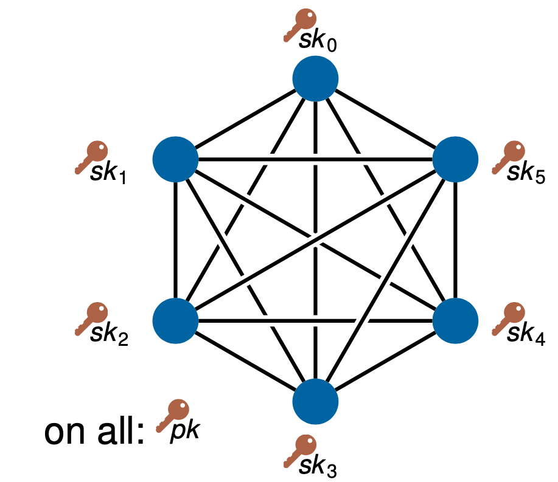

→ Signing Phase

- **Start of Signing:** Client sends a message m to all nodes
- **Signing** : Each node sends their partial signature to the aggregator/client
- **Interpolation** : The aggregator/client combines individual partial signatures once it receives t responses to a full signature.

→ Summary

- Threshold signature ensures Ksec confidentiality
- Allows for better availability and distribution of power among involved parties
- Variety of interesting use-cases:
  - Cryptographic wallets
  - Public key infrastructure (PKI)
  - Byzantine Fault Tolerant (BFT) protocols
- Many threshold signature schemes for various signature families e.g ECDSA, BLS, Schnorr
- Active area of research in last years

- Similarly like for public key cryptography ECC is a large topic
- Variety of ECC schemes based on ECDSA, Schnorr, Boneh-Lynn-Shacham (BLS)
- Active research of Post-quantum threshold signature schemes
- Focused on signing but it can be used also for decryption
- Performance evaluation, scalability ?

→ Chapter 8

What does a secure channel provide ?

- Confidentiality, Integrity, Authenticity
- Messages received in correct order
- No duplicates/replayed messages (Bonus: we know which messages are missing)

Where are such constructions used ?

- Virtual private network protocols (VPN) like OpenVPN, IPSec, Wireguard
- Transport layer security protocols like TLS, DTLS
- Secure messenger applications like Signal

→ Secure channels require a long term (symmetric or asymmetric) key to work

→ Exchanging/agreeing on long term keys is often done out of band

→ MAC-then-Enc vs. MAC & Enc vs. Enc-then-MAC

- How can we achieve confidentiality, integrity and authenticity ?
- Using a symmetric cipher and a MAC algorithm
- We have several options to construct possible protocol designs that differ in the order of application of MAC and encryption algorithms

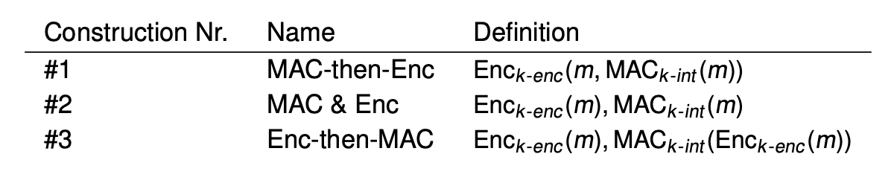

Note:

- Security differs between the options
- We are using different keys for encrpytion and integrity protection: k-int and k-enc
- K-int and k-enc can be derived from a session key k using a key derivation function KDF

(KDF : H(K||int) = K-int, H(K||enc) = k-enc)

-

- We first create the MAC of m, then we encrypt m and the MAC together
- Claim: The encryption protects the MAC \> FALSE
  - Encryption does not provide any message authenticity/integrity !
  - A strong MAC does not need "protection"

- We decrypt not authenticated ciphertext
  - It adds additional layer, which is not required when we use strong MAC values

- Example: A weak MAC cannot be "protected" by encrypting it
  - CRC is wrongly used as a MAC. OTP is perfect encryption and shall protect the MAC
  - does not provide any integrity
  - Attacker can XOR x to encrypted message and XOR CRC(x) to the encrypted CRC to fix it
  - CRC is linear !!

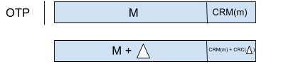

- Was used by the TLS precursor SSL
- Many SSL attacks are/were a result of this scheme !
- Padding Oracle attack comes from Enc-then-MAC principle


- "We independently encrypt m and compute a MAC of m"
- Not better than
- Can be attacked when MAC is weak, c.f discussion for MAC-then-Enc
- Scheme is considered the weakest of our three options
- **Used by (at least) old SSH versions**


- **We first encrypt m, then we compute a MAC over the ciphertext c.**
- **c ←**
- Considered secure
- Integrity of ciphertext is verified before decryption
- Allows to discard messages where the verification failed (non-authentic messages)
  - Don't waste CPU power
  - Don't generate error messages that might help an attacker
  - Don't process non-authentic data!
- Used by IPSec(ESP) Signal (TextSecure ProtocoV2), TLS 1.3 [RFC7366]
- Currently considered the strongest of our options

### Secure Channel Implementation

- We need
  - Message numbering
  - Encryption
  - Authentication
- Our Toy implementation
  - Message numbering: n
  - Encryption: AES-128-CTR

c ← 

- Authentication: HMAC-SHA-256

- Keys for each purpose

→ Message numbering

- 
- Increased monotonically for each valid message
- n must be unique for every message
- Remember last  message and only accept 
- Detect replay attacks
- Guarantee correct order of messages
- Detect lost messages
- Number overflow → rekeying

Otherwise replay attacks would be possible

→ Implementation

- AES-128-CTR mode needs IV:
-  

-  is of length 128 bit: we chose 120 bit IV and 8 bit i

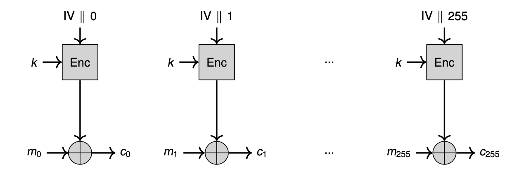


- Max message size per IV:   = 32768 bit = 4096 bytes
- For 
- Messages longer 4096 bytes must be fragmented

- Nonces as IV for AES-CTR:

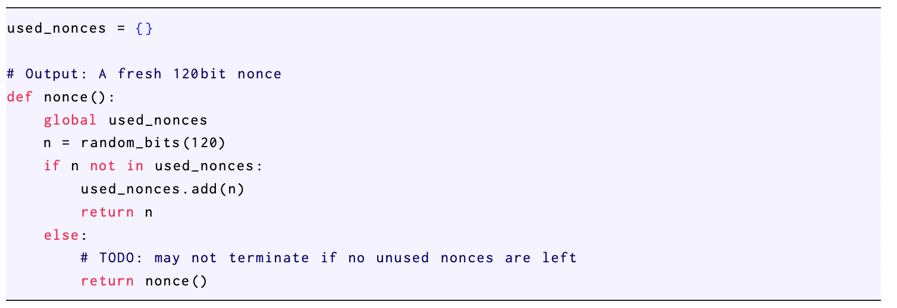
- We want a fresh IV → remember used nonces
- We are super paranoid:
  - Random nonces
  - A counter would suffice

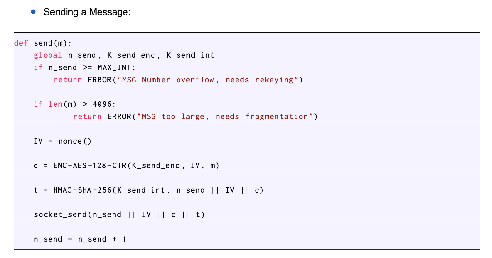

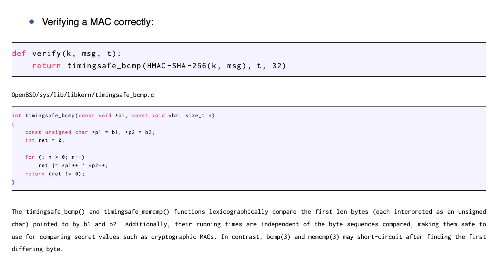

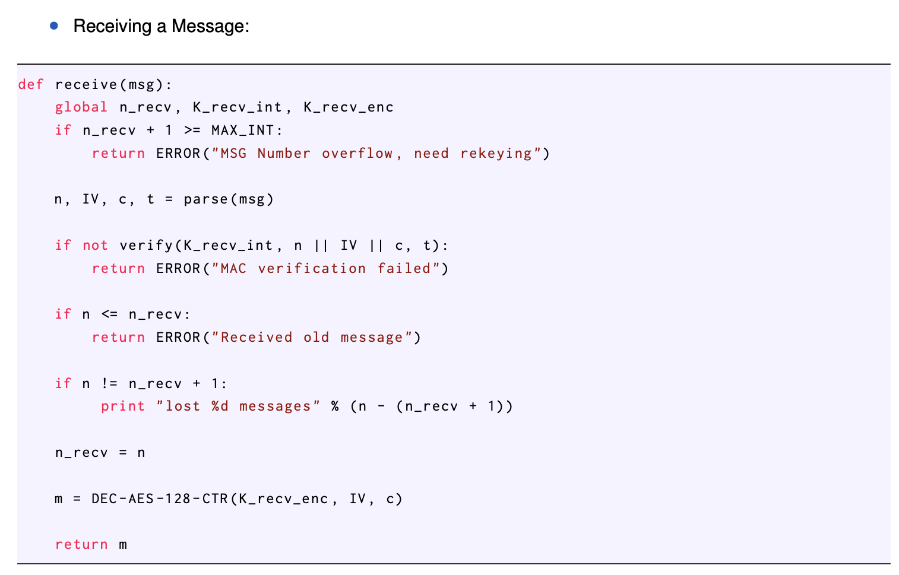


### Authenticated Encryption With Associated Data (AEAD)

- In order to establish a secure channel, quite a lot has to be considered:
  - Encryption (selection of the right cipher and mode of operation, IV, sequence numbers, key)
  - Integrity protection/authentication (selection of the right MAC construction, key, feed the right parameters (IV, sequence numbers, ciphertext) into the function
  - Using the crypto primitives in the right order (Enc-then-MAC)
- Possible Problems:
  - Design and/or implementation errors
  - Performance: in our toy example, the data, i.e first the plaintext, then the ciphertext, had to be processed in two separate steps. It would be desirable to have a "one pass" solution !

- All in one solution:
  - Authenticated Encryption With Associated Data (AEAD) → header data like IV

→ Definition:

- One pass encryption and MAC calculation for payload including "associated data"
- Associated data (AD): Additional non-encrypted but authenticated (header) data e.g
  - IV
  - Sequence numbers
  - Information necessary for message routing
  - ….

→ Benefits

- Security: AEAD algorithms correctly combine message encryption and authentication and are standardized; errors by inexperienced programmers can be avoided
- Performance: AEAD algorithms only need one pass over the data

→ Examples:

- Galois/Counter Mode (GCM)
- Offset Codebook Mode (OCB)

### Galois Fields and Galois Field Multiplication

- Galois Field (GF)
  - Contains a finite number of elements → finite field
  - Multiplication and summation of elements of a Galois field results in an element of the same field
  - GF( contains 1011 that can be interpreted as the polynomial
  - Coefficients of the polynomial can only be 0 or 1
  - So, e.g: ()+1 (Binary: 1011 + 0001) is not (Binary: 101?) but (Binary: 1010)
- Galois Field Multiplication is based on polynomial multiplication modulus a specific irreducible polynomial g(x)
  - Irreducible: the polynomial cannot be factored into the product of other polynomials

AEAD != Secure Channel

AEAD only takes care for confidentiality, integrity, authentication

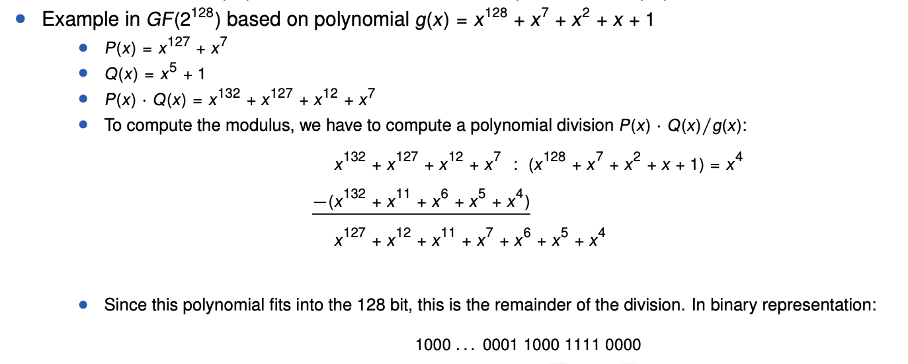
### Galois/Counter Mode (GCM)

- Galois/Counter Mode (GCM)
  - Developed by John Viega and David A. McGrew
  - Standardized by NIST in 2007, IETF standards for cipher suites with AES-GCM for TLS (SSL) and IPSec exist.
  - Follows the Encrypt-then-MAC concept
  - Combines concept of Counter Mode for encryption with Galois Field Multiplication to compute MAC on the ciphertext
  - GF( based on polynomial g(x) =

- Definitions
  - H = Enc(k,0),0: 128 bit set to 0
  - Authenticated Data is data not to be encrypted. GCM generates check value by XOR and GF multiplication with H for each block
  - For the MAC, this process continues on the ciphertext and a length field in the end.

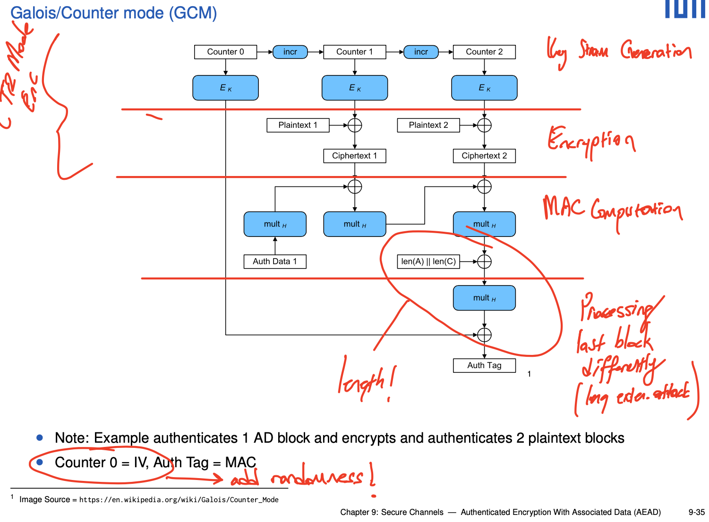

### Offset Codebook Mode (OCB)

- Offset Codebook Mode
  - Authenticated Encryption Mode of block ciphers
  - Proposed 2001[OCB1]
  - Standardized May 2014[RFC 7253]
  - Encryption:
    - Inspiredby ECB
    - However, block-dependent offsets mask plaintext blocks to avoid ECB problems like determinism !
  - Associated Data AD
    - AD is not encrypted but authenticated
    - For example: Unencrypted header data

  - MAC
    - Checksum = XOR over plaintext, length- and key-dependent variables
    - MAC = (Encryption of checksum with shared key k ) XOR (hash(k,AD))
    - Note: hash() is specific for OCB and also part of the standard

  - Requires only one key K for encryption and authentication

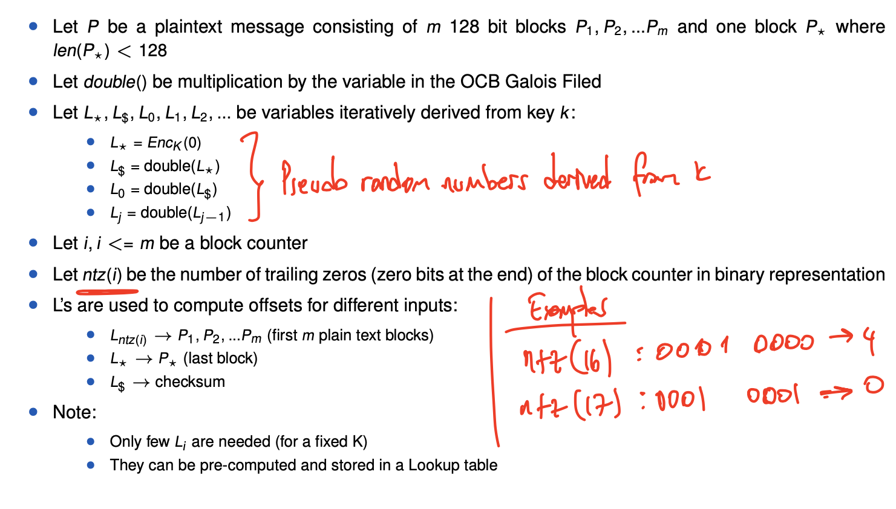

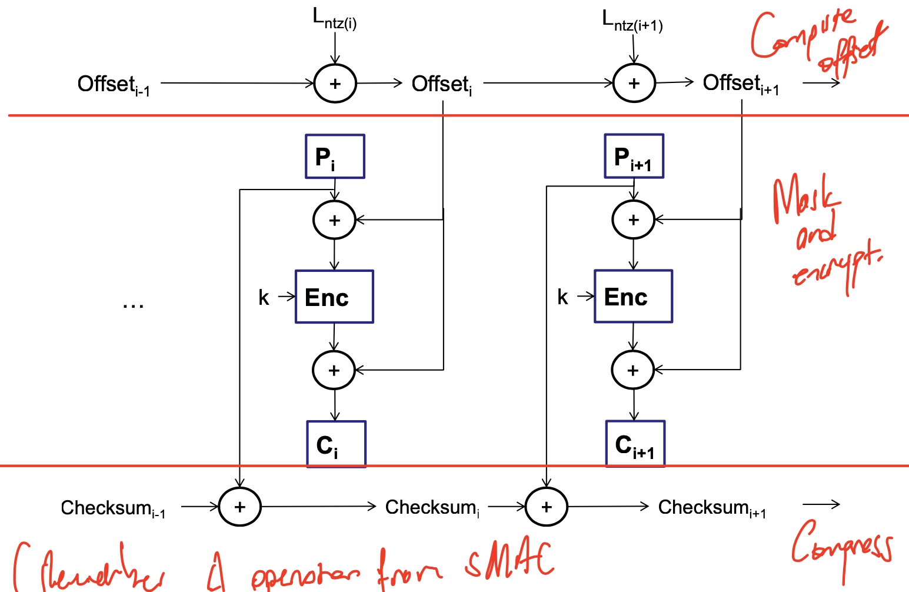


### OCB Initialization

- Offset\_0 is computed by a specific function depending on the key and a nonce
- "It is crucial that, as one encrypts, one does not repeat a nonce." [RFC 7253, §5.1]
 Otherwise identical messages would be processed identically (same ciphertext, same MAC)
- Nonce may not be random, e.g. a counter works fine
- A new nonce for every authenticated encryption API call is needed!
- Details about the initialization: http://www.cs.ucdavis.edu/ rogaway/ocb/ocb-faq.htm

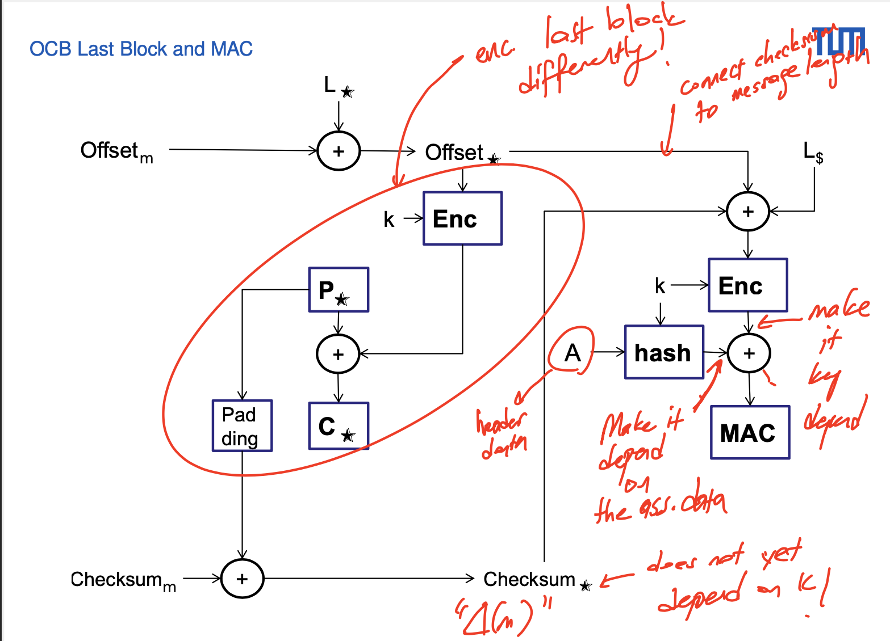

• Question: XOR plaintext and then encrypt, that sounds like the weak MAC example from slide 6.19. Why is OCB secure?

- The attack on 6.19 was possible, as the attacker knows m and can easily forge the "magic" block yo , which does not depend on any secret.
- With OCB, the attacker cannot apply the same trick as they neither know or can compute

•  and

• 

• and lastly, the attacker does not know m, as it is encrypted.

• "_OCB enjoys provable security: the mode of operation is secure assuming that the underlying blockcipher is secure. As with most modes of operation, security degrades as the number of blocks processed gets large" [RFC 7253]_

### Attacks against a Secure Channel (Stream Cipher)

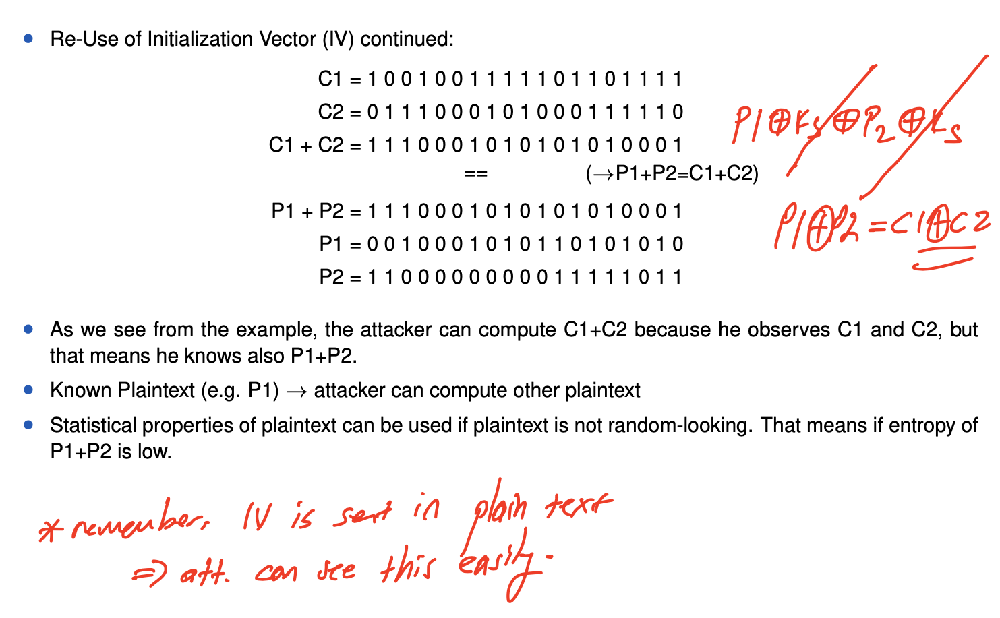

### Attacks against a Secure Channel (Padding oracle)

### → Guessing a secret (revisited)

- Passwords
  - N: size of alphabet (number of different characters)
  - L:length of password in characters
- Complexity of guessing a randomly-generated password / secret
  - The assumption is, we generate a password and then we test it

→ 

- Complexity of guessing a randomly-generated password character by character
  - The assumption is that we can check each character individually for correctness
  - For each character it is N/2 (avg) and N (worst case)
  - So, overall L \* N/2(avg) → O(L.N)

- In the subsequent slides we will show an attack that reduces the decryption of a blockcipher in CBC mode to byte-wise decryption (under special assumptions)

#### MAC-then-Encrypt-Issues

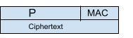

→ Operation

- P and MAC are encrypted and hidden in the ciphertext
- Receiver
  - Decrypts P
  - Decrypts MAC
  - Computes and checks MAC → MAC error or success

→ Consequence

- MAC does not protect the ciphertext
- Integrity check can only be done once everything is decrypted
- As a consequence, receiver will detect malicious messages at the end of the secure channel processing and not earlier
- But is that more than a performance issue ? Well, yes.

#### MAC-then-Encode-then-Encrypt

- If we use a block cipher, we have to ensure that the message encoding fits to the blocksize of the cipher
- Encode-then-MAC-then-Encrypt
  - Format P so that with the MAC added the encryption sees the right size
  - Needs that we know the size of the MAC and block size of cipher when generating P | padding

#### MAC-then-Encode-then-Encrpyt 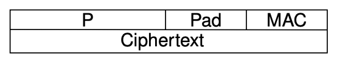

- Used in TLS/SSL
- Here, we add the MAC first and then pad the P | MAC to the correct size
- How do we know what is padding and what not ? Padding in TLS/SSL:

  - If 1 byte of padding is needed, the padding is 1 (i.e. one byte encoding the value 1).
  - If 2 bytes of padding are needed, the padding is 2 2 (i.e. two bytes encoding the value 2).
  - If 3 bytes of padding are needed, the padding is 3 3 3 (i.e. three bytes encoding the value 3).
  - …… 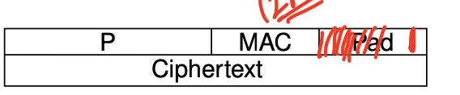
- What happens, when a complete plaintext block accidentally ends with correct padding ?
  - Append a full building block FFF…FF (i.e 16 bytes encoding the value 16)

#### Oracles and Side Channels

- In ancient times, people asked oracles for guidance
- In computer science, oracles are functions that give cheap access to information that would otherwise be hard to compute
  - E.g O(1) cost to ask specific NP-complete question → polynomial hierarchy
- In cryptography, an attacker can trigger some participant O in a protocol or communication to leak information that might or might not be useful.
  - Participant O may re-encrypt some message fragment
  - Participant O responds with an error message explaining what went wrong
  - Response time of participant O may indicate where error happened
  - Response time may leak information about key if processing time depends (enough) on which bits are set to 1.
    - More obvious for the computationally expensive public key algorithms, but implementations of symmetric ciphers have also been attacked.

####


→ Side channel attacks

- A general class of attacks where the attacker gains information from aspects of the physical implementation of cryptosystem.
- Can be based on: Timing, Power Consumption, Radiation….

→ Padding Oracle

- The oracle tells the attacker if the padding in the message was correct
- This may be due to a message with the information
- It can also be due to side channel like the response time

→ Concept of Padding Oracle Attack (against CBC) 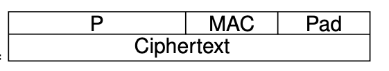

- Attacker sees unknown ciphertext C =

that was sent from Alice to Bob


- To decrypt the ciphertext, the attacker modifies C and sends it to Bob:

- It is unlikely that the MAC and padding

are correct. So, Bob will send an error back to Alice (and the attacker)

- In earlier versions of TLS, Bob sent back different error messages for padding errors and for MAC errors.

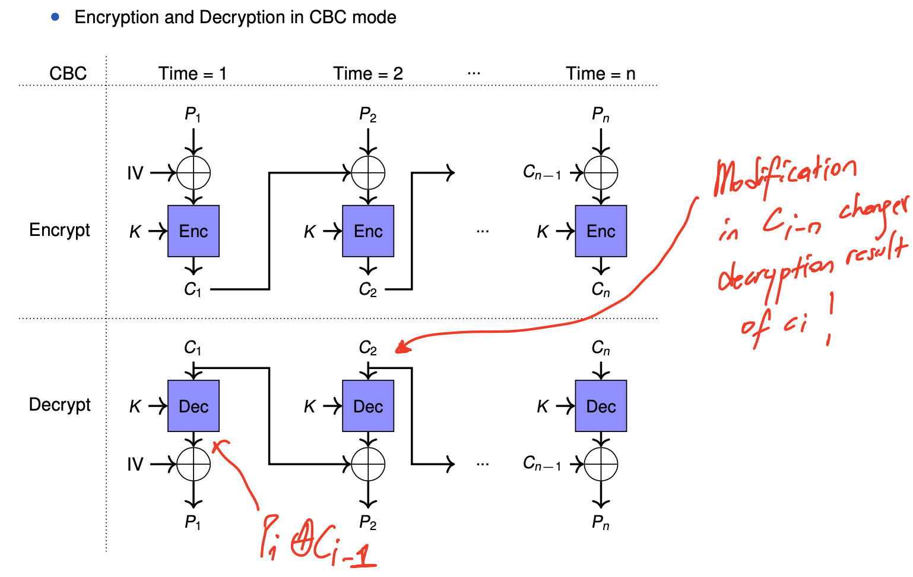

→ Padding Oracle Attack against CBC

- Assumptions:
  - Attacker got hold of a ciphertext C (n blocks, N bytes per block)
    - C was protected with Encryption in CBC mode used in MAC-then-Encode-then-Encrypt mode
    - For padding PKCS7 was used (padding of 1 byte: pad =1, 2 bytes → 2,2 …)
  - An oracle replies to sent ciphertexts with error messages
    - Padding error if padding does not match (checked before MAC)
    - MAC error if padding fits but MAC is wrong
  - Goal: Decrypt the complete ciphertext using the oracle

- Approach:
  - Start decrypting the last byte of the last  block by altering  and sending the resulting ciphertext C' to the oracle
  - When the oracle replies with a MAC error  can be calculated.

- Change the last byte of the original ciphertext block by XORing  it with a chosen :

- Then send  to the oracle
- Padding error returned:
  - Try again using a new  (max of 256 tries needed)

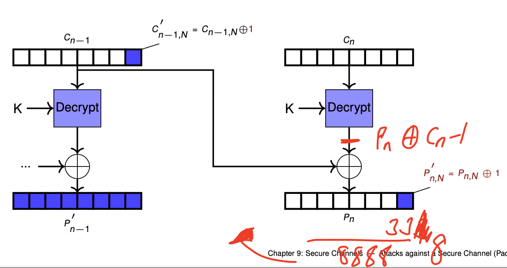

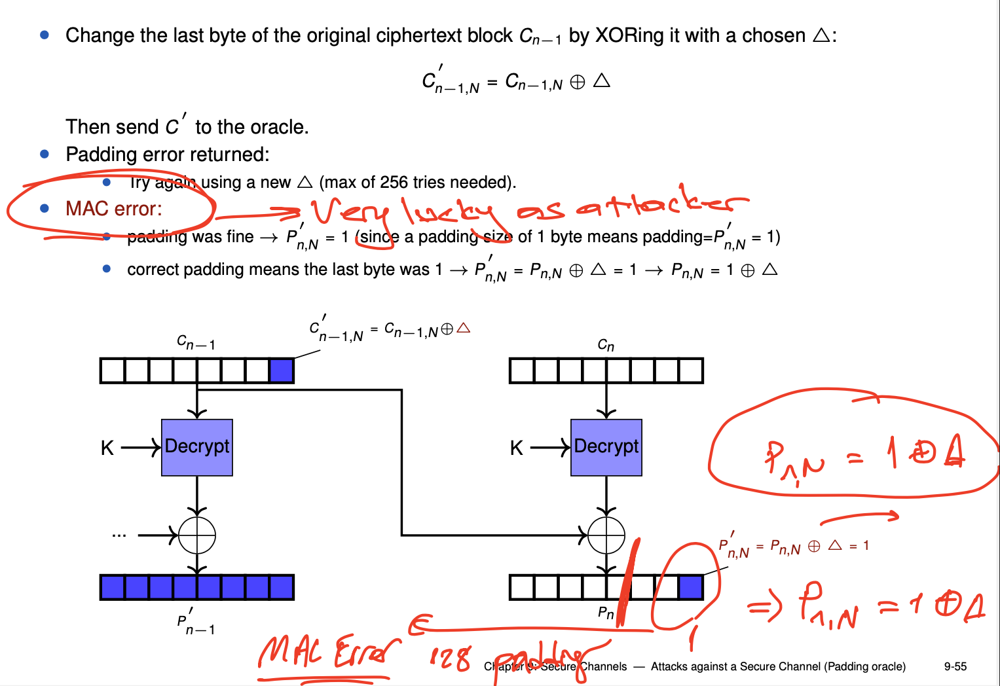

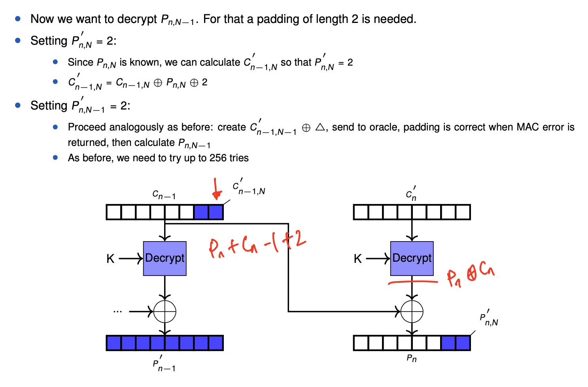 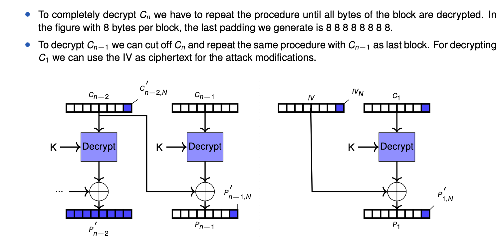

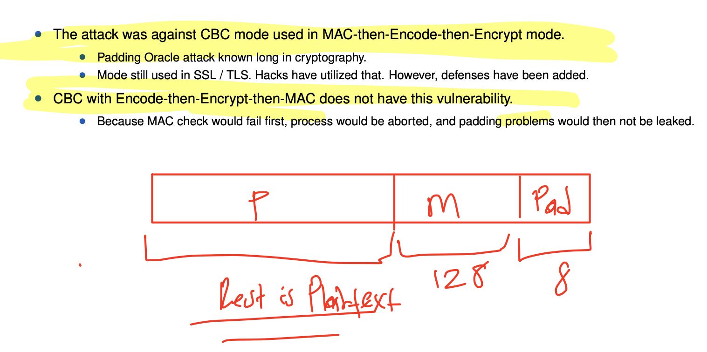