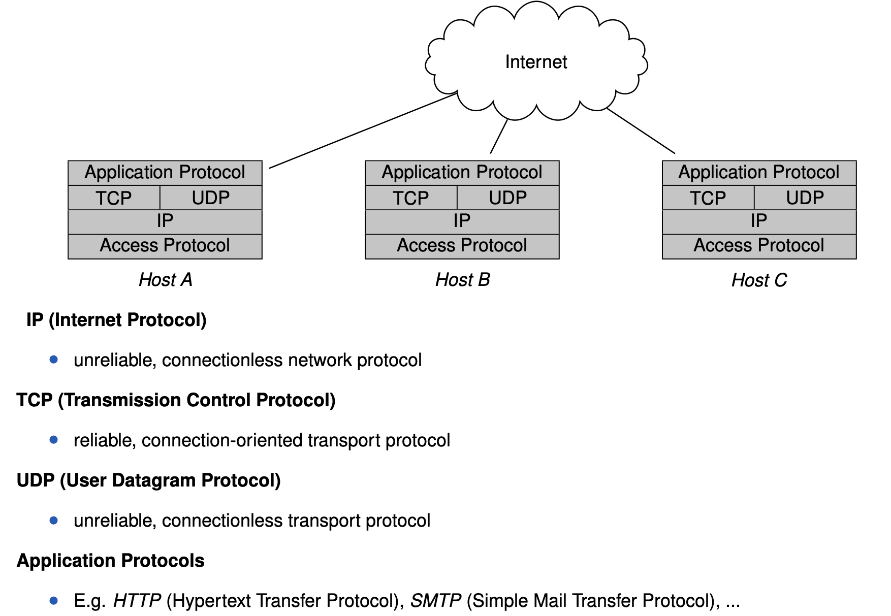
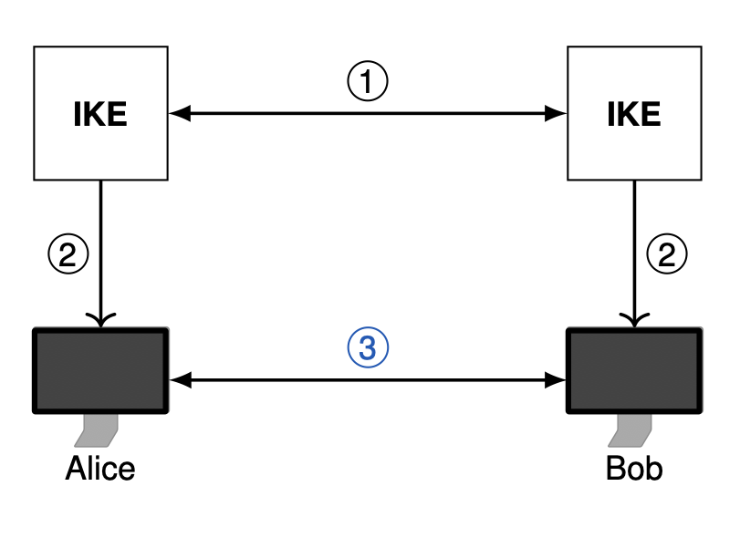
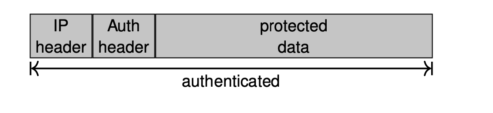
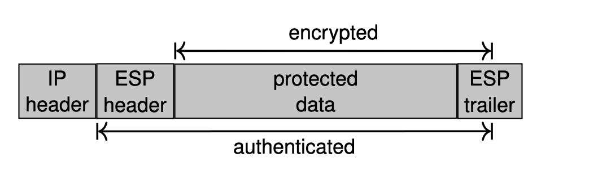
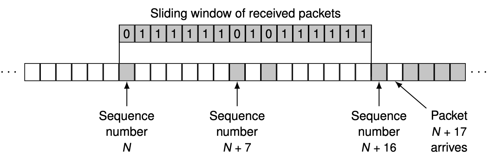
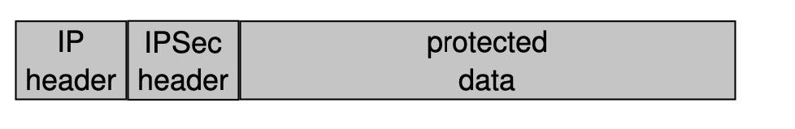
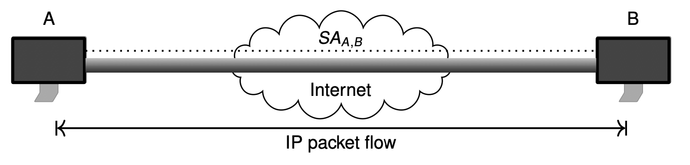
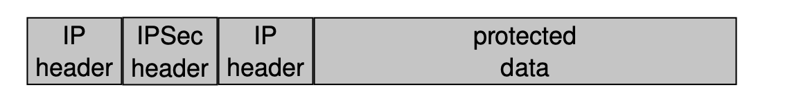
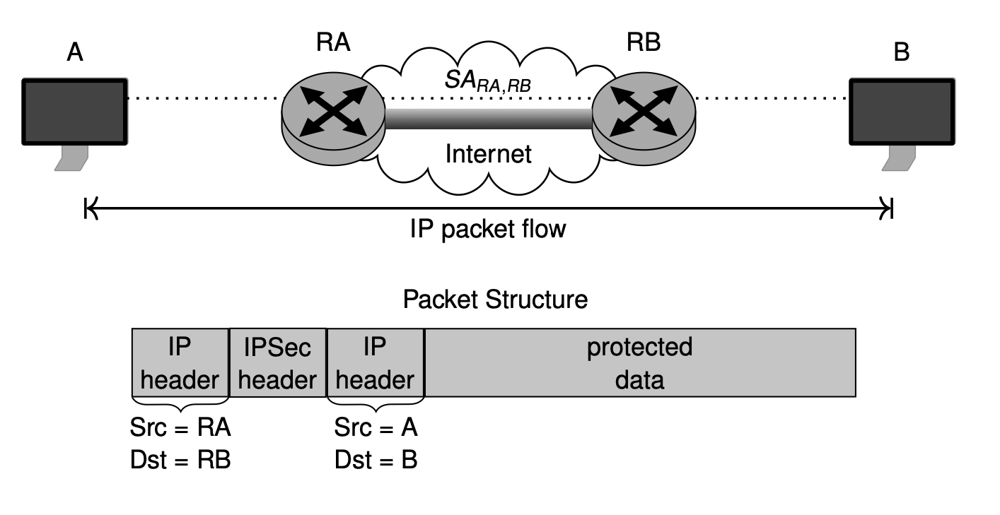

## IP suite 

## Security problems of IP and objectives of IPSec 

On arrival of an IP packet there is no assurance of 

1. Data origin authentication 
    - The packet was actually sent by the entity referenced by the source address

2. Data integrity
    - The original packet content was not modified during transit

3. Confidentiality
    - The packet content was not inspected by a third party during transit

**IPSec tries to address these issues**

- If IPSec is correctly employed, it provides: 

1. Data origin authentication 
    - It is not possible to spoof source/destination addresses without the receiver being able to detect this
    - It is not possible to replay a recorded IP packet without the receiver being able to detect this.

2. Connectionless Data Integrity 
    - It is not possible to modify an IP datagram in transit, without the receiver being able to detect this. 

3. Confidentiality

    - It is not possible to eavesdrop on the content of IP datagrams 
    - Limited traffic flow confidentiality 

4. Security Policies

    - All involved nodes can determine the required protectino for a packet according to a local security policy 
    - Intermediate nodes and the receiver will drop packets, that don't meet these requirements. 

## How does IPsec work?

1. Authentication, key establishment and negotiation of crypto algorithms 
    - Possible protocols: ISAKMP, Internet Key Exchange (IKE), IKEv2

2. Set keys and cryptographic algorithms 
3. Secure channel which provides 
    - Data integrity via Authentication Header (AH) or Encapsulating Security Payload (ESP)
    - Confidentiality using ESP

**Note: ESP can provide both data integrity and encryption while AH only provides data integrity**

### Basic IPSec Architecture

RFC4301 defines the following IPSec components:

- Concepts: 
    - Security Association (SA) and Security Association Database (SAD)
    - Security Policy Database (SPD) and Security Policy

- Fundamental Protocols 
    - Authentication Header (AH)
    - Encapsulating Security Payload (ESP)

- Protocol Modes 
    - Transport Mode
    - Tunnel Mode

- Key Management Protocols 
    - Internet Security Association and Key Management Protocol (ISAKMP)
    - Internet Key Exchange (IKE)
    - IKEv2

- Most RFCs updated in 2005 after several years of revision
- Support for integration of new crypto primitives for encryption and integrity 
- Reduced complexity and better protocol design 

#### **Authentication Header**

- Data origin authentication and replay protection
- Inserted between IP header and the data to be protected 

#### **Encapsulating Security Payload**

- Data origin authentication, replay protection and confidentiality

- A header and a trailer encapsulating the data to be protected

### IPSec Replay Protection

- AH- and ESP-protected packets carry a sequence number 

    - On setup of Security Association (SA) the sequence number is initialized to 0
    - The sequence number is incremented by 1 for each packet sent
    - The sequence number is 32-bit long and  a new session key is needed before a wrap-around occurs
    - The receiver checks if the sequence number is contained in a window of acceptable numbers 

Replay protection is a security mechanism used in IPSec (Internet Protocol Security) to prevent the interception and replay of transmitted data. It ensures that the data received is both fresh and authentic, and that it has not been recorded and played back by an attacker. This is achieved through the use of sequence numbers, which are included in each IPSec packet. The receiver checks the sequence number of each packet to ensure that it is greater than the previous one, and discards any packets that are detected as replays. This helps to prevent the unauthorized resend or use of previous data, providing an additional layer of security for IPSec-protected communication.

### IPSec Security Protocol Modes

- **Transport Mode**

    - Only usable between communication endpoints 
    - Host to host (Both way)
    - Host to Gateway (Both way)

    - Adds a security header (+ trailer  if ESP is employed)

    - Used when the cryptographic endpoints are also the communication endpoints of the secured packets 
    - Cryptographic endpoints: Entities that process IPSec headers
    - Communication endpoints: Source and destination of an IP packet

    - In most cases, communication endpoints are hosts 
    - But not always the case (e.g Gateway being managed by SNMP)

- **Tunnel Mode**
    - Usable with arbitrary peers
    - Encapsulates IP packets 

- Allows for e.g a gateway, protecting traffic on behalf of hosts in subnetwork 

- Used when at least one cryptographic endpoint is not a communication endpoint 
- This allows for gateways securing IP trafic on behalf of other entities. 

- **Note: Tunnel mode is not used for host to host communication**

- Example: Secuirty gateway, ensuring authentication and/or confidentiality between subnetwork and host

Transport mode is used to secure individual IP packets at the IP layer. In this mode, IPSec encrypts and authenticates the payload of each IP packet, but does not protect the entire IP header. This mode is used for end-to-end communication between two hosts, for example, between a client and a server. Transport mode is well suited for protecting applications that use a single IP address, such as email or file transfers.

Tunnel mode is used to secure entire IP packets by encapsulating the original IP packet within another IP packet. In this mode, IPSec encrypts and authenticates both the original IP header and the payload, protecting the entire original IP packet. This mode is used for communication between two security gateways, such as between a remote client and a corporate network. Tunnel mode is well suited for site-to-site VPNs, where the entire traffic between two networks needs to be protected.

In general, transport mode is used for end-to-end communication between two hosts, while tunnel mode is used for communication between two security gateways, such as for site-to-site VPNs. The choice of mode depends on the specific requirements of the network and the security needs of the communication.

### Traffic Selectors *(Security Policies)*

A Traffic Selector is a set of properties used to characterize IP packets. Each TS may contain: 

- IP Source address 
    - Specific host, network prefix, address range or wildcard 

- IP destination address 
    - Specific host, network prefix, address range or wildcard 
    - In case of incoming tunneled packets the inner header is evaulated 

- Name
    - DNS name, X.500 name or other name types.

**Traffic selectors are used to define Security policies !**

### Security Policies 

- A Security Policy (SP) specifies which and how security services should be provided to IP packets 

This includes: 

- Selectors that identify specific IP flows 
- Required security attributes for each flow
- Security services to be provided for each flow
    - Security protocol (AH/ESP)
    - Protocol Mode (Transport/Tunnel)
    - Other parameters (e.g policy lifetime, port number)
- Actions (e.g Discard, Secure, Bypass)
- IPSec protection can be specifid for specific applications (through port number)

**Security Policies are stored in the Security Policy Database (SPD)**

