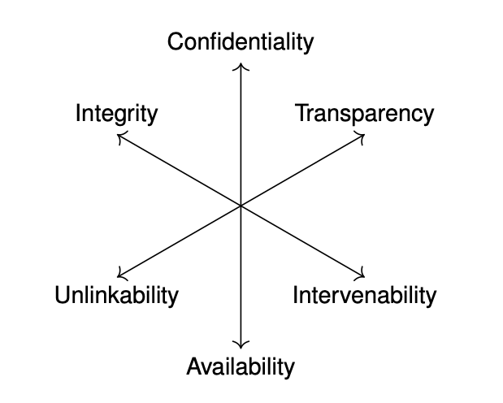

## A Cypherpunk's Manifesto

A fundamental goal is achieving and supporting personal privacy in the digital world. 

Cypherpunk's Manifesto is a document written by Eric Hughes in 1993, which outlines the motivations and goals of the cypherpunk movement. The cypherpunk movement is a group of activists who believe in the use of cryptography and computer technology to promote privacy, security, and freedom. The manifesto asserts that cryptography is necessary to protect individual privacy and freedom in the digital age, and it calls for the widespread use of encryption to secure communications and defend against government surveillance. The manifesto is considered a seminal document in the history of cryptography and privacy, and its ideas continue to be influential in the ongoing debates about privacy and security in the digital age.

From manifesto:

- Privacy is necessary for an open society in the electronic age. Privacy is not secrecy. A private matter is something one doesn't want the whole world to know, but a secret matter is something one doesn't want anybody to know. Privacy is the power to selectively reveal oneself to the world.

- There seem to be two main reasons people are drawn to Cypherpunks[...] The first reason is personal privacy. That is, tools for ensuring privacy, protection from surveillanve society and individual choice. 

**Understanding of Privacy**

Privacy is mainly constituted by confidentiality of information and a mechanism of selective access control. Furthermore, privacy is often considered equal with anonymity. i.e keeping the identity confidential.

The main focus is keeping data inaccessible for unauthorized third parties. 

## Contextual Integrity

Contextual integrity refers to the idea that privacy norms and practices should be consistent within a particular context, such as a social network or an organization. It argues that personal information should only be collected, used, and disclosed in ways that are consistent with the expectations and norms of the context in which it is collected, used, and disclosed.

## Privacy Protection Goals 

We defined protection goals for security: confidentiality, integrity and availability (CIA) They constitute criteria which allo assessment, whether security is acheived in a certain context. 

This approach was highly successful and constitues a de facto default understanding of security. 

Idea: Establish protection goals for privacy which complement CIA and interrelate with them. 

- **Proposal**

   - **Unlinkability**: The inability  to connect and combine initially separate information. 
   - **Transparency:** The ability to observe the data handling and processing of a system 
   - **Intervenability:** The ability (by data and system owners) to influence all planned or ongoing processing of personal data. 

The set of six protection goals is interrelated as a triead of duals, i.e pairs of conflicting goals building a trade-off. 

- **Confidentiality and Availability**: Confidentiality constraints access to information, while availability demands that information is  accessible. 
- **Integrity vs Intervenability**: Integrity constrains the ability to change information, while intervenability requires that stakeholders are able to change information when necessary. 
- **Unlinkability vs Transparency**: Unlinkability demands that information cannot be combined, transparency requires that insight is possible how personal information of individuals are processed. 

## Personal Data 

Any information relating to an identified or identifiable natural person.

### Quasi identifiers

Quasi-identifiers are pieces of information that, when combined, can be used to identify an individual. Quasi-identifiers do not identify an individual by themselves, but when combined with other data, they can become identifiers. Examples of quasi-identifiers include demographic information such as age, gender, zip code, and job title. In the context of privacy and data protection, quasi-identifiers can pose a threat to privacy if they are combined with other data sources to create a complete profile of an individual, so it is important to consider the potential risks when collecting and using quasi-identifier information.

An example of an event that occurred due to the use of quasi-identifiers is the Netflix Prize competition. In 2006, Netflix launched a competition in which participants were given a dataset containing anonymous movie ratings data for over 480,000 customers. Participants were challenged to use this data to improve Netflix's movie recommendation system.

However, in 2007, researchers were able to re-identify a number of Netflix customers by using publicly available information, such as the customers' movie ratings and reviews, along with demographic information, such as their age and gender, which were considered quasi-identifiers. This allowed the researchers to match the anonymous movie ratings data with the public information and identify the corresponding Netflix customers.

This incident highlighted the potential risks associated with using quasi-identifiers and the importance of protecting privacy in the handling of such information. It also prompted Netflix to end the competition and change the way it managed its customer data to better protect privacy.

### GDPR (General Data Protection Regulation)

The General Data Protection Regulation (GDPR) is a regulation in EU law on data protection and privacy for all individuals within the European Union. It also addresses the export of personal data outside the EU. The GDPR aims primarily to give control to citizens and residents over their personal data and to simplify the regulatory environment for international business by unifying the regulation within the EU.

- Only personal data, this does not include company data.

## Summary 

- How to understand security ? 

    - Using the protection goals of 
**confidentiality, integrity and availability.**
- How to understand privacy ? 

    - Using the protection goals of **unlinkability, transparency and intervenability.**

- How can secutiry and privacy goals be interrelated ?
    
    - Using the triad of duals.
        **confidentiality vs availability,integrity vs intervenability, unlinkability vs transparency.**
- What does GDPR stands fo ? 
    
    - General Data Protection Regulation

- What is personal data ?

    - Any information relating to an identified or identifiable natural person.

- What is the difference between the data controller and data processor ? 

- controller means the [entity] which determines the purposes and means of the processing of personal data.
- processor means [an entity] which processes personal data on behalf of the controller.

