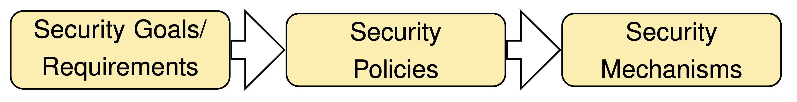
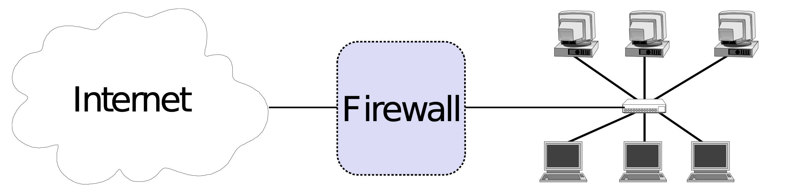
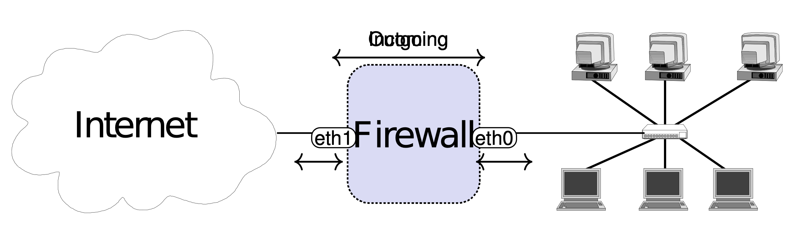

# Network Middleboxes 

Definition: "Any intermediary box, performing functions apart from standard functions of an IP router on the data path between a source host and destination host"

**Firewalls (FW) Firewalls (FW)**
    • Filter traffic based on a set of rules defined by a network administrator
**Intrusion Detection Systems (IDS) Intrusion Detection Systems (IDS)**
    • Monitor traffic and collect data for (offline) analysis for security anomalies
    • Capable of more complex inspection that Firewalls
**Network Address Translators (NAT)**
    • Allows multiple (private) hosts to share a single (public) IP address (example scenario: home network)
    • Rewrites the source IP address and port of outgoing packets, memorizes changes in NAT table
    • Incoming packets are rewritten if mapping exists in NAT table
**Load Balancers (LB)**
    • Provide one point of entry to a service, distribute requests to multiple instances of a service

- **Hints:**
    • NAT has Firewall-like characteristics as a NAT implicitly blocks incoming traffic if no mapping exists.
    But: is not a Firewall-type, is not a security tool!
    • Load balancers help to increase availability by distributing load.

## The 3 Security Components 

- **Security Goals/Requirements**
    • Define security goals
    • Confidentiality, Data Integrity, Authenticity, Controlled Access, Availability, Accountability
    • “What do we want?”
- **Security Policy**
    • Rules to implement the requirements
    • “How to get there?”
- **Security Mechanisms**
    • Enforce the policy
    • “What tools do we use?”

**Examples**

- **Security Requirements:**
    Sender accountability of all internal eMails
- **Security Policy:**
    All eMails must be cryptographically signed. Other eMails must not be delivered.
- **Security Mechanisms:**
    X.509 certificates + signatures, dropping of unsigned eMails by mailserver

## Network Firewalls 

• Not the same as a desktop firewall – only protects the local computer
• Network firewalls protect entire networks
• (However, most things we talk about can also be applied to configure a desktop firewall!)

• Controlled Access at the network level
• Installed where a protected subnetwork is connected to a less trusted network
• If not specified otherwise, we assume
• Firewall is placed between Internet and local network

### Incoming and Outgoing Packets

• Different views
• View 1 ("outside view by admin of the LAN")
    • Incoming: from the Internet to the local network
    • Outgoing: from the local network to the Internet
• View 2 ("inside view from the firewall")
    • On each **interface**, there are **incoming** and **outgoing** packets

- Firewalls by default does nothing, needs to be configured !!

### Strategies 

- **Default deny strategy**
    • Everything not explicitly permitted (= whitelisted/allowlisted) is denied
    • Increased security; you know what applications are allowed to communicate
    • Users that use non-standard applications/protocols will complain
- **Default permit strategy**
    • Everything not explicitly forbidden (= blacklisted/blocklisted) is permitted
    • Less secure
    • Less hassle with users

-  **Best practice: Default deny**
- Also possible: **Default deny for inbound traffic, default permit for outbound traffic**

