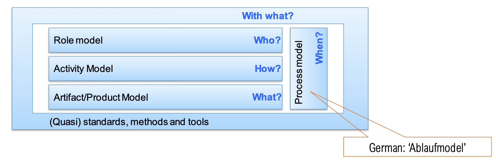
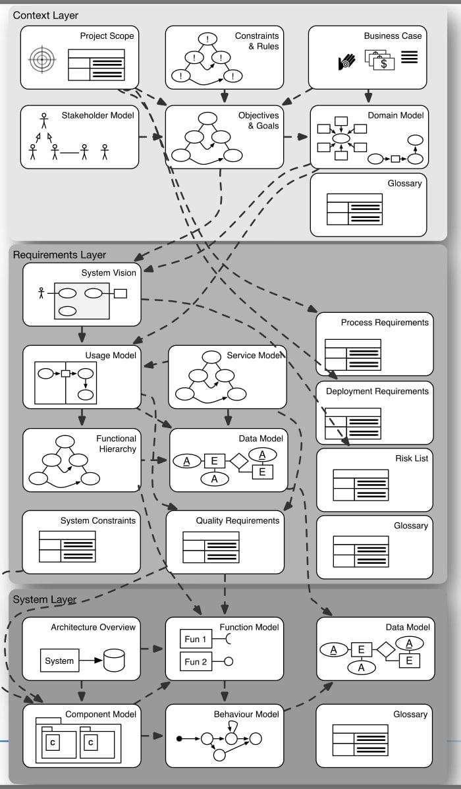
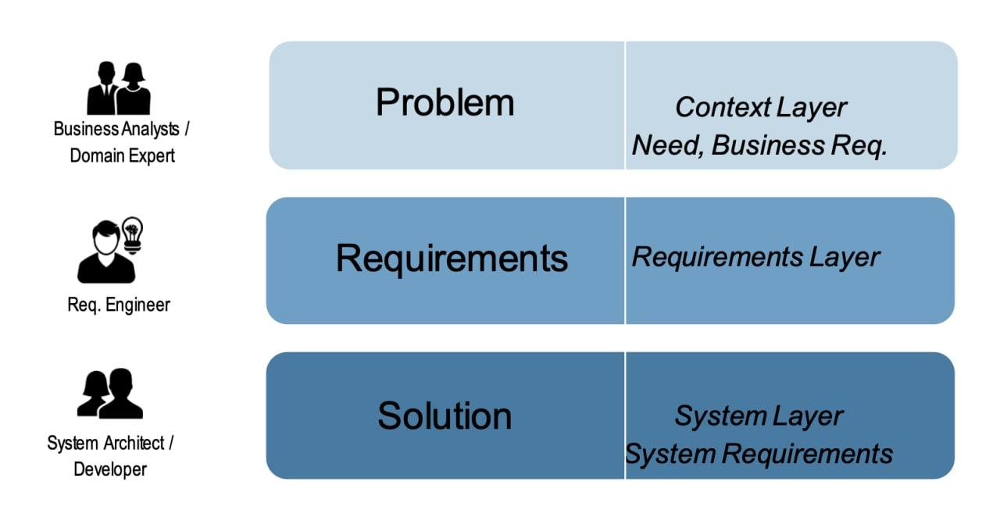

# L3 - RE Processes

- RE as an inmplicit task 
    - "It is the code that counts"
    - Clarify requirements during development

- RE as an explicit task
    - Requirements must be clarified by the responsible persons so thoroughly that no decisions related to the requirements are made by programmers during the implementation

### Explicit Requirements Engineering

RE represents the bridge from stakeholder goals into software development. 

- RE is a decision-making process
    - Recognize, evaluate, decide
    - RE is part of the decision whether a project should be carried out

- RE must always start with the individual project starting point
    - Are goals clear - is there agreement on them ?
    - Are responsible persons RE-capable ?
    - Is the application domain understood ?

- There cannot be one standardized process for all projects.

#### Essential aspects in explicit RE

- Are roles ("responsibilities") clearly defined ? 

- Is the engineering procedure clearly defined ? 

- Are requirements validated ?
- Is the quality of the requirements checked ?
- Is the correct implementation of the requirements systematically monitored ?
- Is there an updated description of the implemented requirements at the end of the project ?

- In other words: What is the engineering model used in this project ?

### What is an Engineering Model ?

- An engineering model describes systematic, engineering-like and quantifiable procedures to solve tasks of a certain class in a repeatable way.

#### Submodels

#### Role model and process model

- ***Process Model:** Instantiation at the beginning of the project defines milestones
- **Role Model**:
    - Roles have explicit skills and the responsibility for an artifact
    - Example are
        - Business analyst as domain expert
        - Requirements Engineer as mediator between context areas and development
        - System Architect
    - Roles can be filled by different people or by the same person in personal union

### Engineering Models

#### Activity-orientation

- Focus on the activities performed
- Specifies who does what in which way and at what time

##### Evaluation 

| **Advantages**                                                           | **Disadvantages**                                                  |
|--------------------------------------------------------------------------|--------------------------------------------------------------------|
| Description of the work process                                          | Restrictive: This way and only this way!                           |
| Specification of a temporal order  and detailed instructions for action  | Complex planning, difficult to measure  the quality of the results |
|                                                                          | No statements about artifact contents and dependencies             |

#### Artifact-orientation 

- Focus on what is created and its characteristics
- Defines responsibilities per artifact

##### Evaluation 

| Advantages                                                                | Disadvantages                                                     |
|---------------------------------------------------------------------------|-------------------------------------------------------------------|
| Awareness of clear result structures (content, dependencies, terminology) | High learning curve  (thinking in processes is habitual behavior) |
| Testable quality and progress control                                     | Definition & selection of adequate methods                        |
| Clear roles and responsibilities                                          | Derivation of plans complex                                       |
| Good adaptability                                                         |                                                                   |

What is an artifact model ?

**Artifact:**

    - Documents (intermediate) results of development process steps
    - Has structure, content and a form of representation
    - Has sense and purpose, subject to version control
    - Examples: Documents, data objects and models

**Artifact model**

    - All artifacts and dependencies relevant in the process
    - In the literature there are numerous definitions and terms that are often used
      synonmymously (meta model, ontology, product model,  ...)
    - Artifact models can be constructed and displated in different ways !

**Why artifact orientation in RE**

| **Common problems in practice**                                                        | **Characteristics of artifact orientation**                                                                                                                                                                                                     |
|----------------------------------------------------------------------------------------|-------------------------------------------------------------------------------------------------------------------------------------------------------------------------------------------------------------------------------------------------|
| Maintenance hard w/o solid requirements documentation (but also: write-only documents) | Documentation                                                                                                                                                                                                                                   |
| Roles, responsibilities and skill profiles often unclear                               | Definition of responsibilities along the created artifacts                                                                                                                                                                                      |
| Lack of understanding of content, context and terminology in the artifacts             | Implicit knowledge about (domain) content is explicitly recorded    - Modeling concepts and notations    - Contexts     > Awareness for consistent and complete results     > Integration into the QA process      (testable result structures) |

#### A note on Artifacts

- Agile development procedure skeptical about number and level of detail of artifacts beyond code and tests: no immediate customer value; hard to maintain over time  

- Artifacts need to be synchronized with each other
- Change of context/requirment: cost of changing artifacts

- "Quality" of artifacts in general hard/impossible to assess ! This is the reason for standardized processes: ISO26262 functional safety; Common Criteria for secuirty; ISO 9000 for quality in general. Require existence of processes and certain artifacts but do not state their quality

However, **maintenance is difficult without well-documented requirements**

### AMDiRE artifact model 

- ADMiRE : Artefact Model for Domain-independent RE

- The flexibility of an artifact model is rooted in the selection of adequate artifacts

#### ADMiRE: Roles and Layers

### Problem space vs solution space 

In Requirements Engineering, we must capture both the problem and solution space

#### Problem 

    - Capture stakeholders and their goals
    - Understand and describe the problem
    - Specify and validate characteristics and capabilities of potential solutions

#### Solution

    - Iteratively derive a specification of a solution, that solves the problem. 
    - Develop function and architecture models 
    - Establish tracking and verification
    - Incorporate changes

> The distinction between problem definition and solution is essential in RE! 
> Engineers are trained to focus on the solution !!

**What is wrong with (premature) solution orientation ?**

Requirements are often not explicitly identified, but it is rushed to a solution. 

    - Essential requirements are not considered
    - Solution space is unnecessarily restricted
    - Decisions are not validated with stakeholders
    - System has properties, which are not required ("Gold Plating") and do not add immediate value 
