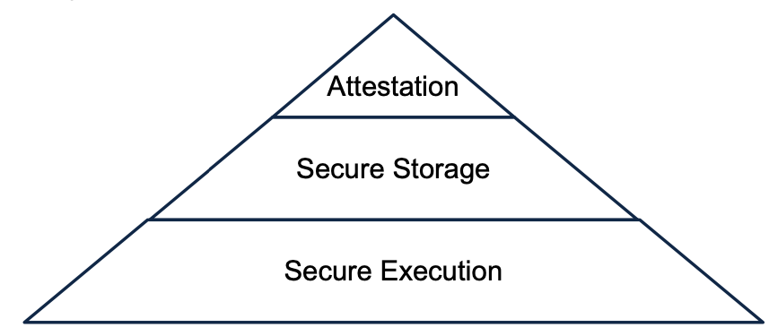
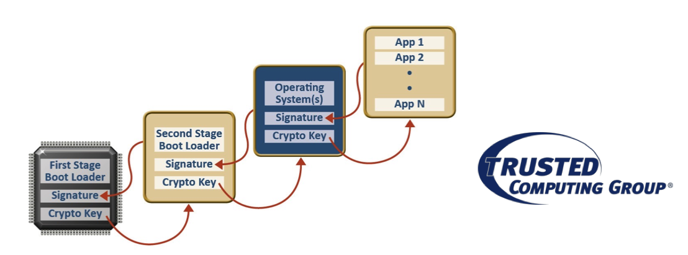
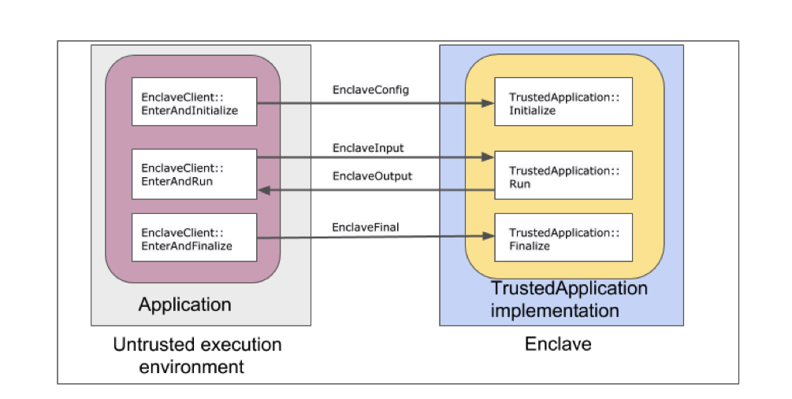
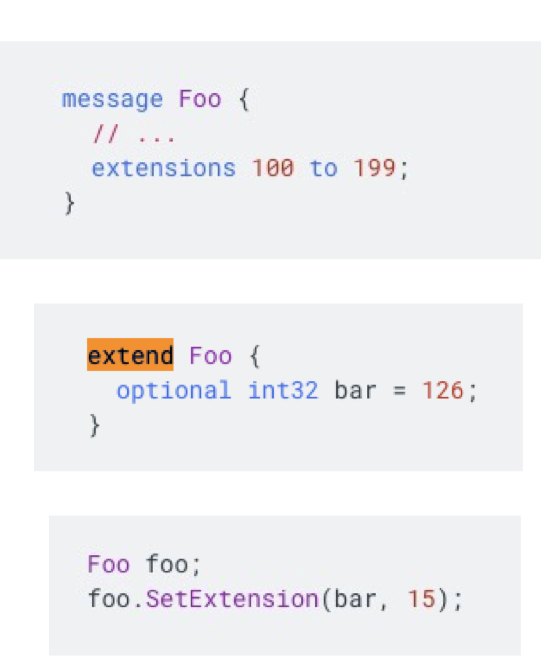
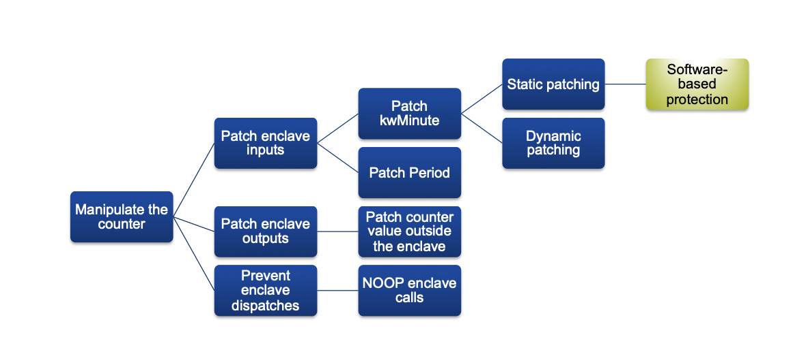


Exercise 6- Hardware Based Protection


# Hardware Based Protection 

## Hardware Based Security Concepts 

1. Explain the main difference between dynamic and static security in hardware-based protections 

    - **Static** protection in which system software components (BIOS, boot loader, OS, etc) constitute a hash chain and thereby protected. 
    (If the system starts secure; it stays secure !)
    - **Dynamic** protection in which a CPU-level security enforcement protects programs through execution 
    (System can start right, but things could go wrong at runtime)
    - Dynamic protections guarantee **static security** by verifiying the signature of programs upon load. 

2. Name and describe three types of attestations. 

    - Attestation is a mechnanism for software to prove its identity. The goal of attestation is to prove to a remote party that your operating system and application software are intact and trustworthy. Attestation can be done locally between two programs or remotely between a program and a remote verifier. 
        - Identification of devices 
            - An IT organization needs to be certain that only enterprise-owned machines are allowed on the enterprise's network (IP and MAC address are not security identifiers)
            - Device health attestation
                - An IT organization needs to frequently check enterprise machines for possible compromises
            - Secure storage of keys 
                - Enterprise sensitive keys need to be secured from other software on the system 

3. Briefly explain two use cases in which hardware-based security can be useful. 
    
(Very broad, more specific scenario might come to exam ! )

## Hardware-Based Protection: The Protection Pyramid

- **Secure Execution mitigates the following threats**
    - All the servers on which the banking software stack is being executed are exposed to IT users 
    - Malicious insiders may manipulate system's configurations and services 

- **Secure Storage**
    - Disclosure of the accounts' credentials can have severe consequences 
    - Leakage of the account funds can lead to serious reputation damage 

- **Attestation**
    - The system shall be able to provide unforgeable proofs of its integrity state at the granularity of the services and configurations to local or remote services 

## Mapping Banking System Threats to the Protection Pyramid

- **Secure Execution**
    - The execution of programs/services shall be protected against manipulations. 
    - Genuine cryptographic functions shall be provided for programs/services 
    - Secure execution provides the basis for the other two steps of the pyramid. 

- **Secure Storage**
    - The confidentiality of system secrets shall be guaranteed
    - Only the program that owns the secret shall be granted access 
    
- **Attestation**

    - Worst yet, attacks may go unnoticed for years !

4. What are the limitations of TPM-based protections? Name and explain three limitations. 

(In the final exam, mention about attacks against TPM as discussed in the lecture, googling, sniffing and etc)

- We have to know and maintain all hashes for all versions of software ! 
    - Software patches and updates rolled out almost on a daily basis
- A third party verifier (read single point of failure) has to attest the system 

- Starting secure (hash chain) does not necessarily guarantee a sustainable security
    - Simply put, securing binary representation does not guarantee secure execution 
    - Exploit vulnerabilities ? In mem ? In exec ? 
- Not all computers have built-in TPM chips 
- Either protect the entire system all the way from boot or nothing ! 

5. Can hardware-based protection render software-based protection obsolete ? Justify your answer with example(s)

Existing hardware-based protections (i.e enclave-based protection) probably will not render software-based protection obsolete. 

    - Such hardware is not available in a majority of computing devices (particularly IoT devices)
    - As long as confidentiality and integrity remain relevant requirements in computing devices with no trusted hardware, software-based protection remains relevant. 
    - The existing trusted hardware does not fully address IP concerns such as code confidentiality. 
    That is, obfuscation continues to be relevant measure against reverse engineering. 
    - Adversaries might be able to achieve their goals by manipulating program parts residing in the untrusted world instead of the enclave-based code. Since IO operations of programs cannot be placed inside enclaves, parts of programs have to reside in the untrusted world inevitably. 
    - In the current situation, hybrid approaches (combining software-based and hardware-based) appear to be viable options. 

6. Briefly explain how the hash chain mechnanism protects a system from integrity violations. 

## Trusted Platform Module (TPM) - Attestation (aka Hash Chain)

- TPM comes with a trusted boot loader (first stage boot loader)
- TPM certifies the system boot loader (second stage boot loader)
- Boot loader certifies OS 
- OS certifies Applications 
- All certificates include the public key of the component that is certified along with a hash of the component binary file
- These certificates constitute a **hash chain** 
- A remote verifier can attest the hash chain at anytime. 

Answer to the question 6. 

As shown in the information above, TPM constitues a hash chain starting from a secure boot loader to the OS and applications. In the case of tampering attacks, the hashes will not match the expected values. Such mismatches can be veritifed by local applicaton or remote attesters. 

7. How does SGX ensure that sealed data can exclusively be read by the enclave that owns the data ? 

Sealing is a process in which an enclave securely persists its data to the disk. Encryption is performed using a private Seal Key that is unique to that particular platform and enclave, and is unknown to any other entity.. During the manufacturing process, a unique set of keys are generated and stored in the processor's fuse array. There are certain measures to ensure that the key is only retrievable by the issuing enclave. Read more here: https://software.intel.com/content/www/us/en/develop/blogs/introduction-to-intel-sgx-sealing.html

8. In exercise sheet 4, we have discussed attacks on SaaS, PaaS, and IaaS architectures. We assume that we are a tenant of such a SaaS cloud service by Mississippi Web Services (MWS). MWS claims that their machines now include TPM and SGX to improve the security of their virtual machines. Should we feel good about this? What attacks on IaaS/PaaS systems discussed before are now impossible ?

Adequate utilization of security hardware can severely harden the system security. In principle, security hartdware can faciliate the mitigation of threats to the confidentiality and integrity of assets. However, employing security hardware by itself does not necessarily guarantee security.
The system has to undergo adequate securiy analysis to identify threats to its assets. Subsequetly, relevant measures shall be implmented to protect system assets. In most cases, a combination of protections may be required to mitigate all the threats. To answer the question in a generic sense, TPM and SGX enable the cloud to provide means for attestation to their users. 

## Enclave-Based Security: A technological dilemma

- The developers are in charge of splitting their applications into trusted and untrusted partitions. 
- Different technologies exists for confidential computing: Open Enclave, Intel SGX, ARM TrustZone
- Every technology comes with its own SDK and documentation 
    - Intel SGX's implementation differs from ARM TrustZone 
- Switching between technologies often entails learning a whole set of development tools 
- Codes written upon a particular SDK version may become obsolete over time (maintenance cost)
- Porting an existing enclave application to a different hardware is often expensive. 

## Enclave-Based Security with Asylo 

- The developers are still in charge of splitting their applications into trusted and untrusted partitions. 
- The underlying technology (hardware) is abstracted away as backend
- Enclave programs are built via intuitive multi-purpose constructs. 
- A program can be compiled to various backends: Intel SGX or simulated enclave, others to come
- The program itself remains transparent to the underlying technology
- Write one program, compilte it to various (supported) backends 
- Programs are written in a higher level of abstraction, so SDK changes do not propagate to user application usually. 

## Enclave-Based Security with Asylo: Constructors 

- **TrustedApplication** is trusted component of an enclave application that is responsible for sensitive computations. 
- **EnclaveClient** is the untrusted component of an enclave application that is responsible for communicating messages with the trusted component
- **EnclaveManager** is singleton object in the untrusted system that is responsible for managing enclave lifetimes and shared resources between enclaves. 
- We refer to the process of switching from an unstrusted execution environment to a trusted environment as entering an enclave. Every enclave provides a limited number of entry points where trusted execution may begin or resume. 

- **The truested environment** consists of one or more enclaves, which protect code and data ina sensitive workload. To create an enclave, we define a class which inherits from **TrustedApplication** and implmeent the logic to host in the enclave. 

- **Untrusted environment** The untrusted API provides methods analogous to the enclave entry points that are defined by a TrustedApplication. These methods implement the necesseary machinery to safely cross the enclave boundary. The inputs to these methods are extensible by the developer. 

## Enclave-Based Security with Asylo: Trusted Application 

The TrustedApplication class declares methods corresponding to each entry point defined by the Asylo API. 

- **Initialize** initializes the enclave with configuration values that are bound to the enclave's identity. This shouldbe used for security-sensitive configuration settings. 

- **Run** takes input messsages from the untrusted environment code, performs truted execution, and returns an output message the untrusted environment. 

- **Finalize** takes finalization values from the untrusted environment and is called before the enclave is destroyed. 

If any of these methods are not overridden, they simply return an OkStatus. 

https://asylo.dev/docs/concepts/api-overview.html

## Enclave-Based Security with Asylo: EnclaveClient

The EnclaveClient class is responsible for commuinicating messages with the trusted component. 
    - EnterAndInitialize passes enclave configuration settings and optional user-defined configuration extensions to the enclave. The configuration information is essential to the identify of the enclave. 
    - EnterAndRun passes an unput message the the enclave and receives an output message from the enclave. 
    This method may be called an arbitrary number of times with different inputs after the enclave has been initialized. 
    - EnterAndFinalize passes enclave finalization data to the enclave. 

Both EnterAndInitialize and EnterAndFinalize are private methods that are called by the friend class EnclaveManager

## Enclave-Based Security with Asylo: EnclaveManager

The EnclaveManager class is responsible for creating and managing enclave instances. This class is a friend class to EnclaveClient.

    - **LoadEnclave** initializes the enclave with a call to EnterAndInitialize
    - **DestroyEnclave** destroys the enclave with a call to EnterAndFinalize

Entering an enclave is analogous to making a system call. An enclave entry point implments a gateway to sensitive code with access to the enclave's resources. Arguments are copied into the enclave on entry and results are copied out and exit. 

## Enclave-Based Security with Asylo: Enclave Lifecycle

- **Part 1: Initialization**

    - The untrusted application performs a set of steps to initialize the trusted application 
        - Instantiate EnclaveManager
        - Configure the options for fetching the enclave from the disk
        - Call LoadEnclave --- Implicitly invoke the enclave’s Initialize method
**Part 2: Secure Execution**

- The untrusted application performs a set of steps to securely execute a workload in the trusted application 
    - Provide input via the EnclaveInput message
    - Get a handle to the enclave via EnclaveManager::GetClient
    - Dispatch a call to the enclave, e.g., by calling EnclaveClient::EnterAndRun

- **Part 3: Finalization**
 -  Destroy the enclave EnclaveManager::DestroyEnclave
 - The Asylo framework will implicitly use the client to call the trusted application’s Finalize method

## Enclave-Based Security with Asylo: Interaction model

In Asylo, enclaves operate on protocol-buffer messages; all enclave inputs and outputs are protocol buffers

**What are protocol buffers?**

Protocol buffers are Google's language-neutral, platform-neutral, extensible mechanism for serializing structured data – think XML, but smaller, faster, and simpler. You define how you want your data to be structured once, then you can use special generated source code to easily write and read your structured data to and from a variety of data streams and using a variety of languages.

https://developers.google.com/protocol-buffers

## Protocol-Buffers: Defining A Message Type

You define your message type in a .proto file:
 - Scalar and composite types are supported
 - Each field in the definition has a unique number
 - Fields can be required, optional, or repeated Use repeated for arrays

 https://developers.google.com/protocol-buffers/docs/overview

## Protocol-Buffers: Extensions

Extensions let you declare that a range of field numbers in a message are available for third-party extensions. An extension is a placeholder for a field whose type is not defined by the original .proto file. This allows other .proto files to add to your message definition by defining the types of some or all of the fields with those field numbers.
- This says that the range of field numbers [100, 199] in Foo is reserved for extensions. Other users can now add new fields
to Foo in their own .proto files that import your .proto, using field numbers within your specified range – for example:
-  This adds a field named bar with the field number 126 to the original definition of Foo.
-  Extensions use a specific interface:

4. (Exercise 2 Hands-On) Explain which attacks can*not* be implemented anymore, i.e., what enclave protection guarantees in the sample system

In memory manipulation of the counter value is countered. The counter variable along with the sensitive funtions (those that have access to the counter value) reside within the enclave and hence are protected against both data and code manipulations. 

5. (E2-Hands-On) Enumerate and briefly discuss possible threats against your enclave-protected smart meter that (for example) jeopardize/undermine/manipulate the reading and represent the steps needed to carry out this attack using an ADT.

The interface to the enclave resides in the untrusted environment. The code residing outside the enclave is not protected against attacks. Despite the counter itself being protected within the enclave, the interface to functions that can manipulate the counter value resides outside the enclave. One possibility is to tamper with the input values of the enclave. The adversary can, for instance, change the kwMinute value outside the enclave. Similarly, perpetrators can patch the period to offPeak to get 50 % discount regardless of their usage time. Another possibility is to prevent the dispatch of usage reports to the enclave. Consequently, no usages will be counted by the smart counter. Lastly, the attackers can patch the output message of the enclave (in the untrusted world.)

