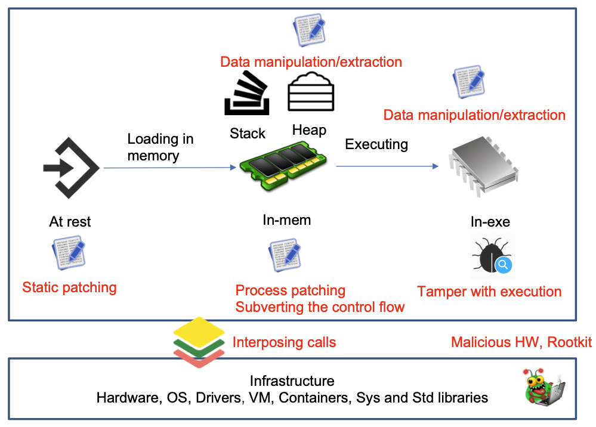
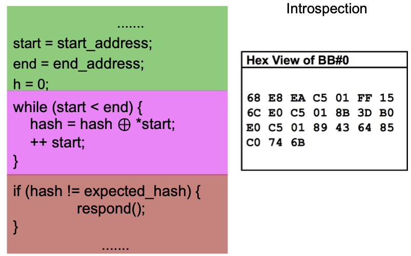
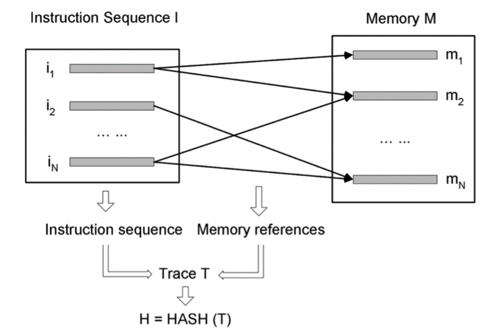
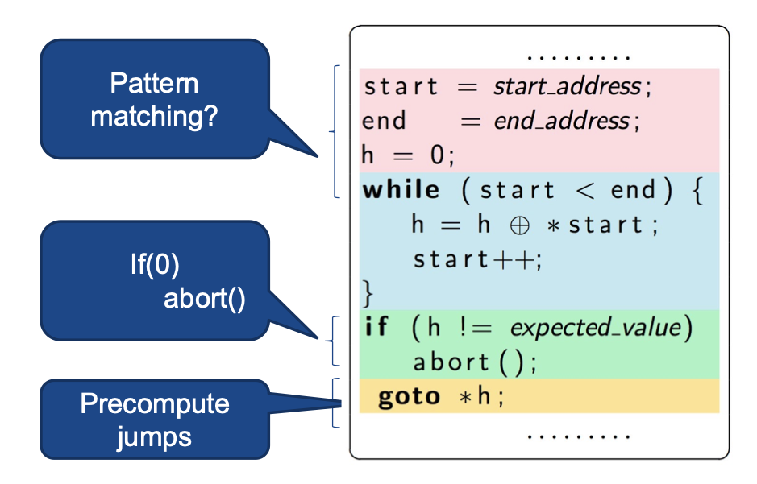
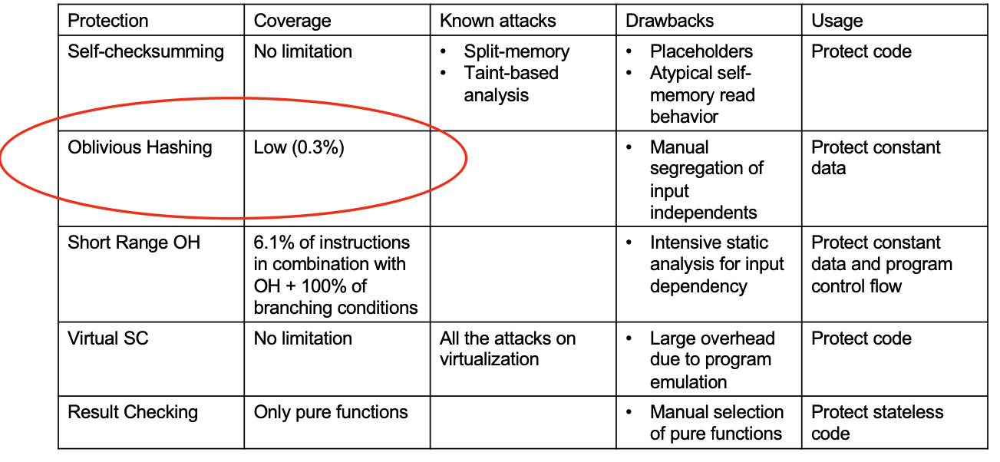
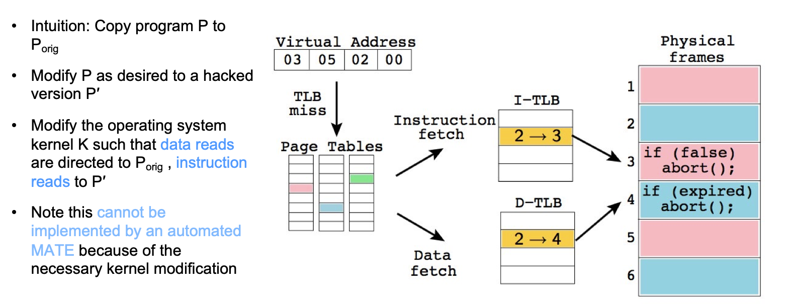

# Software Based Integrity Protection 

## General Software Integrity Protection Concepts 

1. What are the MATE threats to the integrity of systems ? Name and explain four threats

- **Static Tampering**
    - The adversary tampers with the program binary e.g to disable the `license_check()` function 

- **In-memory tampering**
    - The adversary manipulates the process memory at runtime; often malware attacks programs from this very angle

- **In-execution tampering**
    - The perpetrator tampers with the execution environment of the program, e.g a well-timed flip of a register value can subvert the program execution. 

- **Call interposition**
    - The attacker tampers with the program dependencies, e.g tricking a program to use counterfit(insecure) crypto functions can lead to IP disclosure in a DRM (think of Spotify.)

2. Assume that OS-based program signature verification is enabled. Why would we still need integrity protection ? 

- From an **attacker's perspective**: merely effective against static pathcing attacks, 
- The verification program itself is susceptible to MATE attacks. 

- From a **user's perspective**:
    - Signature verification is a measure to protect users from phishing, network and repackaaged malware attacks 
    - It is no mechanism agains MATE 
    - The signature verification program itself is susceptible to MATE attacks
    - Signatures inherit all PKI problems (which certificate authority to trust?)
    - Yes, we still need integrity protection 

3. Why does self-checksumming require a post compilation patching step ? 

- SC hashes/checksums programs' code segment at **runtime** periodically.
- The expected checksums are recalculated and shipped within the program
- Once a mismatch is detected a response mechanism will be triggered. 

- The checksum/hash **takes place at runtime** over the text segment in memory (i.e machine code) 
- The text segment value is **unknown prior to compliation** 
- Once the binary is compiled and the text segment is laid out, we can compute the expected hash/checksum values
- After the computation, the expected values need to be set in the binary. 
- One way to achieve this goal is to use placeholders at compile time and ultimately patch them with the expected values. 

4. We have focused on detecting integrity violations in lecture. Suggest several response mechanisms, and discuss their benefits and shortcomings.

- Sabotage attackers' assets (e.g delete their /home directory) (too intrusive) -> perhaps not so effective against professional attackers (e.g using a virtual machine)
- Terminate execution (easy to spot) -> denial of service is not always acceptable (imagine if Chrome exited every time a malware attempted to tamper with it)
- Phone home (network packages can be traced and subsequently blocked by the attacker)
- Inject random faults in the stack (delayed program crash is harder to spot) -> inherits problems of execution termination
- Ideal response mechanism depends on the usage context. 
- Stealth is the most important factor 

## Software-Based Integrity Protection Concepts

1. Explain two differences between self-checksumming and oblivious hashing

### Self-Checksumming (SC) - old but gold ! 

- SC hashes/checksums programs' code segment at runtime periodically
- The expecetd checksums are recalculated and shipped withing the program
- Once a mismatch is detected a response mechanism will be triggered

### Oblivious Hashing (OH) 

Differences are : 

a. SC checks sthe code segment (in memory) at runtime, while OH hashes the input independent memory references
b. SC can potentially protect any piece of code; OH can only protect input-independent instructions. 

2. Why is stealth vital in software-based integrity protection ? Explain which of self-checksumming or oblivious hashing has better steath. 

## Attacks on the Chang and Atallah’s Self-Checksumming Scheme

In software-based protection, the integrity checking code itself is susceptible to tampering attacks. If the attacker can easily distinguish the check routines, the protection becomes very exposed. The ultimate goal of defenders is to ensure that the protection logic resembles ordinary program logic to impose more effeort on the attacker. As discussed in the lecture, SC introduces a typical self-memory reads that could potentially expose protection guards. Conversely, OH operates on the typical memory references that blend comparatively better (than SC) with the program logic. 

3. Explain the most significant limitation of oblivious hashing.

- **Low Coverage**
    - Hashing input-dependent instructions lead to inconsistent hash values. OH is unable to verify such values. Therefore, OH can only protect input-independent instructions. In many cases, a large portion of program instructions direclty(explicitly) or indirectly(implicitly) depend on input. This limitation severely lowers the coverage of OH 

4. Explain how the memory split attack works

The main assumption of SC is that the read and fetch memories are identical. However, SC does not verity this assumption. The memory split attack exploits this unverified assumption by constituting two memories: untampered memory for reads (SC checks) and tampered memory for fetches (execution)
The memory split attack alters the OS kernel such that all code segnment reads read the untampered memory, while instruction fetches read the tampered memory. 