# Obfuscation 

## Motivation: Protect Intellectual Property against MATE

1. Man-in-the-middle (MITM)
    - attacks communication channels (e.g replays messages)
2. Remote attacker 
    - exploit vulnerabilities 
3. Man-at-the-end (MATE)
    - reverse engineers software (e.g steals intellectual property)

## Informal Definition

To obfuscate a program P means to transform it into a executable program P' from which it is harder to extract information than from P. 

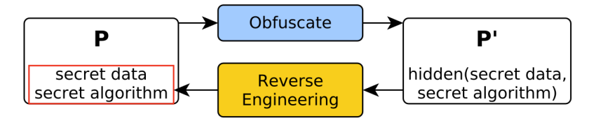

## Informal Definition of Reverse Engineering
THe process of extracting data or a model of the system by inspecting its lower level description and/or behavior. 

## Attack:1 - Stealing intellectual property (e.g algorithms)

- Alice is a software developer
- Alice develops Expensive Software, where Module B required expensive research and development
- MATE buys 1 copy from Alice and reverse engineers the code to extract Module B
- MATE builds a competing product (Cheaper Software) where he uses Module B, stolen from Alice
- More users buy from MATE, because it is cheaper than buying from Alice and works similarly
- Alice spent many resources on development and is now loosing customers due to MATE

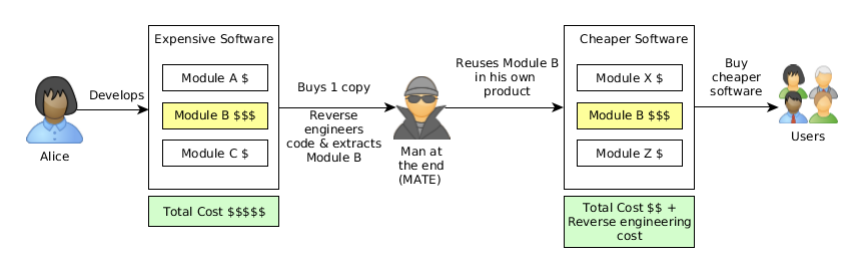

## Attack: 2 - Stealing secret data (e.g keys, passwords)

- Alice is a movie producer and distributor. 
- She offers a media player with a hidden decryption key, which can play her premium content (even off-line) 
only after users pay for viewing it (e.g. Netflix)
- MATE buys 1 copy from Alice and reverse engineers the code to extract the decryption key
- MATE can now decrypt the premium videos and resell them in unencrypted form to other consumers
- Alice looses potential customers because of MATE

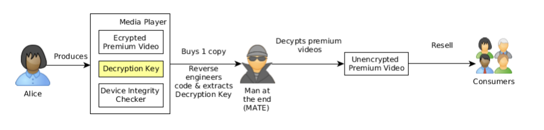

## Categorization of Obfuscation

What types of obfuscation transformations exist ?

-  **Static vs. Dynamic**
    - **Static obfuscation**:
        - Obfuscated programs remain fixed at runtime
        - Raises the bar against static analysis
        - Can be attacked through dynamic techniques (debugging, emulation, tracing).
    - **Dynamic obfuscation**:
        - Programs keep changing at runtime
        - Raises the bar against dynamic analysis
        - Also called self-modifying code

- **Point of insertion**
    - Source code
    - Intermediate representation
    - Assembly code

- **Transformation targets**
    
    - Layout → scramble identifiers and code layout
    - Data → obfuscate data (structures) embedded in code
    - Control flow → obfuscate secret algorithms

## Static Obfuscation Transformations

| Protect Intellectual Property | Protect Secret Data |
|:-----------------------------:|:-------------------:|
|• Scramble identifiers         | • Opaque expressions |
|• Instruction substitution     | • White-box cryptography
|• Garbage code insertion       |
|• Merging and splitting functions| 
|• Opaque predicates            |
|• Control-flow flattening      |
|• Virtualization obfuscation   |

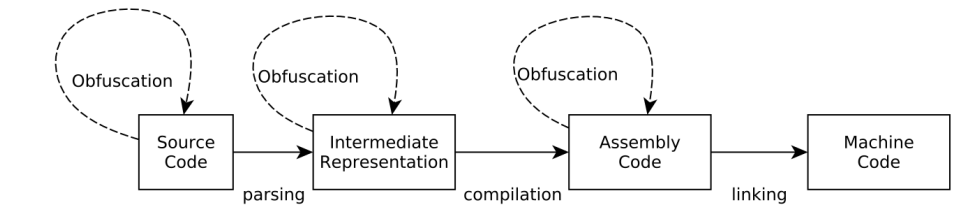

## Confuse Code Reader: Scramble identifiers

- Replace identifier names with random strings

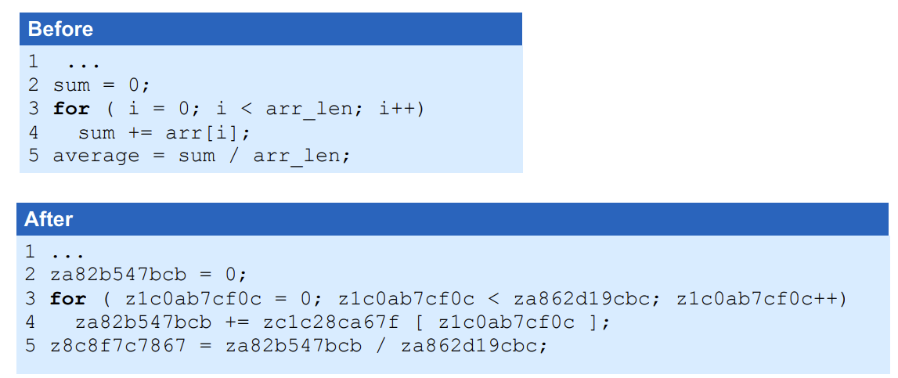

## Confuse Code Reader: Instruction substitution
- Replace binary operation (e.g. +, -, AND, OR, XOR, etc.) by functionally equivalent, but more complicated 
computations
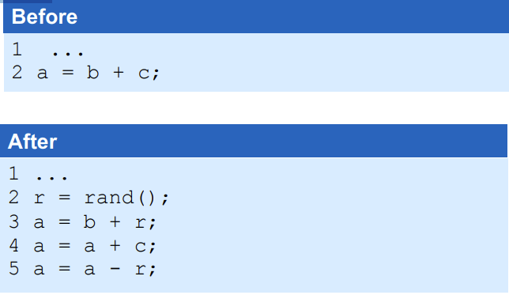

## Confuse Code Reader: Garbage code insertion

- This is the opposite of the "remove dead code" compiler optimization

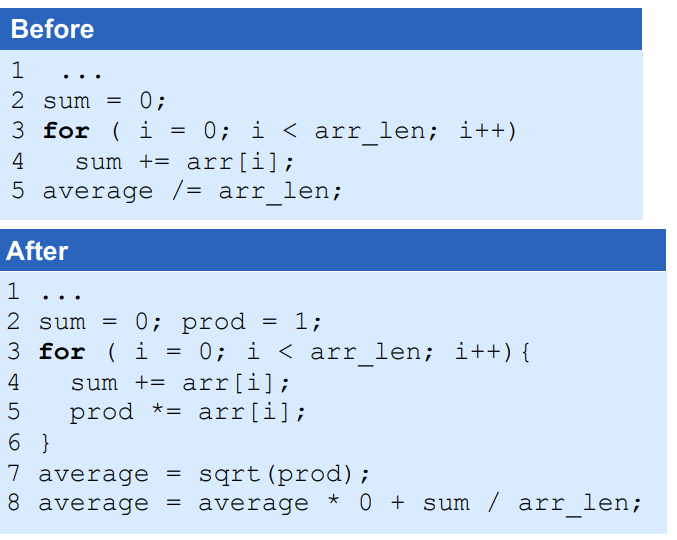

## Confuse Code Reader: Merging and Splitting functions

- Merging means **combining** the code of two or more functions into a single function
- Splitting means **dividing** the code of one function into two or more functions

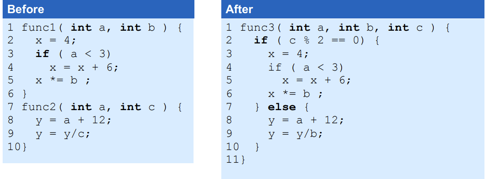

## Confuse Code Reader and Compiler: Opaque predicates and opaque expressions

- Informal Definition:
    - An expression whose value is known to the defender (at obfuscation time), but which is difficult for an attacker to  figure out statically.

- P^T for an opaquely true predicate
- P^F for an opaquely false predicate
- P^? for an opaquely intermediate predicate
- E^=v for an opaque expression of value 

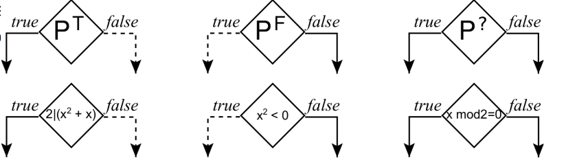

## Bogus control-flow via opaque predicates

- Opaque predicates facilitate insertion of bogus control-flow:
    - Dead branches are never taken
    - Superfluous branches are always taken
    - Branches whose outcome does not affect I/O behavior

- Resilience of bogus control-flow reduced to resilience of opaque predicates

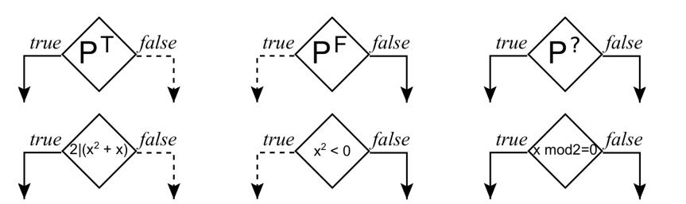

E.g. add an opaquely true predicate (PT ) to a while loop condition (P)

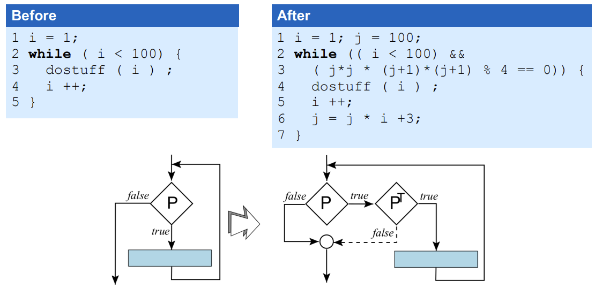

## Breaking opaque predicates via abstract interpretation

- Dalla Preda et al. [4] used abstract interpretation to break opaque predicates:
    - Opaque predicates are confined in a single basic block
    - Instructions that make up the predicate are contiguous
    - Only opaque predicate of the following form: n|p(x), ∀x ∈ Z, where p(x) is a polynomial in x
    s
- E.g. opaquely true predicate: 2|(x^2 + x), ∀x ∈ Z
- Abstract interpretation is able to infer that regardless of x’s value, the IF condition is always true

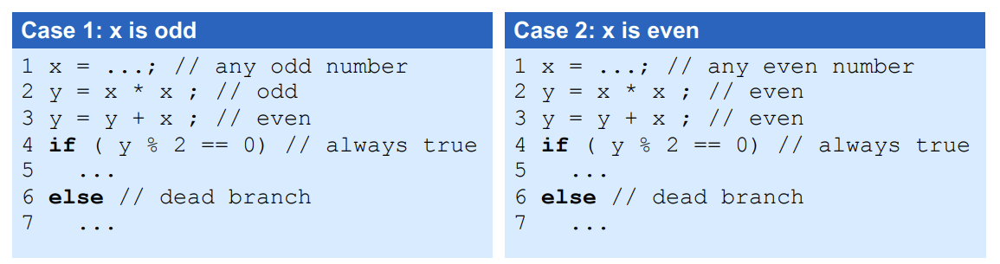

## Confuse Code Reader: Control-flow flattening

- Remove the control-flow structure of functions:
    1. Put each basic block as a case inside a switch statement
    2. Wrap the switch inside an infinite loop

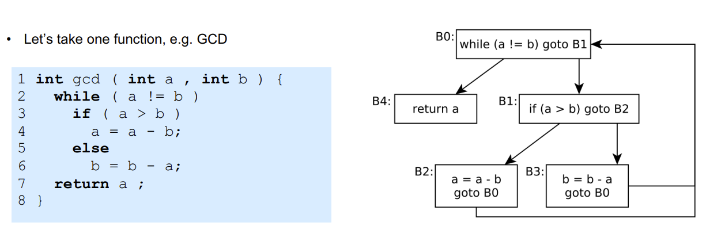

## Control-flow flattening GCD example

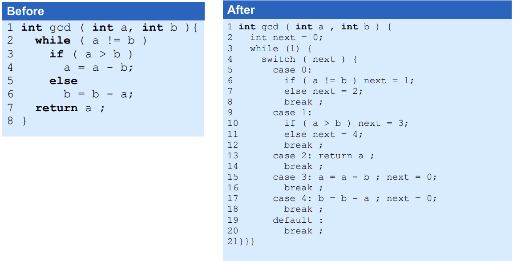

- The CFG of the resulting code:

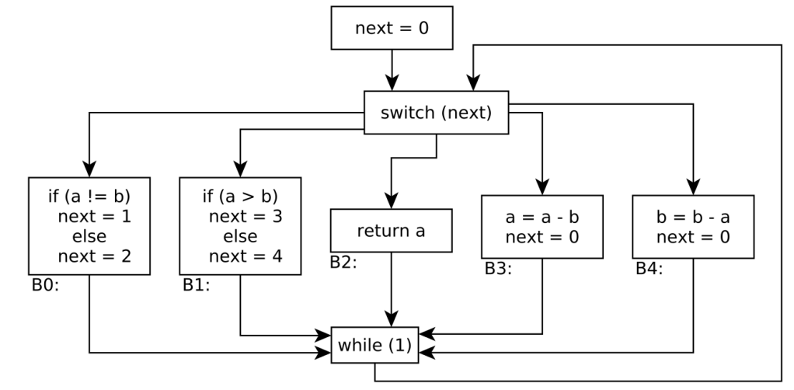

## Control-flow flattening discussion

- **Performance penalty:**
- For 3 SPEC programs: 4x slowdown, 2x size
-  Reasons:
    - The wrapper loop condition check, plus jump
    - The switch next value check, plus indirect jump
- How to optimize:
    - Keep tight loops as one switch entry (don’t split)
    - Use gcc’s labels-as-values → allows jumping to next basic block

- **Attack on control-flow flattening:**
    1. Find next block of every basic block
    2. Rebuild original CFG
- **Mitigation:** assign opaque expressions (E=v ) to next
- **Question:** How do we build such opaque expressions?

## Virtualization Obfuscation

- **Goal:** Hide secret algorithm of program P
**Obfuscation Procedure:**
1. Generate random bytecode instruction set architecture (ISA) L covering all instructions of P
2. Translate P to L bytecode program
3. Generate emulator to interpret L bytecode on x86 machine
**Output:** Obfuscated program (P') consists of bytecode program and emulator

### Example 

- We apply virtualization obfuscation to function foo, written in C

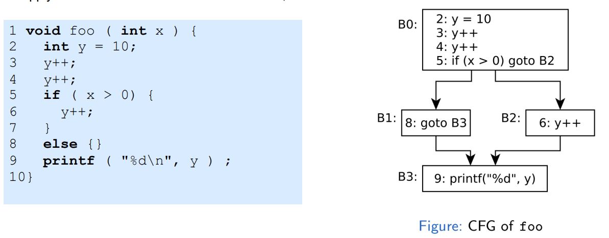

- **Step 1:** Generate random bytecode ISA covering all instructions of foo

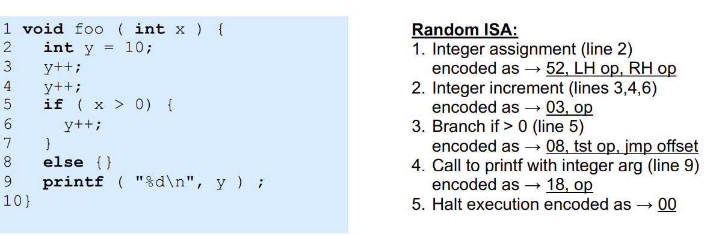

Variables and constants of bytecode program stored in array: data
- data[0] represents variable x
- data[1] represents variable y
- data[2] represents constant for initialization to 10 (line 2 of foo)
- data[3] represents constant jump offset of conditional branch (measured in bytes!)

